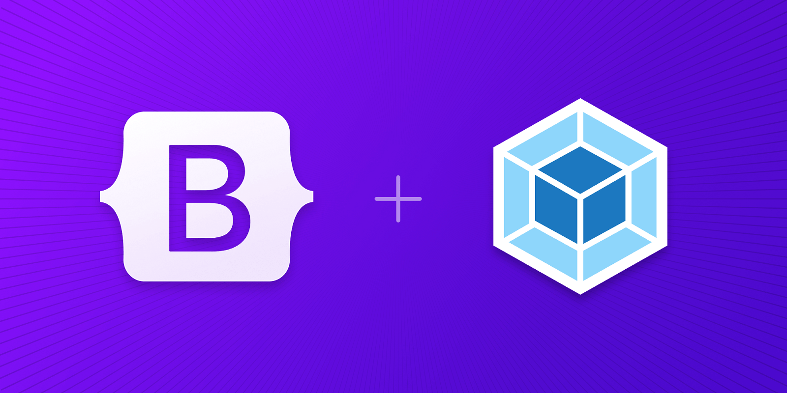

## Bundling Bootstrap with Webpack



Webpack is a powerful JavaScript module bundler that processes your project's dependencies (Sass, JS, images) and generates optimized static assets for production.

---

## 1. Prerequisites & Setup

To bundle Bootstrap with Webpack, you need a Node.js environment and several core dependencies.

### Step 1: Initialize Project
```bash
mkdir my-project && cd my-project
npm init -y
```

### Step 2: Install Webpack & Bootstrap
You need the Webpack core, its CLI, a development server, and the Bootstrap/Popper libraries.
* **Webpack Tools:** `npm i --save-dev webpack webpack-cli webpack-dev-server html-webpack-plugin`
* **Bootstrap:** `npm i --save bootstrap @popperjs/core`

### Step 3: Install Stylesheet Loaders
Webpack requires specific loaders to process Sass and CSS.
`npm i --save-dev autoprefixer css-loader postcss-loader sass sass-loader style-loader`

---

## 2. Project Structure
A standard Webpack setup separates source code from compiled distribution files:

```text
my-project/
├── src/
│   ├── js/
│   │   └── main.js       # Entry point for JS & CSS imports
│   ├── scss/
│   │   └── styles.scss   # Bootstrap Sass imports
│   └── index.html        # HTML template
├── webpack.config.js     # Webpack configuration
└── package.json          # Build scripts
```

---

## 3. Webpack Configuration (`webpack.config.js`)

This file tells Webpack how to handle different file types.


### Core Configuration
The `module.rules` section defines how `.scss` files are processed:
1.  **sass-loader:** Compiles Sass to CSS.
2.  **postcss-loader:** Uses **Autoprefixer** to add browser vendor prefixes.
3.  **css-loader:** Resolves `@import` and `url()` statements.
4.  **style-loader:** Injects CSS into the DOM via `<style>` tags (Development) **OR** **mini-css-extract-plugin** (Production).

---

## 4. Importing Bootstrap

### In Sass (`src/scss/styles.scss`)
You can import the entire library or pick specific parts:
```scss
// Import all of Bootstrap
@import "bootstrap/scss/bootstrap";
```

### In JavaScript (`src/js/main.js`)
Import your styles and Bootstrap’s interactive components:
```javascript
import '../scss/styles.scss';
import * as bootstrap from 'bootstrap'; // Imports all plugins
```
*To reduce bundle size, import only what you need:*
`import { Tooltip, Toast } from 'bootstrap';`

---

## 5. Production Optimizations

While the default setup works for development, production requires adjustments for speed and security.

### Extracting CSS
By default, CSS is bundled inside the JavaScript file. For production, it's better to separate them to improve load times and comply with Content Security Policies (CSP).
* **Plugin:** `mini-css-extract-plugin`
* **Result:** Generates a standalone `main.css` file which must be linked in your `index.html`.

### Extracting SVG Icons
Bootstrap uses inline SVGs. If your security policy blocks `data:` URIs, use Webpack's **Asset Modules** to extract these into an `/icons/` folder:
```javascript
{
  mimetype: 'image/svg+xml',
  scheme: 'data',
  type: 'asset/resource',
  generator: { filename: 'icons/[hash].svg' }
}
```

---

## 6. Build Scripts
Add these to your `package.json` to manage your workflow:
* **Development:** `npm start` (Runs `webpack serve` with hot reloading).
* **Production:** `npm run build` (Runs `webpack build --mode=production` for minified assets).

---

Optimizing your Bootstrap bundle size is a "pro move" that significantly improves your dashboard's loading speed. By default, `@import "bootstrap/scss/bootstrap"` pulls in every single component, even if you aren't using them (like Carousels or Accordions).

In a Webpack project, you can use the **Sass Import** strategy to pick only the "DNA" you need.

---

## 1. The "Required" Minimum
Bootstrap has a core set of files that must be imported first to make everything else work. Without these, variables and mixins will fail.

**In `src/scss/styles.scss`:**
```scss
// 1. Required core (Variables, mixins, functions)
@import "bootstrap/scss/functions";
@import "bootstrap/scss/variables";
@import "bootstrap/scss/variables-dark"; // Optional for dark mode
@import "bootstrap/scss/maps";
@import "bootstrap/scss/mixins";
@import "bootstrap/scss/root";

// 2. Optional: Standard reset
@import "bootstrap/scss/reboot";

// 3. Optional: The Layout System
@import "bootstrap/scss/containers";
@import "bootstrap/scss/grid";
```

---

## 2. Adding Components Individually
After the core is loaded, you add only the components your high-interaction dashboard uses.

```scss
// 4. Component imports
@import "bootstrap/scss/buttons";
@import "bootstrap/scss/forms";
@import "bootstrap/scss/nav";
@import "bootstrap/scss/navbar";
@import "bootstrap/scss/card";
@import "bootstrap/scss/dropdown";
@import "bootstrap/scss/modal";
@import "bootstrap/scss/transitions";

// 5. Utility classes (Margin, padding, colors)
@import "bootstrap/scss/utilities";
@import "bootstrap/scss/utilities/api";
```


---

## 3. Why this matters for Webpack
When Webpack runs `sass-loader`, it processes every `@import`.
* **Standard Import:** Resulting CSS is roughly **200KB+**.
* **Individual Import:** Can reduce the resulting CSS to **50KB - 80KB**.

This is especially important if you are building a React dashboard, as it keeps the initial "Time to Interactive" very low for your users.

---

## 4. Customizing Your Brand (Theming)
The beauty of this Webpack setup is that you can override Bootstrap’s look **before** it compiles. You simply redefine the variables between the `functions` and `variables` imports.

```scss
@import "bootstrap/scss/functions";

// OVERRIDE: Change the primary color to a custom hex
$primary: #ff5733; 
$body-bg: #f8f9fa;

@import "bootstrap/scss/variables";
// ... rest of the imports
```


---

## Final Project Summary
You now have two powerful paths:
1.  **The React/Vite Path:** Best for modern, high-interaction apps with complex data.
2.  **The Webpack/Sass Path:** Best for fine-tuned control over every byte and custom CSS branding.

---
