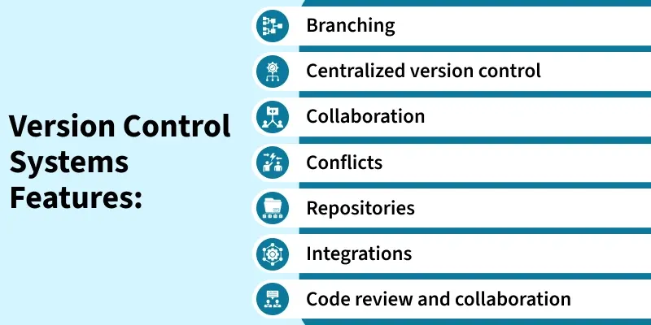
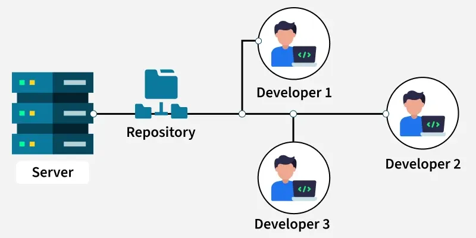
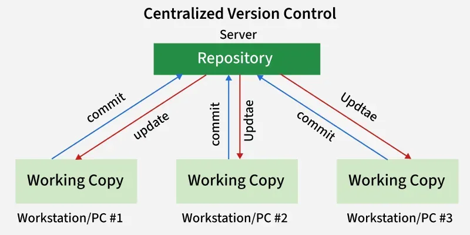
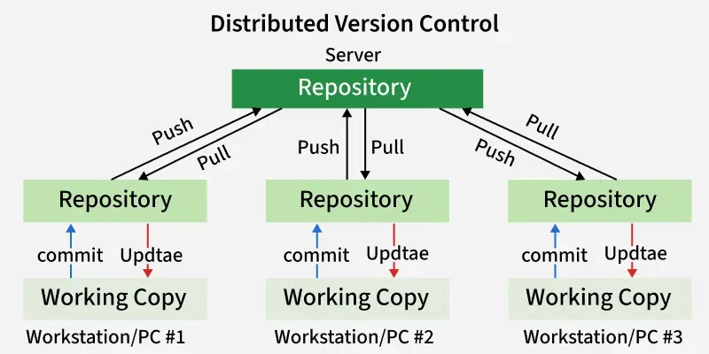
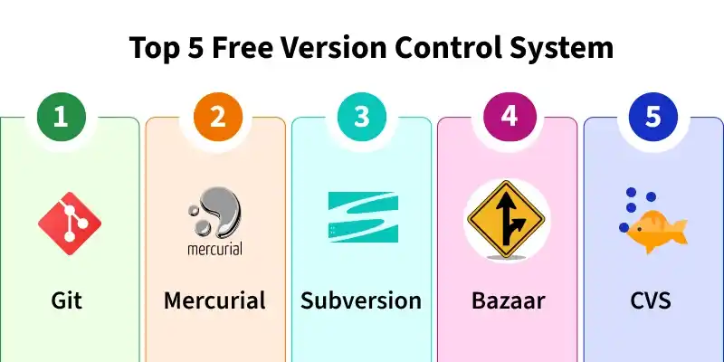

---

## What is a Version Control System?

A Version Control System (VCS) is a tool used in software development and collaborative projects to track and manage changes to source code. It serves four core purposes:

- Tracks and records changes to the codebase, maintaining a structured project history
- Allows multiple developers to collaborate without overwriting each other's work
- Gives developers access to a central repository where project files are stored
- Enables teams to share updates and revert to earlier versions when needed

---

## Core Components

**Repository** — The central storage location for all project files, complete change history, and metadata (author, commit messages, etc.)

**Revision** — A specific saved version of a file or project, identified by a unique ID such as a hash or number.

**Branch** — A separate copy of the codebase used to develop features or fix bugs without affecting the main code.

**Merging** — The process of combining changes from one branch into another, sometimes requiring conflict resolution.

**Commit** — A snapshot of changes made at a specific time, used to track and manage project history.

---

## Types of Version Control Systems

### 1. Local VCS (LVCS)
Stores all project versions on a **single computer**, used mainly by one person.

- No internet or server dependency
- Useful for individual projects only
- Limited to single-user environments

---

### 2. Centralized VCS (CVCS)
All files and version history are stored on a **single central server**. Developers connect to it to access or modify files.

**Workflow:**
1. **Checkout/Update** — Developer retrieves the latest version from the server
2. **Make Changes** — Developer works locally on the files
3. **Commit** — Changes are saved directly back to the central server, instantly visible to all

**Pros:**
- Enables multi-developer collaboration through one central repository
- Good visibility into project activity and changes
- Allows fine-grained admin access control

**Cons:**
- Single point of failure — everything depends on the central server
- If the server goes down, no one can collaborate or commit

---

### 3. Distributed VCS (DVCS)
Every developer has a **full local repository** plus a working copy of the project. Local changes are not automatically visible to others.

**Workflow:**
1. **Commit** — Saves changes to the local repository (visible only to that developer)
2. **Push** — Uploads committed changes to the shared/central repository
3. **Pull** — Downloads changes from the central repository to the local one

> Note: DVCS uses a **two-step process** (commit → push) to share changes with others.

---

## Popular Version Control Systems

### 1. Git
- **Type:** Distributed
- Created by **Linus Torvalds in 2005** for managing the Linux kernel
- Used by platforms like **GitHub, GitLab, and Bitbucket**
- Lightweight, fast, and efficient
- Simple, non-destructive branching and merging
- Key commands: `git clone`, `git pull`, `git push`

### 2. Subversion (SVN)
- **Type:** Centralized
- Popular in organizations and enterprises for its simplicity
- Single central repository
- Supports branching and tagging, but less flexible than Git
- Versions files and directories

### 3. Mercurial
- **Type:** Distributed
- Similar to Git but with a **simpler interface**
- Fast, scalable, suited for both small and large projects
- Supports branching, merging, and managing project history

### 4. CVS (Concurrent Versions System)
- **Type:** Centralized
- An **early VCS**, widely used in the late 1990s–early 2000s
- Laid the foundation for modern systems like SVN
- Tracks individual file changes over time
- Basic branching and tagging support (limited vs. modern tools)

### 5. Bazaar
- **Type:** Distributed (also supports centralized workflows)
- Developed by **Canonical** (creators of Ubuntu)
- Used in projects like **Ubuntu and Launchpad**
- Beginner-friendly with human-readable commands: `bzr commit`, `bzr push`
- Cross-platform: Linux, Windows, macOS

---

## Quick Comparison Summary

| VCS | Type | Best For |
|---|---|---|
| Git | Distributed | Most modern projects, open source |
| SVN | Centralized | Enterprise/legacy systems |
| Mercurial | Distributed | Simple distributed workflows |
| CVS | Centralized | Legacy/historical reference |
| Bazaar | Both | Beginner-friendly projects |

---

These notes cover the full scope of Version Control Systems — from core concepts to types and the most widely used tools available today.

---