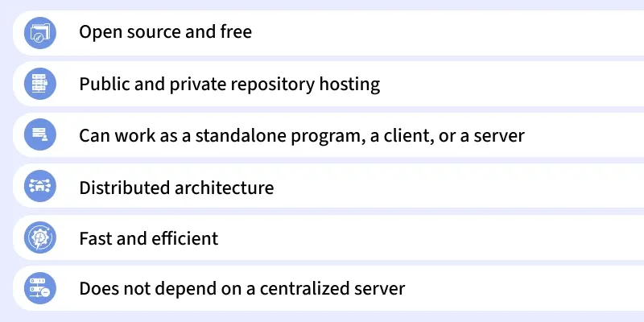
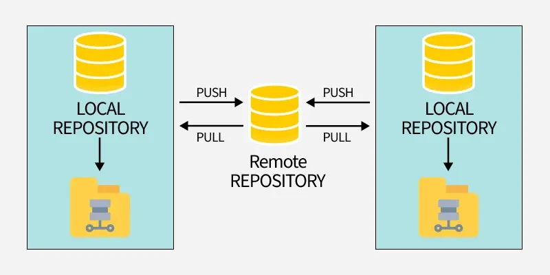
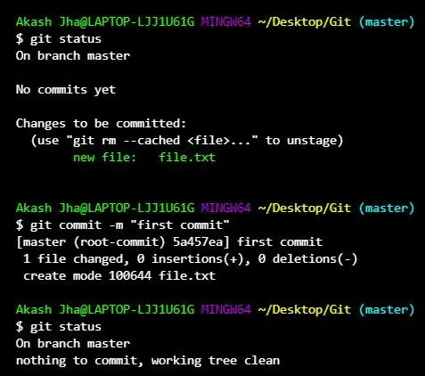
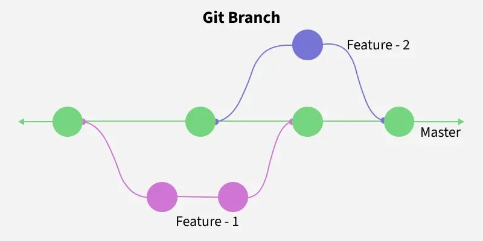
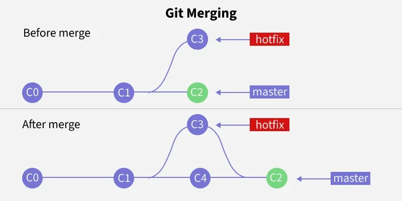
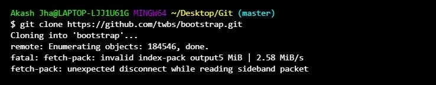
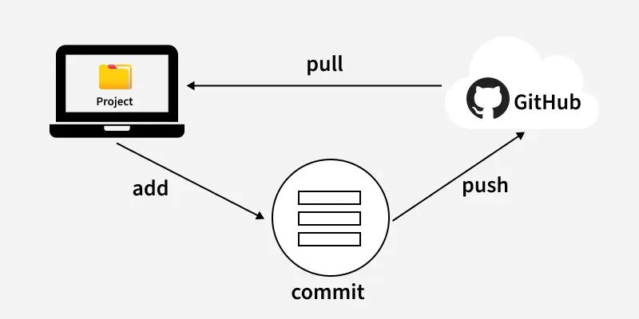
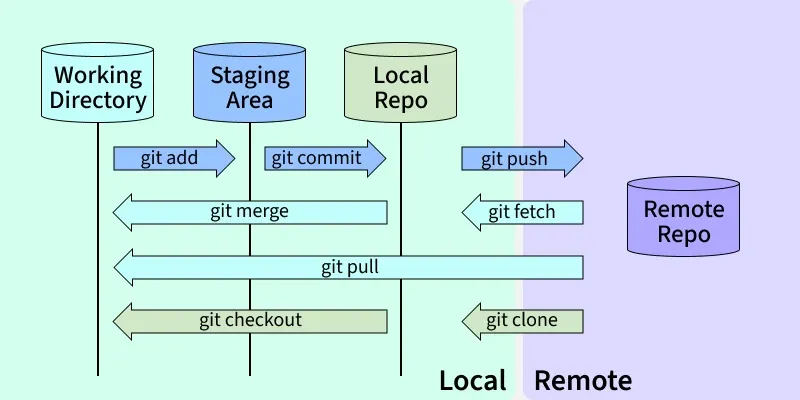

---

## What is Git?

Git is a **distributed version control system (VCS)** used to track changes in source code during software development. It helps developers collaborate, manage different versions of code, and roll back to previous states if needed.



### Why Use Git?

- **Collaboration** — Multiple developers can work together and merge changes easily
- **History Tracking** — Revert to previous versions of code whenever needed
- **Branching & Merging** — Develop features separately and merge them safely
- **Distributed Development** — Each developer has a full copy of the repository
- **Incremental Changes** — Stores snapshots of the entire project tree and optimizes storage using compression and delta encoding

---

## Core Concepts of Git

### 1. Repositories
A repository (or **repo**) is a storage space where project files and their history are kept. There are two types:



- **Local Repository** — A copy of the project stored on your local machine
- **Remote Repository** — A version of the project hosted on a server, often on platforms like GitHub, GitLab, or Bitbucket

### 2. Commits
A commit is a **snapshot of your project at a specific point in time**. Each commit has a unique identifier (hash) and includes a message describing the changes made. Commits allow you to track and review the full history of your project.



### 3. Branches
Branches allow developers to work on separate tasks **without affecting the main codebase**. Common branch types include:

- **Main (or Master) Branch** — The stable, production-ready version of the project
- **Feature Branch** — Used for developing new features or fixing bugs in isolation



### 4. Merging
Merging is the process of **integrating changes from one branch into another**. It allows you to combine work done across different branches and resolve any conflicts that arise during the process.



### 5. Cloning
Cloning a repository means **creating a local copy of a remote repository**. This copy includes all files, branches, and the full commit history.



### 6. Pull and Push
- **Pull** — Fetches updates from the remote repository and integrates them into your local repository
- **Push** — Sends your local changes to the remote repository, making them available to others



---

## The Three States (The Staging Area)

Understanding Git's three states is key to understanding how Git works. Every file in Git can be in one of three states:

**1. Working Directory**
Your project folder with all the files you are currently working on. Any changes made here are **not yet tracked** by Git.

**2. Staging Area (Index)**
An intermediate area where you list the specific changes you want to include in your next commit. You use the `git add` command to move changes from the working directory to the staging area.

**3. Repository (.git directory)**
Where Git **permanently stores snapshots (commits)** of your project. You use the `git commit` command to save staged changes into the repository.

> The three-step process — **modify → add → commit** — gives you precise control over what gets saved in your project's history.

---

## Basic Git Commands

| Command | Description |
|---|---|
| `git status` | Shows current status — staged, unstaged, and untracked files |
| `git add <file-name>` | Stages a specific file for commit. Use `git add .` to stage all changes |
| `git commit -m "message"` | Commits staged changes with a descriptive message |
| `git branch <branch-name>` | Creates a new branch with the given name |
| `git checkout <branch-name>` | Switches to the specified branch |
| `git merge <branch-name>` | Merges changes from the given branch into the current branch |
| `git push origin <branch-name>` | Pushes local branch changes to the remote repository |
| `git pull origin <branch-name>` | Fetches and merges remote changes into the local branch |
| `git log` | Displays the commit history for the current branch |

---

## Git Workflow



A standard Git workflow follows these structured steps:

**Step 1 — Clone the Repository**
```
git clone git@github.com:username/repository.git
```

**Step 2 — Create and Switch to a New Branch**
```
git checkout -b feature-branch
```

**Step 3 — Make Changes and Stage Them**
```
git add <file-name>
```

**Step 4 — Commit the Changes**
```
git commit -m "Add new feature"
```

**Step 5 — Push the Changes**
```
git push origin feature-branch
```

**Step 6 — Create a Pull Request**
After pushing, create a pull request on GitHub to merge the feature branch into the main branch.

**Step 7 — Update Your Local Repository**
```
git checkout main
git pull origin main
```

**Step 8 — Delete the Feature Branch**
```
git branch -d feature-branch
git push origin --delete feature-branch
```

---

## Git Hosting Platforms

Git hosting stores repositories on a remote server, enabling collaboration, backup, pull requests, CI/CD automation, and even website hosting.

### 1. GitHub
A cloud-based Git hosting platform owned by **Microsoft**, popular for open-source projects and beginners.
- Unlimited public and private repositories
- Pull requests and code reviews for team collaboration
- GitHub Pages for hosting static websites
- Automation and CI/CD with GitHub Actions

### 2. GitLab
A complete **DevOps platform** offering Git hosting with built-in CI/CD, issue tracking, and project management tools. Ideal for teams and enterprises.
- Public and private repositories
- Built-in CI/CD pipelines for automation
- Issue tracking and project management
- Option for **self-hosting** for full control and privacy

### 3. Bitbucket
A Git hosting platform by **Atlassian**, designed for private repositories and tight integration with project management tools. Ideal for small teams.
- Private and public repositories
- Bitbucket Pipelines for CI/CD automation
- Integration with **Jira and Trello**
- Secure and collaborative environment for teams

---

## Key Takeaways

- Git is the most widely used version control system in modern software development
- Its **three-state model** (working directory → staging area → repository) gives developers fine-grained control over their project history
- A solid understanding of **branching, merging, push, and pull** is essential for effective team collaboration
- Git can be hosted on platforms like **GitHub, GitLab, or Bitbucket**, each offering unique features suited to different team sizes and workflows

---