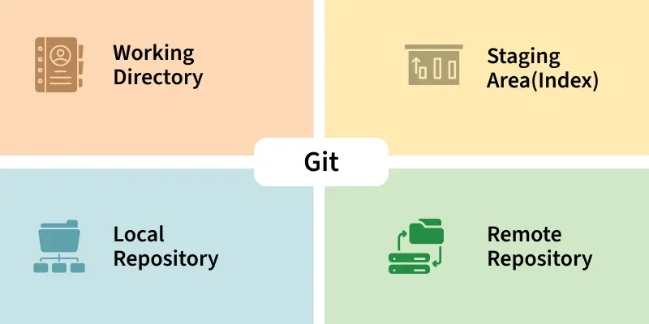
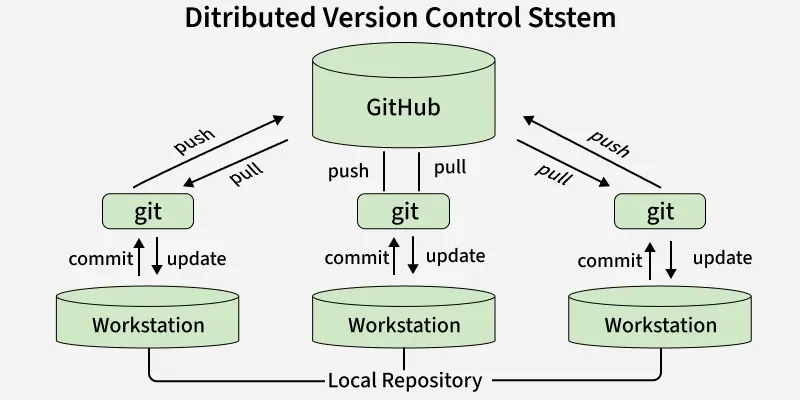
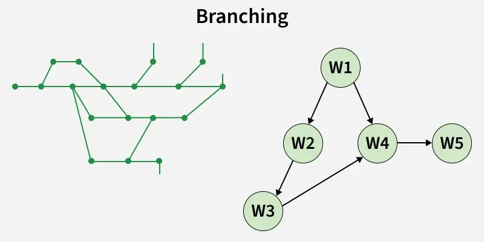
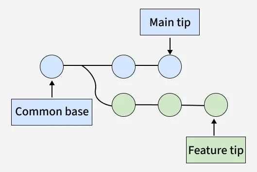
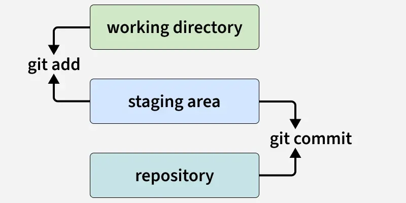
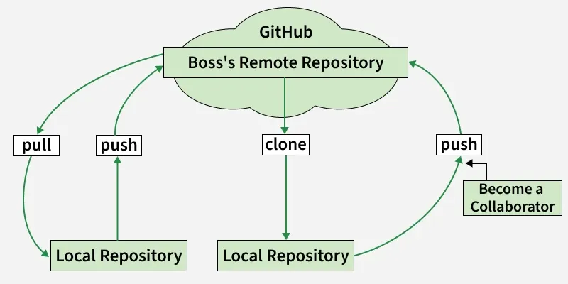

---

# Features of Git

## Overview

Git is a **free, open-source distributed version control system** that efficiently manages projects of any size. Its rich set of features makes it the most popular version control system in the world.

---

## 1. Open Source

Git is free and open-source, maintained by a **global community of developers**. Anyone can contribute to its development, suggest features, or fix bugs.

- Large community support with plenty of tutorials, guides, and forums
- Constant updates and improvements from contributors worldwide
- No licensing cost — free for both personal and commercial projects

> **Example:** Popular platforms like GitHub and GitLab are built on Git and benefit from its open-source nature, creating a vast ecosystem for collaborative development.

---

## 2. Distributed System

Unlike centralized version control systems, Git is **fully distributed**. Every developer has a complete copy of the repository, including all history, branches, and tags.

- Work offline and commit changes without a network connection
- Redundancy ensures backups exist across multiple local repositories
- Faster operations since most actions are performed locally
- Enables non-linear development with multiple branches running simultaneously

> **Example:** You and your teammate can both make changes on your own computers and later merge your work without needing to be connected to a server.

---

## 3. Branching

A branch in Git is like a **parallel version of your code**, allowing you to work on different tasks independently without affecting the main codebase.

- Lets you develop new features, fix bugs, or experiment safely
- Each branch maintains its own set of commits and changes
- Branches can be merged back into the main branch once work is complete
- Helps isolate issues so bug fixes don't interfere with other development work

### Types of Branches

**Main Branch** — The primary stable codebase, usually named `main` or `master`

**Feature Branches** — Used for developing new features (e.g., `feature-login`)

**Bugfix Branches** — Used for fixing specific bugs (e.g., `bugfix-header`)

**Release Branches** — Used for preparing a version for production deployment

> **Example:** If a bug is found in the main branch, you can create a separate bugfix branch, fix and test the issue there, then merge it back — keeping production code stable throughout the process.

---

## 4. Merging

Merging is the process of **combining changes from one branch into another**. Typically, a feature branch is merged into the main branch after development is complete. Git tries to automatically integrate changes, but sometimes conflicts must be resolved manually.

### Types of Merges

**1. Fast-Forward Merge**
- Happens when the main branch has not moved forward since the branch was created
- Git simply moves the main branch pointer forward to the latest commit

**2. Three-Way Merge**
- Happens when both branches have new commits since they diverged
- Git creates a new merge commit that combines changes from both branches

**3. Merge Conflicts**
- Occurs when changes on both branches affect the same line of a file
- Git cannot automatically merge and requires you to resolve conflicts manually

---

## 5. History Tracking

Git keeps a **complete history of all changes** to the codebase. Every commit is recorded with a timestamp, author name, and a message describing the change.

- View the full evolution of a project over time
- Ability to revert to a previous state if something breaks
- Helps identify bugs by checking which changes introduced an issue

> **Example:** If a new feature causes a bug, you can review the commit history to find exactly which changes caused the problem and fix it precisely.

---

## 6. Staging Area (Index)

Git has a **staging area (index)** where changes can be reviewed before being committed. This allows selective commits instead of committing all changes at once.

- Enables careful review of code changes before they become part of the permanent history
- Helps split large changes into smaller, more meaningful commits
- Gives developers fine-grained control over what gets recorded

> **Example:** You edited three files but only want to commit two. You can stage only those two files and commit them, leaving the third for a later commit.

---

## 7. Speed

Git is **highly optimized for speed**. Its underlying data structures — including SHA-1 hashing and compressed snapshots — make operations like committing, branching, and merging very fast.

- Efficient even for large projects with thousands of files
- Fast operations allow developers to experiment and iterate quickly

> **Example:** Creating a new branch or switching between branches takes almost no time, even for very large codebases.

---

## 8. Security

Git uses **cryptographic hash functions** to ensure the integrity of the codebase. It historically used SHA-1 but is transitioning to **SHA-256** to improve security against collision attacks.

- Any tampering is detectable because changing the code changes the hash
- Ensures the integrity of all commits and the full repository history

> **Example:** If someone tries to alter old commits, Git will detect that the hashes don't match, protecting the codebase from unnoticed tampering.

---

## 9. Collaboration

Git makes teamwork seamless by allowing **multiple developers to work on the same codebase** simultaneously.

- Developers can clone repositories and contribute independently
- Changes can be merged smoothly across contributors
- Platforms like GitHub and GitLab provide **pull requests** and **code reviews** for structured, effective collaboration

---

## 10. Cross-Platform Support

Git works across all major operating systems — **Windows, Linux, and macOS**.

- Provides consistent performance across all platforms
- Widely adopted by teams using different systems and environments

---

## 11. Integration with DevOps & CI/CD Tools

Git integrates seamlessly with **DevOps pipelines and CI/CD tools** like Jenkins, GitHub Actions, and GitLab CI.

**Continuous Integration (CI)** — Every commit triggers automated builds and tests, catching issues early.

**Continuous Deployment (CD)** — Tested code can be automatically deployed to staging or production environments.

**Branch-Based Workflows** — Different branches can trigger different pipelines (e.g., `dev` → test environment, `main` → production).

**Supported Tools** — Jenkins, GitHub Actions, GitLab CI, CircleCI, AWS CodePipeline, and more.

---

## Summary Table

| Feature | Key Benefit |
|---|---|
| Open Source | Free, community-driven, no licensing cost |
| Distributed System | Full local copy, works offline, no single point of failure |
| Branching | Parallel development without affecting main code |
| Merging | Safely combines work from different branches |
| History Tracking | Full audit trail; easy to revert or debug |
| Staging Area | Selective, controlled commits |
| Speed | Fast even on large projects |
| Security | Cryptographic hashing protects integrity |
| Collaboration | Seamless teamwork via push, pull, and code reviews |
| Cross-Platform | Works on Windows, Linux, and macOS |
| CI/CD Integration | Automates testing and deployment workflows |

---

These features collectively make Git an indispensable tool for modern software development, supporting everything from solo projects to large-scale enterprise and open-source collaboration.

---