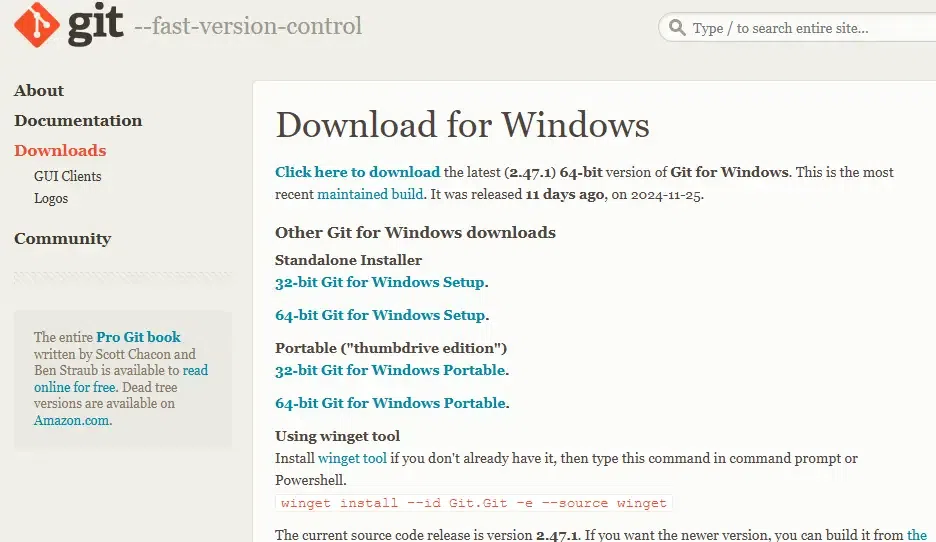
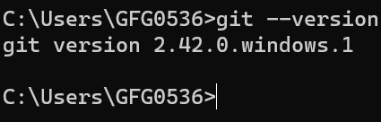
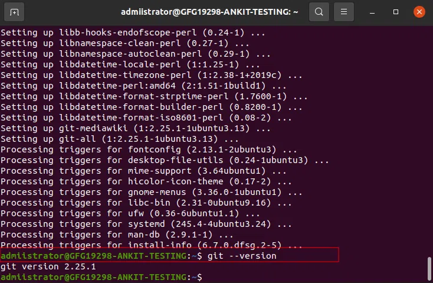
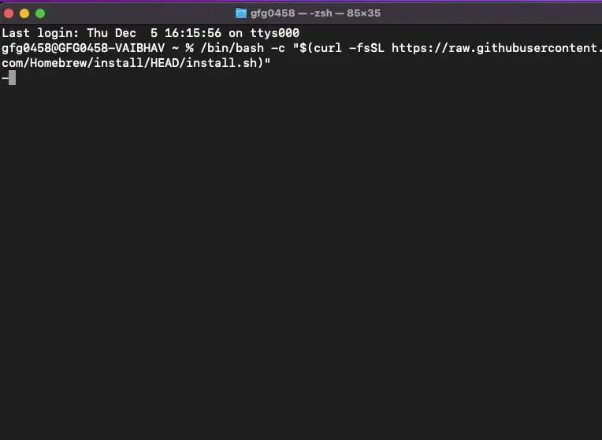
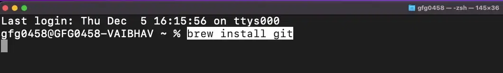

---

# Installing Git and Setting Up GitHub

## Overview

**Git** is a distributed version control system for tracking file changes, while **GitHub** is a cloud platform for hosting Git repositories and enabling collaboration. Installing Git is required to use both for version control.

---

## Installing Git on Windows

The recommended way to install Git on Windows is through the **official Git website**.

### Step 1: Download the Installer
- Go to the official Git website: **https://git-scm.com/downloads/win**



- The download will start automatically for the latest version of Git for Windows
- Once the download is complete, run the `.exe` file to begin setup

### Step 2: Select Editor & Adjust Path
Follow the prompts in the setup wizard. Most default settings are fine for general use, but pay attention to these key steps:

- **Text Editor** — The installer will ask which text editor to use for Git. Choose from options like Vim, Notepad++, or Visual Studio Code
- **System PATH** — Make sure to select the option that adds Git to your system PATH (recommended for ease of use in the command line)
- **HTTPS Security** — Select the default option (OpenSSL) to allow Git to communicate securely over HTTPS
- **Line Endings** — Select the default choice: *"Checkout Windows-style, commit Unix-style line endings"*, which is ideal for most Windows developers

### Step 3: Complete the Installation
- Click **"Install"** and allow the installation to complete
- Once done, launch **Git Bash** (installed alongside Git) or use Git from the **Command Prompt (cmd)**
- Verify the installation by typing:

```
git --version
```



If Git is installed correctly, it will display the version number.

---

## Installing Git on Linux

### Step 1: Update the System and Install Git

**For Debian/Ubuntu:**
```
sudo apt update
sudo apt install git
```

**For Fedora:**
```
sudo dnf install git
```

**For Arch Linux:**
```
sudo pacman -S git
```

### Step 2: Verify the Installation
```
git --version
```



---

## Installing Git on Mac

### Step 1: Install Homebrew
If you don't already have Homebrew, run the following command in your terminal:

```
/bin/bash -c "$(curl -fsSL
 https://raw.githubusercontent.com/Homebrew/install/HEAD/install.sh)"
```



### Step 2: Install Git via Homebrew
Once Homebrew is installed, run the following command to install Git:

```
brew install git
```



### Step 3: Verify the Installation
```
git --version
```


---

## Setting Up GitHub with Git

Once Git is installed, follow these steps to connect it with your GitHub account.

### Step 1: Create a GitHub Account
- Visit **github.com** and sign up for a free account


### Step 2: Configure Git with GitHub
Run the following commands in your terminal (Git Bash on Windows, Terminal on Linux/Mac) to link your identity to Git:

```
git config --global user.name "YourName"
git config --global user.email "youremail@example.com"
```

This ensures every commit you make is tagged with your name and email.

### Step 3: Generate an SSH Key *(Optional but Recommended)*
An SSH key allows secure, passwordless communication between your machine and GitHub.

**Generate the key:**
```
ssh-keygen -t rsa -b 4096 -C "youremail@example.com"
```

**Copy the key:**
```
cat ~/.ssh/id_rsa.pub
```

**Add it to GitHub:**
- Go to **GitHub → Settings → SSH and GPG Keys**
- Click **"New SSH Key"**, paste the copied key, and save

### Step 4: Create a New Repository
- On GitHub, click the **"New Repository"** button
- Give your repository a name, choose public or private, and click **"Create Repository"**
- GitHub will provide commands to link this remote repository with your local Git project


---

## Quick Reference Summary

| Platform | Install Command |
|---|---|
| Windows | Download `.exe` from git-scm.com/downloads/win |
| Ubuntu/Debian | `sudo apt install git` |
| Fedora | `sudo dnf install git` |
| Arch Linux | `sudo pacman -S git` |
| macOS | `brew install git` |
| Verify (All) | `git --version` |

---

## Key Takeaways

- Git can be installed on **Windows, Linux, and macOS** with straightforward steps on each platform
- Always verify installation using `git --version` after setup
- Configuring your **username and email** with `git config` is essential before making any commits
- Setting up an **SSH key** is optional but strongly recommended for secure and seamless communication with GitHub
- Once Git is installed and GitHub is configured, you are fully set up to start creating repositories and collaborating on projects

---