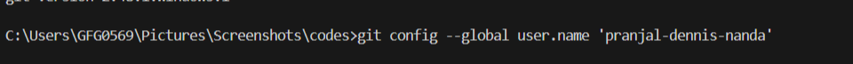
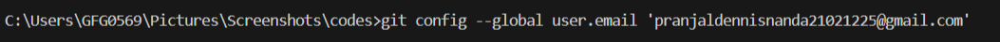
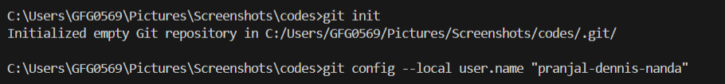
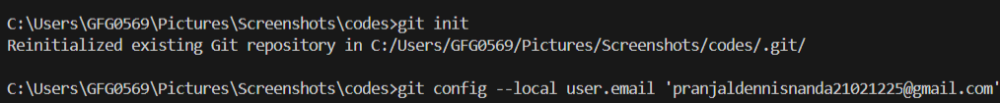
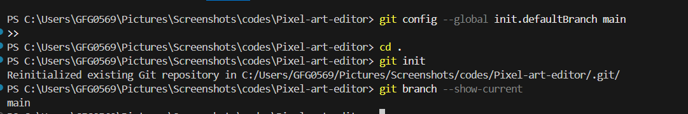
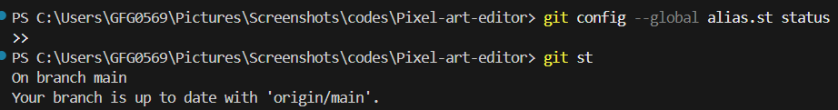
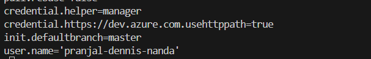

# Setting Up Git and Using Git Config

---

## Overview

Git configuration helps set up your identity and preferences so Git can track changes correctly and work according to your workflow. It serves three core purposes:

- **Defines user identity** (name and email) that is attached to every commit
- **Allows customization** of Git behavior and defaults
- **Ensures consistent and efficient** version control usage across projects

---

## How Git Configuration Works

- Git settings are stored in **different configuration files** at three levels — system, global, and local — each defining how Git behaves at that scope
- **Priority order:** Local configurations take priority over global, and global overrides system configurations
- Git provides the `git config` command to set and modify settings related to user identity, repository behavior, and preferences
- The `git config --list` command lets users view all currently applied settings from all configuration levels
- Users can create **aliases**, define **default branches**, and set up **preferences** to enhance workflow efficiency

---

## Configuration Levels

| Level | Scope | File Location |
|---|---|---|
| **System** | All users on the machine | `/etc/gitconfig` |
| **Global** | Current user, all repositories | `~/.gitconfig` |
| **Local** | Current repository only | `.git/config` inside the repo |

---

## Steps to Set Up Git Using Git Config

### Step 1: Install Git
Before configuring Git, you must first install it on your system. Installation steps vary by platform — Windows, Linux, or Mac.

---

### Step 2: Check the Git Version
Verify that Git has been installed successfully by running:

```
git --version
```

If installed correctly, this will display the current version number.

---

### Step 3: Set Global Username
Set your name for **all repositories** on your system using:

```
git config --global user.name 'username'
```

This name will appear on every commit you make across all projects.



---

### Step 4: Set Global Email
Set your email for **all repositories** using:

```
git config --global user.email 'user email'
```

This email is also attached to every commit and should match the email used on your GitHub account.



---

### Step 5: Set Local Username and Email
To set a username and email for a **specific repository only**, first initialize an empty Git repository, then set the local credentials:

```
git init
git config --local user.name 'username'
git config --local user.email 'email'
```

> Local settings override global settings for that specific repository — useful when working with multiple accounts (e.g., personal and work).





---

### Step 6: Configure the Default Branch Name
By default, Git initializes repositories with a branch named `master`. You can change this to `main` or any preferred name:

```
git config --global init.defaultBranch main
```

This applies to all newly created repositories going forward.



---

### Step 7: Create an Alias for a Command
Git aliases allow you to **shorten commonly used commands**, saving time and keystrokes.

**Example — create a shortcut for `git status`:**
```
git config --global alias.st status
```

Now instead of typing `git status`, you can simply type:
```
git st
```

You can create aliases for any Git command to match your preferred workflow.



---

### Step 8: View All Configurations
To see all Git settings currently applied by the user across all configuration levels, run:

```
git config --list
```

This displays all active settings including username, email, aliases, default branch, and more.



---

### Step 9: Removing or Resetting Configurations
If you need to remove a specific configuration, use the `--unset` flag:

```
git config --global --unset user.email
```

To completely reset all Git settings back to default, delete the global config file:

**On Linux/Mac:**
```
rm ~/.gitconfig
```

**On Windows:**
```
del %USERPROFILE%\.gitconfig
```

---

## Quick Reference — All Config Commands

| Command | Description |
|---|---|
| `git --version` | Verify Git is installed and check version |
| `git config --global user.name 'name'` | Set global username for all repositories |
| `git config --global user.email 'email'` | Set global email for all repositories |
| `git init` | Initialize a new local Git repository |
| `git config --local user.name 'name'` | Set username for current repository only |
| `git config --local user.email 'email'` | Set email for current repository only |
| `git config --global init.defaultBranch main` | Set default branch name for new repositories |
| `git config --global alias.st status` | Create an alias (`st`) for `git status` |
| `git config --list` | View all current Git configurations |
| `git config --global --unset user.email` | Remove a specific global configuration |
| `rm ~/.gitconfig` | Reset all settings on Linux/Mac |
| `del %USERPROFILE%\.gitconfig` | Reset all settings on Windows |

---

## Key Takeaways

- Always set your **global username and email** immediately after installing Git — these are attached to every commit you make
- Use **local config** when working with multiple Git accounts (e.g., separate personal and work identities per repository)
- **Local settings always override global**, which override system-level settings
- **Aliases** are a simple but powerful way to speed up your daily Git workflow
- Use `git config --list` regularly to audit and verify your current configuration is correct

---