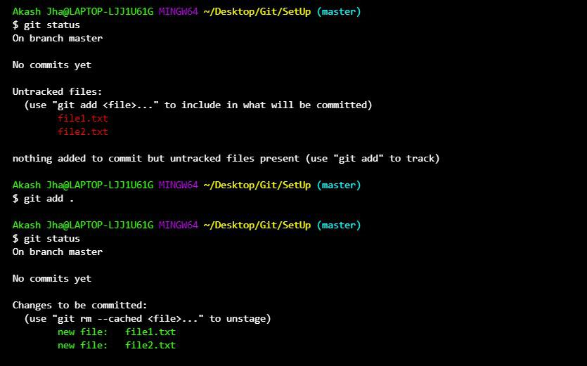

# Git Add

---

## Overview

`git add` is a Git command used to **move changes from the working directory to the staging area**, preparing them for the next commit. It is a critical step in Git's three-stage workflow — without staging, no changes can be committed.


### Core Purposes
- **Stages Changes** — Moves modified or new files to the staging area
- **Selective Staging** — You can add individual files, multiple files, or all files at once
- **Prepares for Commit** — Only staged files are included when running `git commit`
- **Supports Partial Changes** — With specific options, you can stage only certain parts of a file

---

## Git's Workflow Context

```
Working Directory  →  git add  →  Staging Area  →  git commit  →  Repository
```

`git add` is the bridge between making changes and saving them permanently in the repository.

---

## Using Git Add

### 1. Add a Single File
Stages a specific file for the next commit:
```
git add filename.txt
```
Only `filename.txt` will be staged — all other modified files remain unstaged.

---

### 2. Add Multiple Files
Stages two or more specific files at once:
```
git add file1.txt file2.txt
```
Each file listed will be moved to the staging area, ready for the next commit.

---

### 3. Add All Files in the Directory
Stages **all modified, new, and deleted files** in the current directory and all its subdirectories:
```
git add .
```
This is the most commonly used form when you want to stage everything at once before committing.



---

### 4. Add Files Matching a Pattern
Stages all files matching a specific pattern — for example, all `.txt` files in the current directory:
```
git add *.txt
```
Useful when you want to stage a group of related files without listing each one individually.

---

### 5. Stage Parts of a File (Interactive)
Allows you to **interactively select specific hunks (sections) of changes** within a file to stage, rather than staging the entire file:
```
git add -p filename.txt
```
Git will walk you through each change in the file and ask whether you want to stage it. This is particularly useful when a file contains multiple unrelated changes that should belong to separate commits.

---

## Common Options for Git Add

| Option | Description |
|---|---|
| `.` | Stage all changes in the current directory |
| `-A` | Stage all changes including deletions across the entire repository |
| `-u` | Stage modified and deleted files only; ignores untracked (new) files |
| `-p` | Stage changes interactively, hunk by hunk |
| `-n` | Show what would be staged without actually staging anything (dry run) |

---

## Untracked Files vs Tracked Files

Understanding the difference between untracked and tracked files is essential for using `git add` correctly.

| | Untracked Files | Tracked Files |
|---|---|---|
| **Definition** | Files that Git is **not yet monitoring** | Files that Git is **already monitoring** |
| **History** | Newly created; never staged or committed | Already committed at least once in the past |
| **To Stage** | Must be added using `git add` for the first time | Changes must be staged again with `git add` before each new commit |
| **Example** | A new file `notes.txt` you just created | Editing `app.js` that already exists in the repository |

> **Key point:** Even files Git already knows about (tracked files) must be re-staged with `git add` every time they are modified — Git does not automatically include changes in the next commit.

---

## Practical Examples

**Scenario 1 — Staging a single new file:**
```
git add notes.txt
```
Moves the newly created `notes.txt` from untracked to staged.

**Scenario 2 — Staging everything before a commit:**
```
git add .
git commit -m "Add all project files"
```
Stages all changes and then commits them in one workflow.

**Scenario 3 — Staging only modified and deleted files (ignoring new files):**
```
git add -u
```
Useful when you don't want to accidentally include new untracked files in your commit.

**Scenario 4 — Reviewing what will be staged before doing it:**
```
git add -n .
```
Shows a preview of what would be staged without actually staging anything — a safe way to verify before committing.

**Scenario 5 — Splitting a large file change into smaller commits:**
```
git add -p app.js
```
Interactively reviews and selects only certain changes within `app.js` to stage, keeping commits clean and focused.

---

## Key Takeaways

- `git add` is the essential **middle step** between editing files and committing them — nothing gets committed without being staged first
- You have full control over **what gets staged** — individual files, groups of files, all files, or even specific sections within a file
- **Untracked files** must be added with `git add` at least once before Git will monitor them
- **Tracked files** still need to be re-staged with `git add` after every modification before they can be committed
- Use `git add -p` for **clean, focused commits** when a file contains multiple unrelated changes
- Use `git add -n` as a **dry run** to safely preview what will be staged before actually doing it

---


# Git Cheatsheet: Adding Files (`git add`)

## Overview

Git's `add` command stages file changes before committing them. This cheatsheet explains how to use:

- `git add <file>`
- `git add .`
- `git add . -p` (patch mode)

---

## 📌 Commands Summary

| Command               | Description                                                                 |
|-----------------------|-----------------------------------------------------------------------------|
| `git add <file>`      | Stages a **specific file**.                                                 |
| `git add .`           | Stages **all changes** (new, modified, deleted) in current and subdirectories. |
| `git add . -p`        | Interactively stages **selected hunks** of changes from all files.          |

---

## 🆚 Key Differences

| Feature              | `git add <file>`            | `git add .`                     | `git add . -p`                      |
|----------------------|------------------------------|----------------------------------|--------------------------------------|
| **Scope**            | One specific file             | All files in current folder     | All files, **but hunk-by-hunk**     |
| **Selective Staging**| No (entire file)             | No (everything)                 | ✅ Yes (you choose hunks)           |
| **Interactive**      | ❌                            | ❌                               | ✅                                  |
| **Best Use Case**    | Known file(s) only            | Quick stage of everything       | Precision staging (omit temp/debug) |
| **Granularity**      | Full file                    | Full directory                  | Per hunk (even inside a file)       |

---

## 💻 Usage Examples

### 1. `git add <file>`

```sh
git add module-4-project/src/main/java/com/codegym/dao/CountryDAO.java
```

✅ Stages **only this file**. Best for staging changes you’re confident about.

---

### 2. `git add .`

```sh
git add .
```

✅ Stages **all changes** in current directory. Fastest but least selective.

⚠️ Be careful! You may include debug or unfinished work.

---

### 3. `git add . -p`

```sh
git add . -p
```

✅ Interactive mode: Git shows changes **hunk-by-hunk**:

```
Stage this hunk [y,n,q,a,d,e,?]?
```

- `y`: Yes, stage it
- `n`: No, skip it
- `s`: Split further
- `e`: Edit manually
- `q`: Quit patch mode

Perfect when you want to **stage only clean code** and skip messy or debug sections.

---

## 🧠 Real-World Scenario

### Scenario:
You’ve made these changes:
- Added features to `CountryDAO.java`
- Inserted debug logs in `Country.java`
- Reformatted `CityDAO.java` and `City.java`

### A. Stage only feature work:

```sh
git add module-4-project/src/main/java/com/codegym/dao/CountryDAO.java
```

### B. Stage everything (not recommended if unsure):

```sh
git add .
```

### C. Stage feature work, skip debug/logs:

```sh
git add . -p
```

Manually stage hunks **you want**, skip the rest.

---

## 🔁 Working with Already Staged Files

### ❓ Can you use `git add -p` on already staged files?

❌ No. It only works on **unstaged changes**.

---

## 🔄 How to Edit What’s Already Staged

### Option 1: Unstage First, Then Patch

```sh
git restore --staged <file>
git add -p
```

Example:
```sh
git restore --staged CountryDAO.java
git add -p
```

### Option 2: Use `git reset -p` to Unstage Specific Hunks

```sh
git reset -p
```

✅ Allows **hunk-by-hunk unstaging** from already staged files.

---

## 💡 Pro Tip

You can combine approaches:

```sh
git add CountryDAO.java       # Stage the entire file
git add . -p                  # Then selectively add hunks from other files
```

---

## ✅ Summary Table

| Command          | When to Use                                                                 |
|------------------|------------------------------------------------------------------------------|
| `git add <file>` | When you know exactly which file(s) to stage                                 |
| `git add .`      | When you want to stage everything without reviewing                          |
| `git add . -p`   | When you want full control over what to include in your commit               |
| `git reset -p`   | To selectively **unstage** changes that were accidentally staged             |
| `git restore --staged <file>` | To unstage an entire file without discarding your changes         |

---

### 🔚 That’s a wrap!

This guide gives you **granular control** over your Git staging process. Perfect your commits by using the right command for the job.

---