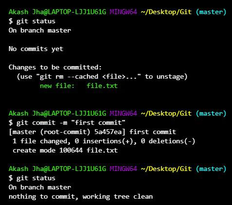

# Git Commit

---

## Overview

`git commit` saves a **snapshot of staged changes** into the Git repository, creating a permanent point in history that helps track and manage project progress.

### Core Purposes
- Commits store changes from the **staging area** into the repository
- Each commit represents a **snapshot of the project** at a specific point in time
- Git records **metadata** with every commit — including author, timestamp, commit message, and parent commit
- After committing, the working directory and staging area remain active and ready for further changes

---

## Git's Workflow Context

```
Working Directory  →  git add  →  Staging Area  →  git commit  →  Repository
                                                        ↓
                                              Snapshot stored permanently
                                              with author, timestamp & message
```

---

## Ways to Use Git Commit

### 1. Commit with a Message
The most common way to commit — saves all staged changes with a descriptive message:
```
git commit -m "Initial commit"
```
- Saves staged changes with the provided message
- Messages should be **concise but descriptive**, clearly explaining what the commit does

---

### 2. Commit All Changes at Once
Automatically stages all **modified and deleted tracked files** before committing:
```
git commit -a -m "Update all tracked files"
```
- Combines `git add` and `git commit` into a single step for tracked files
- **Note:** Does not include untracked (new) files — you still need `git add` for those

---

### 3. Amend the Last Commit
Modifies the most recent commit — either updating its message or adding newly staged changes to it:
```
git commit --amend -m "Updated commit message"
```
- Useful for **correcting mistakes** in the most recent commit
- Instead of creating a new commit, it rewrites the last one
- Can also be used to add forgotten files to the previous commit by staging them first, then running `--amend`

---

### 4. Commit Interactively
Allows you to commit changes **hunk by hunk**, giving fine-grained control over exactly what goes into the commit:
```
git commit -p
```
- Git walks you through each change and asks whether to include it
- Useful for keeping commits clean and focused when a file has multiple unrelated changes



---

## Common Options for Git Commit

| Option | Description |
|---|---|
| `-m` | Add a commit message inline |
| `-a` | Automatically stage modified and deleted tracked files before committing |
| `--amend` | Modify the last commit — update its message or add new staged changes |
| `-p` | Commit interactively, hunk by hunk |
| `--dry-run` | Show what would be committed without actually committing |
| `-am "message"` | Stage all tracked changes and commit them in a single step |

---

## Working with Git Commit

### 1. Understanding Commits and HEAD
- Each commit is a **node in Git's history**, linked to the commit before it, forming a chain
- **HEAD** is a special pointer that always points to the **current commit on the active branch**
- As new commits are made, HEAD automatically moves forward to the latest commit

```
A  →  B  →  C  ← HEAD (latest commit on current branch)
```

---

### 2. Git Commit Flags in Practice

**Create a commit with a message:**
```
git commit -m "commit message"
```

**Automatically stage all tracked modified files and commit:**
```
git commit -a
```

**Stage all tracked changes and commit in one step:**
```
git commit -am "message"
```

---

### 3. Handling Modifications After a Commit

Once a commit is made, you continue working by following the same cycle:

**Modify and Commit:**
```
# Edit your files, then:
git add filename.txt
git commit -m "Describe the change"
```

**View Changes in a Specific Commit:**
```
git show
```

**View Full Commit History:**
```
git log
```
Displays all past commits with their hash, author, date, and message.

---

### 4. Amending a Commit

To fix the last commit without creating a new entry in history:
```
git commit --amend -m "new message"
```

**Common use cases for `--amend`:**
- Fixing a typo in the last commit message
- Adding a file you forgot to include in the last commit
- Removing incorrect changes from the last commit

**Workflow for adding a forgotten file:**
```
git add forgotten-file.txt
git commit --amend -m "Add feature with all required files"
```

> **Important:** Avoid using `--amend` on commits that have already been pushed to a shared/remote repository, as it rewrites history and can cause issues for other developers.

---

## Practical Examples

**Scenario 1 — Basic commit after staging:**
```
git add index.html
git commit -m "Add homepage layout"
```

**Scenario 2 — Quick commit of all tracked changes:**
```
git commit -am "Fix typos across all files"
```

**Scenario 3 — Fix a typo in the last commit message:**
```
git commit --amend -m "Fix homepage layout spacing"
```

**Scenario 4 — Preview what would be committed:**
```
git commit --dry-run
```

**Scenario 5 — View the full project commit history:**
```
git log
```

---

## Key Takeaways

- `git commit` is the core action that **permanently saves your work** into the repository as a snapshot
- Only **staged files** (added with `git add`) are included in a commit — unstaged changes are left untouched
- Every commit stores **metadata** — author, timestamp, message, and a link to the parent commit — forming a traceable history chain
- **HEAD** always points to the most recent commit on the active branch
- Use `--amend` to fix the last commit cleanly, but **avoid amending commits already pushed** to a shared repository
- Use `-p` for **interactive commits** when you want fine-grained control over what gets saved
- Use `git log` to review history and `git show` to inspect changes in a specific commit

---

# Git Commit Message Cheat Sheet

## 📘 Introduction

Writing clean, meaningful Git commit messages is essential for team collaboration, readability, and automation. This cheat sheet summarizes best practices, structures, and real-world examples for writing excellent Git commit messages.

---

## 🔧 What Is a Git Commit Message?

A commit message documents the changes introduced in a commit. It consists of:

* A short summary (subject line)
* An optional, detailed explanation (body)
* Optional footers (e.g., references, tags, breaking changes)

---

## 💡 Why Good Commit Messages Matter

* Improve project maintainability
* Help collaborators (and your future self) understand the purpose of changes
* Enable automation (e.g., changelogs, release notes)

---

## ✅ Best Practices

### 1. **Structure of a Good Commit Message**

```
<type>(optional scope): <subject>

<body>

<footer>
```

### 2. **Use Imperative Mood in Subject**

Use commands, not descriptions.

❌ "Fixed button alignment"

✅ "Fix button alignment"

---

## 📏 The 50/72 Rule

* Limit subject line to **50 characters**
* Wrap body text at **72 characters**

Example:

```
feat(ui): Add search bar to navbar

Users can now search through the entire site using the navbar.
Supports real-time filtering and highlights results.
```

### 🔧 Configuring Your Terminal Editor for 50/72 Rule

To enforce or visualize the 50/72 rule in your terminal editor:

#### For Vim:

Add the following to your `~/.vimrc`:

```vim
set textwidth=72
set colorcolumn=51,73
```

This sets soft wrapping at 72 and shows vertical guidelines at columns 51 and 73.

#### For Nano:

Open or create `~/.nanorc` and add:

```bash
set fill 72
```

This wraps text at 72 characters.

#### For VS Code:

In `settings.json`:

```json
"editor.rulers": [50, 72],
"editor.wordWrapColumn": 72,
"editor.wordWrap": "wordWrapColumn"
```

This displays vertical rulers and wraps body text at 72 characters.

#### For IntelliJ IDEA:

Go to **Preferences** > **Editor** > **Code Style** > **General**:

* Set **Right Margin (columns)** to `72`
* Enable **Visual guidelines** at column `72` and optionally at `50`

To format Git commit messages specifically:

* Navigate to **Preferences** > **Version Control** > **Commit Dialog**
* Under **Commit Message Inspections**, enable:

    * "Limit subject line to 50 characters"
    * "Wrap body at 72 characters"

These settings enforce the 50/72 rule within IntelliJ's Git tools.

---

## 📚 Conventional Commit Types

| Type       | Description                                            | Example                                        |
| ---------- | ------------------------------------------------------ | ---------------------------------------------- |
| `feat`     | Add a new feature                                      | `feat(api): Add user login endpoint`           |
| `fix`      | Fix a bug                                              | `fix(auth): Prevent crash on null token`       |
| `docs`     | Documentation-only changes                             | `docs(readme): Update installation guide`      |
| `style`    | Code style changes (formatting, etc.)                  | `style(css): Reformat header styles`           |
| `refactor` | Code refactoring that doesn’t fix a bug or add feature | `refactor(db): Optimize query performance`     |
| `test`     | Add/update tests                                       | `test(user): Add integration tests for signup` |
| `chore`    | Routine tasks (build, dependency updates)              | `chore: Update ESLint to v8`                   |

> Use `!` after type to indicate a breaking change: `chore!: Drop Node 12 support`

---

## ✍️ How to Write Meaningful Descriptions

* Start by describing **why** the change was made
* Follow with **what** was done
* Include references if possible (e.g. issue number)

Example:

```
fix(auth): Resolve login loop on expired session

Users were being redirected repeatedly if their session expired.
Added token refresh logic to avoid logout loop.

Fixes: #123
```

---

## 🧑‍💻 Writing Structured Commits via Command Line

### Option 1: Use Multiple `-m` Flags

```bash
git commit -m "fix(auth): Prevent null token crash" \
            -m "This handles edge cases where the token may be undefined."
```

### Option 2: Use a Text Editor

```bash
git commit
```

This opens your configured editor for writing structured commits.

Set editor:

```bash
git config --global core.editor "nano"  # or vim, code, etc.
```

---

## 🔁 Real-World Examples

### ✅ Good

```
feat(auth): Add password reset functionality

Adds API endpoint and frontend flow to reset user passwords.
Sends token via email and allows token-based reset.
```

```
docs: Add usage examples to README

Included sample commands for starting the server and running tests.
Improves onboarding for new contributors.
```

```
chore!: Upgrade to Node 20

Removes support for Node 14 and updates all dependencies.

BREAKING CHANGE: Drop support for Node versions < 18.
```

### ❌ Bad

```
update stuff

Fix things here and there.
```

```
bugfix
```

BDD commit template

Copy and paste the following content into Nano:

<Type>: <Short summary using ubiquitous language>

Given
When
Then

# Notes:
# Related issue:---
✅ Examples
1. Feature commit
   feat: Allow user to complete a task that is in progress

Given a task is in progress
When the user completes the task
Then the task status should be updated to DONE

# Implements scenario: "Complete in-progress task"
# Related issue: TASK-42

2. Bug fix commit
   fix: Prevent user from completing an already completed task

Given a task is already DONE
When the user tries to complete it again
Then the system should not change its status and should return an error

# Fixes edge case where completed tasks were being updated again
# Related issue: BUG-17

3. Refactor commit
   refactor: Simplify Task.complete() logic to match domain rules

Given the new completion policy
When a task is marked as done
Then status transitions must follow the updated domain model

# No functional change; improves clarity of domain logic

4. Test commit
   test: Add scenario tests for completing an in-progress task

Given a task in progress
When user completes it
Then taskRepository.save() should be called and return updated status

5. Documentation commit
   docs: Update README with task completion workflow

Given the new business rules
When describing task states
Then include "IN_PROGRESS" and "DONE" transitions

🧠 Benefits of this format

🔗 Keeps your commits, code, and BDD scenarios in sync

🧾 Makes your Git log readable by business and technical audiences

🧭 Encourages thinking in behavioral terms, not just technical changes

💬 Greatly improves team communication and code reviews
## 🧾 Summary of Best Practices

* ✅ Use imperative mood in the subject
* ✅ Limit subject line to 50 characters
* ✅ Wrap body text at 72 characters
* ✅ Separate subject, body, and footer with blank lines
* ✅ Use Conventional Commit types (`feat`, `fix`, etc.)
* ✅ Explain *why* the change was made, not just *what*
* ❌ Don’t use vague messages like "changes", "fixes", "update"

---

## 📎 Additional Resources

* [Conventional Commits Spec](https://www.conventionalcommits.org/)
* [GitHub Docs on Commit Messages](https://docs.github.com/en/get-started/using-git/about-commits)
* [Chris Beams: How to Write a Git Commit Message](https://chris.beams.io/posts/git-commit/)

---

## 🚀 TL;DR Template

```bash
git commit -m "<type>(<scope>): <subject>" \
            -m "<body explaining why and what>" \
            -m "BREAKING CHANGE: ..." # optional
```

---

Happy committing! 🚀
