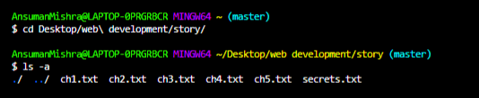
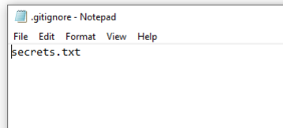
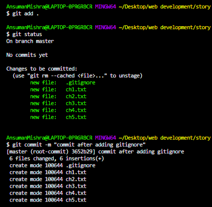

# Understanding Git Ignore and Its Usage

---

## Overview

A `.gitignore` file specifies which files and directories Git should **exclude from version control**. It is an essential part of keeping a repository clean, secure, and manageable.

### Core Purposes
- **Prevents tracking** of unnecessary or sensitive files (e.g., passwords, API keys, log files)
- **Supports patterns** — file names, extensions, and directory patterns can all be specified
- **Keeps the repository clean** and free from clutter like build artifacts and system files

---

## Creating a .gitignore File

### Step 1: Navigate to Your Project Directory
Open the terminal or command prompt, navigate to your project folder using `cd`, and view its contents:
```
cd directory(or)folder
ls -a
```


### Step 2: Create the .gitignore File
Create a `.gitignore` file inside the root of your project folder:
```
touch .gitignore
```

### Step 3: Add Files and Patterns to Ignore
Open the `.gitignore` file and list the files or patterns to be ignored, placing each entry on a **separate line**:
```
# Compiled class file
*.class

# Log file
*.log

# Mobile Tools for Java (J2ME)
.mtj.tmp/

# Package Files
*.jar
*.war
*.nar
*.ear
*.zip
*.tar.gz
*.rar
```


### Step 4: Initialize Git and Commit
Initialize Git in the terminal, add the files to the repository, and commit with an appropriate message:
```
git init
git add .
git commit -m "your message"
```

### Step 5: Check Repository Status
Verify that the ignored files are being excluded from tracking:
```
git status
```
Files listed in `.gitignore` will be **consistently excluded** from tracking and future commits.



---

## .gitignore File Patterns and Format

Git supports a variety of patterns in `.gitignore` to give you precise control over what gets ignored.

| Pattern | Description |
|---|---|
| *(blank line)* | Used to separate entries for readability |
| `#` | Denotes a comment. Use `\#` to match a literal `#` |
| `/` | Directory separator. Example: `webdev/` ignores the `webdev` directory at the root |
| `*.extension` | Matches all files with a specific extension (e.g., `*.txt`, `*.log`) |
| `**/name` | Matches any file or directory named `name` at **any level** in the project |
| `name/**` | Matches **all files and subdirectories** inside the `name` directory |
| `!filename` | **Negation** — re-includes a file that would otherwise be ignored |

---

## .gitignore Rules

- Files listed in `.gitignore` must follow specific pattern syntax
- Git reads the `.gitignore` file **from top to bottom** — order matters
- The file supports **negation** using the `!` prefix to re-include specific files
- `*.log` ignores all files with the `.log` extension
- `build/` ignores the entire `build` directory and everything inside it
- Lines beginning with `#` are treated as **comments** and ignored by Git

---

## Local vs Personal Git Ignore Rules

Git provides two levels of ignore rules — **local** (repository-specific) and **personal** (global across all repositories).

### Local Git Ignore Rules (`.gitignore`)
A repository-level file that defines ignored files **for that specific project only**.

- Typically one `.gitignore` file is maintained per repository
- Lists files and directories to be excluded from version control
- Applies **only to the specific repository** where it exists
- Shared with collaborators once it is committed and pushed to the remote repository

---

### Personal Git Ignore Rules (Global `.gitignore`)
A global ignore file that applies to **all Git repositories** on your machine. It is never shared with collaborators.

**Step 1 — Create the global .gitignore file:**
```
touch ~/.gitignore_global
```

**Step 2 — Add your personal ignore rules:**
```
# ~/.gitignore_global
*.swp
.DS_Store
```

**Step 3 — Configure Git to use this file globally:**
```
git config --global core.excludesfile ~/.gitignore_global
```

From this point on, every Git repository on your machine will automatically ignore the patterns listed in `~/.gitignore_global`, without affecting any shared `.gitignore` files.

---

## How to Undo Already Committed Files

If you accidentally committed files before setting up `.gitignore`, you can **remove them from tracking** without deleting the actual files:

```
git rm --cached -r .
```

- `rm` — remove from Git tracking
- `--cached` — removes from the repository index only, not from your local filesystem
- `-r` — recursive, applies to all files and subdirectories

After running this command, add the files to `.gitignore` and commit again to permanently exclude them from future tracking.

---

## Quick Reference Summary

| Task | Command |
|---|---|
| Create a `.gitignore` file | `touch .gitignore` |
| Create a global ignore file | `touch ~/.gitignore_global` |
| Set global ignore file in Git | `git config --global core.excludesfile ~/.gitignore_global` |
| Check what is being tracked | `git status` |
| Remove already committed files from tracking | `git rm --cached -r .` |

---

## Key Takeaways

- `.gitignore` is essential for keeping your repository **clean, secure, and professional** by excluding unnecessary and sensitive files
- Use **patterns** like `*.log`, `build/`, and `**/name` to efficiently ignore groups of files rather than listing each one individually
- **Local `.gitignore`** is project-specific and shared with the team; **global `.gitignore`** is personal and applies to all repositories on your machine
- Git reads `.gitignore` **top to bottom** — use `!` negation carefully to re-include specific files
- If files were committed before being ignored, use `git rm --cached -r .` to **untrack them** without deleting them locally
- The GitHub community maintains a collection of ready-made `.gitignore` templates for various languages and frameworks — searchable directly on GitHub

---