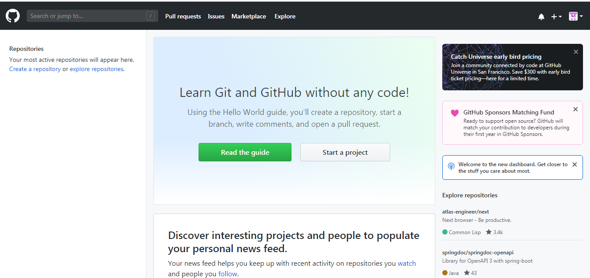
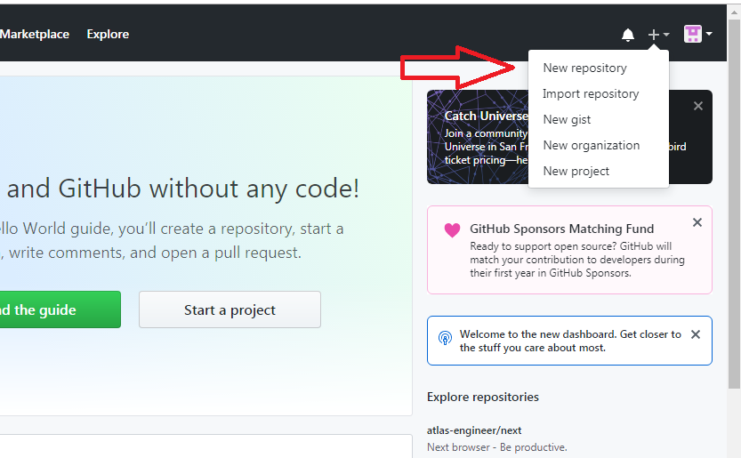
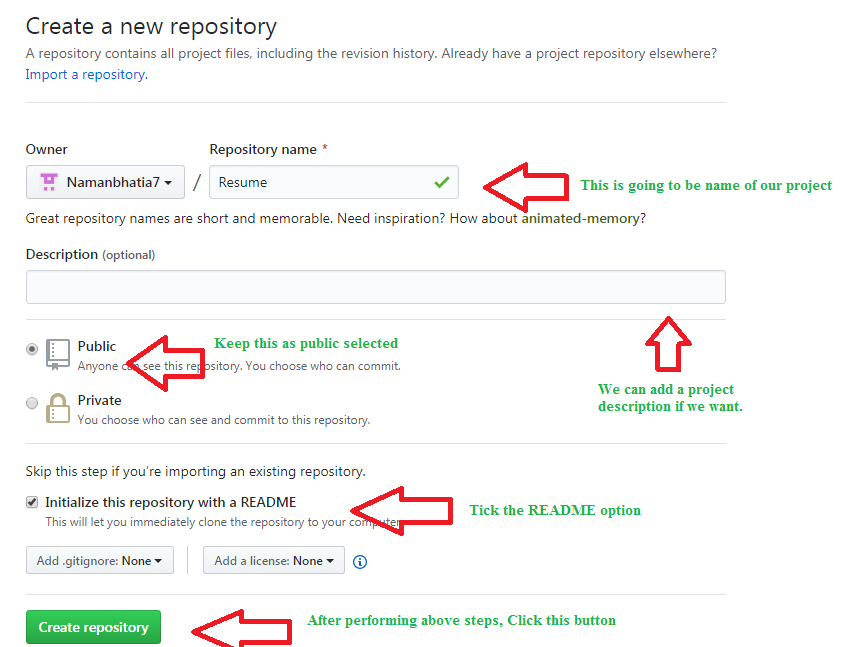
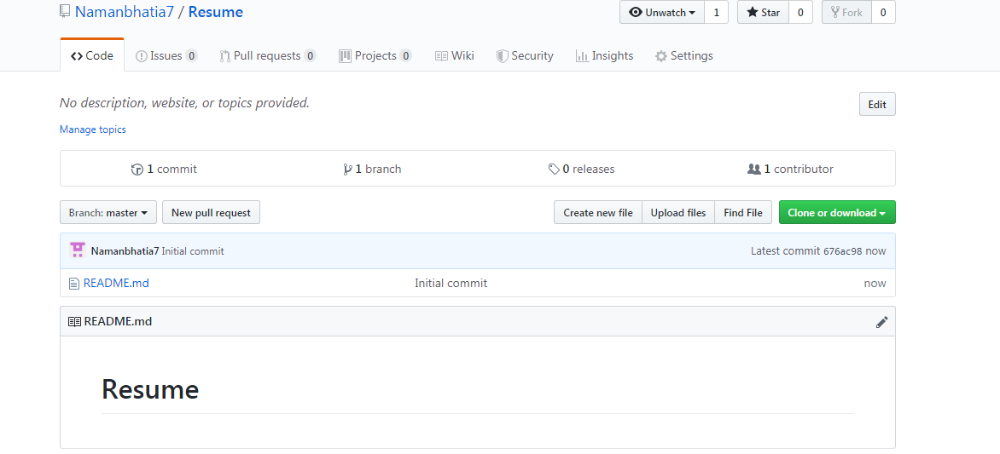
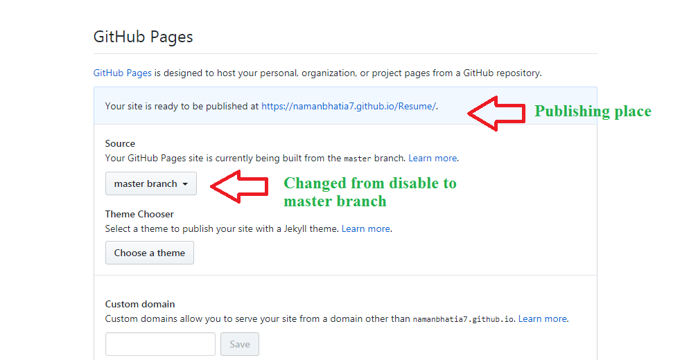
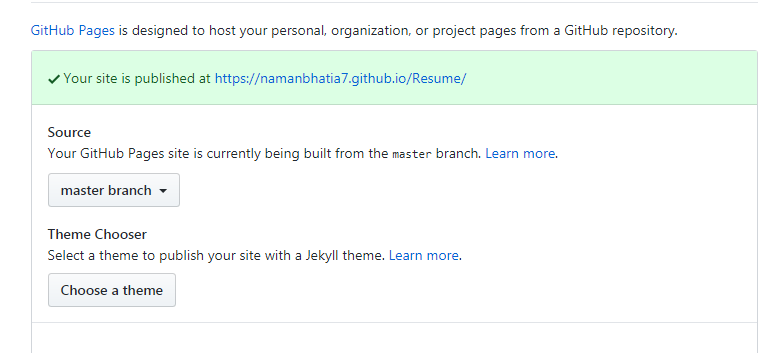

# Creating a Repository in GitHub

---

## Overview

GitHub is a cloud-based platform that hosts Git repositories, enabling developers to store, manage, and collaborate on code. Creating a repository on GitHub is the first step to publishing your project online, sharing it with others, or deploying it as a live site.

---

## What is a GitHub Repository?

A GitHub repository is a remote storage location for your project. It holds all your project files, folders, and the complete version history tracked by Git. Repositories can be:

- **Public** — visible to anyone on the internet.
- **Private** — only accessible to you and collaborators you invite.

---

## Steps to Creating a Repository in GitHub

---

### Step 1: Sign In to GitHub

Go to [https://github.com](https://github.com) and sign in to your account. If you don't have an account, create one for free.

```
https://github.com
```

> **Note:** Your GitHub username will appear in all your repository URLs, e.g., `https://github.com/yourusername/your-repo`.

&nbsp;



---

### Step 2: Create a New Repository

Once signed in, click the **"+"** icon in the top-right corner of the navigation bar and select **"New repository"** from the dropdown menu.

Alternatively, navigate directly to:
```
https://github.com/new
```

&nbsp;



---

### Step 3: Fill In Repository Details

You will be taken to the **Create a new repository** form. Complete the following fields:

| Field | Description |
|---|---|
| **Repository name** | A short, memorable name for your project (e.g., `Resume`, `my-portfolio`). |
| **Description** *(optional)* | A brief explanation of what your project is about. |
| **Visibility** | Choose **Public** or **Private**. |
| **Initialize with README** | Tick this to add a `README.md` file automatically — recommended for new repos. |
| **Add .gitignore** *(optional)* | Select a template to exclude unnecessary files from tracking. |
| **Choose a license** *(optional)* | Add an open-source license to define how others can use your code. |

Once you've filled in the details, click **"Create repository"**.

&nbsp;



---

### Step 4: Connect Your Local Repository to GitHub

After creating the repository on GitHub, link it to your local project so you can push your code.

Copy the remote URL from the repository page, then run the following commands in your terminal:

Add the remote origin:
```bash
git remote add origin https://github.com/yourusername/your-repository
```


Push your local commits to GitHub:
```bash
git push -u origin main
```

> **Note:** If your default branch is named `master` instead of `main`, replace `main` with `master` in the command above.

&nbsp;



---

### Step 5: Enable GitHub Pages *(Optional — Publishing a Live Site)*

GitHub Pages allows you to host your project as a live website directly from your repository. This is useful for portfolios, resumes, and documentation sites.

To enable GitHub Pages:

1. Go to your repository on GitHub.
2. Click on **Settings**.
3. Scroll down to the **Pages** section.
4. Under **Source**, select the branch to build from (e.g., `master branch` or `main`).
5. Click **Save**.

Once enabled, GitHub will publish your site and display a confirmation message:

> ✅ *Your site is published at* `https://yourusername.github.io/your-repository/`

For example:
```
https://namanbhatia7.github.io/Resume/
```

You can also apply a Jekyll theme to style your site using the **Theme Chooser** — click **"Choose a theme"** and select from the available options.

> **Note:** Your GitHub Pages site is built from the branch you selected (e.g., `master branch`). Any commits pushed to that branch will automatically update the live site.

&nbsp;

**Step 1:** Go to settings and scroll down to github pages section. Change disable option to master branch option. Now github will do some behind the scenes work and going to publish the repository.



Step 2: Now we are done and our project can be accessed worldwide.



---

## Quick Reference — Key Actions

| Action | How to Do It |
|---|---|
| Create a new repo | Click **"+"** → **"New repository"** |
| Set visibility | Choose Public or Private during creation |
| Push local code | `git remote add origin <url>` then `git push -u origin main` |
| Enable GitHub Pages | Settings → Pages → Select branch → Save |
| Apply a Jekyll theme | Settings → Pages → Theme Chooser → Choose a theme |
| View published site | `https://yourusername.github.io/repo-name/` |

---

## Interview Prep — Common Questions

### Q: What is the difference between Git and GitHub?
**Git** is a local version control tool that tracks changes in your code on your machine. **GitHub** is a cloud-based platform that hosts Git repositories remotely, enabling collaboration, backup, and features like GitHub Pages and pull requests.

---

### Q: What is a README file and why is it important?
A `README.md` is a markdown file that serves as the front page of your repository on GitHub. It typically describes the project, how to install it, how to use it, and any other relevant information. It is the first thing visitors see when they open your repository.

---

### Q: What is the difference between a public and private repository?
- A **public** repository is visible to everyone on the internet. Anyone can view and clone it.
- A **private** repository is only accessible to you and collaborators you explicitly invite.

---

### Q: What is GitHub Pages?
GitHub Pages is a free static site hosting service built into GitHub. It publishes content directly from a repository branch and makes it accessible via a public URL in the format `https://username.github.io/repository-name/`. It supports plain HTML/CSS/JS as well as Jekyll-based themes.

---

### Q: What does `git remote add origin` do?
It links your local repository to a remote repository on GitHub. `origin` is the conventional alias given to the primary remote. After setting this, you can push and pull code between your local machine and GitHub using that alias.

---

### Q: What is a `.gitignore` file?
A `.gitignore` file tells Git which files and folders to exclude from tracking. For example, you may want to ignore `node_modules/`, build outputs, or environment files containing secrets. GitHub provides templates for common languages and frameworks when creating a repository.

---

