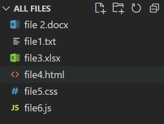
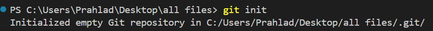
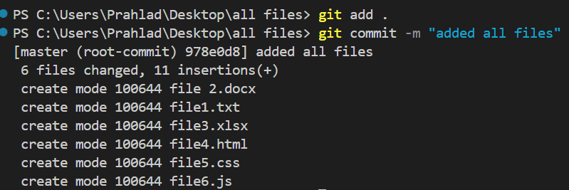
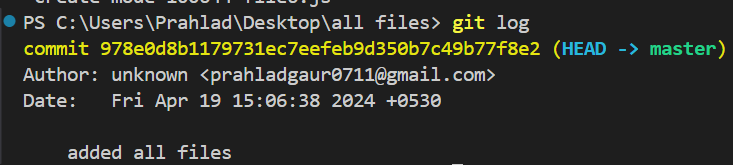
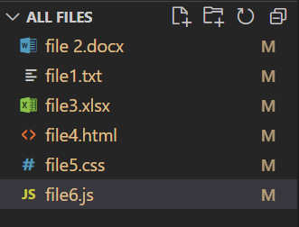
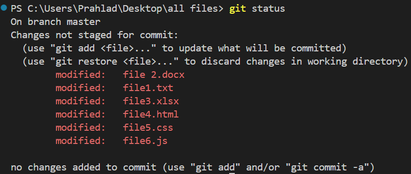
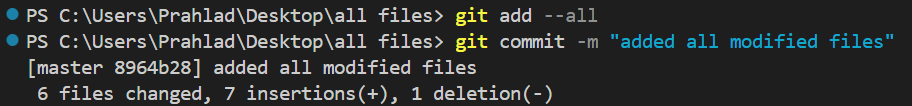
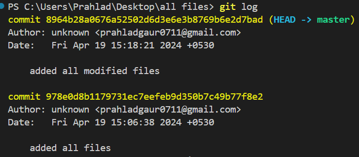
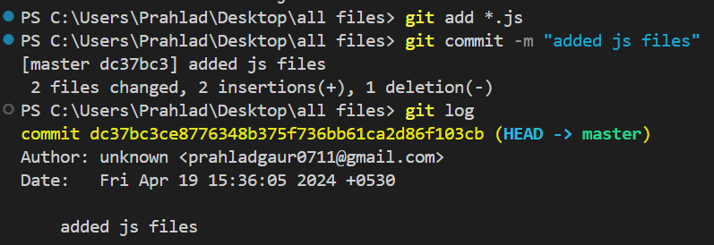

## Comprehensive Guide: Staging All Files in Git

The **staging area** (also known as the "index") is a crucial middle ground in the Git workflow. It acts as a buffer between your **working directory** (where you edit files) and the **local repository** (where changes are permanently saved). Staging allows you to review and organize your changes, ensuring only intended updates are included in your next commit.

---

### Core Concepts
* **Staging:** The process of preparing files for a commit using `git add`.
* **Inclusive Staging:** Using flags like `-A` ensures new, modified, and deleted files are all tracked.
* **Purpose:** It allows for granular control, letting you group specific changes into logical commits rather than saving everything at once.

---

### [Approach 1] Using the Dot (`.`) Notation
The dot notation is the most common way to stage all changes within the current directory and its subdirectories.

**Step 1: Project Setup**
First, create your workspace and the files you intend to track.
* `mkdir folder-name` (Creates a directory)
* `touch file-name` (Creates an empty file)

Folder Structure: Create a folder similar to that.



**Step 2: Initialize Git**
Convert your local directory into a Git repository.
```bash
git init
```



*(This creates a hidden .git folder that tracks your version history.)*

**Step 3: Stage and Commit**
Add all files in the current path to the staging area and save them to the history.
```bash
git add .
git commit -m "added all files"
```



**Step 4: Verify History**
Check the commit log to ensure your files were successfully saved.
```bash
git log
```


---

### [Approach 2] Using the `--all` or `-A` Flag
The `-A` flag is highly effective because it tells Git to look at the entire working tree. It captures modifications, new files (untracked), and files you have deleted.

**Step 1: Modify Files**
When you edit an existing file, Git marks it as **Modified (M)**.



**Step 2: Check Status**
Before staging, it is best practice to see which files Git recognizes as changed.
```bash
git status
```


**Step 3: Stage Everything**
Use the all-encompassing flag to stage every change across the entire project.
```bash
git add --all 
# OR
git add -A

git commit -m "added all modified files"
```


Now we can check git log.



---

### [Approach 3] Staging by File Extension
Sometimes you only want to stage specific types of files (e.g., all scripts or all documentation) while leaving other changes in the working directory. This is done using **wildcards**.

* **Syntax:** `git add *.extension`
* **Example for Text files:** `git add *.txt`
* **Example for JavaScript files:** `git add *.js`



> **Note:** This approach is particularly useful in polyglot projects where you want to separate your backend changes from your frontend changes into different commits.

---

### Summary Table: Staging Commands

| Command | Scope | Handles Deletions? |
| :--- | :--- | :--- |
| `git add .` | Current directory and subdirectories | Yes |
| `git add -A` | Entire project (working tree) | Yes |
| `git add *.js` | All files ending in .js | No (only matches existing) |

---