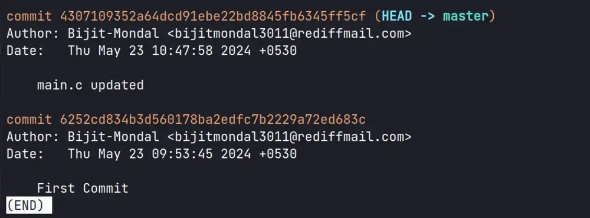
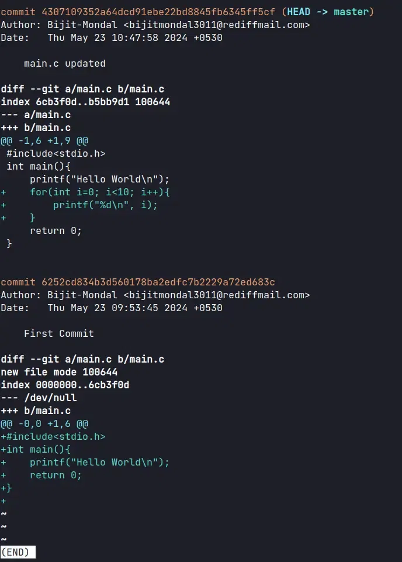

## Tracking File Changes Using Git

Tracking file changes is the heartbeat of version control. It allows you to maintain a complete version history, review modifications over time, and manage the evolution of your project without the fear of losing previous work.

---

### Phase 1: Contextual Awareness
Before diving into history, you must understand your current environment.

**Step 1: Check the Repository Status**
Always verify the state of your working directory. This ensures you know which files are currently being tracked and if there are pending modifications.
```bash
git status
```
* **Untracked:** Files Git doesn't know about yet.
* **Modified:** Changes exist but aren't staged.
* **Staged:** Changes are ready to be committed.



---

### Phase 2: Identifying Key Milestones
When you need to know who changed a specific file and when, you look at the logs.

**Step 2: View File-Specific History**
To filter out the noise of the entire project and focus on just one file, use the following command:
```bash
git log -- filename.extension
```
* **Outcome:** Git generates a list of commits that specifically affected that file, showing the Author, Date, and Commit Message.


---

### Phase 3: Inspecting the Details
Finding the commit is only half the battle; seeing exactly what lines changed is the next step.

**Step 3: View Changes in a Specific Commit**
Once you have the **commit hash** (a long alphanumeric string) from your log, you can "inspect" it to see the line-by-line differences (diffs).
```bash
git show <commit-hash>
```
*Example:*
```bash
git show 4307109352a64dcd91ebe22bd8845fb6345ff5cf
```
* **Output:** This displays the file metadata and a "patch" (diff) where additions are usually marked in green (+) and deletions in red (-).

---

### Phase 4: The Combined View (Efficient Troubleshooting)
If you want to see the history and the actual code changes simultaneously, use the "patch" flag.

**Alternative Way: Integrated Log and Patch**
This command is perfect for quickly scrolling through the evolution of a file's content.
```bash
git log -p -- filename
```

**Command Breakdown:**
* `git log`: The base command for history.
* `-p`: Short for **patch**; it displays the actual code diff for each entry.
* `--`: A separator that tells Git everything following it is a file path, not a command option.
* `filename`: The specific file you are investigating.



---

### Summary of Commands

| Command | Primary Use Case |
| :--- | :--- |
| `git status` | See what is currently happening in the directory. |
| `git log -- [file]` | List all commits that involved a specific file. |
| `git show [hash]` | See exactly what changed in one specific commit. |
| `git log -p -- [file]` | See a chronological list of all code changes for a file. |

---