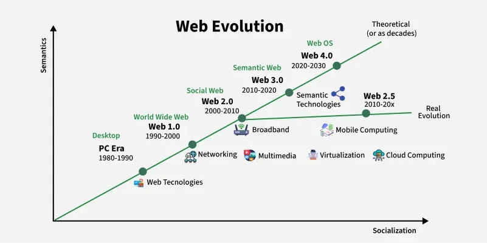
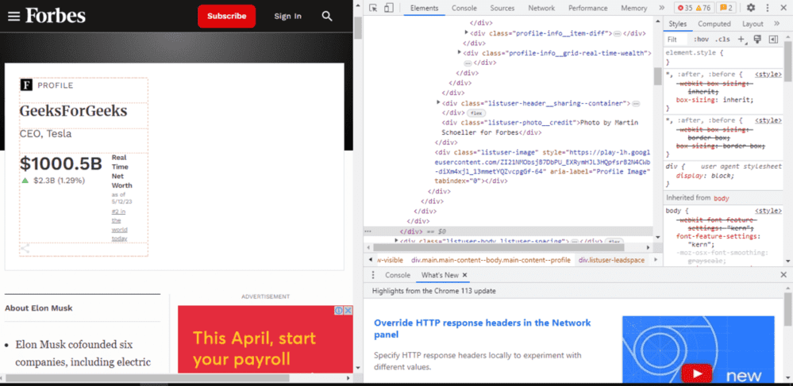

# Working of the Web and How Websites Are Rendered

---

## Overview

The web works on a **client–server model** where browsers act as clients requesting resources from servers. Websites are rendered by interpreting and combining multiple web technologies.

- Server delivers HTML, CSS, and JavaScript
- Browser builds the page structure and renders the content

---

## World Wide Web (WWW)

The **World Wide Web (WWW)** is a system of interconnected hypertext documents accessed over the internet, allowing users to view and share information in various formats such as text, images, audio, and video.

- A collection of interlinked web pages accessed via the internet
- Transformed global communication and information sharing
- Works on established standards such as **HTTP, HTML, and URLs**

---

## History of the Web

The World Wide Web was invented in **1989 by Tim Berners-Lee** at CERN to enable easy information sharing between scientists. Since then, it has rapidly evolved from simple static pages into a dynamic, interactive, and intelligent global platform.

| Year | Milestone |
|---|---|
| **1989** | Tim Berners-Lee proposed the WWW while working at CERN |
| **1990** | First web browser and server developed; Archie search engine introduced |
| **1991** | First website went live and became publicly accessible |
| **1993** | Mosaic, the first popular graphical web browser, was released |
| **Late 1990s** | Dot-com boom expanded e-commerce and online businesses |
| **2000s** | JavaScript and CSS enabled dynamic and interactive websites |
| **Mid-2000s** | Rise of social media platforms like Facebook and YouTube |
| **Present Day** | Emerging technologies such as AI, VR, and IoT continue to shape the future of the web |

---

## Webpage

A **webpage** is a single document within a website that is displayed in a web browser. It presents information or functionality to users using web technologies.

- Created using HTML and other web technologies
- Can contain multimedia content and interactive elements
- May be **static** (fixed content) or **dynamically generated** (content changes based on user or data)

### How a Webpage Works

A webpage is created using **HTML, CSS, and JavaScript**, which work together to define structure, style, and interactivity. When requested, the browser processes these files step by step to display the final page:

**HTML** — Provides the basic structure and content of the webpage

**CSS** — Controls layout, colors, fonts, and overall visual appearance

**JavaScript** — Enables interactivity such as buttons, menus, and animations

The full request-to-render process follows these steps:

1. Web server sends the required files (HTML, CSS, JS) to the user's browser
2. Browser creates the **DOM (Document Object Model)** from the HTML
3. CSS styles are applied to the DOM elements
4. JavaScript runs to add dynamic behavior and user interactions
5. User actions can trigger new requests and further page updates

---

## Domain Name

A **domain name** is a unique, human-readable address used to access a website on the internet through the **Domain Name System (DNS)**.

- Maps a human-friendly name to an underlying **IP address**
- Follows a hierarchical structure: **subdomain → domain name → TLD (Top-Level Domain)**
- Registered and renewed through domain registrars

> **Example:** In `www.example.com` — `www` is the subdomain, `example` is the domain name, and `.com` is the top-level domain.

---

## Browser Rendering

**Browser rendering** is the process by which a web browser converts webpage code into a visible and interactive page for the user.

### How the Browser Renders a Page
1. The browser's **rendering engine** parses HTML and CSS
2. Builds the **Document Object Model (DOM)** from HTML
3. Applies **CSS rules** to style the DOM elements
4. Executes **JavaScript** to add dynamic behavior
5. Displays the final rendered output to the user

> Rendering performance depends on the **browser, device, network speed, and page complexity**.

---

## Client-Side Rendering (CSR)

**Client-side rendering (CSR)** is a rendering approach where the browser itself builds and displays the webpage using resources provided by the server.

- Rendering is handled **entirely by the user's browser**
- Server delivers HTML, CSS, and JavaScript files
- JavaScript controls all page updates and interactions
- Enables **dynamic and interactive** user experiences
- Commonly used in **Single-Page Applications (SPAs)**

---

## Server-Side Rendering (SSR)

**Server-side rendering (SSR)** is a rendering approach where the server generates the **complete HTML page** and sends it directly to the browser.

- Rendering occurs **on the server** before being sent to the client
- Suitable for **content-heavy or frequently updated** websites
- Improves **initial page load speed** and **SEO (Search Engine Optimization)**
- Commonly used in **CMS (Content Management System)** platforms

---

## CSR vs SSR — Quick Comparison

| Feature | Client-Side Rendering (CSR) | Server-Side Rendering (SSR) |
|---|---|---|
| **Where rendering happens** | In the browser | On the server |
| **Initial load speed** | Slower (JS must load first) | Faster (HTML ready on arrival) |
| **SEO** | Less optimal | Better for SEO |
| **Interactivity** | Highly dynamic | Better for static/content pages |
| **Common use** | Single-Page Applications (SPAs) | CMS platforms, news sites |

---

## The Inspect Command

The **Inspect command** is a built-in browser developer tool that lets you **view and modify** a webpage's HTML, CSS, and JavaScript in real time. Available in modern browsers including Google Chrome, Mozilla Firefox, and Microsoft Edge.

### How to Use the Inspect Command

**Method 1 — Right-click:**
- Right-click anywhere on the webpage
- Select **"Inspect"** from the context menu

**Method 2 — Keyboard shortcut:**
- **Windows/Linux:** `Ctrl + Shift + I`
- **Mac:** `Cmd + Option + I`

Once opened, the **developer tools window** appears, showing the HTML, CSS, and JavaScript of the current page. You can use the various tabs and tools within it to inspect, debug, and manipulate the webpage as needed.

---

## Key Takeaways

- The web operates on a **client-server model** — browsers request resources, servers deliver them
- Every webpage is built from three core technologies: **HTML (structure), CSS (style), and JavaScript (interactivity)**
- The browser processes these files through a **rendering pipeline** — parsing HTML → building the DOM → applying CSS → executing JavaScript
- **CSR** puts rendering work in the browser, ideal for dynamic apps; **SSR** puts it on the server, better for SEO and fast initial loads
- **Domain names** are human-readable addresses that map to IP addresses via DNS
- The **Inspect tool** is a powerful built-in browser feature for understanding and debugging how any webpage is built

---