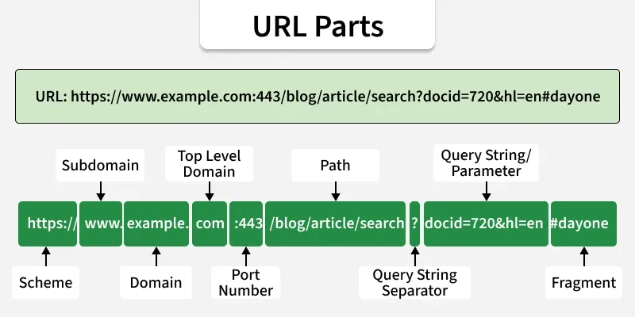

# URL Components and Web Terminologies

---

## Overview

A **URL (Uniform Resource Locator)** is a unique address used to locate and access resources on the internet.

- Identifies the **location** of a resource online
- Specifies the **protocol** to use (e.g., HTTP or HTTPS)
- Includes the **domain name** or IP address
- May contain a **path** to a specific resource
- Used to access web pages, files, images, and other online resources

---

## Parts of a URL

A URL is composed of multiple parts, each defining **how and where** a resource can be accessed.

**Example URL breakdown:**
```
https://www.example.com:443/path/page?key=value#section
```



| Component | Example | Description |
|---|---|---|
| **Scheme** | `https` | Defines the protocol used to access the resource (e.g., http, https, ftp) |
| **Subdomain** | `www` | Specifies a subdivision of the main domain |
| **Domain** | `example` | Identifies the main website name |
| **Top-Level Domain (TLD)** | `.com` | Indicates the domain extension (e.g., .com, .org, .net) |
| **Port Number** | `:443` | Specifies the server port (default: 80 for HTTP, 443 for HTTPS) |
| **Path** | `/path/page` | Points to the specific resource location on the server |
| **Query String Separator** | `?` | The symbol that marks the beginning of query parameters |
| **Query String / Parameters** | `key=value` | Passes data as key-value pairs, separated by `&` |
| **Fragment** | `#section` | Refers to a specific section within the resource |

---

## HTTP

**HTTP (Hypertext Transfer Protocol)** is a communication protocol that defines how data is exchanged between clients and web servers.

- Used to **transfer data** over the internet
- Defines **request-response communication** between client and server
- Supports transmission of web pages, images, and other resources
- **Stateless protocol** by design — each request is independent with no memory of previous ones

---

## HTTPS

**HTTPS (Hypertext Transfer Protocol Secure)** is a secure version of HTTP that **encrypts data** exchanged between clients and servers.

- Uses **encryption (SSL/TLS)** to protect data in transit
- **Prevents interception** and tampering by third parties
- Ensures **secure communication** between client and server
- Required for any website handling sensitive data such as passwords or payment information

---

## HTTP vs HTTPS — Comparison

| Feature | HTTP | HTTPS |
|---|---|---|
| **Full Name** | Hypertext Transfer Protocol | Hypertext Transfer Protocol Secure |
| **Data Transfer** | Sent in plain text | Encrypted using SSL/TLS |
| **Default Port** | Port 80 | Port 443 |
| **Security** | No built-in security | Secure communication via encryption |
| **Vulnerability** | Vulnerable to attacks like MITM (Man-in-the-Middle) | Resistant to MITM and similar attacks |
| **Speed** | Faster (no encryption overhead) | Slight overhead due to encryption (negligible in modern systems) |
| **Use Case** | Where security is not critical | Where secure data transmission is required |
| **Certificate** | Does not require SSL/TLS certificate | Requires SSL/TLS certificate |

---

## Client-Server Model Encryption

Secure communication in the client-server model is achieved through **encryption**, ensuring data exchanged between clients and servers remains protected.

- In the client-server model, a **client sends requests** and the **server returns responses**
- **Encryption** converts data into a secure, unreadable form to prevent unauthorized access
- **HTTPS** secures client-server communication using SSL/TLS protocols
- **SSL/TLS** provide both encryption and authentication for secure data transfer
- **HTTP** transfers data but provides **no encryption** — data is exposed in plain text

---

## SSL and TLS Certificates

**SSL (Secure Sockets Layer)** and **TLS (Transport Layer Security)** are security protocols that encrypt internet communication and verify server identity to ensure secure data transfer.

- Encrypt data transmitted between client and server
- Protect communication from **interception and unauthorized access**
- Use **digital certificates** to authenticate web servers, confirming they are who they claim to be
- Certificates are issued by trusted **Certificate Authorities (CAs)**
- Clients **verify certificates** before establishing a secure connection

> **Note:** TLS is the modern, more secure successor to SSL. Although "SSL" is still commonly used as a term, modern secure connections use TLS.

---

## Public Key vs Symmetric Key Encryption

Encryption can be classified into two main methods, each using different mechanisms for securing data:

### Public Key Encryption (Asymmetric Encryption)
- Uses a **public key** for encryption and a **private key** for decryption
- The public key can be **shared openly** with anyone
- The private key is kept **completely secret** by the owner
- More secure but computationally slower

### Symmetric Key Encryption
- Uses a **single shared key** for both encryption and decryption
- The same key must be known to both the sender and receiver
- **Faster** than public key encryption
- Risk lies in securely sharing the key between parties

| Feature | Public Key (Asymmetric) | Symmetric Key |
|---|---|---|
| **Keys Used** | Two keys — public and private | One shared key |
| **Public Sharing** | Public key can be shared openly | Key must be kept secret by both parties |
| **Speed** | Slower | Faster |
| **Use Case** | Initial secure handshake (SSL/TLS) | Bulk data encryption after handshake |

---

## Key Takeaways

- A **URL** is made up of several distinct components — scheme, domain, path, query parameters, and fragment — each serving a specific role in locating a resource
- **HTTP** is a stateless protocol for transferring data; **HTTPS** adds encryption via SSL/TLS for secure communication
- Always prefer **HTTPS** for any website handling user data — it protects against interception and tampering
- **SSL/TLS certificates** are issued by trusted Certificate Authorities and must be verified before a secure connection is established
- **Public key encryption** secures the initial handshake; **symmetric key encryption** handles the faster bulk data transfer once a connection is established

---