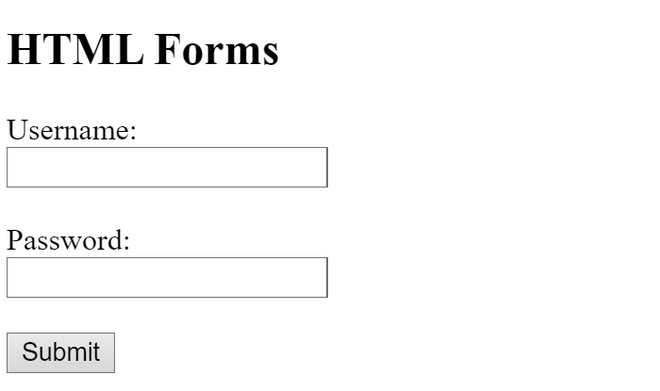
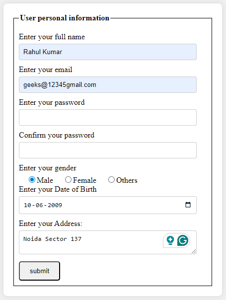

# HTML Forms 

---

## What are HTML Forms?

HTML forms, defined using the `<form>` tag, are essential for **collecting user input on web pages**. They include interactive controls like text fields, emails, passwords, checkboxes, radio buttons, and submission buttons.

- Over **85% of websites** rely on forms to gather user data
- Play a crucial role in modern web development by enabling user interaction and data submission
- Used for login pages, registration forms, search bars, contact forms, surveys, and more

---

## Basic Syntax

```html
<form>
  <!-- form elements -->
</form>
```

### Basic Example

```html
<!DOCTYPE html>
<html lang="en">
  <head>
    <meta charset="UTF-8">
    <meta name="viewport" content="width=device-width, initial-scale=1.0">
    <title>HTML Forms</title>
  </head>
  <body>
    <h2>HTML Forms</h2>
    <form>
      <label for="username">Username:</label><br>
      <input type="text" id="username" name="username"><br><br>

      <label for="password">Password:</label><br>
      <input type="password" id="password" name="password"><br><br>

      <input type="submit" value="Submit">
    </form>
  </body>
</html>
```

### Output: 



- The `<form>` tag defines the form container for user input
- A `<label>` is linked to each input via matching `for` and `id` attributes
- A text input collects the username and a password input masks the password
- A submit button sends the form data

---

## `<form>` Tag Attributes

These attributes control how and where form data is sent when the form is submitted.

| Attribute | Description |
|---|---|
| `action` | Specifies the URL where the form data is sent upon submission |
| `method` | Defines the HTTP method used to send data — either `get` or `post` |
| `target` | Determines where to display the server's response (`_blank`, `_self`, `_parent`, `_top`, or an iframe name) |
| `enctype` | Specifies how form data is encoded when using `method="post"` |
| `autocomplete` | Controls whether the browser should auto-fill form fields (`on` or `off`) |
| `novalidate` | A boolean attribute that prevents the form from being validated before submission |

### `method` Attribute — GET vs POST

| | `GET` | `POST` |
|---|---|---|
| **Data sent in** | URL query string | Request body |
| **Visible in URL** | Yes | No |
| **Best for** | Search forms, non-sensitive data | Login, registration, sensitive data |
| **Data length limit** | Yes — URL has a character limit | No practical limit |

### `enctype` Attribute Values

| Value | When to Use |
|---|---|
| `application/x-www-form-urlencoded` | Default — used for most standard forms |
| `multipart/form-data` | Required when the form includes file uploads |
| `text/plain` | Sends data as plain text — rarely used |

---

## Form Elements

These are the HTML elements used to build interactive and user-friendly forms.

| Element | Description |
|---|---|
| `<label>` | Defines a label for a form element — improves accessibility |
| `<input>` | Creates various types of input fields (text, password, email, etc.) |
| `<button>` | Defines a clickable button to submit, reset, or trigger functionality |
| `<select>` | Creates a drop-down list for selecting one or more options |
| `<textarea>` | Provides a multi-line text input for longer content |
| `<fieldset>` | Groups related form elements and draws a box around them |
| `<legend>` | Defines a caption or title for a `<fieldset>` |
| `<datalist>` | Specifies a list of pre-defined options for an `<input>` element |
| `<output>` | Displays the result of a calculation or user action |
| `<option>` | Defines individual options within a `<select>` drop-down |
| `<optgroup>` | Groups related options within a `<select>` drop-down |

---

## Input Types in HTML Forms

The `type` attribute of `<input>` determines what kind of data the user can enter and how the control is rendered.

| Input Type | Description |
|---|---|
| `type="text"` | Single-line text input field |
| `type="password"` | Password field — input is masked for privacy |
| `type="email"` | Validates that the input is a properly formatted email address |
| `type="number"` | Accepts numeric values — supports `min`, `max`, and `step` attributes |
| `type="date"` | Allows the user to select a date from a calendar picker |
| `type="time"` | Allows the user to select a time |
| `type="radio"` | Allows selection of only one option from a group |
| `type="checkbox"` | Allows selection of multiple options independently |
| `type="file"` | Allows the user to select and upload a file |
| `type="submit"` | Button that submits the form data |
| `type="reset"` | Button that resets all form fields to their default values |

---

## Advanced Form Example

A complete styled form collecting personal information including name, email, password, gender, date of birth, and address.

```html
<!DOCTYPE html>
<html>
  <head>
    <meta charset="UTF-8">
    <meta name="viewport" content="width=device-width, initial-scale=1.0">
    <title>HTML Form</title>
    <style>
      body {
        display: flex;
        justify-content: center;
        align-items: center;
        height: 100vh;
        margin: 0;
        background-color: #f0f0f0;
      }
      form {
        width: 400px;
        background-color: #fff;
        padding: 20px;
        border-radius: 8px;
        box-shadow: 0 0 10px rgba(0, 0, 0, 0.1);
      }
      fieldset {
        border: 1px solid black;
        padding: 10px;
        margin: 0;
      }
      legend {
        font-weight: bold;
        margin-bottom: 10px;
      }
      label {
        display: block;
        margin-bottom: 5px;
      }
      input[type="text"],
      input[type="email"],
      input[type="password"],
      textarea,
      input[type="date"] {
        width: calc(100% - 20px);
        padding: 8px;
        margin-bottom: 10px;
        box-sizing: border-box;
        border: 1px solid #ccc;
        border-radius: 4px;
      }
      .gender-group {
        margin-bottom: 10px;
      }
      .gender-group label {
        display: inline-block;
        margin-left: 10px;
      }
      input[type="radio"] {
        margin-left: 10px;
        vertical-align: middle;
      }
      input[type="submit"] {
        padding: 10px 20px;
        border-radius: 5px;
        cursor: pointer;
      }
    </style>
  </head>
  <body>
    <form>
      <fieldset>
        <legend>User Personal Information</legend>

        <label for="name">Enter your full name:</label>
        <input type="text" id="name" name="name" required />

        <label for="email">Enter your email:</label>
        <input type="email" id="email" name="email" required />

        <label for="password">Enter your password:</label>
        <input type="password" id="password" name="pass" required />

        <label for="confirmPassword">Confirm your password:</label>
        <input type="password" id="confirmPassword" name="confirmPass" required />

        <label>Enter your gender:</label>
        <div class="gender-group">
          <input type="radio" name="gender" value="male" id="male" required />
          <label for="male">Male</label>
          <input type="radio" name="gender" value="female" id="female" />
          <label for="female">Female</label>
          <input type="radio" name="gender" value="others" id="others" />
          <label for="others">Others</label>
        </div>

        <label for="dob">Enter your Date of Birth:</label>
        <input type="date" id="dob" name="dob" required />

        <label for="address">Enter your Address:</label>
        <textarea id="address" name="address" required></textarea>

        <input type="submit" value="Submit" />
      </fieldset>
    </form>
  </body>
</html>
```

### Output:



### What This Form Demonstrates

- `<fieldset>` and `<legend>` group and label related inputs visually
- `type="text"` and `type="email"` collect name and email with built-in email validation
- `type="password"` masks sensitive input — used twice for password confirmation
- `type="radio"` with the same `name` attribute ensures only one gender can be selected
- `type="date"` provides a date picker for date of birth
- `<textarea>` allows multi-line input for the address field
- `required` on key fields enforces client-side validation before submission
- CSS styling adds a card-like appearance with rounded corners, padding, and shadows

---

## Key Form Elements in Detail

### `<label>`
Links descriptive text to a form control using the `for` attribute matching the input's `id`. Clicking the label focuses the associated input — essential for accessibility.

```html
<label for="email">Email:</label>
<input type="email" id="email" name="email">
```

### `<textarea>`
Used for multi-line text input such as messages, comments, or addresses.

```html
<textarea id="address" name="address" rows="4" cols="40"></textarea>
```

### `<select>` and `<option>`
Creates a drop-down list. Each `<option>` defines one selectable item.

```html
<select name="country">
  <option value="in">India</option>
  <option value="uk">United Kingdom</option>
  <option value="us">United States</option>
</select>
```

### `<fieldset>` and `<legend>`
Groups related form controls inside a visible box with a title.

```html
<fieldset>
  <legend>Personal Details</legend>
  <!-- related inputs here -->
</fieldset>
```

---

## Complete Form Structure Summary

```html
<form action="/submit" method="post" autocomplete="on">
  <fieldset>
    <legend>Registration Form</legend>

    <!-- Text -->
    <label for="name">Name:</label>
    <input type="text" id="name" name="name" required>

    <!-- Email -->
    <label for="email">Email:</label>
    <input type="email" id="email" name="email" required>

    <!-- Password -->
    <label for="pass">Password:</label>
    <input type="password" id="pass" name="pass" required>

    <!-- Radio -->
    <label>Gender:</label>
    <input type="radio" name="gender" value="male"> Male
    <input type="radio" name="gender" value="female"> Female

    <!-- Checkbox -->
    <label>Interests:</label>
    <input type="checkbox" name="html" value="html"> HTML
    <input type="checkbox" name="css" value="css"> CSS

    <!-- Dropdown -->
    <label for="country">Country:</label>
    <select id="country" name="country">
      <option value="in">India</option>
      <option value="uk">UK</option>
    </select>

    <!-- Textarea -->
    <label for="msg">Message:</label>
    <textarea id="msg" name="msg"></textarea>

    <!-- Submit & Reset -->
    <input type="submit" value="Submit">
    <input type="reset" value="Clear">

  </fieldset>
</form>
```

---

## Best Practices

- **Always use `<label>` elements** — link them to inputs with matching `for` and `id` attributes for accessibility and usability
- **Use `required` for mandatory fields** — enables browser-level client-side validation without JavaScript
- **Choose the correct `input type`** — use `email` for emails, `number` for numbers, and `date` for dates to trigger appropriate keyboard layouts on mobile and enable built-in validation
- **Use `method="post"` for sensitive data** — never send passwords or personal information via `GET` as it appears in the URL
- **Group related fields** — use `<fieldset>` and `<legend>` to visually and semantically organise complex forms
- **Use `placeholder` as a hint, not a label** — placeholder text disappears on typing and should not replace a visible `<label>`

---

## Summary

| Element / Attribute | Key Role |
|---|---|
| `<form>` | Wraps all form controls and defines submission behaviour |
| `action` | URL where form data is sent |
| `method` | HTTP method — `get` or `post` |
| `<input>` | Core control for collecting various types of user input |
| `<label>` | Associates descriptive text with an input for accessibility |
| `<textarea>` | Multi-line text input |
| `<select>` / `<option>` | Drop-down list selection |
| `<fieldset>` / `<legend>` | Groups and labels related form sections |
| `required` | Enforces mandatory field completion before submission |
| `enctype="multipart/form-data"` | Required for file upload forms |

HTML forms are the primary mechanism for user interaction and data collection on the web. Mastering form elements, input types, attributes, and validation is fundamental to building functional, accessible, and secure web applications.

---