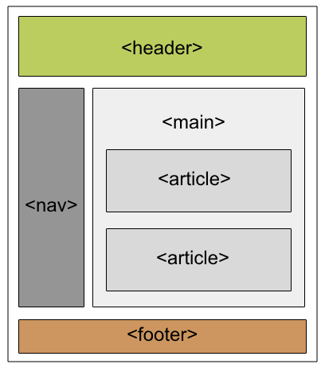

# HTML5 Semantic Elements 

---

## What are HTML5 Semantic Elements?

HTML5 semantic elements are tags that **clearly describe their purpose and meaning** — both to the browser and to the developer reading the code. Unlike generic containers like `<div>` and `<span>`, semantic elements carry inherent meaning about the role of their content.

- Clearly define the role and content of elements
- Improve code readability and structure
- Enhance accessibility for screen readers and assistive technologies
- Help browsers and search engines understand and index page content
- Improve SEO by giving search engines meaningful context about content

---

## Semantic vs Non-Semantic Elements

| Type | Examples | Meaning |
|---|---|---|
| **Semantic** | `<article>`, `<header>`, `<footer>`, `<nav>`, `<main>` | Clearly describes the content's purpose |
| **Non-Semantic** | `<div>`, `<span>` | Generic containers — tells nothing about their content |

---

## HTML5 Semantic Page Structure

A typical HTML5 page uses semantic elements to define distinct regions:

```
<header>      — Page or section header
<nav>         — Navigation links
<main>        — Primary page content
  <article>   — Standalone, reusable content
  <section>   — Thematic grouping of content
  <aside>     — Secondary/sidebar content
<footer>      — Page or section footer
```



---

## Semantic Elements in Detail

---

### 1. `<article>`

The `<article>` tag is used for content that **stands alone and can be independently distributed or reused** — such as a blog post, news article, forum post, or product card.

```html
<!DOCTYPE html>
<html>
  <head>
    <title></title>
    <style>
      h1 { color: #006400; font-size: 50px; text-align: left; }
      p  { font-size: 25px; text-align: left; margin-top: 0; }
    </style>
  </head>
  <body>
    <article>
      <h1>GeeksforGeeks</h1>
      <p>A Computer Science portal for geeks. It contains well written,
         well thought, and well explained computer science and programming
         articles, quizzes, and practice/competitive programming questions.</p>
    </article>
  </body>
</html>
```

**When to use:** Any content that would make sense on its own if extracted from the page — a news story, a blog entry, a user comment.

---

### 2. `<aside>`

The `<aside>` tag is used to place content in a **sidebar** — content that is related to but separate from the main content surrounding it.

```html
<!DOCTYPE html>
<html>
  <body>
    <p>GeeksforGeeks is a Computer Science Portal</p>
    <aside>
      <h4>GeeksForGeeks</h4>
      <p>GeeksforGeeks is a computer science platform
         where you can learn good programming.</p>
    </aside>
  </body>
</html>
```

**When to use:** Sidebars, pull quotes, related links, advertisements, or supplementary information that complements the main content.

---

### 3. `<details>` and `<summary>`

These two tags work together to create a **collapsible content block**:
- `<details>` defines the additional content that can be hidden or shown
- `<summary>` defines the visible, clickable heading that toggles the content

```html
<!DOCTYPE html>
<html>
  <body>
    <details>
      <summary class="GFG">GeeksforGeeks</summary>
      <p>GeeksforGeeks is a Computer Science portal
         where you can learn good programming.</p>
    </details>
  </body>
</html>
```

**When to use:** FAQs, accordions, expandable descriptions, or any content that users may or may not need to see.

---

### 4. `<figure>` and `<figcaption>`

These two tags are used together to display an **image, illustration, or diagram alongside a descriptive caption**:
- `<figure>` wraps the image and its caption as a self-contained unit
- `<figcaption>` provides the descriptive caption for the figure

```html
<!DOCTYPE html>
<html>
  <body>
    <h2>GeeksforGeeks</h2>
    <figure>
      
      <figcaption>GeeksforGeeks Logo</figcaption>
    </figure>
  </body>
</html>
```

### Output:


**When to use:** Images with captions, diagrams, code snippets with explanations, or any visual content that needs a descriptive label.

---

### 5. `<header>`

The `<header>` tag represents **introductory content for a page or section**. It typically contains headings, logos, navigation, or introductory text. Multiple `<header>` elements can exist on a single page — one per section or article.

```html
<!DOCTYPE html>
<html>
  <body>
    <article>
      <header>
        <h1>GeeksforGeeks</h1>
        <h3>GeeksforGeeks</h3>
        <p>A computer Science portal</p>
      </header>
    </article>
  </body>
</html>
```

**When to use:** At the top of the page for site-wide headers, or at the top of individual `<article>` or `<section>` elements for section-specific introductory content.

---

### 6. `<footer>`

The `<footer>` tag is placed at the **bottom of a page, article, or section**. It typically contains contact details, copyright information, links, or authorship details. Like `<header>`, multiple `<footer>` elements can exist on a single page.

```html
<!DOCTYPE html>
<html>
  <body>
    <footer>
      <p>Posted by: GeeksforGeeks</p>
      <p>Contact: <a href="https://www.geeksforgeeks.org/">geeksforgeeks.org</a>.</p>
    </footer>
  </body>
</html>
```

**When to use:** Page-level footers with copyright and contact info, or section/article-level footers with authorship and related links.

---

### 7. `<main>`

The `<main>` tag defines the **primary, unique content of the document**. Content inside `<main>` should be unique to that page and not repeated across pages (such as sidebars, navigation, or footers). There should only be **one `<main>` element per page**.

```html
<!DOCTYPE html>
<html>
  <body>
    <main>
      <h1>Important Residences</h1>
      <p>A few of them are Rashtrapati Bhavan, White House etc.</p>
      <article>
        <h1>Rashtrapati Bhavan</h1>
        <p>It is the home of the President of India.</p>
      </article>
      <article>
        <h1>The White House</h1>
        <p>It is the home of the President of the United States of America.</p>
      </article>
    </main>
  </body>
</html>
```

**When to use:** Wrapping the core, unique content of a page — the central body of the webpage excluding headers, footers, and sidebars.

---

### 8. `<section>`

The `<section>` tag splits a page into **thematic groupings of content**. Each section typically has its own heading. Unlike `<article>`, a section is not necessarily self-contained — it represents a themed portion of a larger whole.

```html
<!DOCTYPE html>
<html>
  <body>
    <section>
      <h1>Data Structure</h1>
      <p>Data Structure is a data organisation and storage format
         that enables efficient access and modification.</p>
    </section>
    <section>
      <h1>Algorithm</h1>
      <p>A process or set of rules to be followed in calculations
         or other problem-solving operations, especially by a computer.</p>
    </section>
  </body>
</html>
```

**When to use:** Dividing a long page into labelled regions — Introduction, Features, Contact, About — where each region forms a distinct thematic unit.

---

### 9. `<nav>`

The `<nav>` tag defines a set of **navigation links** — typically forming a navigation bar or menu. It signals to browsers and screen readers that its content is for navigating the site or page.

```html
<!DOCTYPE html>
<html>
  <body>
    <h1>Navigation Bar</h1>
    <nav>
      <a href="/home/">Home</a> |
      <a href="/about-us/">About Us</a> |
      <a href="/data-structure/">Data Structure</a> |
      <a href="/operating-system/">Operating System</a>
    </nav>
  </body>
</html>
```

**When to use:** Primary site navigation menus, breadcrumb navigation, table of contents links, or any group of links intended for site navigation.

---

### 10. `<mark>`

The `<mark>` tag is used to **highlight text** — indicating that the content is relevant or significant in a given context, similar to using a highlighter pen on physical text.

```html
<!DOCTYPE html>
<html>
  <body>
    <h1>mark tag</h1>
    <p>
      GeeksforGeeks is a
      <mark>Computer Science</mark>
      portal
    </p>
  </body>
</html>
```

**When to use:** Highlighting search terms in search results, marking relevant passages in a document, or drawing attention to key terms.

---

## All Semantic Elements — Quick Reference

| Element | Purpose | Multiple Per Page? |
|---|---|---|
| `<article>` | Standalone, reusable content (blog post, news article) | Yes |
| `<aside>` | Sidebar content related to surrounding content | Yes |
| `<details>` | Collapsible content container | Yes |
| `<summary>` | Visible heading/toggle for `<details>` | One per `<details>` |
| `<figure>` | Self-contained image or illustration with caption | Yes |
| `<figcaption>` | Caption for a `<figure>` element | One per `<figure>` |
| `<header>` | Introductory content for a page or section | Yes |
| `<footer>` | Footer for a page, article, or section | Yes |
| `<main>` | Primary unique content of the document | **Only one** |
| `<section>` | Thematic grouping of content with a heading | Yes |
| `<nav>` | Navigation links — menus, breadcrumbs | Yes |
| `<mark>` | Highlighted or marked text | Yes |

---

## `<article>` vs `<section>` vs `<div>`

| | `<article>` | `<section>` | `<div>` |
|---|---|---|---|
| **Meaning** | Self-contained, independently distributable content | Thematic grouping within a larger whole | No semantic meaning — generic container |
| **Standalone** | Yes | Not necessarily | No |
| **Requires heading** | Recommended | Recommended | No |
| **Use for** | Blog posts, news items, comments | Page regions, chapters, tabs | Layout and styling only |

---

## Best Practices

- **Do not overuse `<div>`** — use semantic elements where appropriate instead of generic `<div>` elements to provide more specific, meaningful information about the content
- **Structure content logically** — organise content within semantic elements to reflect the actual meaning and importance of the information on the page
- **Validate your HTML** — use tools like the W3C HTML Validator to ensure your semantic elements adhere to HTML5 standards
- **Use only one `<main>`** — there should be a single `<main>` element per page representing the unique primary content
- **Nest semantically** — `<article>` can contain its own `<header>` and `<footer>`; `<section>` can contain multiple `<article>` elements

---

## Summary

HTML5 semantic elements replace meaningless `<div>` soup with a structured, meaningful document outline. They make code easier to read and maintain, improve accessibility for users relying on screen readers, and help search engines better understand and rank your content. Adopting semantic HTML is a fundamental best practice in modern web development.

---