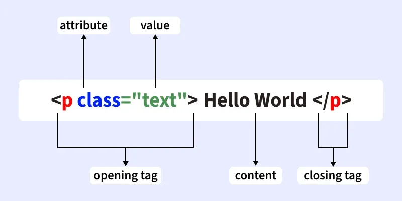
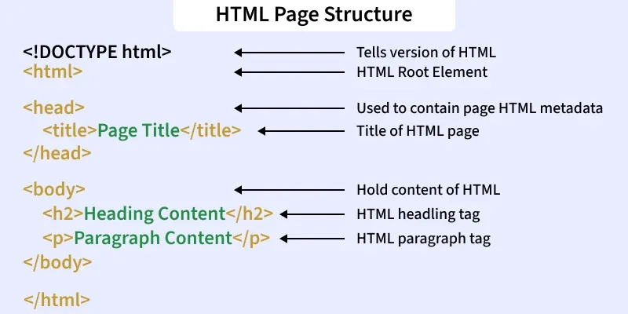
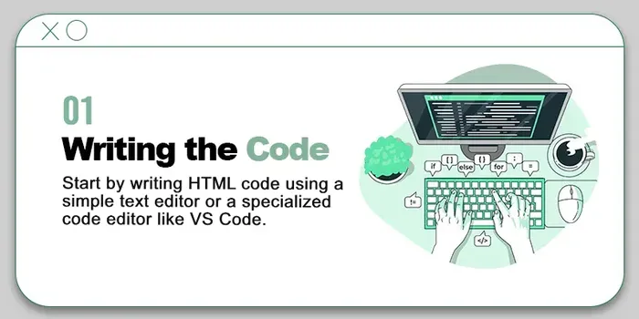
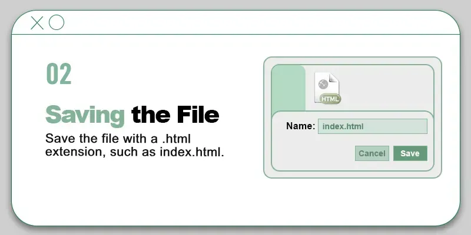
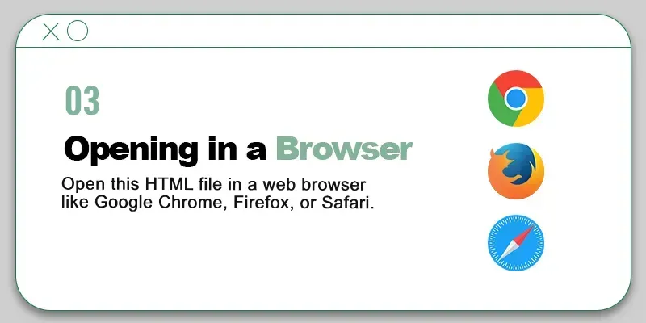
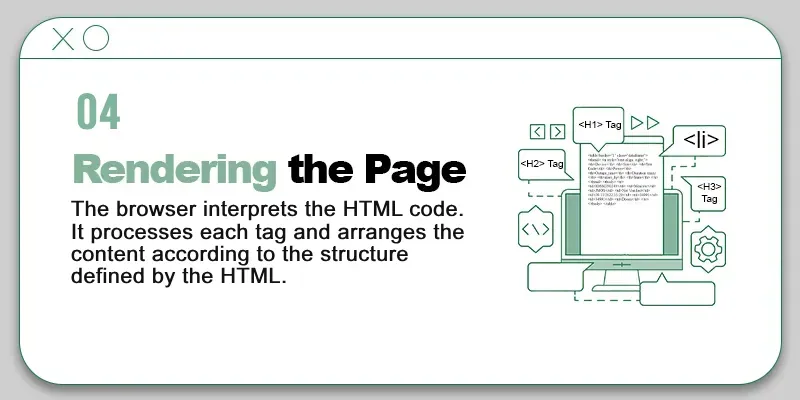
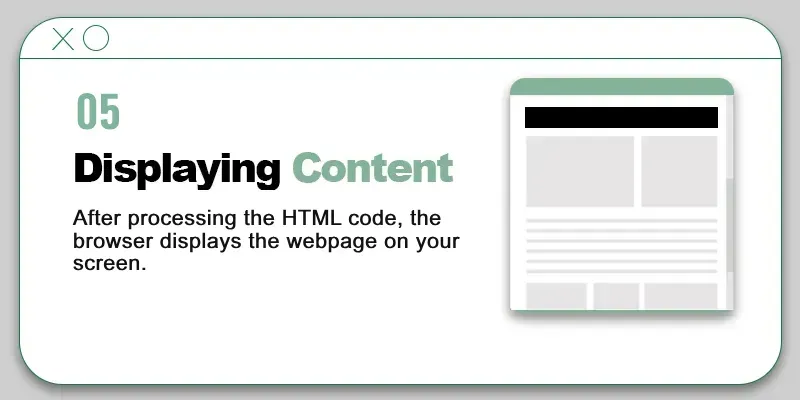
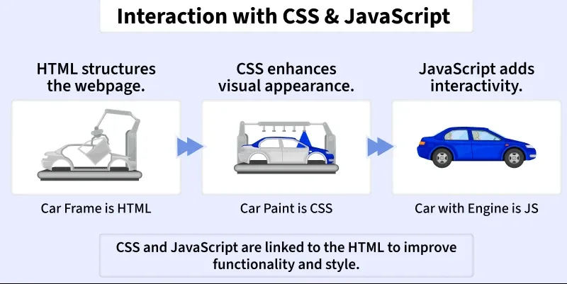

# HTML Introduction

---

## What is HTML?

**HTML (HyperText Markup Language)** is the standard language for creating and structuring web pages. It defines how content like text, images, and links appear in a browser.

- **Markup language, not a programming language** — it annotates text to define how it is structured and displayed by web browsers
- **Static language** — does not inherently provide interactive features on its own
- Combined with **CSS** for styling and **JavaScript** for interactivity to build modern, fully featured web pages

---

## Basic HTML Document

```html
<!DOCTYPE html>
<html>
  <head>
    <title>My First Webpage</title>
  </head>
  <body>
    <h1>Welcome to My Webpage</h1>
    <p>This is my first paragraph of text!</p>
  </body>
</html>
```

---

## HTML Tags vs HTML Elements

These two terms are related but distinct — it is important not to confuse them.

| | HTML Tag | HTML Element |
|---|---|---|
| **What it is** | The keyword enclosed in angle brackets `< >` | The complete structure including opening tag, content, and closing tag |
| **Example** | `<p>` | `<p>Hello World</p>` |
| **Purpose** | Tells the browser what type of content to expect | The full unit of content as rendered by the browser |

So a **tag** is just the label, while an **element** is the entire package — opening tag + content + closing tag.



---

## Structure of an HTML Page



Every HTML document follows a standard structure. Each section has a specific role:

```html
<!DOCTYPE html>          <!-- Declares the document as HTML5 -->
<html>                   <!-- Root element — contains everything -->
  <head>                 <!-- Stores metadata, title, links to CSS -->
    <title>Page Title</title>
  </head>
  <body>                 <!-- All visible content goes here -->
    <h1>Heading</h1>
    <p>Paragraph</p>
  </body>
</html>
```

| Section | Role |
|---|---|
| `<!DOCTYPE html>` | Tells the browser this is an HTML5 document — must be the very first line |
| `<html>` | The root element that wraps all other elements on the page |
| `<head>` | Stores page title, metadata, and links to external resources (CSS, fonts) |
| `<body>` | Contains all visible content — text, images, links, buttons, etc. |

---

## How HTML Works — Step by Step












1. Write HTML code using tags and elements in a text editor
2. Save the file with a `.html` extension so browsers can recognise it
3. Open the file in a browser (Chrome, Firefox, etc.)
4. The browser reads and interprets the HTML code
5. Each HTML tag is processed and converted into visible content
6. The final webpage is rendered on screen — headings, paragraphs, images, and all
7. Any HTML errors may affect how the page looks or behaves

---

## HTML, CSS, and JavaScript — How They Work Together



HTML alone produces static, unstyled content. CSS and JavaScript are layered on top to add style and interactivity. Together, all three form the foundation of every modern web page.

| Language | Role | Analogy |
|---|---|---|
| **HTML** | Structures the webpage and defines content elements | The car's **frame** — the foundation |
| **CSS** | Enhances visual appearance — colours, fonts, layout | The car's **paint** — style and design |
| **JavaScript** | Adds interactivity and dynamic behaviour | The car's **engine** — motion and behaviour |

### Example — All Three Working Together

**index.html** — Structure
```html
<!DOCTYPE html>
<html>
  <head>
    <link rel="stylesheet" href="style.css">
  </head>
  <body>
    <h1>Hello World</h1>
    <button onclick="showMessage()">Click Me</button>
    <script src="script.js"></script>
  </body>
</html>
```

**style.css** — Styling
```css
h1 {
  color: blue;
  font-family: Arial;
}
```

**script.js** — Interactivity
```javascript
function showMessage() {
  alert("This is JavaScript adding interactivity!");
}
```

All three files are linked together — HTML manages structure, CSS handles appearance, and JavaScript controls behaviour.

---

## HTML Attributes

Attributes provide **additional information** about an element. They are always placed inside the **opening tag** and written as `name="value"` pairs.

### Key Rules
- Written inside the opening tag of an element
- Always written as `name="value"` pairs
- Attribute values are enclosed in double quotes `" "`
- Most HTML elements can have one or more attributes
- Help customise how elements behave or display in the browser

### Syntax

```html
<tagname attribute="value">Content</tagname>
```

### Example

```html
<a href="https://www.example.com/">Visit Example</a>
```

Here, `href` is an attribute of the `<a>` tag that defines the destination URL of the link.

### Common Attributes

| Attribute | Used On | Purpose |
|---|---|---|
| `href` | `<a>` | Defines the URL of a hyperlink |
| `src` | ``, `<script>` | Specifies the source file path |
| `class` | Any element | Assigns a CSS class for styling |
| `id` | Any element | Assigns a unique identifier |
| `alt` | `` | Provides alternative text for images |

---

## Summary

HTML is the backbone of every web page. On its own it provides structure and content, but it reaches its full potential when combined with CSS for visual design and JavaScript for dynamic behaviour. Understanding the document structure, the difference between tags and elements, and how attributes work are the essential foundations for all further HTML learning.

---