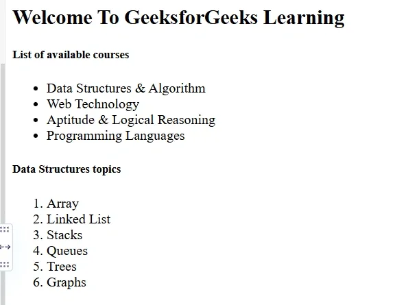
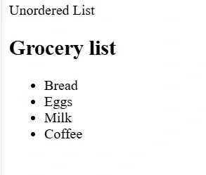
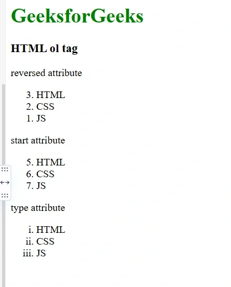
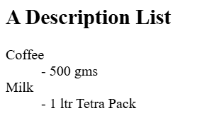

# HTML Lists 

---

## What are HTML Lists?

HTML lists organise content into structured formats, making information clear, readable, and easy to navigate. They are one of the most commonly used elements for presenting grouped or sequential information on a webpage.

- HTML lists organise content using tags like `<ul>`, `<ol>`, and `<dl>`
- Improve readability by presenting data in a structured format
- Can be nested inside one another to create multi-level lists

---

## Basic Syntax

```html
<ul>
  <li>Item 1</li>
  <li>Item 2</li>
  <li>Item 3</li>
</ul>
```

### Full Example — Both List Types

```html
<!DOCTYPE html>
<html lang="en">
  <head>
    <title></title>
  </head>
  <body>
    <h2>Welcome To GeeksforGeeks Learning</h2>

    <h5>List of available courses</h5>
    <ul>
      <li>Data Structures & Algorithm</li>
      <li>Web Technology</li>
      <li>Aptitude & Logical Reasoning</li>
      <li>Programming Languages</li>
    </ul>

    <h5>Data Structures topics</h5>
    <ol>
      <li>Array</li>
      <li>Linked List</li>
      <li>Stacks</li>
      <li>Queues</li>
      <li>Trees</li>
      <li>Graphs</li>
    </ol>
  </body>
</html>
```

### Output:



---

## Types of HTML Lists

There are **three main types** of lists in HTML:

| List Type | Tag | Used For |
|---|---|---|
| Unordered List | `<ul>` | Items where order does not matter |
| Ordered List | `<ol>` | Items that follow a specific sequence |
| Description List | `<dl>` | Terms paired with their descriptions |

### Output:



---

## 1. Unordered List `<ul>`

An unordered list displays items as **bulleted points** where the order of items does not matter. Each item is marked with a bullet by default.

- Ideal for scenarios where the sequence of items is not important
- Starts with the `<ul>` tag
- Each list item begins with the `<li>` tag

### Syntax

```html
<ul>
  <li>Item 1</li>
  <li>Item 2</li>
  <li>Item 3</li>
</ul>
```

### Example

```html
<!DOCTYPE html>
<html>
  <head>Unordered List</head>
  <body>
    <h2>Grocery List</h2>
    <ul>
      <li>Bread</li>
      <li>Eggs</li>
      <li>Milk</li>
      <li>Coffee</li>
    </ul>
  </body>
</html>
```

### `<ul>` Attributes

| Attribute | Description |
|---|---|
| `type` | Specifies which kind of bullet marker is used in the list |
| `compact` | Renders the list smaller — not recommended, use CSS instead |

### `type` Attribute Values for `<ul>`

| Value | Marker Style |
|---|---|
| `disc` | Filled circle (default) |
| `circle` | Hollow circle |
| `square` | Filled square |

> **Best Practice:** Use CSS (`list-style-type`) to control bullet style rather than the `type` attribute.

---

## 2. Ordered List `<ol>`

An ordered list is used when items **need to follow a specific sequence**. Items are marked with numbers by default, but can be configured to use letters or Roman numerals.

- All list items are numbered by default
- Starts with the `<ol>` tag
- Each list item begins with the `<li>` tag

### Syntax

```html
<ol>
  <li>Item 1</li>
  <li>Item 2</li>
  <li>Item 3</li>
</ol>
```

### Example — With Key Attributes

```html
<!DOCTYPE html>
<html lang="en">
  <head>
    <title></title>
  </head>
  <body>
    <h1 style="color: green">GeeksforGeeks</h1>
    <h3>HTML ol tag</h3>

    <!-- reversed attribute — counts down -->
    <p>reversed attribute</p>
    <ol reversed>
      <li>HTML</li>
      <li>CSS</li>
      <li>JS</li>
    </ol>

    <!-- start attribute — begins at 5 -->
    <p>start attribute</p>
    <ol start="5">
      <li>HTML</li>
      <li>CSS</li>
      <li>JS</li>
    </ol>

    <!-- type attribute — Roman numerals -->
    <p>type attribute</p>
    <ol type="i">
      <li>HTML</li>
      <li>CSS</li>
      <li>JS</li>
    </ol>
  </body>
</html>
```

## Output:



### `<ol>` Attributes

| Attribute | Description | HTML5 Support |
|---|---|---|
| `type` | Defines the numbering style — numeric, alphabetic, or Roman numerals | ✅ |
| `start` | Defines the starting number or letter for the list | ✅ |
| `reversed` | Makes the list count in descending order | ✅ |
| `compact` | Defines that the list should be compacted | ❌ Not supported in HTML5 — use CSS |

### `type` Attribute Values for `<ol>`

| Value | Marker Style | Example |
|---|---|---|
| `1` | Numeric (default) | 1, 2, 3 |
| `A` | Uppercase alphabetic | A, B, C |
| `a` | Lowercase alphabetic | a, b, c |
| `I` | Uppercase Roman numerals | I, II, III |
| `i` | Lowercase Roman numerals | i, ii, iii |

---

## 3. Description List `<dl>`

A description list presents **terms paired with their descriptions** — similar to a glossary or dictionary. It is less common than ordered and unordered lists but very useful for definitions, key-value pairs, and metadata-style content.

- The `<dl>` tag defines the overall description list
- The `<dt>` tag (description term) defines the term being described
- The `<dd>` tag (description details) provides the description or definition of the term

### Syntax

```html
<dl>
  <dt>Item 1</dt>
  <dd>Description of Item 1</dd>
  <dt>Item 2</dt>
  <dd>Description of Item 2</dd>
</dl>
```

### Example

```html
<!DOCTYPE html>
<html lang="en">
  <head>
    <title></title>
  </head>
  <body>
    <h2>A Description List</h2>
    <dl>
      <dt>Coffee</dt>
      <dd>- 500 gms</dd>
      <dt>Milk</dt>
      <dd>- 1 ltr Tetra Pack</dd>
    </dl>
  </body>
</html>
```
## Output:



### Description List Tags

| Tag | Name | Role |
|---|---|---|
| `<dl>` | Description List | Wraps the entire description list |
| `<dt>` | Description Term | The term or name being defined |
| `<dd>` | Description Details | The description or definition of the term |

---

## Comparison of All Three List Types

| Feature | Unordered `<ul>` | Ordered `<ol>` | Description `<dl>` |
|---|---|---|---|
| **Default marker** | Bullet point | Number | None (indented) |
| **Use when** | Order doesn't matter | Order matters | Term-definition pairs |
| **Item tag** | `<li>` | `<li>` | `<dt>` and `<dd>` |
| **Common use** | Navigation menus, feature lists | Steps, rankings, instructions | Glossaries, FAQs, metadata |

---

## Complete Example — All Three List Types

```html
<!DOCTYPE html>
<html lang="en">
  <head>
    <title>HTML Lists</title>
  </head>
  <body>

    <!-- Unordered List -->
    <h2>Grocery List (Unordered)</h2>
    <ul>
      <li>Bread</li>
      <li>Eggs</li>
      <li>Milk</li>
    </ul>

    <!-- Ordered List -->
    <h2>Steps to Boil an Egg (Ordered)</h2>
    <ol type="1">
      <li>Fill a pot with water</li>
      <li>Bring the water to a boil</li>
      <li>Add the egg and set a timer</li>
      <li>Remove and cool in cold water</li>
    </ol>

    <!-- Description List -->
    <h2>Programming Terms (Description)</h2>
    <dl>
      <dt>HTML</dt>
      <dd>HyperText Markup Language — structures web content</dd>
      <dt>CSS</dt>
      <dd>Cascading Style Sheets — styles the visual presentation</dd>
      <dt>JavaScript</dt>
      <dd>A scripting language that adds interactivity to web pages</dd>
    </dl>

  </body>
</html>
```

---

## Summary

HTML lists are a fundamental tool for presenting structured information clearly and consistently. Choosing the right list type depends entirely on the content — use `<ul>` when order is irrelevant, `<ol>` when sequence matters, and `<dl>` when presenting terms alongside their definitions. For styling and customisation, always prefer CSS over deprecated HTML attributes like `compact`.

---