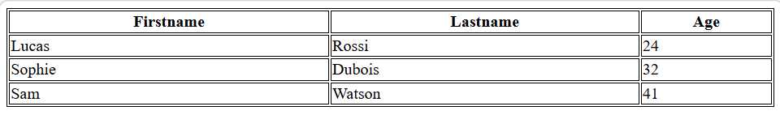
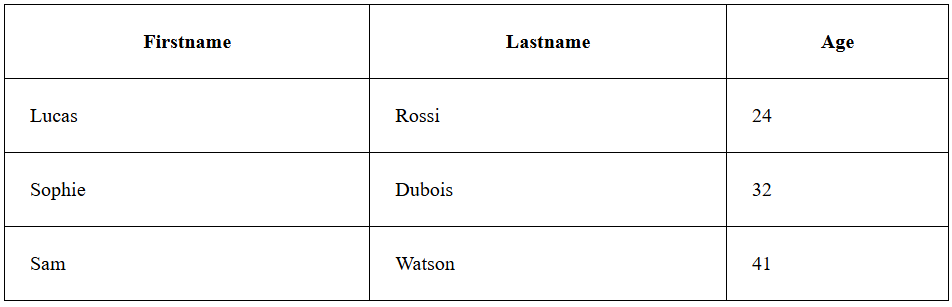
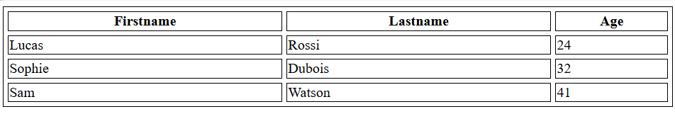
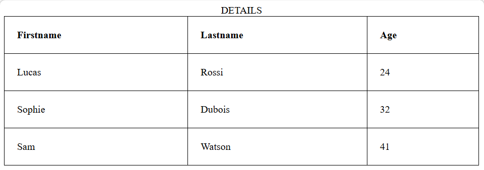
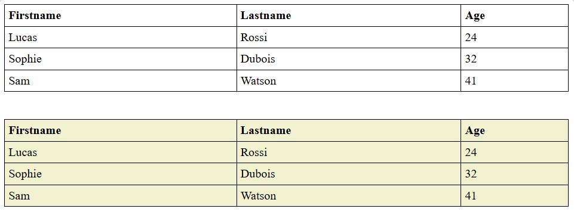

# HTML Tables 

---

## What are HTML Tables?

HTML tables help **organise data into rows and columns**, making information easy to read and compare. They are useful for displaying schedules, price lists, product details, comparison charts, and any structured data.

- Can include text, images, links, and other HTML elements inside cells
- Built using tags like `<table>`, `<tr>`, `<th>`, and `<td>`
- Allow clear presentation of data for comparison
- Can be styled with CSS for better design and readability

---

## Basic Syntax & Example

```html
<!DOCTYPE html>
<html lang="en">
  <head>
    <title></title>
  </head>
  <body>
    <table>
      <tr>
        <th>Firstname</th>
        <th>Lastname</th>
        <th>Age</th>
      </tr>
      <tr>
        <td>Luca</td>
        <td>Rossi</td>
        <td>24</td>
      </tr>
      <tr>
        <td>Sophie</td>
        <td>Dubois</td>
        <td>32</td>
      </tr>
      <tr>
        <td>Sam</td>
        <td>Watson</td>
        <td>41</td>
      </tr>
    </table>
  </body>
</html>
```

---

## HTML Table Tags

| Tag | Name | Description |
|---|---|---|
| `<table>` | Table | Defines the overall table structure for organising data in rows and columns |
| `<tr>` | Table Row | Represents a single row within the table |
| `<th>` | Table Header | Defines a header cell — typically bold and centred by default |
| `<td>` | Table Data | Defines a standard data cell that holds the actual content |
| `<caption>` | Caption | Provides a title or description for the entire table |
| `<thead>` | Table Head | Defines the header section of the table, often containing column labels |
| `<tbody>` | Table Body | Represents the main content area of the table |
| `<tfoot>` | Table Footer | Specifies the footer section, typically holding summaries or totals |
| `<col>` | Column | Defines attributes for individual table columns |
| `<colgroup>` | Column Group | Groups a set of columns to apply formatting or properties collectively |

### Key Rules

- Each `<tr>` represents one row containing `<th>` or `<td>` cells
- `<th>` cells are **bold and centred** by default
- `<td>` cells hold the actual data content
- Cells can contain text, images, lists, links, or even another nested table

---

## Simple Table Example

```html
<!DOCTYPE html>
<html>
  <body>
    <table>
      <tr>
        <th>Book Name</th>
        <th>Author Name</th>
        <th>Genre</th>
      </tr>
      <tr>
        <td>The Book Thief</td>
        <td>Markus Zusak</td>
        <td>Historical Fiction</td>
      </tr>
      <tr>
        <td>The Cruel Prince</td>
        <td>Holly Black</td>
        <td>Fantasy</td>
      </tr>
      <tr>
        <td>The Silent Patient</td>
        <td>Alex Michaelides</td>
        <td>Psychological Fiction</td>
      </tr>
    </table>
  </body>
</html>
```

---

## Styling HTML Tables with CSS

CSS is used to add borders, background colours, padding, alignment, and spacing to make tables look professional and readable.

---

### 1. Adding a Border

A border is added using the CSS `border` property. Without it, tables display with no visible borders.

```css
table, th, td {
  border: 1px solid black;
}
```

```html
<table style="width:100%">
  <tr>
    <th>Firstname</th>
    <th>Lastname</th>
    <th>Age</th>
  </tr>
  <tr>
    <td>Lucas</td>
    <td>Rossi</td>
    <td>24</td>
  </tr>
</table>
```

### Output



---

### 2. Collapsed Borders

By default, each cell has its own individual border, creating a double-border effect. Adding `border-collapse: collapse` merges them into a single clean border.

```css
table, th, td {
  border: 1px solid black;
  border-collapse: collapse;
}
```

| Property | Effect |
|---|---|
| Without `border-collapse` | Double borders between cells |
| With `border-collapse: collapse` | Single, clean merged border |

---

### 3. Cell Padding

Cell padding specifies the space **between the cell content and its border**. Without padding, content sits flush against the cell borders.

```css
th, td {
  padding: 20px;
}
```

```html
<style>
  table, th, td {
    border: 1px solid black;
    border-collapse: collapse;
  }
  th, td {
    padding: 20px;
  }
</style>
```

### Output:



---

### 4. Left-Aligning Headings

By default, `<th>` content is **bold and centred**. The `text-align` property overrides this to left-align headings.

```css
th {
  text-align: left;
}
```

---

### 5. Border Spacing

Border spacing adds **space between individual cells** — unlike padding which adds space inside cells. Note: `border-spacing` only works when `border-collapse` is **not** set to `collapse`.

```css
table {
  border-spacing: 5px;
}
```

### Output:




| CSS Property | What it Controls |
|---|---|
| `padding` | Space inside the cell between content and border |
| `border-spacing` | Space between cell borders (cells remain separate) |
| `border-collapse` | Merges borders — overrides `border-spacing` |

---

### 6. Cells Spanning Multiple Columns — `colspan`

The `colspan` attribute makes a single cell stretch across **more than one column**.

```html
<table style="width:100%">
  <tr>
    <th>Name</th>
    <th colspan="2">Telephone</th>   <!-- spans 2 columns -->
  </tr>
  <tr>
    <td>Lucas Rossi</td>
    <td>9125577854</td>
    <td>8565557785</td>
  </tr>
</table>
```


- `colspan="2"` makes the *Telephone* header stretch across two columns
- The row below fills both columns with separate phone numbers

---

### 7. Cells Spanning Multiple Rows — `rowspan`

The `rowspan` attribute makes a single cell stretch across **more than one row**.

```html
<table style="width:100%">
  <tr>
    <th>Name:</th>
    <td>Lucas Rossi</td>
  </tr>
  <tr>
    <th rowspan="2">Telephone:</th>  <!-- spans 2 rows -->
    <td>9125577854</td>
  </tr>
  <tr>
    <td>8565557785</td>
  </tr>
</table>
```

- `rowspan="2"` makes the *Telephone* header span two rows vertically
- Each of the two rows to the right contains a separate phone number

---

### `colspan` vs `rowspan`

| Attribute | Direction | Purpose |
|---|---|---|
| `colspan` | Horizontal | Merges a cell across multiple **columns** |
| `rowspan` | Vertical | Merges a cell across multiple **rows** |

---

### 8. Adding a Caption

The `<caption>` tag adds a **title or label** above the table. It must be placed immediately after the opening `<table>` tag.

```html
<table style="width:100%">
  <caption>DETAILS</caption>
  <tr>
    <th>Firstname</th>
    <th>Lastname</th>
    <th>Age</th>
  </tr>
  <tr>
    <td>Lucas</td>
    <td>Rossi</td>
    <td>24</td>
  </tr>
</table>
```

### Output:



---

### 9. Adding a Background Colour

A background colour can be applied to the entire table or specific cells using the CSS `background-color` property.

```css
table#t01 {
  width: 100%;
  background-color: #f2f2d1;
}
```

```html
<table id="t01">
  <tr>
    <th>Firstname</th>
    <th>Lastname</th>
    <th>Age</th>
  </tr>
  <tr>
    <td>Lucas</td>
    <td>Rossi</td>
    <td>24</td>
  </tr>
</table>
```

### Output:



- Background colour can be applied to `<table>`, `<tr>`, `<th>`, or `<td>` individually
- Use CSS `id` or `class` selectors to target specific tables

---

### 10. Nested Tables

A **nested table** is a table placed inside a `<td>` cell of another table. This allows complex layouts but should be used carefully as it can quickly become difficult to manage and maintain.

```html
<table border="5" bordercolor="black">
  <tr>
    <td>First Column of Outer Table</td>
    <td>
      <!-- Inner nested table -->
      <table border="5" bordercolor="grey">
        <tr>
          <td>First row of Inner Table</td>
        </tr>
        <tr>
          <td>Second row of Inner Table</td>
        </tr>
      </table>
    </td>
  </tr>
</table>
```

- The outer table has two columns — the second column contains the entire inner table
- Nesting can lead to complex layouts and potential rendering errors
- Use CSS layout tools like Flexbox or Grid as a modern alternative where possible

---

## Complete Styled Table Example

```html
<!DOCTYPE html>
<html>
  <head>
    <style>
      table, th, td {
        border: 1px solid black;
        border-collapse: collapse;
      }
      th, td {
        padding: 12px;
        text-align: left;
      }
      th {
        background-color: #4CAF50;
        color: white;
      }
      tr:nth-child(even) {
        background-color: #f2f2f2;
      }
    </style>
  </head>
  <body>
    <table style="width:100%">
      <caption>Employee Details</caption>
      <thead>
        <tr>
          <th>Name</th>
          <th>Department</th>
          <th colspan="2">Contact</th>
        </tr>
      </thead>
      <tbody>
        <tr>
          <td>Lucas Rossi</td>
          <td>Engineering</td>
          <td>9125577854</td>
          <td>lucas@example.com</td>
        </tr>
        <tr>
          <td>Sophie Dubois</td>
          <td>Design</td>
          <td>8565557785</td>
          <td>sophie@example.com</td>
        </tr>
      </tbody>
      <tfoot>
        <tr>
          <td colspan="4">Total Employees: 2</td>
        </tr>
      </tfoot>
    </table>
  </body>
</html>
```

---

## CSS Table Properties Summary

| CSS Property | Applied To | Effect |
|---|---|---|
| `border` | `table`, `th`, `td` | Adds a visible border |
| `border-collapse` | `table` | Merges double borders into one |
| `border-spacing` | `table` | Adds space between cell borders |
| `padding` | `th`, `td` | Adds space inside cells |
| `text-align` | `th`, `td` | Controls horizontal text alignment |
| `background-color` | Any table element | Sets background colour |
| `width` | `table` | Controls table width |

---

## Summary

HTML tables are a powerful tool for presenting structured, comparative data. Understanding the core tags (`<table>`, `<tr>`, `<th>`, `<td>`), spanning attributes (`colspan`, `rowspan`), structural sections (`<thead>`, `<tbody>`, `<tfoot>`), and CSS styling properties is essential for building clean, readable, and well-designed tables in any web project.

---