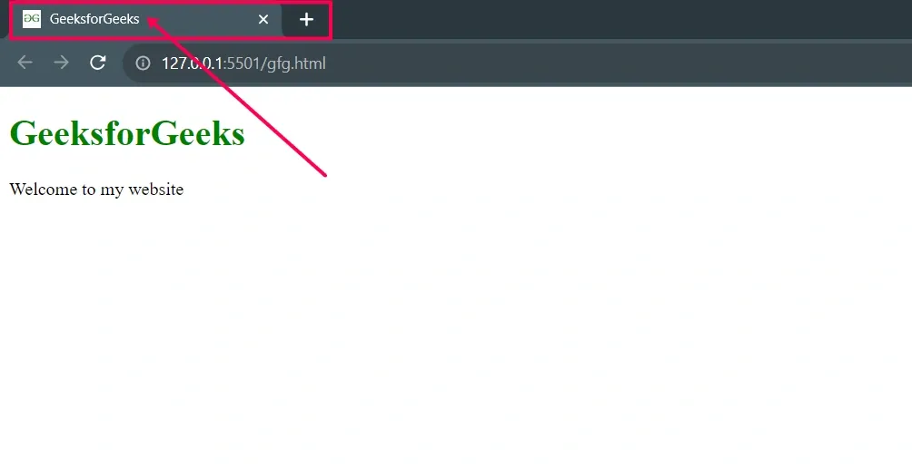

# HTML Favicon 

---

## What is a Favicon?

A **favicon** is a small image displayed next to a website's title in the browser tab. It helps users quickly recognise and return to a website.

---

## Why Use a Favicon?

| Benefit | Description |
|---|---|
| Easy identification | Appears in browser tabs, bookmarks, and browsing history |
| Brand recognition | Serves as a visual identity for the website |
| Professionalism | Enhances credibility of the site |
| Usability | Helps users locate their tab among multiple open tabs |

---

## Basic Syntax

Add a `<link>` tag inside the `<head>` section of your HTML file:

```html
<!DOCTYPE html>
<html lang="en">
<head>
    <title>My Website</title>
    <link rel="icon"
          href="https://www.example.com/favicon.ico"
          type="image/x-icon">
</head>
<body>
    <h3>Welcome to my website</h3>
</body>
</html>
```

### Output:



> **Note:** Major browsers do not support the sizing property of the favicon.

---

## Steps to Create and Add a Favicon

1. **Design** a small favicon image (usually 16×16 or 32×32 pixels).
2. **Save** it in a supported format: `.ico`, `.png`, or `.svg`.
3. **Upload** the favicon to your website's root directory or use an external image URL.
4. **Add** a `<link>` tag inside the `<head>` section referencing the favicon.
5. **Test** by opening the website in a browser to confirm it displays correctly.

---

## Favicon Size Reference

| File Name | Size | Description |
|---|---|---|
| favicon-32.png | 32×32 | Standard for most desktop browsers |
| favicon-57.png | 57×57 | Standard iOS home screen |
| favicon-76.png | 76×76 | iPad home screen icon |
| favicon-96.png | 96×96 | GoogleTV icon |
| favicon-120.png | 120×120 | iPhone retina touch icon |
| favicon-128.png | 128×128 | Chrome Web Store & small Windows 8 Start Screen icon |
| favicon-144.png | 144×144 | Internet Explorer 10 Metro tile for pinned site |
| favicon-152.png | 152×152 | iPad touch icon |
| favicon-167.png | 167×167 | iPad Retina touch icon |
| favicon-180.png | 180×180 | iPhone 6 Plus |
| favicon-192.png | 192×192 | Google Developer Web App Manifest recommendation |
| favicon-195.png | 195×195 | Opera Speed Dial icon |
| favicon-196.png | 196×196 | Chrome for Android home screen icon |
| favicon-228.png | 228×228 | Opera Coast icon |

---

## Favicon File Format Support

| Format | Browser Support | Quality / Notes |
|---|---|---|
| ICO | All five major browsers | Supports multiple icon sizes in a single file; widest compatibility |
| PNG | All five major browsers | High quality, supports transparency, smaller file size |
| GIF | All five major browsers | Supports animation |
| JPEG | All five major browsers | Good for high-quality images |
| SVG | All five major browsers | Scalable, small file size, sharp at any resolution |
| WebP | All five major browsers | Smaller file size with high quality |

---

## Troubleshooting Favicon Issues

### 1. Clear Browser Cache
Browsers often cache favicons, which prevents updates from appearing immediately.

- Clear your browser cache, or
- Open the website in **incognito / private mode** to force a refresh.

---

### 2. Check File Path
An incorrect file path is the most common cause of a missing favicon.

```html
<!-- Favicon in root directory -->
<link rel="icon" href="/favicon.ico" type="image/x-icon">

<!-- Favicon in a subfolder -->
<link rel="icon" href="/images/favicon.ico" type="image/x-icon">
```

- Place the favicon in the **root directory** where possible.
- Double-check the path matches the actual file location.

---

### 3. Use Full URL
If the favicon does not load correctly, specify the complete URL:

```html
<link rel="icon" href="https://www.example.com/favicon.ico" type="image/x-icon">
```

---

### 4. Format Issues
Ensure the favicon uses a supported format for cross-browser compatibility.

- Preferred formats: **ICO**, **PNG**, **SVG**
- Avoid obscure formats that may not render consistently across browsers.

---

## Quick Reference Checklist

| Task | Detail |
|---|---|
| Tag used | `<link rel="icon" href="..." type="...">` |
| Where to place it | Inside `<head>` section |
| Recommended size | 16×16 or 32×32 pixels minimum |
| Best formats | ICO (widest support), PNG, SVG |
| File location | Root directory of the website |
| Not working? | Clear cache, check path, use full URL, verify format |

---

## Important Notes

- The `<link>` tag for favicon must be placed inside `<head>` — not `<body>`.
- ICO format is recommended for maximum cross-browser compatibility as it can contain multiple sizes in one file.
- SVG is the best choice for modern browsers due to its scalability and small file size.
- Always test your favicon across different browsers (Chrome, Firefox, Safari, Edge) after adding it.

---