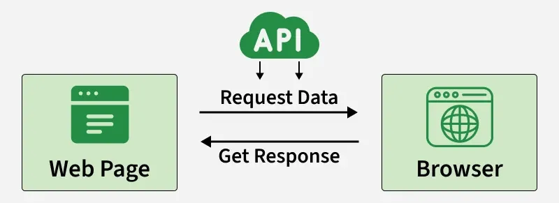
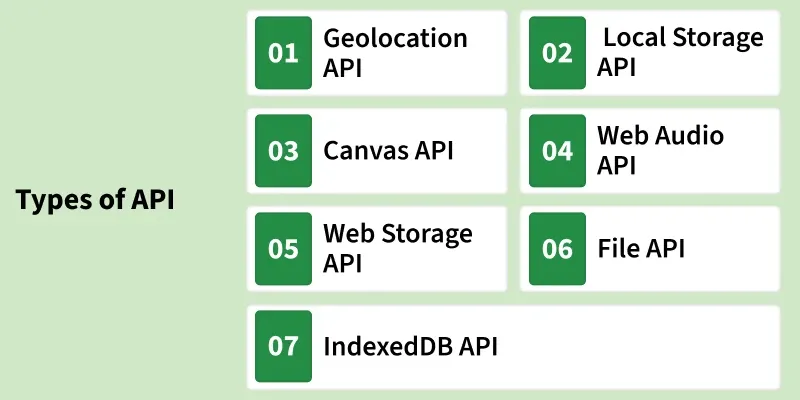

# HTML APIs 

---

## What are HTML APIs?

**HTML APIs** are built-in JavaScript interfaces provided by HTML5 that allow developers to interact with browser features and system resources. They make web pages more powerful by enabling multimedia, storage, graphics, and device access.

---

## Key Features



| Feature | Description |
|---|---|
| Browser control | Allow JavaScript to control browser features like audio, video, and graphics |
| Interactivity | Help create interactive and dynamic web applications |
| No plugins needed | Improve user experience without requiring external plugins |
| Common APIs | Canvas, Geolocation, Web Storage, Media APIs, and more |

---

## Types of HTML APIs



---

## 1. Geolocation API

The **Geolocation API** allows websites to access the user's geographic location (latitude and longitude).

### Key Points
- Retrieves the user's current position via `navigator.geolocation`
- Handles errors if permission is denied or location is unavailable
- Displays latitude and longitude dynamically on the page

### Code Example

```html
<html>
<body>
    <button onclick="getLocation()">Get My Location</button>
    <p id="location"></p>

    <script>
        function getLocation() {
            if (navigator.geolocation) {
                navigator.geolocation.getCurrentPosition(showPosition, showError);
            } else {
                document.getElementById("location").innerHTML =
                    "Geolocation is not supported by this browser.";
            }
        }

        function showPosition(position) {
            const latitude = position.coords.latitude;
            const longitude = position.coords.longitude;
            document.getElementById("location").innerHTML =
                `Latitude: ${latitude}<br>Longitude: ${longitude}`;
        }

        function showError(error) {
            switch (error.code) {
                case error.PERMISSION_DENIED:
                    document.getElementById("location").innerHTML =
                        "User denied the request for Geolocation.";
                    break;
                case error.POSITION_UNAVAILABLE:
                    document.getElementById("location").innerHTML =
                        "Location information is unavailable.";
                    break;
                case error.TIMEOUT:
                    document.getElementById("location").innerHTML =
                        "The request to get user location timed out.";
                    break;
                case error.UNKNOWN_ERROR:
                    document.getElementById("location").innerHTML =
                        "An unknown error occurred.";
                    break;
            }
        }
    </script>
</body>
</html>
```

### Breakdown

| Part | Description |
|---|---|
| `navigator.geolocation` | Checks if the browser supports geolocation |
| `getCurrentPosition(success, error)` | Requests the current position; calls `showPosition` on success |
| `position.coords.latitude` | Returns the latitude value |
| `position.coords.longitude` | Returns the longitude value |
| `showError(error)` | Handles 4 error types: denied, unavailable, timeout, unknown |

---

## 2. Local Storage API

The **Local Storage API** allows web applications to store data **persistently** in the user's browser — data survives page refreshes and browser restarts.

### Key Points
- Saves data as key/value pairs using `localStorage.setItem()`
- Loads saved data using `localStorage.getItem()`
- Data persists across sessions and page refreshes

### Code Example

```html
<html>
<body>
    <input type="text" id="username" placeholder="Enter your username">
    <button onclick="saveData()">Save Username</button>
    <button onclick="loadData()">Load Username</button>
    <p id="result"></p>

    <script>
        function saveData() {
            const username = document.getElementById("username").value;
            if (username) {
                localStorage.setItem("username", username);
                alert("Username saved!");
            } else {
                alert("Please enter a username.");
            }
        }

        function loadData() {
            const username = localStorage.getItem("username");
            if (username) {
                document.getElementById("result").innerHTML = `Saved Username: ${username}`;
            } else {
                document.getElementById("result").innerHTML = "No username saved.";
            }
        }
    </script>
</body>
</html>
```

### Breakdown

| Method | Description |
|---|---|
| `localStorage.setItem("key", value)` | Saves a value under the given key |
| `localStorage.getItem("key")` | Retrieves the value stored under the key |
| Persistent storage | Data remains even after refreshing or reopening the browser |

---

## 3. Canvas API

The **Canvas API** provides a means to draw graphics directly onto a webpage, enabling dynamic, scriptable rendering of 2D shapes and bitmap images.

### Key Points
- Creates a drawable surface using the `<canvas>` element
- All drawing is done through JavaScript using the 2D context
- Supports shapes, colours, images, text, and animations

### Code Example

```html
<html>
<body>
    <canvas id="myCanvas" width="200" height="200"></canvas>

    <script>
        const canvas = document.getElementById("myCanvas");
        const ctx = canvas.getContext("2d");

        // Set fill colour to blue
        ctx.fillStyle = "blue";

        // Draw a filled rectangle
        ctx.fillRect(50, 50, 100, 100);
    </script>
</body>
</html>
```

### Breakdown

| Part | Description |
|---|---|
| `<canvas width="200" height="200">` | Creates a 200×200 drawing surface |
| `getContext("2d")` | Gets the 2D rendering context for drawing |
| `ctx.fillStyle = "blue"` | Sets the colour used for filling shapes |
| `ctx.fillRect(50, 50, 100, 100)` | Draws a filled blue rectangle at (50, 50), 100×100px |

---

## 4. Web Audio API

The **Web Audio API** allows developers to create, process, and control sound effects and music directly in the browser — no plugins required.

### Key Points
- Creates an `AudioContext` to manage and control audio
- Uses an `OscillatorNode` to generate tones
- Controls frequency, type, and timing of sound

### Code Example

```html
<html>
<body>
    <button onclick="playSound()">Play Sound</button>

    <script>
        const audioContext = new (window.AudioContext || window.webkitAudioContext)();
        const oscillator = audioContext.createOscillator();

        oscillator.type = 'sine';
        oscillator.frequency.setValueAtTime(440, audioContext.currentTime);
        oscillator.connect(audioContext.destination);

        function playSound() {
            oscillator.start();
            oscillator.stop(audioContext.currentTime + 1);
        }
    </script>
</body>
</html>
```

### Breakdown

| Part | Description |
|---|---|
| `new AudioContext()` | Creates the audio processing environment |
| `createOscillator()` | Creates a node that generates a sound wave |
| `oscillator.type = 'sine'` | Sets the wave shape (sine, square, triangle, sawtooth) |
| `frequency.setValueAtTime(440, ...)` | Sets frequency to 440Hz — the musical note A4 |
| `oscillator.connect(destination)` | Routes audio output to the speakers |
| `oscillator.start()` | Begins playing the tone |
| `oscillator.stop(currentTime + 1)` | Stops the tone after 1 second |

---

## 5. Web Storage API

The **Web Storage API** provides mechanisms by which browsers can store key/value pairs in a much more intuitive fashion than using cookies.

### Key Points
- Stores data as key/value pairs in the browser
- More intuitive and larger capacity than cookies
- Includes both `localStorage` (persistent) and `sessionStorage` (session only)
- Data remains even after refreshing or reopening the browser

### Code Example

```html
<html>
<body>
    <input type="text" id="username" placeholder="Enter your username">
    <button onclick="saveData()">Save Username</button>
    <button onclick="loadData()">Load Username</button>
    <p id="result"></p>

    <script>
        function saveData() {
            const username = document.getElementById("username").value;
            if (username) {
                localStorage.setItem("username", username);
                alert("Username saved!");
            } else {
                alert("Please enter a username.");
            }
        }

        function loadData() {
            const username = localStorage.getItem("username");
            if (username) {
                document.getElementById("result").innerHTML = `Saved Username: ${username}`;
            } else {
                document.getElementById("result").innerHTML = "No username saved.";
            }
        }
    </script>
</body>
</html>
```

### localStorage vs Cookies

| Feature | Web Storage | Cookies |
|---|---|---|
| Storage size | ~5MB | ~4KB |
| Ease of use | Simple key/value API | Complex string parsing |
| Sent with requests | No | Yes (every HTTP request) |
| Expiry | Never (localStorage) | Can be set manually |

---

## 6. File API

The **File API** allows web applications to read and manipulate files locally on a user's device, providing access to file contents, metadata, and more.

### Key Points
- Allows users to select a file using `<input type="file">`
- Reads file contents using the `FileReader` object
- Reads files as text and displays them in the browser

### Code Example

```html
<html>
<body>
    <input type="file" id="fileInput">
    <button onclick="readFile()">Read File</button>
    <p id="fileContent"></p>

    <script>
        function readFile() {
            const fileInput = document.getElementById("fileInput");
            const file = fileInput.files[0];

            if (file) {
                const reader = new FileReader();
                reader.onload = function (event) {
                    document.getElementById("fileContent").innerText = event.target.result;
                };
                reader.readAsText(file);
            } else {
                alert("Please select a file.");
            }
        }
    </script>
</body>
</html>
```

### Breakdown

| Part | Description |
|---|---|
| `<input type="file">` | Opens a file picker dialog for the user |
| `fileInput.files[0]` | Gets the first selected file from the input |
| `new FileReader()` | Creates a FileReader object to read file contents |
| `reader.onload` | Event that fires when the file has been fully read |
| `reader.readAsText(file)` | Reads the file and converts it to a text string |
| `event.target.result` | Contains the file's text content after reading |

---

## 7. IndexedDB API

The **IndexedDB API** provides a way to store large amounts of structured data, including files and blobs, directly in the browser.

### Key Points
- Creates a full database inside the browser
- Stores structured records (objects) with key paths and indexes
- Supports creating, reading, and writing data via transactions
- Suitable for offline-capable web applications

### Code Example

```html
<html>
<body>
    <button onclick="createDatabase()">Create Database</button>
    <button onclick="addData()">Add Data</button>
    <button onclick="getData()">Get Data</button>
    <p id="result"></p>

    <script>
        let db;

        function createDatabase() {
            const request = indexedDB.open("MyDatabase", 1);
            request.onupgradeneeded = function (event) {
                db = event.target.result;
                const objectStore = db.createObjectStore("users", { keyPath: "id" });
                objectStore.createIndex("name", "name", { unique: false });
            };
            request.onsuccess = function (event) {
                db = event.target.result;
                alert("Database created successfully!");
            };
            request.onerror = function () {
                alert("Error creating database.");
            };
        }

        function addData() {
            const transaction = db.transaction(["users"], "readwrite");
            const objectStore = transaction.objectStore("users");
            const user = { id: 1, name: "John Doe" };
            const request = objectStore.add(user);
            request.onsuccess = function () {
                alert("Data added successfully!");
            };
        }

        function getData() {
            const transaction = db.transaction(["users"]);
            const objectStore = transaction.objectStore("users");
            const request = objectStore.get(1);
            request.onsuccess = function (event) {
                const user = event.target.result;
                if (user) {
                    document.getElementById("result").innerText =
                        `ID: ${user.id}, Name: ${user.name}`;
                } else {
                    document.getElementById("result").innerText = "No data found.";
                }
            };
        }
    </script>
</body>
</html>
```

### Breakdown

| Part | Description |
|---|---|
| `indexedDB.open("MyDatabase", 1)` | Opens (or creates) a database named "MyDatabase" version 1 |
| `onupgradeneeded` | Fires when the database is first created or upgraded |
| `createObjectStore("users", { keyPath: "id" })` | Creates a table-like store where `id` is the unique key |
| `createIndex("name", "name", ...)` | Creates an index on the `name` field for searching |
| `db.transaction(["users"], "readwrite")` | Opens a transaction for reading and writing |
| `objectStore.add(user)` | Adds a new record to the store |
| `objectStore.get(1)` | Retrieves the record with key `1` |

---

## Best Practices for Using HTML5 APIs

### 1. Ensure Browser Compatibility
- Check API support across different browsers before implementation.
- Use fallbacks or polyfills to maintain consistent functionality.

```javascript
// Example: checking Geolocation support
if (navigator.geolocation) {
    // supported — use the API
} else {
    // not supported — show fallback
}
```

### 2. Handle Errors Gracefully
- Implement proper error handling to manage API failures smoothly.
- Display clear and user-friendly error messages when issues occur.

### 3. Request User Permissions
- Always ask for user consent before accessing sensitive data or device features.
- Clearly explain why the permission is needed to build user trust.

---

## Quick Reference Summary

| API | Purpose | Key Method / Object |
|---|---|---|
| Geolocation API | Get user's location | `navigator.geolocation.getCurrentPosition()` |
| Local Storage API | Persist data in browser | `localStorage.setItem()` / `getItem()` |
| Canvas API | Draw 2D graphics | `canvas.getContext("2d")` |
| Web Audio API | Generate and control sound | `AudioContext`, `createOscillator()` |
| Web Storage API | Store key/value pairs | `localStorage` / `sessionStorage` |
| File API | Read local files | `FileReader`, `readAsText()` |
| IndexedDB API | Store structured data | `indexedDB.open()`, transactions |

---

## Important Notes

- All HTML5 APIs are **built into the browser** — no external libraries or plugins needed.
- APIs that access sensitive features (location, files, audio) require **user permission**.
- Always check browser compatibility using resources like **MDN Web Docs** or **caniuse.com**.
- `localStorage` stores data with **no expiry** — use `sessionStorage` if you only need data for the current session.
- IndexedDB is best for **large or complex data** — for simple key/value storage, `localStorage` is sufficient.

---