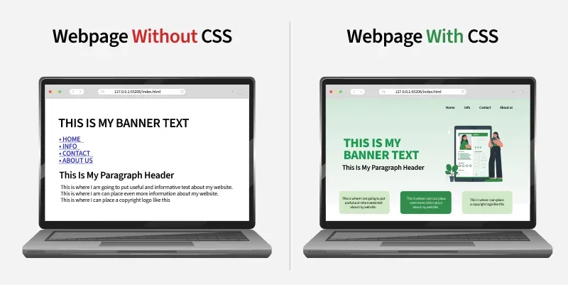
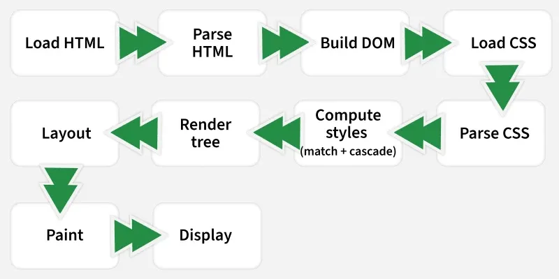

# CSS Introduction Notes

---

## 1. What is CSS?

**CSS (Cascading Style Sheets)** is a language designed to simplify the process of making web pages presentable.

- Allows you to apply styles to HTML documents — controlling colors, fonts, spacing, and positioning.
- Separates **content** (HTML) from **presentation** (CSS), allowing styles to be reused across multiple pages.
- HTML uses **tags**; CSS uses **rule sets**.
- CSS styles are applied to HTML elements using **selectors**.



---

## 2. Understanding Cascading

Cascading defines how the browser resolves conflicts between multiple CSS rules using **importance**, **specificity**, and **source order**.

- CSS follows a style hierarchy: **Inline → Internal → External**
- **Specificity** decides which selector has more weight.
- Later rules override earlier ones if they have equal priority.

---

## 3. CSS Selectors

A CSS selector is a pattern used to target HTML elements and apply specific styles.

| Selector Type | Description | Example |
|---|---|---|
| Tag | Targets elements by HTML tag | `p { }` |
| Class | Targets elements by class attribute | `.card { }` |
| ID | Targets a single element by ID | `#header { }` |
| Attribute | Targets elements with specific attributes | `[type="text"] { }` |
| Combinator | Selects based on hierarchy or sibling relationship | `div > p { }` |
| Pseudo-class | Styles elements in a particular state | `:hover`, `:first-child` |
| Pseudo-element | Styles specific parts of an element | `::before`, `::first-letter` |
| Advanced | Precise and complex selection | `:not()`, `:nth-child()` |

> **Tip:** Efficient use of selectors leads to clean, maintainable, and scalable CSS.

---

## 4. How CSS Works — The Browser Rendering Pipeline



When a browser loads a webpage, it follows a 10-step process to apply CSS and display content:

### Step 1 — Load HTML
The browser fetches the HTML document from the server and receives it as plain text.

### Step 2 — Parse HTML
The browser reads and tokenizes the HTML, converting tags into nodes.

### Step 3 — Build DOM (Document Object Model)
The parsed HTML elements form a tree structure — the **DOM** — representing all page elements and their hierarchy.

### Step 4 — Load CSS
When the browser finds a `<link>` or `<style>` tag, it loads the CSS files. Note: external CSS is **render-blocking** — the page waits until it is fully loaded.

### Step 5 — Parse CSS
The browser converts CSS text into the **CSSOM** (CSS Object Model), understanding all rules and selectors.

### Step 6 — Compute Styles (Match + Cascade)
The browser matches CSS rules to DOM elements, applies cascading rules, and calculates the final **computed styles** for each element.

### Step 7 — Build Render Tree
Combines the DOM and CSSOM into a **Render Tree**, which includes only visible elements (e.g., elements with `display: none` are excluded).

### Step 8 — Layout (Reflow)
The browser calculates the exact **position and size** of each visible element on the page.

### Step 9 — Paint
The render tree elements are converted into actual pixels — drawing colors, borders, text, and images on the screen.

### Step 10 — Display (Compositing)
The browser combines all painted layers into the **final image** and displays it on the screen.

---

## 5. Advantages of CSS

| Advantage | Description |
|---|---|
| **Simplifies Design** | Makes web design and maintenance easier to manage. |
| **Better Performance** | Improves website speed and overall user experience. |
| **Responsive Design** | Supports responsive and adaptive designs for all screen sizes and devices. |
| **Saves Time** | Write CSS once and reuse it across multiple HTML pages. |
| **Easy Maintenance** | A single CSS change updates the style globally across the entire site. |
| **SEO Friendly** | Clean code structure improves readability for search engines. |
| **Superior Styles** | Offers a wider range of styling options compared to plain HTML attributes. |
| **Offline Browsing** | CSS can cache web apps locally using an offline cache, enabling offline viewing. |

---

## Quick Summary

```
CSS = Styling language for HTML
Cascade = Inline > Internal > External
Selectors = Patterns to target HTML elements
Pipeline = HTML → DOM → CSS → CSSOM → Render Tree → Layout → Paint → Display
Key Benefits = Reusability, Responsiveness, Performance, Maintainability
```

---

