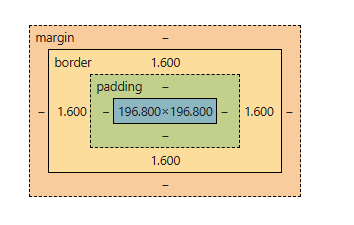
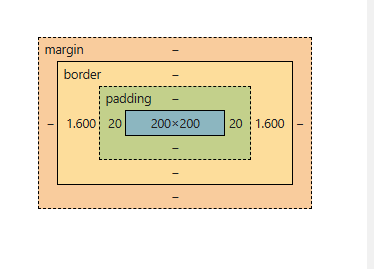

---

# 📦 CSS Box Model

## 🔹 Overview

The **CSS Box Model** describes how elements are displayed and sized in a web page. Every HTML element is treated as a rectangular box, and this box determines:

* The element’s **dimensions (width and height)**
* Its **spacing and position** relative to other elements

Each box consists of four main layers:

1. Content
2. Padding
3. Border
4. Margin

---

## 🔹 Components of the Box Model



### 1. Content Area

The **content area** is the central part of the box model where the actual content is displayed.

* Holds text, images, or other HTML elements
* Controlled using:

    * `width`
    * `height`

**Content edges:**

* Top content edge
* Bottom content edge
* Left content edge
* Right content edge

---

### 2. Padding Area

The **padding area** is the space between the content and the border.

* Adds space **inside** the element
* Increases the overall size of the element
* Defined using:

    * `padding-top`, `padding-right`, `padding-bottom`, `padding-left`

**Key idea:**
Padding expands the box outward from the content.

---

### 3. Border Area

The **border area** surrounds the padding and content.

* Acts as a frame around the element
* Controlled using:

    * `border-width`
    * `border-style`
    * `border-color`

**Important:**

* Border thickness contributes to total width and height
* Thicker borders = larger element

---

### 4. Margin Area

The **margin area** is the outermost layer.

* Creates space between elements
* Controlled using:

    * `margin-top`, `margin-right`, `margin-bottom`, `margin-left`

**Important:**

* Margin does not affect the internal size of the element
* It affects spacing between elements

---

## 🔹 Box-Sizing Property

The `box-sizing` property defines how the total size of an element is calculated.

There are two main types:

---

## 🔹 1. `box-sizing: content-box` (Default)

When using `content-box`, the width and height apply **only to the content area**.

Padding and border are added outside the content.

### ✅ Example:

```html
<html>
<head>
    <style>
        div {
            height: 20px;
            width: 20px;
            box-sizing: content-box;
            padding-left: 20px;
            padding-right: 20px;
            border-left: 5px solid red;
            border-right: 5px solid red;
        }
    </style>
</head>
<body>
    <div>Hello GFG</div>
</body>
</html>
```


### 📊 Explanation:

* Content width = 200px
* Padding = 20px (left) + 20px (right) = 40px
* Border = 1.6px (left) + 1.6px (right) = 3.2px

### 👉 Total Width Calculation:

```
Total Width = Content + Padding + Border
Total Width = 200 + 40 + 3.2 = 243.2px
```

### ⚠️ Key Point:

The final size becomes larger than specified because padding and border are added outside the content.

---

## 🔹 2. `box-sizing: border-box`

When using `border-box`, the width and height include:

* Content
* Padding
* Border

### ✅ Example:

```html
<html>
<head>
    <style>
        div {
            height: 20px;
            width: 70px;
            box-sizing: border-box;
            padding-left: 20px;
            padding-right: 20px;
            border-left: 2px solid red;
            border-right: 2px solid red;
        }
    </style>
</head>
<body>
    <div>Hello GFG</div>
</body>
</html>
```


### 📊 Explanation:

* Total width remains fixed at 200px
* Padding = 40px
* Border = 3.2px

### 👉 Content Adjustment:

```
Content Width = 200 - (Padding + Border)
Content Width = 200 - 43.2 = 156.8px
```

### ✔️ Result:

The total width remains **200px**, and the content shrinks to fit.

---

## 🔹 Use Cases of CSS Box Model

### 1. Default Behavior (content-box)

```html
<html>
<head>
    <style>
        div {
            width: 200px;
            padding: 20px;
            border: 2px solid black;
            box-sizing: content-box;
            background-color: lightgreen;
        }
    </style>
</head>
<body>
    <div>This is a div with box-sizing content-box.</div>
</body>
</html>
```

**Result:**

```
Total width = 200 + 40 (padding) + border = 250px
```

---

### 2. Consistent Sizing (border-box)

```html
<html>
<head>
    <style>
        div {
            width: 200px;
            padding: 20px;
            border: 2px solid black;
            box-sizing: border-box;
            background-color: lightcoral;
        }
    </style>
</head>
<body>
    <div>This is a div with box-sizing border-box.</div>
</body>
</html>
```

**Result:**

* Total width remains **200px**

---

### 3. Apply Border-Box Globally

```html
<html>
<head>
    <style>
        * {
            box-sizing: border-box;
        }
        div {
            width: 100%;
            padding: 20px;
            border: 2px solid blue;
            background-color: lightyellow;
        }
    </style>
</head>
<body>
    <div>This is a div with border-box applied globally.</div>
</body>
</html>
```

**Benefit:**

* Consistent sizing across all elements

---

### 4. Fixed Layout with Border-Box

```html
<html>
<head>
    <style>
        div {
            width: 300px;
            height: 20px;
            padding: 15px;
            border: 10px solid green;
            box-sizing: border-box;
            background-color: lightblue;
            font-size: 12px;
        }
    </style>
</head>
<body>
    <div>This is a fixed-size div with box-sizing border-box.</div>
</body>
</html>
```

**Result:**

* Element keeps fixed dimensions despite padding and border

---

### 5. Responsive Design with Border-Box

```html
<html>
<head>
    <style>
        * {
            box-sizing: border-box;
        }
        .container {
            max-width: 100%;
            padding: 20px;
            border: 5px solid purple;
            background-color: lightgreen;
        }
    </style>
</head>
<body>
    <div class="container">This is a responsive box with border-box.</div>
</body>
</html>
```

**Result:**

* Element resizes properly without overflow issues

---

## 🔹 Key Takeaways

* Every element is made up of:
  **Content → Padding → Border → Margin**
* `content-box`:

    * Default
    * Adds padding and border outside
* `border-box`:

    * Keeps total size fixed
    * Easier for layouts
* Margin controls spacing between elements
* Padding and border affect element size

---

## 🧠 Final Summary

Understanding the CSS Box Model is essential for:

* Designing layouts
* Controlling spacing
* Building responsive interfaces

👉 Most modern designs use:

```css
* {
    box-sizing: border-box;
}
```

because it simplifies layout calculations and prevents unexpected sizing issues.

---

