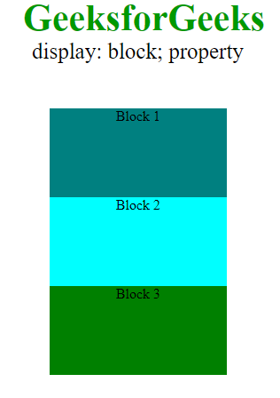
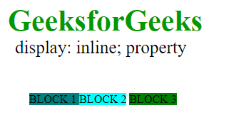
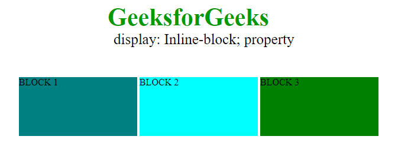
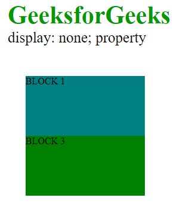

---

# 🧩 CSS Display Property – Complete Notes

## 🔹 Overview

The **CSS `display` property** defines how an HTML element is rendered on a webpage.

It determines:

* The **type of box** an element generates
* How the element **behaves in the layout**
* How it **interacts with other elements**

### 👉 Key Roles:

* Controls layout structure
* Determines whether elements appear:

    * On a new line
    * Inline with others
    * Hidden
    * As flexible or grid containers

---

## 🔹 Syntax

```css
display: value;
```

---

## 🔹 Example: Block Display Layout

```html
<html>
<head>
    <style>
        #geeks1 {
            height: 100px;
            width: 200px;
            background: teal;
            display: block;
        }

        #geeks2 {
            height: 100px;
            width: 200px;
            background: cyan;
            display: block;
        }

        #geeks3 {
            height: 100px;
            width: 200px;
            background: green;
            display: block;
        }

        .gfg {
            margin-left: 20px;
            font-size: 42px;
            font-weight: bold;
            color: #009900;
        }

        .geeks {
            font-size: 25px;
            margin-left: 30px;
        }

        .main {
            margin: 50px;
            text-align: center;
        }
    </style>
</head>
<body>
    <div class="gfg">GeeksforGeeks</div>
    <div class="geeks">display: block; property</div>

    <div class="main">
        <div id="geeks1">Block 1</div>
        <div id="geeks2">Block 2</div>
        <div id="geeks3">Block 3</div>
    </div>
</body>
</html>
```

---

## 🔹 Understanding the Display Property

The `display` property controls:

* Whether an element starts on a new line
* Whether width and height can be applied
* How elements are positioned relative to each other

---

## 🔹 Common Display Values

---

### 1. `display: block`

* Default for elements like `<div>`
* Takes full width of its container
* Starts on a new line
* Allows setting:

    * width
    * height

### ✅ Example:

```css
#geeks1 {
    background: teal;
    display: block;
}

#geeks2 {
    background: cyan;
    display: block;
}

#geeks3 {
    background: green;
    display: block;
}
```

Output:



### ✔️ Behavior:

* Elements stack vertically
* Each element appears on a new line

---

### 2. `display: inline`

* Elements appear **in the same line**
* Do NOT start a new line
* Width and height **cannot be set properly**

### ✅ Example:

```css
#geeks1 {
    background: teal;
    display: inline;
}

#geeks2 {
    background: cyan;
    display: inline;
}

#geeks3 {
    background: green;
    display: inline;
}
```

Output:



### ✔️ Behavior:

* Elements flow like text
* Positioned side-by-side

---

### 3. `display: inline-block`

* Combines **inline** and **block** features

### ✔️ Key Features:

* Elements appear inline (same row)
* Width and height **can be set**

### ✅ Example:

```css
#geeks1 {
    background: teal;
    display: inline-block;
}

#geeks2 {
    background: cyan;
    display: inline-block;
}

#geeks3 {
    background: green;
    display: inline-block;
}
```

Output:



### ✔️ Use Case:

* Creating flexible layouts
* Buttons, cards, navigation items

---

### 4. `display: none`

* Completely hides the element
* Element is removed from layout flow

### ✅ Example:

```css
#geeks2 {
    background: cyan;
    display: none;
}
```

Output:



### ✔️ Behavior:

* Element does not occupy space
* Other elements behave as if it doesn’t exist

---

### 5. `display: flex` and `display: grid`

Modern layout systems:

#### 🔸 Flexbox (`display: flex`)

* One-dimensional layout
* Works in:

    * Row OR column

#### 🔸 Grid (`display: grid`)

* Two-dimensional layout
* Works in:

    * Rows AND columns

### ✔️ Use Cases:

* Responsive layouts
* Complex UI structures

---

## 🔹 Display Property Values Table

| Value              | Description                          |
| ------------------ | ------------------------------------ |
| inline             | Displays element inline              |
| block              | Displays element as block            |
| inline-block       | Inline element with block properties |
| none               | Removes element from layout          |
| flex               | Creates flex container               |
| grid               | Creates grid container               |
| inline-flex        | Inline-level flex container          |
| inline-grid        | Inline-level grid container          |
| contents           | Removes container but keeps children |
| list-item          | Behaves like `<li>`                  |
| table              | Behaves like `<table>`               |
| inline-table       | Inline table behavior                |
| table-row          | Behaves like `<tr>`                  |
| table-cell         | Behaves like `<td>`                  |
| table-column       | Behaves like `<col>`                 |
| table-row-group    | Behaves like `<tbody>`               |
| table-header-group | Behaves like `<thead>`               |
| table-footer-group | Behaves like `<tfoot>`               |
| table-column-group | Behaves like `<colgroup>`            |
| table-caption      | Behaves like `<caption>`             |
| run-in             | Inline or block depending on context |
| initial            | Resets to default value              |
| inherit            | Inherits from parent                 |

---

## 🔹 Key Takeaways

* `display` controls **layout behavior**
* `block`:

    * New line
    * Full width
* `inline`:

    * Same line
    * No width/height control
* `inline-block`:

    * Best of both worlds
* `none`:

    * Completely removes element
* `flex` and `grid`:

    * Used for modern layouts

---

## 🧠 Final Summary

The CSS `display` property is one of the most important properties for layout design.

👉 It determines:

* How elements are placed
* How they interact
* How the page structure behaves

### ⭐ Best Practice:

* Use `flex` or `grid` for modern layouts
* Use `inline-block` for simple horizontal alignment
* Use `block` for structure

---

