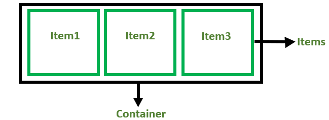
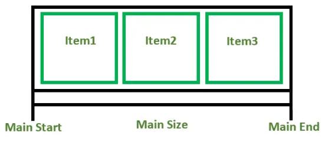
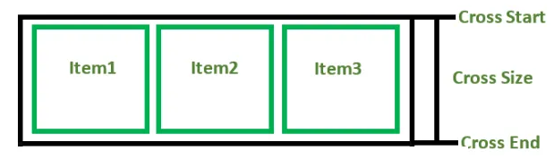
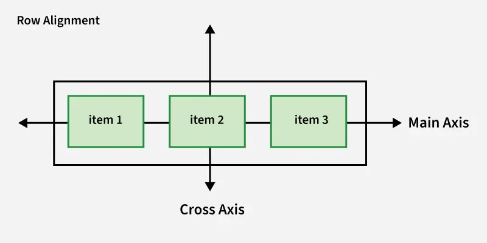
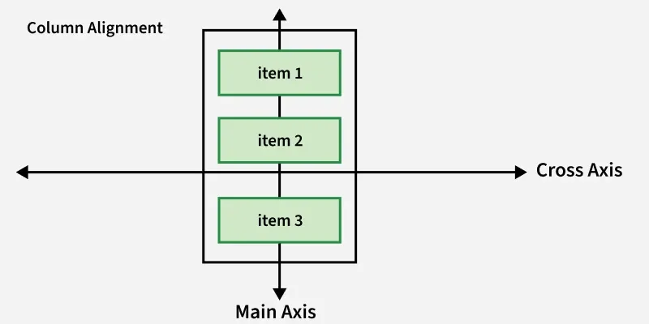

---

# 📦 CSS Flexbox

## 🔹 Overview

The **CSS Flexible Box Layout (Flexbox)** is a one-dimensional layout system used to arrange elements in:

* Rows (horizontal)
* Columns (vertical)

👉 It is designed to:

* Distribute space efficiently
* Align items easily
* Create responsive layouts

---

## 🔹 Key Features

* Eliminates the need for:

    * Floats
    * Complex positioning
* Handles **dynamic or unknown sizes**
* Works well for **responsive design**
* Supported by all modern browsers

---

## 🔹 Basic Flexbox Example

```html
<html>
<head>
    <style>
        .flex-container {
            display: flex;
            background-color: #f2f2f2;
            padding: 10px;
        }

        .flex-item {
            background-color: #4CAF50;
            color: white;
            margin: 5px;
            padding: 20px;
            text-align: center;
            flex: 1;
        }
    </style>
</head>
<body>
    <div class="flex-container">
        <div class="flex-item">Item 1</div>
        <div class="flex-item">Item 2</div>
        <div class="flex-item">Item 3</div>
    </div>
</body>
</html>
```

### 📊 Explanation:

* `.flex-container` → becomes a flex container using `display: flex`
* `.flex-item` → each item:

    * Takes equal width (`flex: 1`)
    * Has spacing via margin and padding

---

## 🔹 Before Flexbox (Traditional Layouts)

Before Flexbox, layouts were created using:

* **Block layout** → sections stacked vertically
* **Inline layout** → text flow
* **Table layout** → grid-like structure
* **Positioning** → manual placement

👉 These methods were harder to manage and less flexible.

---

## 🔹 Flexbox Components



### 1. Flex Container

* The parent element
* Defined using:

```css
display: flex;
```

---

### 2. Flex Items

* The child elements inside the container

---

## 🔹 Flexbox Axes

Flexbox operates on two axes:

---

### 1. Main Axis



* Primary direction of layout

**Key terms:**

* Main Start → beginning of axis
* Main End → end of axis
* Main Size → length between start and end

---

### 2. Cross Axis



#### For rows:



#### For columns:



* Perpendicular to the main axis

**Key terms:**

* Cross Start
* Cross End
* Cross Size

---

## 🔹 Flex Direction

Controls the direction of the main axis:

```css
flex-direction: row;           /* left to right */
flex-direction: row-reverse;   /* right to left */
flex-direction: column;        /* top to bottom */
flex-direction: column-reverse;/* bottom to top */
```

---

## 🔹 Alignment and Spacing Properties

---

### 1. `justify-content`

* Aligns items along the **main axis**

**Values:**

* `flex-start`
* `flex-end`
* `center`
* `space-between`
* `space-around`

---

### 2. `align-items`

* Aligns items along the **cross axis**

**Values:**

* `stretch`
* `center`
* `flex-start`
* `flex-end`

---

### 3. `align-content`

* Aligns **multiple rows** in a flex container
* Works when there is extra space on cross axis

---

## 🔹 More Flexbox Examples

---

## 1. Responsive Design with Flexbox

```html
<html>
<head>
    <style>
        .flex-container {
            display: flex;
            flex-wrap: wrap;
            justify-content: space-around;
            background-color: #32a852;
        }

        .flex-container div {
            background-color: #c9d1cb;
            margin: 10px;
            padding: 20px;
            flex: 1 1 200px;
        }

        @media (max-width: 600px) {
            .flex-container {
                flex-direction: column;
            }
        }
    </style>
</head>
<body>
    <h2>Responsive Flexbox</h2>

    <div class="flex-container">
        <div>Item1</div>
        <div>Item2</div>
        <div>Item3</div>
    </div>
</body>
</html>
```

### 📊 Explanation:

* `flex-wrap: wrap` → allows items to move to next line
* `justify-content: space-around` → equal spacing
* `flex: 1 1 200px` → flexible width with minimum size
* Media query:

    * Changes layout to column for small screens

---

## 2. Navigation Bar Using Flexbox

```html
<html>
<head>
    <style>
        .navbar {
            display: flex;
            justify-content: space-between;
            align-items: center;
            background-color: #4CAF50;
            padding: 10px;
        }

        .navbar a {
            color: white;
            text-decoration: none;
            padding: 10px 15px;
        }

        .navbar a:hover {
            background-color: #45a049;
        }
    </style>
</head>
<body>
    <div class="navbar">
        <a href="#home">Home</a>
        <a href="#services">Services</a>
        <a href="#contact">Contact</a>
    </div>
</body>
</html>
```

### 📊 Explanation:

* `display: flex` → horizontal layout
* `justify-content: space-between` → spreads links
* `align-items: center` → vertical alignment
* Hover effect improves interaction

---

## 🔹 Key Takeaways

* Flexbox is a **one-dimensional layout system**
* Works along:

    * Main axis
    * Cross axis
* Simplifies:

    * Alignment
    * Spacing
    * Responsive design
* Key properties:

    * `display: flex`
    * `flex-direction`
    * `justify-content`
    * `align-items`

---

## 🧠 Final Summary

Flexbox is one of the most powerful tools in CSS for building modern layouts.

👉 It helps you:

* Create responsive designs easily
* Align elements without complex code
* Manage spacing dynamically

### ⭐ Best Practice:

* Use Flexbox for:

    * Navigation bars
    * Layout sections
    * Responsive components

---

