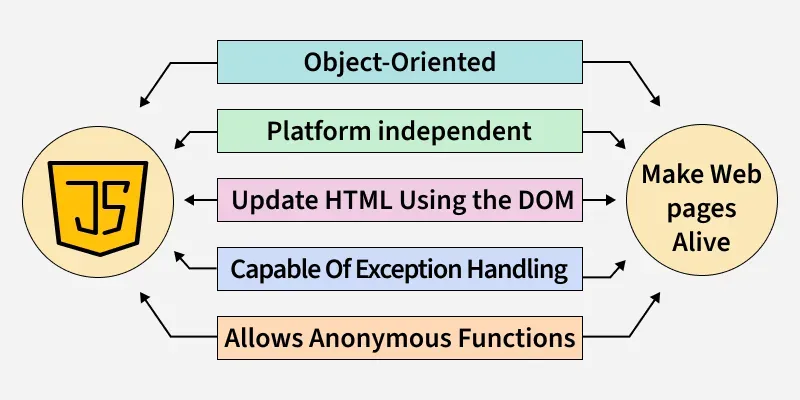
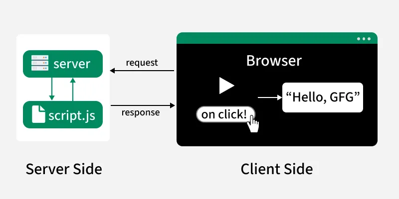
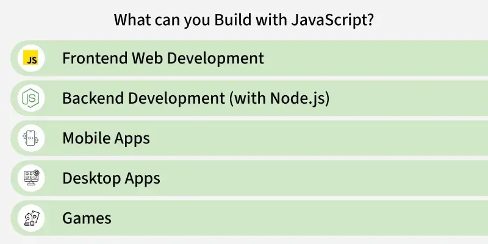

# Introduction to JavaScript



> JavaScript is a **versatile, dynamically typed programming language** that brings life to web pages by making them interactive. It supports both client-side and server-side development and integrates seamlessly with HTML, CSS, and a rich standard library.

---

## Table of Contents
1. [Core Characteristics](#core-characteristics)
2. [Hello World Programs](#hello-world-programs)
3. [Comments in JavaScript](#comments-in-javascript)
4. [Key Features](#key-features)
5. [Client-Side vs Server-Side](#client-side-vs-server-side)
6. [Programming Paradigms](#programming-paradigms)
7. [Limitations](#limitations)
8. [JavaScript Versions (ECMAScript)](#javascript-versions-ecmascript)

---

## Core Characteristics

| Property | Description |
|---|---|
| **Single-threaded** | Executes one task at a time |
| **Interpreted** | Executes code line by line, no compilation step |
| **Dynamically typed** | Variable data types are decided at **run-time** |

---

## Hello World Programs

### In a Browser (Embedded in HTML)

```html
<html>
  <head></head>
  <body>
    <h1>Check the console for the message!</h1>
    <script>
      // This is our first JavaScript program
      console.log("Hello, World!");
    </script>
  </body>
</html>
```

- The `<script>` tag is used to include JavaScript inside an HTML document.
- `console.log()` prints messages to the **browser's developer console**.
- Open DevTools (F12) → Console tab to see the output.

### In a Server Console (Node.js)

Create a file called `index.js`:

```js
// This is a comment
console.log("Hello, World!");
```

Run it in your terminal:

```bash
node index.js
```

---

## Comments in JavaScript

Comments are notes that the JavaScript interpreter **ignores**. They are useful for explaining code or temporarily disabling lines during testing.

### Single-Line Comment

```js
// This is a single-line comment
```

### Multi-Line Comment

```js
/* This is a multi-line comment
   spanning multiple lines */
```

---

## Key Features

### 1. Client-Side Scripting
Runs directly in the user's browser — **no server communication needed** for immediate responses, making it fast and responsive.

### 2. Versatile
Can be used for a wide range of tasks — from simple calculations all the way to complex **server-side applications**.

### 3. Event-Driven
Responds to user actions such as **clicks, keystrokes, and form submissions** in real time.

### 4. Asynchronous
Can handle tasks like **fetching data from servers** without freezing or blocking the user interface.

### 5. Rich Ecosystem
A vast collection of **libraries and frameworks** built on top of JavaScript speed up development:
- **React** — UI component library
- **Angular** — full-featured MVC framework
- **Vue.js** — lightweight progressive framework

---

## Client-Side vs Server-Side



### Client-Side JavaScript
- Controls the **browser and its DOM** (Document Object Model)
- Handles user events: clicks, form inputs, animations
- Common libraries: **AngularJS**, **ReactJS**, **VueJS**

### Server-Side JavaScript
- Interacts with **databases**, manipulates files, and generates responses
- **Node.js** is the primary runtime environment
- **Express.js** is a widely used framework for building APIs and web servers
- Enables **full-stack JavaScript development** (same language front-to-back)

---

## Programming Paradigms

JavaScript supports both major programming styles:

### Imperative Programming
- Focuses on **how** to perform tasks
- Controls the flow of computation step by step
- Includes **procedural** and **object-oriented** programming approaches
- Example construct: `async/await` for handling asynchronous actions

### Declarative Programming
- Focuses on **what** should be done, not how
- Describes the desired result without detailing every step
- Example: **arrow functions** that express logic concisely



---

## Limitations

Despite its power, JavaScript has notable limitations:

### 🔐 Security Risks
- Vulnerable to **Cross-Site Scripting (XSS)** attacks
- Malicious scripts can be injected via elements like ``, `<object>`, or `<script>` tags to steal user data

### 🐢 Performance
- Generally **slower than compiled languages** (e.g., C++, Java) for complex or computation-heavy tasks
- For typical browser tasks, performance is rarely a significant issue

### 🧩 Complexity
- Advanced JavaScript requires understanding of:
    - Core programming concepts
    - Objects and prototypes
    - Both client-side and server-side scripting

### ⚠️ Weak Error Handling & Type Checking
- **Weakly typed** — variables don't require explicit type declarations
- Type checking is not strictly enforced, which can introduce hard-to-debug bugs

---

## JavaScript Versions (ECMAScript)

JavaScript follows the **ECMAScript (ES)** standard. Here's a summary of major versions:

| Version | Year | Key Features |
|---|---|---|
| **ES5** | 2009 | `strict mode`, JSON support, getters/setters |
| **ES6** | 2015 | `let`/`const`, classes, arrow functions, template literals, modules |
| **ES7–ES13** | 2016–2022 | `async`/`await`, `BigInt`, optional chaining (`?.`), nullish coalescing (`??`) |
| **ES14** | 2023 | `toSorted()`, `findLast()`, static class blocks |

> ⚠️ **Note:** Older browsers do not support ES6+. Use a transpiler like **Babel** if you need compatibility with legacy browsers.

---

## Quick Reference Summary

```
JavaScript
├── Runs in Browser (Client-Side)
│   ├── Manipulates the DOM
│   └── Frameworks: React, Angular, Vue
├── Runs on Server (Node.js)
│   └── Frameworks: Express.js
├── Language Traits
│   ├── Single-threaded
│   ├── Interpreted
│   └── Dynamically typed
└── Paradigms
    ├── Imperative (OOP, procedural)
    └── Declarative (functional)
```

---