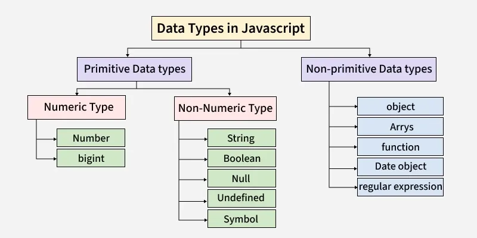

# JavaScript Data Types

> **JavaScript data types** define what kind of values a variable can hold and how those values behave in a program. They determine how data is stored in memory and how operations like comparison, calculation, and conversion work.

---

## Why Data Types Matter

- Each data type has its own **methods and operations** that control how it can be used
- Understanding data types helps **prevent errors** and makes code more **efficient and reliable**
- JavaScript is **dynamically typed** — types are checked at runtime, not declared upfront

---

## Data Type Categories

JavaScript data types are split into two major categories:



---

## Table of Contents
1. [Primitive Data Types](#primitive-data-types)
2. [Non-Primitive Data Types](#non-primitive-data-types)
3. [Interesting Facts & Gotchas](#interesting-facts--gotchas)
4. [Quick Reference Table](#quick-reference-table)

---

## Primitive Data Types

> Primitive data types represent **simple, immutable values** stored directly in memory, ensuring efficiency in both memory usage and performance.

---

### 1. Number

Includes both **integers** and **floating-point numbers**. Also covers special values:
- `Infinity` / `-Infinity` — represent infinite values
- `NaN` — "Not-a-Number", represents a computational error

```js
let n1 = 2;
console.log(n1);          // 2

let n2 = 1.3;
console.log(n2);          // 1.3

let n3 = Infinity;
console.log(n3);          // Infinity

let n4 = 'something' / 2;
console.log(n4);          // NaN
```

> 💡 There is **only one number type** in JavaScript — integers and floats are both just `number`.

---

### 2. String

A **series of characters** enclosed in quotes. JavaScript supports three types of quotes:

| Quote Type | Syntax | Use Case |
|---|---|---|
| Double quotes | `"Hello"` | Standard strings |
| Single quotes | `'Hello'` | Standard strings |
| Backticks | `` `Hello` `` | Template literals — supports embedded expressions |

```js
let s1 = "Hello There";
console.log(s1);              // Hello There

let s2 = 'Single quotes work fine';
console.log(s2);              // Single quotes work fine

let s3 = `can embed ${s1}`;
console.log(s3);              // can embed Hello There
```

> 💡 A **single character** like `'g'` is also a string — there is no separate `char` type in JavaScript.

---

### 3. Boolean

Has only **two possible values**: `true` or `false`. Commonly used in conditions and comparisons.

```js
let b1 = true;
console.log(b1);   // true

let b2 = false;
console.log(b2);   // false
```

---

### 4. Null

A **special value** that represents nothing, empty, or no value. It is its own type and contains only `null`.

```js
let age = null;
console.log(age);  // null
```

> ⚠️ `null` is an **intentional** absence of value — it is explicitly assigned by the programmer.

---

### 5. Undefined

A variable that has been **declared but not initialised** is automatically assigned `undefined`. It means the variable exists, but has no value yet.

```js
let a;
console.log(a);    // undefined
```

> 💡 `undefined` = variable exists but has no value. `null` = variable explicitly set to "no value".

---

### 6. Symbol *(Introduced in ES6)*

Symbols are **unique and immutable** primitive values used as identifiers for object properties. They help create unique keys in objects, preventing conflicts with other properties.

```js
let s1 = Symbol("Geeks");
let s2 = Symbol("Geeks");

console.log(s1 == s2);   // false — every Symbol is always unique
```

> 💡 Even two Symbols with the **same description** are never equal to each other.

---

### 7. BigInt *(Introduced in ES2020)*

Used to represent **whole numbers larger than** `2⁵³ - 1` (the limit of the regular `Number` type). The largest safe integer for `Number` is represented by `Number.MAX_SAFE_INTEGER`.

```js
let b = BigInt("0b1010101001010101001111111111111111");
console.log(b);   // A very large integer value
```

> 💡 Use `BigInt` when you need to work with very large integers that exceed JavaScript's normal number precision.

---

## Non-Primitive Data Types

> Non-primitive types are also called **reference types** or **derived data types**. They are derived from primitive data types and store references to memory locations rather than values directly.

---

### 1. Object

JavaScript objects store **key-value pairs** and are created using `{}` or the `new` keyword. They are fundamental — nearly everything in JavaScript is an object.

```js
let gfg = {
    type: "Company",
    location: "Noida"
};

console.log(gfg.type);      // Company
console.log(gfg.location);  // Noida
```

---

### 2. Array

A special kind of object used to store an **ordered collection of values**, which can be of any data type — even mixed types.

```js
let a1 = [1, 2, 3, 4, 5];
console.log(a1);   // [1, 2, 3, 4, 5]

let a2 = [1, "two", { name: "Object" }, [3, 4, 5]];
console.log(a2);   // Mixed types including object and nested array
```

---

### 3. Function

A **block of reusable code** designed to perform a specific task when called.

```js
// Defining a function
function greet(name) {
    return "Hello, " + name + "!";
}

// Calling the function
console.log(greet("Ajay"));   // Hello, Ajay!
```

> 💡 Functions are also **objects** in JavaScript — they can be passed around, stored in variables, and used as values.

---

### 4. Date Object

The `Date` object is used to **work with dates and times**, allowing for date creation, manipulation, and formatting.

```js
// Creating a Date object for the current date and time
let currentDate = new Date();

console.log(currentDate);   // e.g., 2025-04-11T10:30:00.000Z
```

---

### 5. Regular Expression (RegExp)

A `RegExp` object defines a **search pattern** used for matching text in strings.

```js
// Pattern to match the word "hello"
let pattern = /hello/;

// Test against a string (case-sensitive)
let result = pattern.test("Hello, world!");

console.log(result);   // false — "Hello" ≠ "hello" (case-sensitive)
```

---

## Interesting Facts & Gotchas

### 1. JavaScript is Dynamically Typed
Variables are **not bound** to a specific data type. The type is stored with the **value**, not the variable, and is decided at runtime.

```js
let x = 42;
console.log(x);   // 42 (Number)

x = "hello";
console.log(x);   // hello (String)

x = [1, 2, 3];
console.log(x);   // [1, 2, 3] (Array)
```

---

### 2. Everything is (Sort of) an Object
Functions are objects, arrays are objects, and even **primitive values temporarily behave like objects** when you access properties on them.

```js
let s = "hello";
console.log(s.length);     // 5 — string temporarily treated as object

let x = 42;
console.log(x.toString()); // "42"

let y = true;
console.log(y.toString()); // "true"
```

> 💡 Internally, JavaScript wraps primitives in a **temporary wrapper object** (e.g., `new String("hello")`) to allow property access, then discards it immediately after.

---

### 3. `NaN` is Not Equal to Itself
`NaN` stands for "Not-a-Number" and represents a computational error. Despite its name, its `typeof` is `"number"`. Uniquely, `NaN` is the **only value in JavaScript not equal to itself**.

```js
console.log(typeof NaN);    // "number"
console.log(NaN === NaN);   // false ❗
```

> ✅ Use `Number.isNaN(value)` to reliably check for `NaN`.

---

### 4. A Symbol is Never Equal to Another Symbol
Every Symbol is guaranteed to be unique — even two Symbols with the exact same description will never be equal.

```js
let s1 = Symbol("abc");
let s2 = Symbol("abc");

console.log(s1 === s2);   // false
```

---

### 5. `undefined` vs `null`

| | `undefined` | `null` |
|---|---|---|
| **Meaning** | Variable declared but not assigned | Explicitly set to "no value" |
| **Who sets it** | JavaScript (automatically) | The programmer (intentionally) |
| **Type** | `"undefined"` | `"object"` *(a known JS quirk)* |

---

### 6. Integers and Floats are the Same Type
There is **only one `number` type** in JavaScript — it covers both integers and floating-point numbers.

```js
let x = 42;     // Integer
let y = 42.5;   // Floating-point

console.log(typeof x);   // "number"
console.log(typeof y);   // "number"
```

---

### 7. A Single Character is Still a String
There is **no separate character type** in JavaScript. A single character is simply a string of length 1.

```js
let s1 = "gfg";   // String
let s2 = 'g';     // Also a String

console.log(typeof s1);   // "string"
console.log(typeof s2);   // "string"
```

---

## Quick Reference Table

| Data Type | Category | Example | `typeof` Result |
|---|---|---|---|
| `Number` | Primitive | `42`, `3.14`, `NaN` | `"number"` |
| `String` | Primitive | `"hello"`, `'world'` | `"string"` |
| `Boolean` | Primitive | `true`, `false` | `"boolean"` |
| `Null` | Primitive | `null` | `"object"` *(quirk)* |
| `Undefined` | Primitive | `undefined` | `"undefined"` |
| `Symbol` | Primitive | `Symbol("id")` | `"symbol"` |
| `BigInt` | Primitive | `9007199254740991n` | `"bigint"` |
| `Object` | Non-Primitive | `{ key: value }` | `"object"` |
| `Array` | Non-Primitive | `[1, 2, 3]` | `"object"` |
| `Function` | Non-Primitive | `function() {}` | `"function"` |
| `Date` | Non-Primitive | `new Date()` | `"object"` |
| `RegExp` | Non-Primitive | `/pattern/` | `"object"` |

---

## Key Takeaways

- JavaScript has **7 primitive types**: `Number`, `String`, `Boolean`, `Null`, `Undefined`, `Symbol`, `BigInt`
- **Non-primitive types** (Objects, Arrays, Functions, etc.) store references, not values directly
- JavaScript is **dynamically typed** — one variable can hold different types at different times
- `NaN` is of type `"number"` and is **not equal to itself**
- `null` and `undefined` are different — `null` is intentional, `undefined` is automatic
- `typeof null` returns `"object"` — this is a **well-known JavaScript bug** that exists for legacy reasons
```
JavaScript Data Types
├── Primitive (simple, immutable, stored directly in memory)
│   ├── Number
│   ├── String
│   ├── Boolean
│   ├── Null
│   ├── Undefined
│   ├── Symbol     (ES6)
│   └── BigInt     (ES2020)
└── Non-Primitive (reference types, derived from primitives)
    ├── Object
    ├── Array
    ├── Function
    ├── Date Object
    └── Regular Expression
```
---