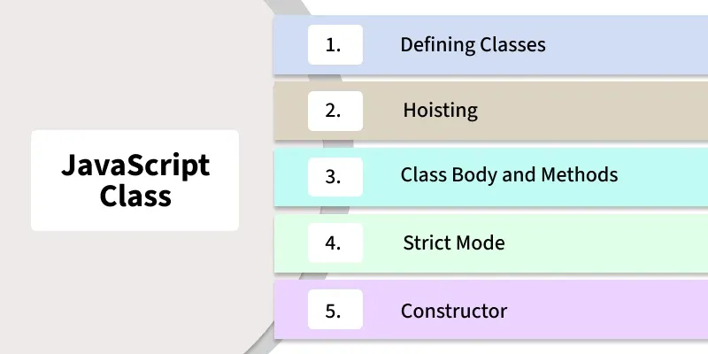

# JavaScript Classes

JavaScript classes were introduced in **ES6 (ECMAScript 2015)** to provide a more structured and readable way of creating objects. Classes make it easier to write object-oriented code by supporting concepts such as **encapsulation, inheritance, modularity, and code reusability**.

A class acts as a blueprint for creating objects. Instead of creating objects manually, a class allows multiple objects to be created with the same properties and methods.



---

# Syntax of a JavaScript Class

```javascript
class ClassName {

    constructor() {

        // Initialize properties here

    }

    methodName() {

        // Method code

    }

}
```

### Explanation

```javascript
class ClassName
```

The `class` keyword is used to declare a class.

```javascript
constructor()
```

The constructor is a special method that automatically runs whenever a new object is created from the class.

```javascript
methodName()
```

Methods define the behavior that objects created from the class can perform.

### Key Points

* The `class` keyword creates a class.
* The `constructor()` method initializes object properties.
* Methods are defined inside the class.
* Objects are created using the `new` keyword.

---

# Key Features of JavaScript Classes

JavaScript classes provide several important features:

### Encapsulation

Combines data (properties) and behavior (methods) into a single unit.

### Constructor Method

Initializes object properties when an object is created.

### Inheritance

Allows one class to inherit properties and methods from another class.

### Code Reusability

Multiple objects can share the same methods and structure.

### Simplicity and Clarity

Provides a cleaner and more organized way to create and manage objects.

---

# Creating a Simple Class

A simple class contains properties and methods that define the characteristics and behavior of an object.

## Example

```javascript
class Person {

    constructor(name, age) {

        this.name = name;
        this.age = age;

    }

    g() {

        console.log(
            `Hello, my name is ${this.name} and I am ${this.age} years old.`
        );

    }

}

let p1 = new Person("Pranjal", 20);

p1.g();
```

### Output

```text
Hello, my name is Pranjal and I am 20 years old.
```

---

## Explanation

### Class Declaration

```javascript
class Person {
```

Creates a class named `Person`.

---

### Constructor

```javascript
constructor(name, age) {

    this.name = name;
    this.age = age;

}
```

The constructor receives two parameters:

* `name`
* `age`

These values are stored in the object using `this`.

---

### Method Definition

```javascript
g() {

    console.log(
        `Hello, my name is ${this.name} and I am ${this.age} years old.`
    );

}
```

Defines a method named `g()` that displays a greeting message.

---

### Creating an Object

```javascript
let p1 = new Person("Pranjal", 20);
```

Creates a new object named `p1`.

Values passed:

```text
name = "Pranjal"
age = 20
```

---

### Calling the Method

```javascript
p1.g();
```

Executes the method and prints the greeting.

---

### Key Points

* `Person` is a class.
* `constructor()` initializes object properties.
* `g()` defines object behavior.
* `new` creates an instance of the class.

---

# Constructor to Initialize Objects

The constructor is used to initialize properties whenever a new object is created.

Without a constructor, every object's properties would need to be assigned manually.

---

## Example

```javascript
class Car {

    constructor(make, model, year) {

        this.make = make;
        this.model = model;
        this.year = year;

    }

    d() {

        console.log(
            `${this.year} ${this.make} ${this.model}`
        );

    }

}

let my = new Car(
    "Toyota",
    "Corolla",
    2021
);

my.d();
```

### Output

```text
2021 Toyota Corolla
```

---

## Explanation

### Constructor

```javascript
constructor(make, model, year)
```

Receives:

* make
* model
* year

---

### Property Initialization

```javascript
this.make = make;
this.model = model;
this.year = year;
```

Stores the values in the object.

---

### Method

```javascript
d()
```

Displays the car details.

---

### Creating an Instance

```javascript
let my = new Car(
    "Toyota",
    "Corolla",
    2021
);
```

Creates a car object with:

```text
make = Toyota
model = Corolla
year = 2021
```

---

### Calling the Method

```javascript
my.d();
```

Displays the car information.

---

### Key Points

* The constructor initializes object properties.
* Each new object receives its own property values.
* Methods can use those properties through `this`.

---

# Inheritance in Classes

Inheritance allows one class to inherit properties and methods from another class.

The child class can:

* Use parent properties.
* Use parent methods.
* Add new properties.
* Add new methods.
* Override existing methods.

---

## Example

```javascript
class Car {

    constructor(make, model, year) {

        this.make = make;
        this.model = model;
        this.year = year;

    }

    di() {

        console.log(
            `${this.year} ${this.make} ${this.model}`
        );

    }

}

class ElectricCar extends Car {

    constructor(
        make,
        model,
        year,
        batteryLife
    ) {

        super(
            make,
            model,
            year
        );

        this.batteryLife =
        batteryLife;

    }

    d() {

        console.log(
            `Battery life: ${this.batteryLife} hours`
        );

    }

}

let tesla =
new ElectricCar(
    "Tesla",
    "Model S",
    2022,
    24
);

tesla.di();

tesla.d();
```

### Output

```text
2022 Tesla Model S

Battery life: 24 hours
```

---

## Explanation

### Parent Class

```javascript
class Car
```

Contains:

* make
* model
* year

and the method:

```javascript
di()
```

---

### Child Class

```javascript
class ElectricCar extends Car
```

The `extends` keyword creates inheritance.

`ElectricCar` inherits from `Car`.

---

### Using super()

```javascript
super(
    make,
    model,
    year
);
```

Calls the parent constructor.

This initializes:

```javascript
this.make
this.model
this.year
```

---

### New Property

```javascript
this.batteryLife =
batteryLife;
```

Adds a property specific to electric cars.

---

### New Method

```javascript
d()
```

Displays battery information.

---

### Creating an Object

```javascript
let tesla =
new ElectricCar(
    "Tesla",
    "Model S",
    2022,
    24
);
```

Creates an electric car object.

---

### Calling Inherited Method

```javascript
tesla.di();
```

Uses the method inherited from `Car`.

---

### Calling Child Method

```javascript
tesla.d();
```

Uses the method defined in `ElectricCar`.

---

### Key Points

* `extends` creates inheritance.
* `super()` calls the parent constructor.
* Child classes inherit parent methods.
* Child classes can add new functionality.

---

# Creating Multiple Objects from a Class

One of the biggest advantages of classes is the ability to create multiple objects using the same structure.

Each object has its own data but shares the same methods.

---

## Example

```javascript
class Car {

    constructor(make, model, year) {

        this.make = make;
        this.model = model;
        this.year = year;

    }

    d() {

        console.log(
            `${this.year} ${this.make} ${this.model}`
        );

    }

}

let c1 =
new Car(
    "Toyota",
    "Corolla",
    2021
);

let c2 =
new Car(
    "Honda",
    "Civic",
    2020
);

c1.d();

c2.d();
```

### Output

```text
2021 Toyota Corolla

2020 Honda Civic
```

---

## Explanation

### Class Definition

```javascript
class Car
```

Defines the structure for all car objects.

---

### First Object

```javascript
let c1 =
new Car(
    "Toyota",
    "Corolla",
    2021
);
```

Creates:

```text
Toyota Corolla
2021
```

---

### Second Object

```javascript
let c2 =
new Car(
    "Honda",
    "Civic",
    2020
);
```

Creates:

```text
Honda Civic
2020
```

---

### Method Calls

```javascript
c1.d();
```

Displays:

```text
2021 Toyota Corolla
```

```javascript
c2.d();
```

Displays:

```text
2020 Honda Civic
```

---

### Key Points

* A class can create many objects.
* Each object stores different data.
* All objects share the same methods.
* This improves code reusability and organization.

---

# Summary

JavaScript classes provide a structured way to create objects with shared properties and methods. The `class` keyword is used to define a class, while the `constructor()` method initializes object properties when instances are created. Classes support important object-oriented concepts such as encapsulation, inheritance, code reusability, and modularity. Using the `extends` keyword, one class can inherit properties and methods from another, while `super()` allows access to the parent constructor. Classes make code more organized, readable, and easier to maintain when creating multiple related objects.

---