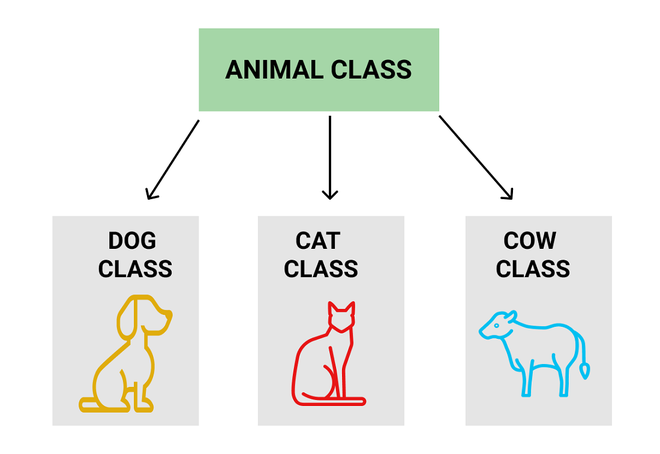

# Inheritance in JavaScript Classes

Inheritance in JavaScript is a mechanism that allows one object or class to acquire properties and methods from another. It promotes **code reusability**, reduces duplication, and helps create **hierarchical relationships** between classes and objects.

Some important points about inheritance are:

* Allows reuse of properties and methods from a parent class.
* Implemented using the `extends` keyword in ES6 classes.
* Supports method overriding in child classes.
* Reduces code duplication.
* Makes code easier to organize and maintain.
* Uses prototypes behind the scenes to share functionality.

For example, an `Animal` class can be a parent class, while `Dog`, `Cat`, and `Cow` can inherit common functionality from it.



---

# Common Types of Inheritance in JavaScript

JavaScript supports several inheritance techniques:

1. Prototype-Based Inheritance
2. ES6 Class-Based Inheritance
3. Mixins for Inheritance
4. Inheritance with `Object.create()`
5. Inheritance with `Object.setPrototypeOf()`
6. Factory Functions for Inheritance

---

# 1. Prototype-Based Inheritance

JavaScript uses prototypes to share properties and methods among objects. This is the traditional inheritance mechanism that existed before ES6 classes.

## Example

```javascript
function Animal(name) {
    this.name = name;
}

Animal.prototype.speak = function () {
    console.log(`${this.name} makes a sound.`);
};

// Child constructor function
function Dog(name) {
    Animal.call(this, name);
}

// Inherit methods from Animal
Dog.prototype = Object.create(Animal.prototype);

Dog.prototype.constructor = Dog;

// Adding a new method to Dog
Dog.prototype.bark = function () {
    console.log(`${this.name} barks: Woof!`);
};

// Creating an instance
const myDog = new Dog("Buddy");

myDog.speak();
myDog.bark();
```

### Output

```text
Buddy makes a sound.

Buddy barks: Woof!
```

---

## Explanation

### Parent Constructor

```javascript
function Animal(name) {
    this.name = name;
}
```

Creates an `Animal` constructor that stores a name.

---

### Parent Method

```javascript
Animal.prototype.speak = function () {
    console.log(`${this.name} makes a sound.`);
};
```

Adds the `speak()` method to `Animal.prototype`.

All Animal objects can use this method.

---

### Child Constructor

```javascript
function Dog(name) {
    Animal.call(this, name);
}
```

Calls the parent constructor so that Dog objects receive the `name` property.

---

### Inheriting Methods

```javascript
Dog.prototype = Object.create(Animal.prototype);
```

Creates a new object whose prototype is `Animal.prototype`.

This allows Dog objects to inherit Animal methods.

---

### Fixing the Constructor Reference

```javascript
Dog.prototype.constructor = Dog;
```

Restores the correct constructor reference.

---

### Adding Child-Specific Method

```javascript
Dog.prototype.bark = function () {
    console.log(`${this.name} barks: Woof!`);
};
```

Adds functionality unique to Dog objects.

---

### Key Points

* `Dog` inherits from `Animal`.
* `Animal.call()` copies parent properties.
* `Object.create()` establishes inheritance.
* Methods are searched through the prototype chain.
* `Dog` can add its own methods while inheriting parent methods.

---

# 2. ES6 Class-Based Inheritance

ES6 introduced classes, making inheritance easier to read and write.

A child class inherits properties and methods using the `extends` keyword.

## Example

```javascript
class one {

    constructor(name) {
        this.name = name;
    }

    speaks() {
        return `my name is ${this.name}`;
    }

}

class two extends one {

    constructor(name) {
        super(name);
    }

}

const o = new two('Pranjal');

console.log(o.speaks());
```

### Output

```text
my name is Pranjal
```

---

## Explanation

### Parent Class

```javascript
class one
```

Defines a class containing:

* A constructor
* A method named `speaks()`

---

### Constructor

```javascript
constructor(name) {
    this.name = name;
}
```

Stores the name property.

---

### Method

```javascript
speaks() {
    return `my name is ${this.name}`;
}
```

Returns a string containing the object's name.

---

### Child Class

```javascript
class two extends one
```

Uses the `extends` keyword to inherit from class `one`.

---

### Calling Parent Constructor

```javascript
super(name);
```

Passes the value to the parent constructor.

---

### Creating an Instance

```javascript
const o = new two('Pranjal');
```

Creates an object of class `two`.

---

### Method Inheritance

```javascript
o.speaks();
```

Although `speaks()` is defined in `one`, it can be used by objects of `two`.

---

### Key Points

* `extends` creates inheritance.
* `super()` calls the parent constructor.
* Child classes automatically inherit parent methods.
* The child can use parent functionality without redefining it.

---

# 3. Mixins for Inheritance

Mixins allow functionality from multiple objects to be combined into another object's prototype.

This is useful when inheritance from multiple sources is needed.

## Example

```javascript
const one = {

    speak() {
        return `${this.name} walks`;
    }

};

const two = {

    walks() {
        return `${this.name} walks`;
    }

};

function Person(name) {
    this.name = name;
}

Object.assign(Person.prototype, one, two);

const person1 = new Person('Pranjal');

console.log(person1.speak());

console.log(person1.walks());
```

### Output

```text
Pranjal walks

Pranjal walks
```

---

## Explanation

### Object One

```javascript
const one = {
    speak() {
        return `${this.name} walks`;
    }
};
```

Contains the `speak()` method.

---

### Object Two

```javascript
const two = {
    walks() {
        return `${this.name} walks`;
    }
};
```

Contains the `walks()` method.

---

### Constructor Function

```javascript
function Person(name) {
    this.name = name;
}
```

Creates Person objects.

---

### Merging Methods

```javascript
Object.assign(Person.prototype, one, two);
```

Copies methods from both objects into `Person.prototype`.

---

### Creating an Instance

```javascript
const person1 = new Person('Pranjal');
```

Creates a Person object.

---

### Accessing Mixed-In Methods

```javascript
person1.speak();
person1.walks();
```

Both methods become available.

---

### Key Points

* Mixins combine functionality from multiple objects.
* `Object.assign()` copies methods into a prototype.
* Objects inherit all copied methods.
* Useful for sharing behavior without class hierarchies.

---

# 4. Inheritance with Object.create()

`Object.create()` creates a new object that inherits from another object.

## Example

```javascript
let obj = {

    name: 'Pranjal',

    age: 21,

    prints() {
        return `my name is ${this.name}`;
    }

};

let obj1 = Object.create(obj);

obj1.name = 'Hello';

console.log(obj1.age);

console.log(obj1.prints());
```

### Output

```text
21

my name is Hello
```

---

## Explanation

### Parent Object

```javascript
let obj = { ... };
```

Contains:

* name
* age
* prints()

---

### Creating Child Object

```javascript
let obj1 = Object.create(obj);
```

Creates a new object whose prototype is `obj`.

---

### Overriding Property

```javascript
obj1.name = 'Hello';
```

Creates a new name property directly on `obj1`.

---

### Inherited Property

```javascript
obj1.age
```

Since `age` does not exist on `obj1`, JavaScript finds it in `obj`.

---

### Inherited Method

```javascript
obj1.prints()
```

Uses the inherited method.

Inside the method:

```javascript
this.name
```

Refers to `obj1.name`, which is `"Hello"`.

---

### Key Points

* `Object.create()` creates prototype-based inheritance.
* Child objects inherit properties and methods.
* Properties can be overridden in the child object.
* Missing properties are searched in the prototype.

---

# 5. Inheritance with Object.setPrototypeOf()

`Object.setPrototypeOf()` changes the prototype of an existing object.

## Example

```javascript
const one = {

    speak() {
        return `${this.name} speaks`;
    }

};

const two = {

    name: 'Pranjal'

};

Object.setPrototypeOf(one, two);

console.log(one.speak());
```

### Output

```text
Pranjal speaks
```

---

## Explanation

### Object One

```javascript
const one = {
    speak() {
        return `${this.name} speaks`;
    }
};
```

Contains a method but no `name` property.

---

### Object Two

```javascript
const two = {
    name: 'Pranjal'
};
```

Contains a `name` property.

---

### Setting Prototype

```javascript
Object.setPrototypeOf(one, two);
```

Makes `two` the prototype of `one`.

---

### Property Lookup

```javascript
this.name
```

Is not found in `one`.

JavaScript searches the prototype and finds:

```javascript
two.name
```

---

### Key Points

* Changes an object's prototype.
* Allows property inheritance.
* Property lookup follows the prototype chain.
* Existing objects can gain inherited behavior.

---

# 6. Factory Functions for Inheritance

Factory functions create and return objects instead of using classes or constructors.

## Example

```javascript
function createPerson(name) {

    return {

        name: name,

        greet() {
            return `Hello my name is ${this.name}`;
        }

    };

}

const one = createPerson('Pranjal');

const two = createPerson('Pranav');

console.log(one.greet());

console.log(two.greet());
```

### Output

```text
Hello my name is Pranjal

Hello my name is Pranav
```

---

## Explanation

### Factory Function

```javascript
function createPerson(name)
```

Creates and returns a new object.

---

### Returned Object

```javascript
return {
    name: name,
    greet() { ... }
};
```

Contains:

* A name property
* A greet() method

---

### Creating Objects

```javascript
const one = createPerson('Pranjal');
const two = createPerson('Pranav');
```

Creates two separate objects.

---

### Calling Methods

```javascript
one.greet();
two.greet();
```

Each object uses its own `name` value.

---

### Key Points

* Factory functions return objects directly.
* No `new` keyword is required.
* Each object contains the same structure.
* Objects can have different data values.

---

# Summary

Inheritance in JavaScript allows objects and classes to acquire properties and methods from other objects, promoting code reuse and reducing duplication. JavaScript supports several inheritance approaches including **prototype-based inheritance**, **ES6 class inheritance**, **mixins**, **Object.create()**, **Object.setPrototypeOf()**, and **factory functions**. All of these techniques allow functionality to be shared between objects while keeping code organized, maintainable, and reusable.

---