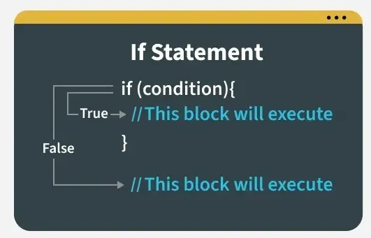
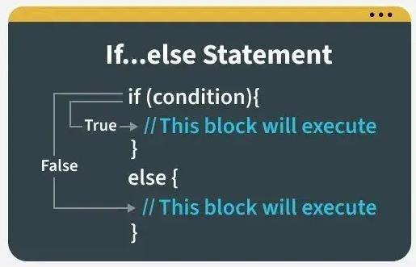
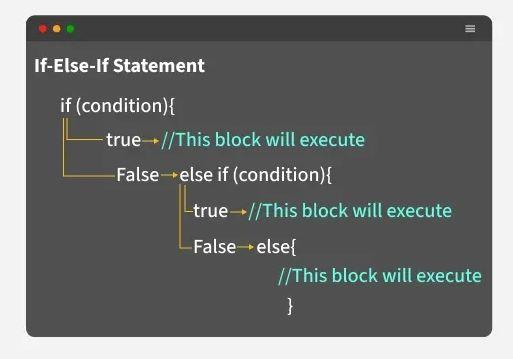
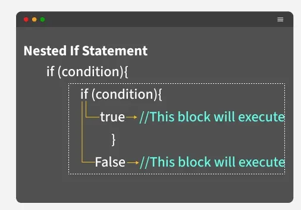

# JavaScript Conditional Statements

Conditional statements are the decision-making engines of JavaScript. They allow your code to execute different actions based on whether a specific condition is **true** or **false**, making your applications dynamic and interactive.

---

## 1. The `if` Statement
The most basic form of control flow. It executes a block of code **only** if the specified condition evaluates to true.



```javascript
let x = 20;

// Simple condition check
if (x % 2 === 0) {
    console.log("Even"); // This runs because 20 % 2 is 0
}

if (x % 2 !== 0) {
    console.log("Odd"); // This is skipped
};
```

## 2. The `if-else` Statement
Used when you have two mutually exclusive outcomes. If the `if` condition fails, the `else` block **must** run.



```javascript
let age = 25;

if (age >= 18) {
    console.log("Adult");
} else {
    console.log("Not an Adult");
};
// Output: Adult
```

## 3. The `else if` Chain
Used to test multiple independent conditions in a sequence. It stops evaluating as soon as it finds the first `true` condition.



```javascript
const x = 0;

if (x > 0) {
    console.log("Positive.");
} else if (x < 0) {
    console.log("Negative.");
} else {
    console.log("Zero.");
};
// Output: Zero.
```

---

## 4. The `switch` Statement
A cleaner alternative to long `else if` chains when comparing a single variable against multiple fixed values.


```javascript
const marks = 85;
let Branch;

switch (true) {
    case marks >= 90:
        Branch = "Computer science engineering";
        break; 
    case marks >= 80:
        Branch = "Mechanical engineering";
        break; // break prevents "falling through" to the next case
    case marks >= 70:
        Branch = "Chemical engineering";
        break;
    default:
        Branch = "Bio technology"; // Runs if no cases match
        break;
}

console.log(`Student Branch name is : ${Branch}`);
```

---

## 5. Ternary Operator (`? :`)
A compact, one-line shorthand for `if-else`.
**Syntax:** `condition ? expressionIfTrue : expressionIfFalse`

```javascript
let age = 21;

const result = (age >= 18) 
    ? "You are eligible to vote." 
    : "You are not eligible to vote.";

console.log(result);
```

---

## 6. Nested `if...else`
Placing a conditional inside another conditional to handle hierarchical logic.



```javascript
let weather = "sunny";
let temp = 25;

if (weather === "sunny") {
    if (temp > 30) {
        console.log("It's a hot day!");
    } else if (temp > 20) {
        console.log("It's a warm day.");
    } else {
        console.log("It's a bit cool today.");
    }
} else {
    console.log("Check the weather forecast!");
};
```

---

## Summary Table

| Statement | Description |
| :--- | :--- |
| **`if`** | Executes code only if the condition is true. |
| **`else`** | Executes code if the preceding `if` condition is false. |
| **`else if`** | Tests a new condition if the previous condition was false. |
| **`switch`** | Selects one of many code blocks to be executed based on a value. |
| **Ternary** | A shorthand for `if-else` used for simple assignments. |
| **Nested** | Hierarchical checks (one condition inside another). |

---

## Interview Prep & Best Practices

### 💡 Pro-Tips for Interviews:
* **Strict Equality:** Always use `===` instead of `==` in your conditions to avoid bugs caused by type coercion.
* **The "Break" Keyword:** In a `switch` statement, if you forget `break`, the code will continue executing the next case regardless of whether it matches (this is called "fall-through").
* **Readability:** While the Ternary operator is cool, don't nest them (e.g., `a ? b ? c : d : e`). It makes code unreadable. Use `if-else` for complex logic.

### ✅ Coding Standards:
1.  **Always use curly braces `{}`** even for single-line `if` statements to maintain code clarity.
2.  **Avoid Deep Nesting:** If you find yourself nesting 3 or 4 levels deep, try using logical operators (`&&` or `||`) to flatten the logic.
3.  **Default Cases:** Always include a `default` in a `switch` or a final `else` in a chain to handle unexpected inputs.

---