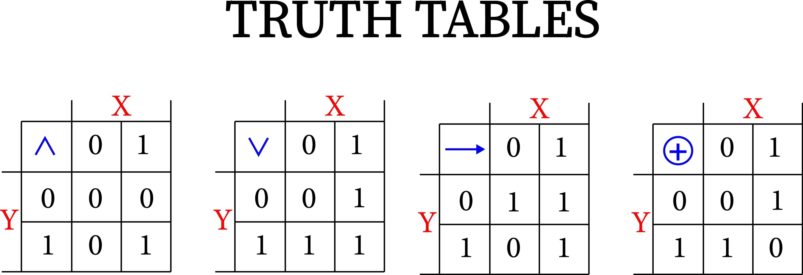
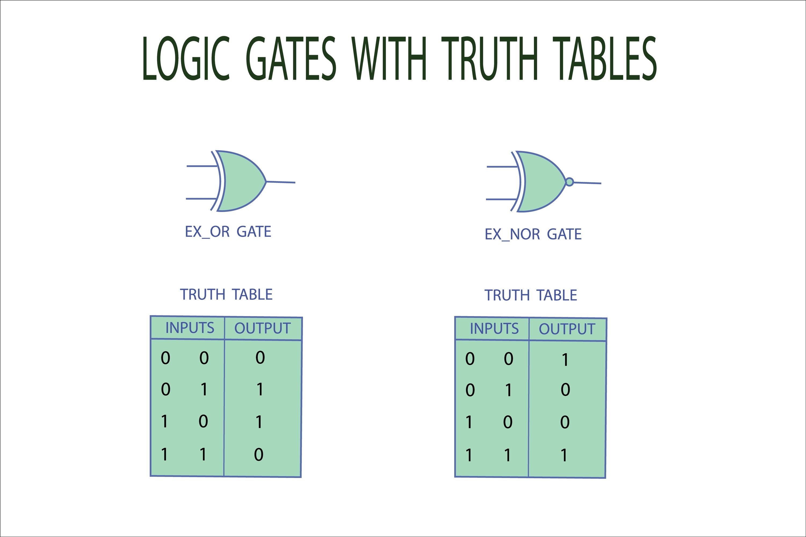

# JavaScript Logical Operators

Logical operators are essential for handling multiple conditions and controlling the flow of a program. They allow you to combine or invert boolean values, making your code more intelligent and reactive.

---

## 1. Logical AND (`&&`)
The `&&` operator checks if **both** operands are true. If either (or both) are false, the result is false.



### Short-Circuit Evaluation
In JavaScript, `&&` doesn't just return `true` or `false`. It returns the actual value:
* If the first operand is **falsy**, it returns that value immediately.
* If the first operand is **truthy**, it evaluates and returns the second operand.

```javascript
// Logical AND in conditions
let age = 20;
let idProof = true;

if (age >= 18 && idProof) {
  console.log("Allowed"); // Runs because both are true
}

// Logical AND with values (Short-circuiting)
let x = 5;
let y = 0;

console.log(x && y);  // Output: 0 (5 is truthy, so it returns the second value)
console.log(x && 10); // Output: 10 (5 is truthy, so it returns the second value)
```

---

## 2. Logical OR (`||`)
The `||` operator checks if **at least one** operand is true. It only returns false if both operands are false.



### Short-Circuit Evaluation
* If the first operand is **truthy**, it returns that value immediately (ignoring the rest).
* If the first operand is **falsy**, it returns the value of the second operand.

```javascript
let i = 1;
let j = null;
let k = undefined;

console.log(j || k); // Output: undefined (null is falsy, returns second)
console.log(i || 0); // Output: 1 (1 is truthy, stops immediately)

// Practical use: Providing a fallback
let age = 16;
let hasGuardian = true;

if (age >= 18 || hasGuardian) {
  console.log("Allowed"); // Allowed because hasGuardian is true
}
```

---

## 3. Logical NOT (`!`)
The `!` operator inverts the boolean value. It converts truthy values to `false` and falsy values to `true`.

### The Double NOT (`!!`) Trick
Using `!!` is a common way to explicitly convert any value into its actual boolean equivalent.

```javascript
let isLoggedIn = false;

if (!isLoggedIn) {
  console.log("Log in!"); // Runs because !false is true
}

// Non-boolean values
let x = "Hello";
console.log(!x);   // false (string is truthy)
console.log(!!x);  // true (converted to boolean)
```

---

## 4. Nullish Coalescing (`??`)
This operator is a specialized version of OR. It returns the right-hand value **only** if the left-hand value is `null` or `undefined`. Unlike `||`, it treats `0` and `""` (empty strings) as valid truthy values.

```javascript
let username = null;
let defaultName = "Guest";

// Returns "Guest" because username is null
console.log(username ?? defaultName); 

username = "Kartik";
// Returns "Kartik" because it's not null/undefined
console.log(username ?? defaultName); 
```

---

## Summary of Truthy vs. Falsy

To master logical operators, you must know what JavaScript considers **Falsy**:
* `false`
* `0` and `-0`
* `""` (Empty string)
* `null`
* `undefined`
* `NaN`

**Anything else is Truthy**, including empty arrays `[]` and empty objects `{}`.

---

## Interview Preparation: Key Insights

* **`||` vs `??`:** This is a frequent interview question. Explain that `||` returns the right side for *any* falsy value (including `0`), while `??` only triggers for `null` or `undefined`.
* **Short-circuiting:** Be prepared to explain how `&&` can be used as a "guard." For example: `user && user.getName()` ensures `getName()` is only called if `user` exists.
* **Result Values:** Clarify that `&&` and `||` do not necessarily return a boolean; they return the value of one of the operands.
* **The `!` Operator Result:** Emphasize that `!` **always** returns a boolean, regardless of the input type.

---