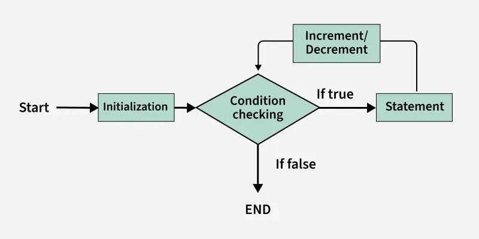
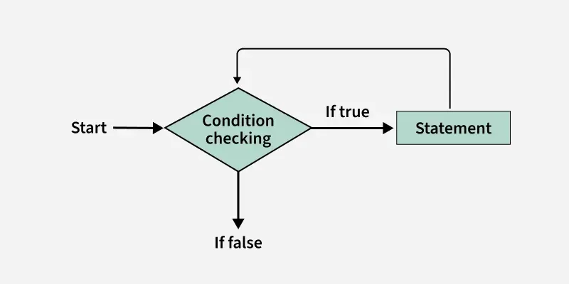
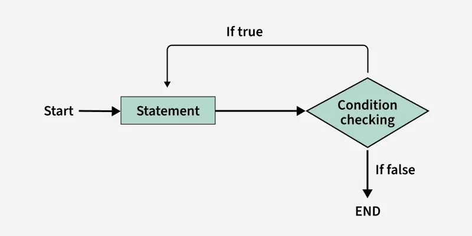

# JavaScript Loops

Loops are fundamental structures that allow you to execute a block of code multiple times. They are essential for automating repetitive tasks, such as processing data in arrays or objects, until a specific condition is met.

---

## 1. The `for` Loop
The `for` loop is the most common loop when you know exactly how many times you want to run a block of code. It is an **Entry Control Loop**, meaning the condition is checked before the code executes.



**Syntax:**
```javascript
for (initialization; condition; increment/decrement) {
    // Code to execute
}
```

**Example:**
```javascript
for (let i = 1; i <= 3; i++) {
    console.log("Count:", i);
}
// Output: 
// Count: 1
// Count: 2
// Count: 3
```

### 1.1 `for...in` Loop
Used specifically to iterate over the **enumerable keys (properties)** of an object.
```javascript
const person = { name: "Alice", age: 22, city: "Delhi" };

for (let key in person) {
  console.log(key, ":", person[key]);
}
```

### 1.2 `forEach` Loop
An array method that executes a provided function once for each element in that array.
```javascript
const numbers = [10, 20, 30];

numbers.forEach(function(num) {
  console.log(num);
});
```

---

## 2. The `while` Loop
The `while` loop repeats a block of code as long as a specified condition remains `true`. Like the `for` loop, it is an **Entry Control Loop**. It is best used when the number of iterations is not known in advance.



**Example:**
```javascript
let i = 0;
while (i < 3) {
    console.log("Number:", i);
    i++; // Crucial: update the variable to avoid infinite loops
}
```

---

## 3. The `do...while` Loop
The `do...while` loop is an **Exit Control Loop**. It executes the code block **at least once** before checking the condition.



**Example:**
```javascript
let i = 0;
do {
    console.log("Iteration:", i);
    i++;
} while (i < 3);
```
**Key Difference:** Even if the condition is false at the very start, a `do...while` loop will always run its body one time.

---

## Summary Comparison Table

| Loop Type | Control Type | Best Use Case |
| :--- | :--- | :--- |
| **`for`** | Entry Control | When the number of iterations is known. |
| **`for...in`** | Property Control | Iterating over Object keys. |
| **`forEach`** | Array Method | Executing a function for every Array element. |
| **`while`** | Entry Control | When the loop depends on a dynamic condition. |
| **`do...while`** | Exit Control | When the code block must run at least once. |

---

## Interview Preparation: Key Concepts

### 💡 Common Interview Questions:
* **Entry vs. Exit Control:** Explain that `for` and `while` check the condition first (Entry), whereas `do...while` checks it after the first execution (Exit).
* **Infinite Loops:** An infinite loop occurs when the termination condition never becomes `false`. This usually happens if you forget to increment/update your counter (e.g., forgetting `i++`).
* **`for...in` vs. `for...of`:** While `for...in` is for object keys, `for...of` (though not in the text) is used for array values. Be ready to explain that `for...in` should generally be avoided for arrays if order matters.

### ✅ Best Practices:
1.  **Prevent Infinite Loops:** Always ensure your loop has a clear path to the "false" condition.
2.  **Use `let` in for-loops:** Declaring your counter with `let` (e.g., `for (let i = 0...)`) ensures the variable is scoped only to that loop, preventing bugs elsewhere in your code.
3.  **Readability:** For arrays, `forEach` or `for...of` is often more readable than a traditional `for` loop.
4.  **Avoid Deep Nesting:** Nesting loops inside loops (O(n²)) can significantly slow down your program. Look for ways to flatten your logic where possible.

---