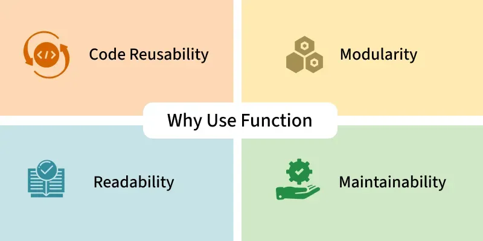
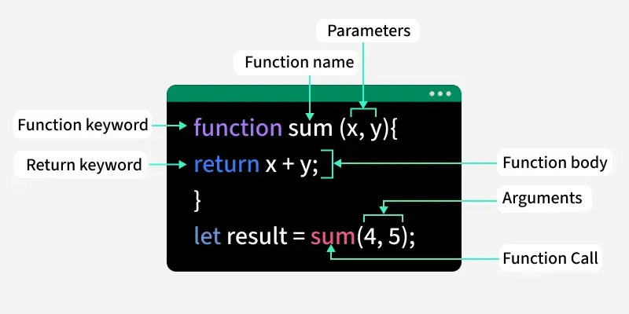

# Functions in JavaScript

## Introduction

Functions are **reusable blocks of code** designed to perform specific tasks. They allow you to organize, reuse, and modularize your code. A function can take inputs, perform actions, and return outputs — making them one of the most fundamental building blocks of JavaScript programming.




---

## Understanding Parameters vs Arguments

Before diving into function types, it's important to understand two key terms:

- **Parameter** — a placeholder variable defined in the function signature.
- **Argument** — the actual value passed when the function is called.

```javascript
function greet(name) {   // 'name' is a parameter
  console.log("Hello " + name);
}

greet("Alice");  // "Alice" is the argument
```

---

## Default Parameters

Default parameters allow a function to use a fallback value when no argument is provided during the function call.

```javascript
function greet(name = "Guest") {
  console.log("Hello, " + name);
}

greet();        // Output: Hello, Guest
greet("Aman");  // Output: Hello, Aman
```

> **Key point:** If no value is passed, the default is used automatically.

---

## The Return Statement

The `return` statement sends a result back from a function to the caller.

- When `return` executes, the function **stops immediately**.
- The returned value can be stored in a variable or used directly.

```javascript
function add(a, b) {
  return a + b; // returns the sum
}

let result = add(5, 10);
console.log(result); // Output: 15
```

---

## Types of Functions in JavaScript

JavaScript supports many different kinds of functions, each suited to different use cases.

---

### 1. Named Function

A function with its own declared name. Easy to reuse and debug — the name appears in error messages and stack traces.

```javascript
function greet() {
  return "Hello!";
}

console.log(greet()); // Output: Hello!
```

---

### 2. Anonymous Function

A function **without a name**, usually assigned to a variable or used as a callback. It cannot be called directly by name.

```javascript
const greet = function() {
  return "Hi there!";
};

console.log(greet()); // Output: Hi there!
```

---

### 3. Function Expression

When you assign a function (named or anonymous) to a variable. The function is then invoked by calling that variable.

```javascript
const add = function(a, b) {
  return a + b;
};

console.log(add(2, 3)); // Output: 5
```

> **Note:** Function expressions are not hoisted, unlike named function declarations.

---

### 4. Arrow Function (ES6)

A concise syntax introduced in ES6 using the `=>` arrow. Arrow functions are shorter and do **not** have their own `this` binding.

```javascript
const square = n => n * n;

console.log(square(4)); // Output: 16
```

Arrow functions are ideal for short, simple operations and callbacks.

---

### 5. Immediately Invoked Function Expression (IIFE)

An IIFE is a function that **runs immediately** after it is defined. It is commonly used to create an isolated scope, avoiding pollution of the global namespace.

```javascript
(function () {
  console.log("This runs immediately!");
})();
// Output: This runs immediately!
```

---

### 6. Callback Functions

A callback is a function **passed as an argument** to another function and executed after that function completes.

```javascript
function num(n, callback) {
  return callback(n);
}

const double = (n) => n * 2;

console.log(num(5, double)); // Output: 10
```

Callbacks are widely used in asynchronous programming (e.g., `setTimeout`, event listeners, API calls).

---

### 7. Constructor Function

A special function used to **create multiple objects** with the same structure. Called with the `new` keyword.

```javascript
function Person(name, age) {
  this.name = name;
  this.age = age;
}

const user = new Person("Neha", 22);
console.log(user.name); // Output: Neha
```

> **Convention:** Constructor functions are named with a capital letter by convention.

---

### 8. Async Function

Async functions handle **asynchronous tasks**. Declared with the `async` keyword, they return a `Promise`. Use `await` inside to pause execution until a Promise resolves.

```javascript
async function fetchData() {
  return "Data fetched!";
}

fetchData().then(console.log); // Output: Data fetched!
```

Async functions make asynchronous code cleaner and easier to read compared to chained `.then()` calls.

---

### 9. Generator Function

Declared with an asterisk `*`, generator functions can **pause execution** using `yield` and resume later. Useful for lazy evaluation and custom iterators.

```javascript
function* numbers() {
  yield 1;
  yield 2;
  yield 3;
}

const gen = numbers();
console.log(gen.next().value); // Output: 1
console.log(gen.next().value); // Output: 2
```

Each call to `.next()` resumes the function until the next `yield`.

---

### 10. Recursive Function

A function that **calls itself** until a base condition is met. Commonly used for problems like factorials, Fibonacci sequences, and tree traversals.

```javascript
function factorial(n) {
  if (n === 0) return 1;
  return n * factorial(n - 1);
}

console.log(factorial(5)); // Output: 120
```

> **Important:** Always define a base case to prevent infinite recursion.

---

### 11. Higher-Order Function

A function that either **accepts another function as a parameter** or **returns a function**. These are the foundation of functional programming in JavaScript (e.g., `map`, `filter`, `reduce`).

```javascript
function multiplyBy(factor) {
  return function(num) {
    return num * factor;
  };
}

const double = multiplyBy(2);
console.log(double(5)); // Output: 10
```

---

### 12. Nested Functions

Functions defined **inside other functions**. Inner functions have access to the variables of their parent (outer) function — this is called **closure**.

```javascript
function outerFun(a) {
  function innerFun(b) {
    return a + b;
  }
  return innerFun;
}

const addTen = outerFun(10);
console.log(addTen(5)); // Output: 15
```

---

### 13. Pure Functions

Pure functions always return the **same output for the same inputs** and produce **no side effects**. They do not modify external state, global variables, or objects passed as arguments.

```javascript
function pureAdd(a, b) {
  return a + b;
}

console.log(pureAdd(2, 3)); // Output: 5
```

Pure functions are predictable, testable, and a core concept in functional programming.

---

### 14. Rest Parameter Function

Uses the `...` spread syntax to collect **all remaining arguments** into an array. Useful when the number of arguments is unknown.

```javascript
function sum(...nums) {
  return nums.reduce((a, b) => a + b, 0);
}

console.log(sum(1, 2, 3, 4)); // Output: 10
```

---

## Summary Table

| Function Type         | Key Characteristic                                      |
|-----------------------|----------------------------------------------------------|
| Named Function        | Has a declared name; hoisted                            |
| Anonymous Function    | No name; assigned to variable or used as callback       |
| Function Expression   | Function stored in a variable; not hoisted              |
| Arrow Function        | Concise syntax; no own `this`                           |
| IIFE                  | Executes immediately after definition                   |
| Callback Function     | Passed as argument; runs after another function         |
| Constructor Function  | Creates objects with `new`; capitalized by convention   |
| Async Function        | Returns a Promise; uses `await` for async control flow  |
| Generator Function    | Uses `yield` to pause and resume execution              |
| Recursive Function    | Calls itself; requires a base case                      |
| Higher-Order Function | Takes or returns another function                       |
| Nested Function       | Defined inside another function; has closure access     |
| Pure Function         | Same output for same input; no side effects             |
| Rest Parameter        | Collects remaining args into an array with `...`        |

---

## Key Takeaways

- Functions are core to writing clean, reusable JavaScript.
- Always use **default parameters** to handle missing arguments gracefully.
- Use **arrow functions** for concise, one-liner callbacks.
- Prefer **pure functions** where possible for predictability and testability.
- Understand **closures** (nested functions) as they are crucial to many JavaScript patterns.
- Use **async/await** for cleaner asynchronous code flow.

---