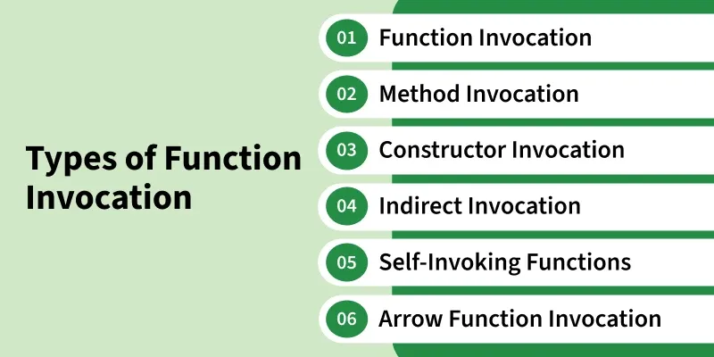

# Function Declaration and Invocation in JavaScript

## Introduction

In JavaScript, functions are blocks of **reusable code** designed to perform a specific task. Two of the most fundamental concepts when working with functions are:

- **Function Declaration** — the process of *defining* a function with a specific name and logic, allowing it to be reused throughout your program.
- **Function Invocation** — the act of *calling* or *executing* a function to carry out its task when needed.

Understanding both concepts is essential to writing efficient and maintainable JavaScript code.

---

## Function Declaration

Function Declaration is how we define a function using the `function` keyword, giving it a name, optional parameters, and a body of code to execute.

### Syntax

```javascript
function functionName(parameters) {
  // code to execute
}
```

- `functionName` — the name used to identify and call the function.
- `parameters` — optional input values the function accepts.
- `{}` — the curly braces contain the code that runs when the function is called.

### Example

```javascript
function greet(name) {
  console.log("Hello, " + name + "!");
}

greet("Alice"); // Output: Hello, Alice!
```

**Breaking it down:**
- `function greet(name)` declares a function named `greet` that accepts one parameter, `name`.
- The code inside the curly braces prints a greeting using that name.
- Calling `greet("Alice")` outputs `Hello, Alice!`.

> **Important — Hoisting:** Function declarations are **hoisted** to the top of their scope. This means you can call a declared function *before* it appears in your code, and it will still work correctly.

```javascript
sayHello(); // Works! Output: Hello!

function sayHello() {
  console.log("Hello!");
}
```

---

## Function Invocation

Function invocation refers to **executing the code defined inside a function**. When a function is invoked, the code inside its block runs, and any return value is computed and passed back to the caller.

### Syntax

```javascript
function functionName(parameters) {
  // code to be executed
}

functionName(arguments); // invocation
```

### Example

```javascript
// Function Declaration
function greet(name) {
  console.log("Hello, " + name + "!");
}

// Function Invocation
greet("Alice"); // Output: Hello, Alice!
greet("Bob");   // Output: Hello, Bob!
```

**Breaking it down:**
- The `greet` function is defined once.
- It is then invoked twice — once with `"Alice"` and once with `"Bob"`.
- Each invocation runs the function independently with its own argument.

---

## Types of Function Invocation

JavaScript provides **six main ways** to invoke a function. Each method can affect the behaviour of `this` (the execution context) differently.



---

### 1. Function Invocation (Direct Call)

The simplest form — calling a function directly by its name.

```javascript
function add(a, b) {
  return a + b;
}

console.log(add(5, 3)); // Output: 8
```

> **Scope note:** In non-strict mode, `this` inside a directly invoked function defaults to the **global object** (`window` in browsers). In strict mode, `this` is `undefined`.

---

### 2. Method Invocation

When a function is a **property of an object** and is called using `object.method()`, it becomes a method invocation.

```javascript
const user = {
  name: "John",
  greet: function () {
    return `Hello, ${this.name}!`;
  },
};

console.log(user.greet()); // Output: Hello, John!
```

> **Key point:** In method invocation, `this` refers to the **object that owns the method** — in this case, `user`.

---

### 3. Constructor Invocation

Functions can be invoked as **constructors** using the `new` keyword. When called this way, JavaScript:
1. Creates a new empty object.
2. Sets `this` to point to that new object.
3. Returns the new object automatically.

```javascript
function Person(name, age) {
  this.name = name;
  this.age = age;
}

const alex = new Person("Alex", 25);
console.log(alex.name); // Output: Alex
```

> **Convention:** Constructor functions are written with a **capital first letter** to distinguish them from regular functions.

---

### 4. Indirect Invocation

Functions can be invoked indirectly using three special methods: `call()`, `apply()`, and `bind()`. These let you explicitly control what `this` refers to.

#### `call()` — Pass arguments individually

Invokes the function immediately with a specified `this` value and individual arguments.

```javascript
function greet(greeting) {
  return `${greeting}, ${this.name}!`;
}

const user = { name: "Max" };
console.log(greet.call(user, "Hello")); // Output: Hello, Max!
```

#### `apply()` — Pass arguments as an array

Works like `call()`, but arguments are passed as an **array**.

```javascript
function greet(greeting) {
  return `${greeting}, ${this.name}!`;
}

const user = { name: "Riya" };
console.log(greet.apply(user, ["Hi"])); // Output: Hi, Riya!
```

#### `bind()` — Create a new function with fixed `this`

Does **not** invoke the function immediately. Instead, it returns a **new function** with `this` permanently set to the provided value.

```javascript
function greet(greeting) {
  return `${greeting}, ${this.name}!`;
}

const user = { name: "Sam" };
const boundGreet = greet.bind(user);
console.log(boundGreet("Hey")); // Output: Hey, Sam!
```

| Method    | Calls Immediately | Arguments Format    | Returns          |
|-----------|-------------------|---------------------|------------------|
| `call()`  | ✅ Yes             | Individual values   | Function result  |
| `apply()` | ✅ Yes             | Array               | Function result  |
| `bind()`  | ❌ No              | Individual values   | New function     |

---

### 5. Self-Invoking Functions (IIFE)

An **Immediately Invoked Function Expression (IIFE)** runs automatically as soon as it is defined. It does not need to be called separately.

```javascript
(function () {
  console.log("This is a self-invoking function!");
})();
// Output: This is a self-invoking function!
```

**Why use IIFEs?**
- To **encapsulate code** and avoid polluting the global scope.
- To run setup logic only once.
- To create a private scope for variables.

```javascript
// Variables inside an IIFE are private
(function () {
  let secret = "hidden";
  console.log(secret); // Output: hidden
})();

// console.log(secret); // ❌ Error: secret is not defined
```

---

### 6. Arrow Function Invocation

Arrow functions are invoked like regular functions but have a key difference in how they handle `this` — they do **not** bind their own `this`. Instead, they inherit `this` from their surrounding (lexical) scope.

```javascript
const user = {
  name: "Alexa",
  greet: () => {
    return `Hello, ${this.name}!`; // `this` is NOT bound to `user`
  },
};

console.log(user.greet()); // Output: Hello, undefined!
```

> **Why `undefined`?** Arrow functions capture `this` from the enclosing scope at the time they are defined — not from the object they belong to. In a browser's global scope, `this.name` is `undefined`.

**Contrast with a regular method:**

```javascript
const user = {
  name: "Alexa",
  greet: function () {
    return `Hello, ${this.name}!`; // `this` IS bound to `user`
  },
};

console.log(user.greet()); // Output: Hello, Alexa!
```

---

## Summary Table

| Invocation Type      | How It's Called                        | `this` Refers To                         |
|----------------------|----------------------------------------|------------------------------------------|
| Function Invocation  | `functionName()`                       | Global object (or `undefined` in strict) |
| Method Invocation    | `object.method()`                      | The owning object                        |
| Constructor          | `new FunctionName()`                   | The newly created object                 |
| `call()`             | `fn.call(thisArg, arg1, arg2)`         | Explicitly set value                     |
| `apply()`            | `fn.apply(thisArg, [arg1, arg2])`      | Explicitly set value                     |
| `bind()`             | `fn.bind(thisArg)` → returns new fn    | Permanently bound value                  |
| IIFE                 | `(function(){ ... })()`               | Global object (or `undefined` in strict) |
| Arrow Function       | `const fn = () => {}; fn()`           | Inherited from lexical scope             |

---

## Key Takeaways

- **Function declarations are hoisted** — you can call them before they appear in your code.
- **`this` behaves differently** depending on how a function is invoked — always be mindful of your invocation type.
- Use **method invocation** when working with object-oriented patterns.
- Use **constructor invocation** with `new` to create object instances.
- Use **`call()` / `apply()`** when you need to borrow a method or set `this` on the fly.
- Use **`bind()`** when you need to pass a function around with a fixed `this`.
- Use **IIFEs** to create isolated scopes and avoid global scope pollution.
- Be careful with **arrow functions in objects** — they do not bind their own `this`.

---