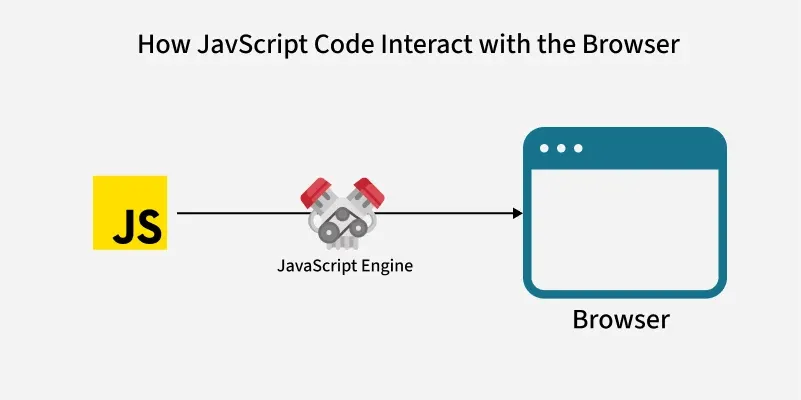
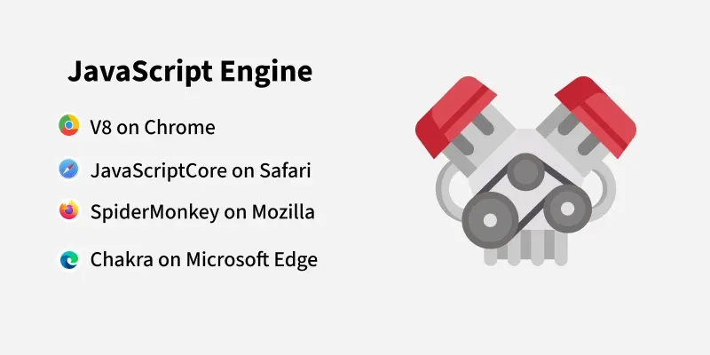
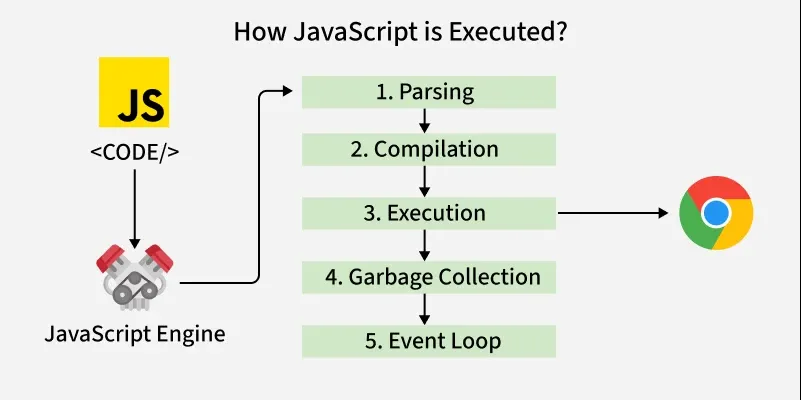
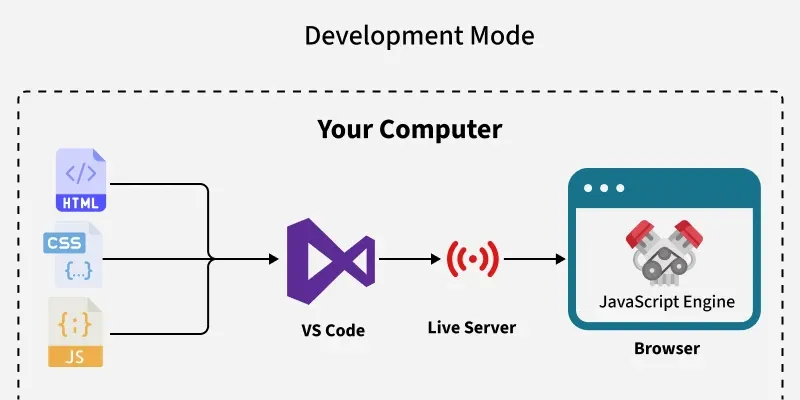
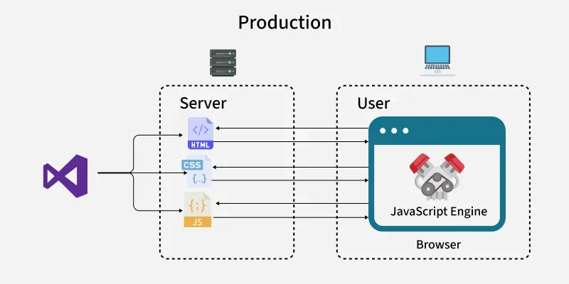
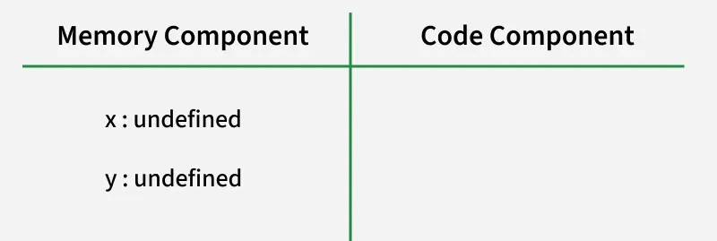
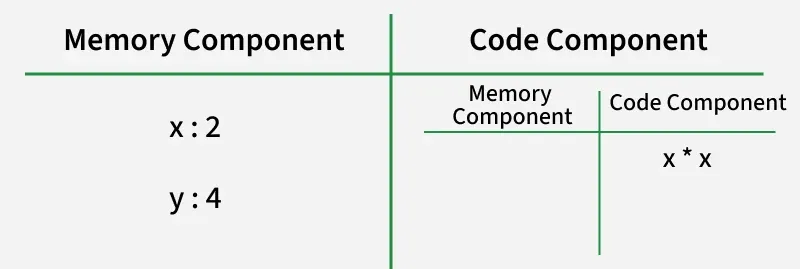
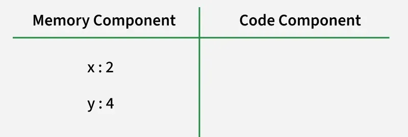

# JavaScript Code Execution

> JavaScript was initially designed to run within a web browser that has a JavaScript engine — a program that reads and executes JavaScript code.

---

## The JavaScript Engine

Browsers cannot directly understand JavaScript code. Instead, each major browser ships with its own built-in JavaScript engine to handle the job:

| Browser | JavaScript Engine |
|---|---|
| Google Chrome | V8 |
| Mozilla Firefox | SpiderMonkey |
| Safari | JavaScriptCore (Nitro) |
| Microsoft Edge | V8 (Chromium-based) |

> **Note:** All engines serve the same purpose — reading, compiling, and running JavaScript code so the browser can understand it.






---

## Key Stages of Execution

The JavaScript engine processes code through several distinct stages:

### 1 — Parsing (~15% of the lifecycle)

The engine reads and interprets the raw JavaScript source code. It checks the syntax, builds a token list, and constructs an **Abstract Syntax Tree (AST)** — a structured representation of the code.

### 2 — Compilation (~25% of the lifecycle)

The AST is converted into **machine-readable instructions** (bytecode or native machine code). Modern engines use **Just-In-Time (JIT) compilation**, which compiles code right before it runs for better performance.

### 3 — Execution (~50% of the lifecycle)

The compiled code is actually **run** — this is the core of the process. The engine executes instructions line by line, producing the desired output and actions in the browser or environment.

### 4 — Garbage Collection + Event Loop (~10% of the lifecycle)

The engine handles two important background tasks:
- **Garbage Collection** — automatically frees memory that is no longer in use
- **Event Loop** — manages asynchronous operations (like `setTimeout`, `fetch`, and event listeners), allowing JavaScript to handle non-blocking tasks despite being single-threaded

---

## JavaScript in Development Mode

When building an application, **Development Mode** refers to working on your local machine before deployment.



- You write HTML, CSS, and JavaScript in an editor like **VS Code**
- A **Live Server** extension (or manual refresh) serves files from a local server
- The browser fetches these files and its JavaScript engine executes the JS code
- Your webpage becomes interactive and dynamic on your local computer

---

## JavaScript in Production Mode

In **Production Mode**, optimized files are deployed to a remote web server and served to real users.



- Files are typically **minified and optimized** before deployment
- The user's browser — not your machine — runs the JavaScript engine
- The engine efficiently executes your code, delivering a smooth user experience

### Development vs. Production Comparison

| Aspect | Development Mode | Production Mode |
|---|---|---|
| Where code runs | Your local machine | User's browser (remote) |
| Server | Local (Live Server, etc.) | Remote web server |
| Files | Raw, unoptimized | Minified, optimized |
| Purpose | Building and testing | Serving real users |

---

## Execution Context

> Everything in JavaScript is wrapped inside an **Execution Context** — an abstract container that holds all the information about the environment in which the current JavaScript code is being executed.

Think of it as a box that contains two components:

```
┌─────────────────────────────────────────┐
│           EXECUTION CONTEXT             │
│                                         │
│  ┌─────────────────┐  ┌──────────────┐  │
│  │  Memory         │  │    Code      │  │
│  │  Component      │  │  Component   │  │
│  │  (Variable Env.)│  │  (Thread of  │  │
│  │                 │  │  Execution)  │  │
│  │  key: value     │  │              │  │
│  │  x:   undefined │  │  line 1...   │  │
│  │  y:   undefined │  │  line 2...   │  │
│  └─────────────────┘  └──────────────┘  │
└─────────────────────────────────────────┘
```

When a JavaScript program runs, a **Global Execution Context (GEC)** is created first. Every function call creates its own new execution context on top of that.

---

## Phases of the Execution Context

The Execution Context operates in two phases:

### Phase 1 — Memory Allocation Phase

All variables and functions in the code are scanned and stored as **key-value pairs** in the memory component **before** any code runs.

- **Functions** → the entire function body is copied into memory
- **Variables (`var`)** → assigned `undefined` as a placeholder
- **Variables (`let` / `const`)** → hoisted but placed in the **Temporal Dead Zone (TDZ)** — they exist in memory but cannot be accessed until their declaration line is reached



### Phase 2 — Code Execution Phase

JavaScript executes the code **one line at a time** inside the Code Component (Thread of Execution). Variable values are updated in memory as each line runs.

> **JavaScript is single-threaded** — it can only do one thing at a time, processing each line sequentially.


---

## Execution Context — Worked Example

```js
let x = 2;
let y = x * x;
console.log(y);
```



### Step 1 — Global Execution Context is Created

As soon as the program runs, the JavaScript engine creates the Global Execution Context.

### Step 2 — Memory Allocation Phase

The engine scans all variables **before running any code**. Since `let` is used, `x` and `y` are hoisted into the **Temporal Dead Zone (TDZ)**:

```
Memory Component
┌──────────────────────┐
│  x  →  <TDZ>         │
│  y  →  <TDZ>         │
└──────────────────────┘
```

> Variables in the TDZ cannot be read or written until JavaScript reaches their declaration line.

### Step 3 — Code Execution Phase

JavaScript now runs the code line by line:

**Line 1: `let x = 2;`**

```
x exits the TDZ and is assigned the value 2

Memory Component
┌──────────────────────┐
│  x  →  2             │
│  y  →  <TDZ>         │
└──────────────────────┘
```

**Line 2: `let y = x * x;`**

```
JavaScript looks up x from memory → finds 2
Calculates 2 * 2 = 4
y exits the TDZ and is assigned 4

Memory Component
┌──────────────────────┐
│  x  →  2             │
│  y  →  4             │
└──────────────────────┘
```

**Line 3: `console.log(y);`**

```
JavaScript looks up y from memory → finds 4
Outputs: 4
```

### Step 4 — Final Memory State

| Variable | Value |
|---|---|
| `x` | `2` |
| `y` | `4` |

**Output:**
```
4
```

---

## Summary

```
JavaScript Source Code
        ↓
  [ JavaScript Engine ]
        ↓
  1. Parsing         → Builds AST from source code           (~15%)
  2. Compilation     → Converts AST to machine instructions  (~25%)
  3. Execution       → Runs the compiled code                (~50%)
  4. GC + Event Loop → Memory management & async ops         (~10%)
        ↓
  [ Execution Context Created ]
        ↓
  Phase 1: Memory Allocation  → Variables/functions stored
  Phase 2: Code Execution     → Code runs line by line
        ↓
  [ Output / Side Effects ]
```

### Key Terms

| Term | Definition |
|---|---|
| **JavaScript Engine** | A program that reads and executes JavaScript code |
| **Parsing** | Reading raw JS code and building an AST |
| **JIT Compilation** | Compiling code just before it runs for performance |
| **Execution Context** | A container holding the environment for running JS code |
| **Global Execution Context** | The default context created when a script first runs |
| **Memory Allocation Phase** | Phase where all variables/functions are stored before execution |
| **Code Execution Phase** | Phase where code runs line by line |
| **Thread of Execution** | The single thread JavaScript uses to run code sequentially |
| **Temporal Dead Zone (TDZ)** | The period where `let`/`const` variables are hoisted but not yet accessible |
| **Garbage Collection** | Automatic memory management — frees unused memory |
| **Event Loop** | Mechanism that handles asynchronous operations in JS |

---
