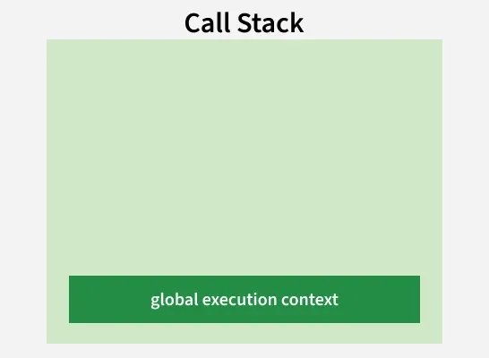
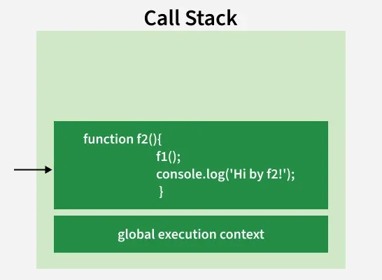
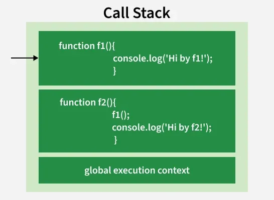
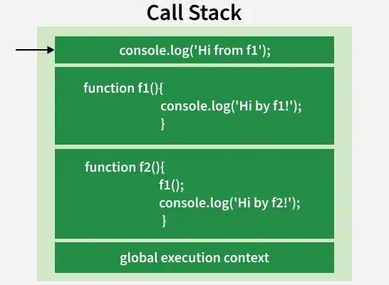

# Call Stack in JavaScript

In JavaScript, the **Call Stack** is a core mechanism used by the engine to manage and track function execution.

- It keeps track of function calls in the order they are executed.
- It helps determine which function is currently running and what runs next.

---

## How the Call Stack Works

JavaScript operates in a **single-threaded** environment, meaning it can only execute one operation at a time. The Call Stack is the part of JavaScript that keeps track of the execution process.

1. **Function Call** — When a function is invoked, it is pushed onto the Call Stack and stays there until execution completes.
2. **Function Execution** — The JavaScript engine executes the function's code until it ends or calls another function.
3. **Nested Calls** — If a function calls another function, the new function is pushed onto the stack while the previous one waits.
4. **Function Return** — After execution finishes, the function is popped from the stack and control returns to the previous function.
5. **Program Completion** — This continues until the stack is empty, indicating the program has finished executing.

---

## Example: Step-by-Step Execution

```js
function f1() {
  console.log('Hi by f1!');
}

function f2() {
  f1();
  console.log('Hi by f2!');
}

f2();
```

### Step-by-Step Breakdown

**Step 1 — Global execution context**

When the code loads in memory, the global execution context gets pushed onto the stack.



**Step 2 — f2() is called**

`f2()` is invoked. Its execution context is pushed onto the stack on top of the global context.



**Step 3 — f1() is called inside f2()**

While executing `f2()`, it calls `f1()`. `f1()`'s execution context is pushed. `f2()` pauses and waits.



**Step 4 — console.log() inside f1()**

`f1()` calls `console.log()`. A new frame is pushed. It prints `"Hi by f1!"` then immediately pops.



**Step 5 — f1() completes and pops**

`console.log()` finishes and pops. Then `f1()` finishes and pops. Control returns to `f2()`.

```
[ f2()   ]
[ Global ]
```

**Step 6 — f2() completes, stack empties**

`f2()` runs its own `console.log()`, prints `"Hi by f2!"`, then `f2()` pops. The stack returns to just the global context, then becomes empty.

```
[ Global ]  →  (empty)
```

### Output

```
Hi by f1!
Hi by f2!
```

---

## Stack Overflow

A **stack overflow** occurs when the call stack runs out of memory due to too many nested function calls. It is commonly caused by infinite or uncontrolled recursion.

### Example: Mutual Infinite Recursion

```js
function funcA() {
  funcB();
}

function funcB() {
  funcA();
}

funcA(); // → Uncaught RangeError: Maximum call stack size exceeded
```

**What happens:**

- `funcA` calls `funcB`, which pushes `funcA` onto the stack again.
- `funcB` calls `funcA`, which pushes `funcB` again.
- This cycle continues indefinitely, eventually exceeding the available stack space.

### Example: Missing Base Case in Recursion

```js
function countDown(n) {
  return countDown(n - 1); // no base case — infinite recursion
}

countDown(5); // → RangeError: Maximum call stack size exceeded
```

**Fix — always include a base case:**

```js
function countDown(n) {
  if (n <= 0) return; // base case stops recursion
  console.log(n);
  countDown(n - 1);
}

countDown(5);
// Output: 5, 4, 3, 2, 1
```

---

## Key Rules of the Call Stack

| Rule | Description |
|---|---|
| **LIFO order** | Last In, First Out — the last function pushed is always the first to be popped |
| **Single stack** | JavaScript has one call stack; only one thing runs at a time |
| **Every call = one frame** | Even built-ins like `console.log()` get their own stack frame |
| **Synchronous only** | The call stack handles synchronous code; async operations use the event loop |

---

## Why the Call Stack Matters

| Purpose | How the Call Stack Helps |
|---|---|
| **Tracks execution** | Knows which function is currently running |
| **Handles nesting** | Pauses an outer function while an inner one runs |
| **Manages recursion** | Each recursive call gets its own isolated frame |
| **Ensures correct return** | Pops back to exactly where execution left off |
| **Controls flow** | Guarantees ordered, predictable execution across multiple functions |

---

## Call Stack vs Event Loop (Quick Note)

The call stack only handles **synchronous** code. When async operations like `setTimeout`, Promises, or `fetch` are used, they are handled by the **event loop** and **callback queue** — they wait until the call stack is empty before executing.

```js
console.log('Start');           // 1. pushed, executed, popped

setTimeout(() => {
  console.log('Timeout');       // 3. runs after stack is clear
}, 0);

console.log('End');             // 2. pushed, executed, popped

// Output:
// Start
// End
// Timeout
```

---

## Summary

The **Call Stack** is JavaScript's bookkeeping system for function execution. It:

- Uses **LIFO** (Last In, First Out) ordering.
- Pushes a new frame every time a function is called.
- Pops a frame when a function returns.
- Throws a **RangeError** if it overflows (too many nested calls).
- Works hand-in-hand with the **event loop** for async behaviour.

Understanding the call stack is fundamental to debugging JavaScript — it is exactly what you see listed in a stack trace when an error occurs.

---