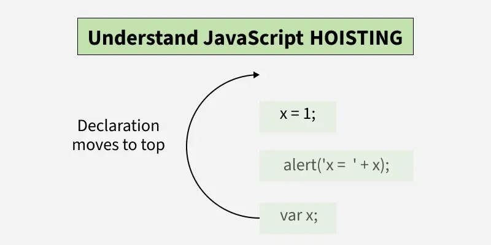
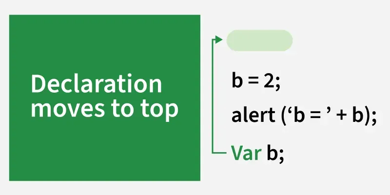

# JavaScript Hoisting

**Hoisting** refers to the behaviour where JavaScript moves the declarations of variables, functions, and classes to the top of their scope during the **compilation phase**. This can sometimes lead to surprising results, especially when using `var`, `let`, `const`, or function expressions.



---

## Key Rules of Hoisting

- Hoisting applies to variable and function **declarations**.
- **Initialisations are not hoisted** — only declarations are.
- `var` variables are hoisted and initialised with `undefined`.
- `let` and `const` are hoisted but remain in the **Temporal Dead Zone (TDZ)** until their declaration line is reached.

---

## Temporal Dead Zone (TDZ)

The **Temporal Dead Zone** is the period between entering a scope and the actual initialisation of a variable declared with `let` or `const`. During this window, any reference to the variable will throw a `ReferenceError`.

**How TDZ works:**

- Variables declared with `let` and `const` are hoisted to the top of their scope, but are **not initialised** until their declaration line is reached.
- Any attempt to access these variables before their declaration results in a `ReferenceError`.
- `var` does **not** have a TDZ — it is hoisted and initialised to `undefined` immediately.

```js
hello(); // TypeError: hello is not a function
var hello = function() {
  console.log("Hi!");
};
```

> `hello` is hoisted as a variable but not initialised until the assignment line is reached. Calling it before that point throws a `TypeError`.

---

## 1. Variable Hoisting with `var`

When you declare a variable with `var`, the declaration is hoisted to the top of its scope, but the **value is not assigned** until that line is actually executed. During the hoisting phase, the variable is initialised to `undefined`.

```js
console.log(a); // undefined
var a = 5;
```


**What JavaScript sees internally:**

```js
var a;           // declaration hoisted, initialised to undefined
console.log(a);  // undefined
a = 5;           // assignment stays in place
```

> `var` hoisting lifts declarations, not initialisations.

**With `var` in a block:**

```js
var b;       // hoisted to top
b = 2;       // assignment runs at original position
alert(b);    // b = 2
```

---

## 2. Variable Hoisting with `let` and `const`

Unlike `var`, `let` and `const` are also hoisted, but they remain in the **Temporal Dead Zone** from the start of the block until their declaration is encountered. Accessing them before their declaration throws a `ReferenceError`.

```js
console.log(b); // ReferenceError: Cannot access 'b' before initialization
let b = 10;
```

> The variable is hoisted, but it remains in the TDZ until the declaration line is executed.

The same applies to `const`:

```js
console.log(c); // ReferenceError: Cannot access 'c' before initialization
const c = 100;
```

---

## 3. Function Declaration Hoisting

Function **declarations** are hoisted with both their name and the entire function body. This means a function can be called **before** its definition in the code.

```js
greet(); // "Hello, Mahima!"

function greet() {
  console.log("Hello, Mahima!");
}
```

**What JavaScript sees internally:**

```js
// Entire function hoisted to the top
function greet() {
  console.log("Hello, Mahima!");
}

greet(); // Works perfectly
```

> The entire function definition is available before its position in the code.

---

## 4. Function Expression Hoisting

Function **expressions** are treated like variable declarations. The variable itself is hoisted, but the function expression is **not assigned** until that line is executed. Calling it before the assignment results in an error.

```js
hello(); // TypeError: hello is not a function

var hello = function() {
  console.log("Hi!");
};
```

**What JavaScript sees internally:**

```js
var hello;       // hoisted as undefined
hello();         // TypeError — hello is undefined, not a function
hello = function() {
  console.log("Hi!");
};
```

> The variable `hello` is hoisted, but since it holds a function expression, it is `undefined` at the time of calling.

---

## 5. Hoisting with `let` and `const` in Functions

Variables declared with `let` and `const` inside a function are hoisted to the top of the **function's scope**, but they remain in the TDZ. This prevents access to them before they are initialised.

```js
function test() {
  console.log(x); // ReferenceError: Cannot access 'x' before initialization
  let x = 50;
}

test();
```

> `x` is hoisted inside the function but cannot be accessed until its declaration line due to the TDZ.

---

## 6. Hoisting with Classes

Classes are hoisted, but like `let` and `const`, they **cannot be accessed** before they are declared. Attempting to do so results in a `ReferenceError`.

```js
const obj = new MyClass(); // ReferenceError

class MyClass {
  constructor() {
    this.name = "Mahima Bhardwaj";
  }
}
```

> Although `MyClass` is hoisted, it remains in the TDZ until its declaration is reached.

**Correct usage — declare the class before using it:**

```js
class MyClass {
  constructor() {
    this.name = "Mahima Bhardwaj";
  }
}

const obj = new MyClass(); // Works fine
console.log(obj.name);     // "Mahima Bhardwaj"
```

---

## 7. Re-declaring Variables with `var`

With `var`, you can re-declare a variable within the same scope without any error. This is a unique behaviour compared to `let` and `const`, which do not allow re-declaration.

```js
var a = 10;
var a = 20; // No error — second declaration overwrites the first
console.log(a); // 20
```

Attempting the same with `let` or `const` throws an error:

```js
let b = 10;
let b = 20; // SyntaxError: Identifier 'b' has already been declared
```

---

## 8. Hoisting in Loops with `var` vs `let`

When using `var` in loops, the loop variable is hoisted to the **function or global scope**, which can cause unexpected behaviour. Using `let` keeps the variable **block-scoped** and behaves as expected.

**With `var` — unexpected output:**

```js
for (var i = 0; i < 3; i++) {
  setTimeout(function() {
    console.log(i); // 3, 3, 3
  }, 100);
}
```

> `var i` is hoisted and shared across all `setTimeout` callbacks. By the time they run, the loop has finished and `i` is `3`.

**With `let` — correct output:**

```js
for (let i = 0; i < 3; i++) {
  setTimeout(function() {
    console.log(i); // 0, 1, 2
  }, 100);
}
```

> `let` creates a new binding for `i` in each iteration, so each callback captures its own value.

---

## 9. Using Hoisted Functions with Parameters

Functions are hoisted with their full definition, including parameters. The parameters themselves are determined at the point of **invocation**, not during hoisting.

```js
test(10); // 10

function test(num) {
  console.log(num);
}
```

> The entire function, including its parameter list, is hoisted and available before its declaration in the code.

---

## 10. Hoisting in Nested Functions

Hoisting works within **nested functions** too. Variables declared with `var` inside a function are hoisted to the top of that function's scope, not the global scope.

```js
function outer() {
  console.log(a); // undefined
  var a = 5;

  function inner() {
    console.log(b); // undefined
    var b = 10;
  }

  inner();
}

outer();
```

> Both `a` and `b` are hoisted within their respective scopes (`outer` and `inner`), but their values are not set until the code execution reaches the initialisation lines.

---

## Comparison Summary

| Feature | `var` | `let` / `const` | Function Declaration | Function Expression |
|---|---|---|---|---|
| Hoisted? | Yes | Yes | Yes | Yes (as `var`) |
| Initialised on hoist? | `undefined` | No (TDZ) | Full definition | `undefined` |
| Accessible before declaration? | Yes (`undefined`) | No (`ReferenceError`) | Yes | No (`TypeError`) |
| Re-declarable in same scope? | Yes | No | No | No |
| Block-scoped? | No | Yes | No | Depends on variable |

---

## Best Practices

- **Prefer `let` and `const`** over `var` to avoid confusing hoisting behaviour.
- **Always declare variables at the top** of their scope to make hoisting explicit and readable.
- **Declare classes before using them** — never rely on hoisting for class instantiation.
- **Use function declarations** when you need to call a function before its definition; use **function expressions** when you want to prevent that.
- **Use `let` in loops** instead of `var` to avoid shared reference issues with closures and async callbacks.

---

## Summary

JavaScript hoisting is an automatic process during the compilation phase where declarations are moved to the top of their scope. Understanding it prevents subtle bugs — particularly around `undefined` values, `ReferenceError` exceptions from the TDZ, and unexpected loop behaviour. The safest approach is to always declare before you use.

---