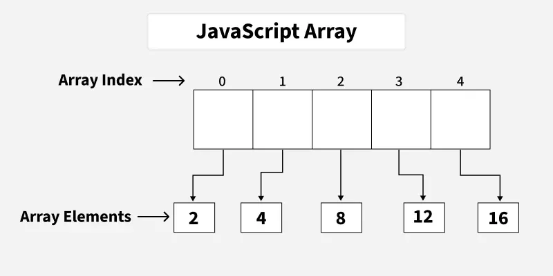

# JavaScript Arrays

## Introduction



In JavaScript, an array is an ordered list of values. Each value, known as an element, is assigned a numeric position in the array called its index. The indexing starts at 0, so the first element is at position 0, the second at position 1, and so on.

Arrays can hold any type of data—such as numbers, strings, objects, or even other arrays—making them a flexible and essential part of JavaScript programming.

### Why Use Arrays?

If you have a list of items (a list of car names, for example), storing the cars in single variables could look like this:

```javascript
let car1 = "Saab";
let car2 = "Volvo";
let car3 = "BMW";
```

However, what if you want to loop through the cars and find a specific one? And what if you had not 3 cars, but 300?

The solution is an array! An array can hold many values under a single name, and you can access the values by referring to an index number.

## Creating Arrays

### 1. Create Array Using Literal

Creating an array using array literal involves using square brackets `[]` to define and initialize the array.

```javascript
// Creating an Empty Array
let a = [];
console.log(a); // Output: []

// Creating an Array and Initializing with Values
let b = [10, 20, 30];
console.log(b); // Output: [ 10, 20, 30 ]
```

### 2. Create Using new Keyword (Constructor)

The "Array Constructor" refers to a method of creating arrays by invoking the Array constructor function.

```javascript
// Creating and Initializing an array with values
let a = new Array(10, 20, 30);
console.log(a); // Output: [ 10, 20, 30 ]
```

**Note:** Both the above methods do exactly the same. Use the array literal method for efficiency, readability, and speed.

### Common Error with Array Creation

```javascript
const a = [5]     // Creates an array with one element: [5]
const b = new Array(5)  // Creates an array with 5 empty slots: [ <5 empty items> ]
```

The above two statements are not the same!

## Basic Operations on JavaScript Arrays

### 1. Accessing Elements of an Array

Any element in the array can be accessed using the index number. The index in the arrays starts with 0.

```javascript
// Creating an Array and Initializing with Values
let a = ["HTML", "CSS", "JS"];

// Accessing Array Elements
console.log(a[0]); // Output: HTML
console.log(a[1]); // Output: CSS
```

### 2. Accessing the First Element of an Array

The array indexing starts from 0, so we can access the first element of array using the index number.

```javascript
let a = ["HTML", "CSS", "JS"];
let fst = a[0];
console.log("First Item: ", fst); // Output: First Item:  HTML
```

### 3. Accessing the Last Element of an Array

We can access the last array element using `[array.length - 1]` index number.

```javascript
let a = ["HTML", "CSS", "JS"];
let lst = a[a.length - 1];
console.log("Last Item: ", lst); // Output: Last Item:  JS
```

### 4. Modifying the Array Elements

Elements in an array can be modified by assigning a new value to their corresponding index.

```javascript
let a = ["HTML", "CSS", "JS"];
console.log(a); // Output: [ 'HTML', 'CSS', 'JS' ]

a[1] = "Bootstrap";
console.log(a); // Output: [ 'HTML', 'Bootstrap', 'JS' ]
```

### 5. Adding Elements to the Array

Elements can be added to the array using methods like `push()` and `unshift()`.

- The `push()` method adds the element to the end of the array
- The `unshift()` method adds the element to the beginning of the array

```javascript
let a = ["HTML", "CSS", "JS"];

// Add Element to the end of Array
a.push("Node.js");

// Add Element to the beginning
a.unshift("Web Development");

console.log(a); // Output: [ 'Web Development', 'HTML', 'CSS', 'JS', 'Node.js' ]
```

### 6. Removing Elements from an Array

To remove elements from an array we have different methods like `pop()`, `shift()`, or `splice()`.

- The `pop()` method removes an element from the last index of the array
- The `shift()` method removes the element from the first index of the array
- The `splice()` method removes or replaces elements from the array

```javascript
let a = ["HTML", "CSS", "JS"];
console.log("Original Array: " + a); // Output: Original Array: HTML,CSS,JS

// Removes and returns the last element
let lst = a.pop();
console.log("After Removing the last: " + a); // Output: After Removing the last: HTML,CSS

// Removes and returns the first element
let fst = a.shift();
console.log("After Removing the First: " + a); // Output: After Removing the First: CSS

// Removes 2 elements starting from index 1
a.splice(1, 2);
console.log("After Removing 2 elements starting from index 1: " + a); // Output: After Removing 2 elements starting from index 1: CSS
```

### 7. Array Length

We can get the length of the array using the array length property.

```javascript
let a = ["HTML", "CSS", "JS"];
let len = a.length;
console.log("Array Length: " + len); // Output: Array Length: 3
```

### 8. Increase and Decrease the Array Length

We can increase and decrease the array length using the JavaScript length property.

```javascript
let a = ["HTML", "CSS", "JS"]

// Increase the array length to 7
a.length = 7;
console.log("After Increasing Length: ", a); // Output: After Increasing Length:  [ 'HTML', 'CSS', 'JS', <4 empty items> ]

// Decrease the array length to 2
a.length = 2;
console.log("After Decreasing Length: ", a) // Output: After Decreasing Length:  [ 'HTML', 'CSS' ]
```

### 9. Iterating Through Array Elements

We can iterate arrays and access array elements using `for` loop and `forEach` loop.

#### Using for loop:

```javascript
let a = ["HTML", "CSS", "JS"];

// Iterating through for loop
for (let i = 0; i < a.length; i++) {
    console.log(a[i]);
}
// Output:
// HTML
// CSS
// JS
```

#### Using forEach loop:

```javascript
let a = ["HTML", "CSS", "JS"];

// Iterating through forEach loop
a.forEach(function myfunc(x) {
    console.log(x);
});
// Output:
// HTML
// CSS
// JS
```

### 10. Array Concatenation

Combine two or more arrays using the `concat()` method. It returns a new array containing joined arrays' elements.

```javascript
let a = ["HTML", "CSS", "JS", "React"];
let b = ["Node.js", "Express.js"];

// Concatenate both arrays
let concateArray = a.concat(b);
console.log("Concatenated Array: ", concateArray);
// Output: Concatenated Array:  [ 'HTML', 'CSS', 'JS', 'React', 'Node.js', 'Express.js' ]
```

### 11. Conversion of an Array to String

We have a built-in method `toString()` to convert an array to a string.

```javascript
let a = ["HTML", "CSS", "JS"];
console.log(a.toString()); // Output: HTML,CSS,JS
```

### 12. Check the Type of an Array

The JavaScript `typeof` operator is used to check the type of an array. It returns "object" for arrays.

```javascript
let a = ["HTML", "CSS", "JS"];
console.log(typeof a); // Output: object
```

## Recognizing a JavaScript Array

There are two methods by which we can recognize a JavaScript array:

1. By using `Array.isArray()` method
2. By using `instanceof` method

```javascript
const courses = ["HTML", "CSS", "Javascript"];
console.log("Using Array.isArray() method: ", Array.isArray(courses)); // Output: Using Array.isArray() method:  true
console.log("Using instanceof method: ", courses instanceof Array); // Output: Using instanceof method:  true
```

## Common Array Problems and Solutions

### Easy Problems
- Largest Element in an Array in Javascript
- Second Largest Element in Array
- Check if array is sorted in Javascript
- Reverse an Array in Javascript
- Move all zeros to end in Javascript
- Left Rotate by One in an Array in JavaScript
- Leaders in an Array in JS
- Frequencies in a Sorted array in JS

### Medium Problems
- Sort an array of 1 to n
- Reorder according to given indexes
- Minimum Swaps to Sort
- Sort an array of 0s, 1s and 2s
- Merge with O(1) extra space
- Majority Element

### Hard Problems
- 4 Sum - Distinct Quadruples
- 4 Sum - All Quadruples
- 4 Sum - Closest Quadruple
- Surpasser Count
- Top K Frequent Elements in an Array
- Kth Missing Positive Number in a Sorted Array

### Basic Array Operations
- Print Alternates
- Linear Search
- Largest Element
- Second Largest
- Remove Duplicates from Sorted
- Generate all Subarrays
- Reverse an Array
- Rotate an Array

## Summary

JavaScript arrays are powerful data structures that provide:

- **Flexible Storage**: Can hold any type of data including mixed types
- **Dynamic Sizing**: Arrays can grow and shrink dynamically
- **Rich Methods**: Built-in methods for manipulation, iteration, and transformation
- **Zero-Based Indexing**: Elements are accessed starting from index 0
- **Ordered Collection**: Maintains the order of elements as they are added

Understanding arrays is fundamental to JavaScript programming as they are used extensively in various applications from simple data storage to complex algorithm implementations.