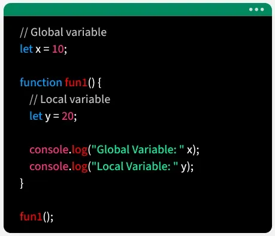
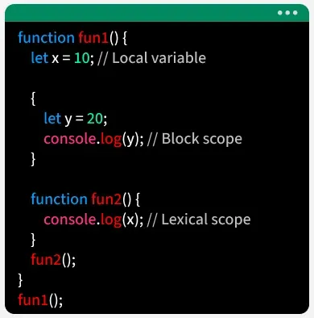

# Scope of Variables in JavaScript

## Overview

Scope in JavaScript defines where a variable can be accessed or used within a program. It controls the visibility and lifetime of variables across different parts of the code.

### Key Characteristics

- **Determines the accessibility of variables** in different parts of the program
- **Helps prevent conflicts** by restricting variable usage to specific areas
- **Improves code organization** and readability
- **Defines the lifetime of variables** during program execution
- **Main types include** global scope, local (function) scope, and block scope

## Basic Example

```javascript
// Declaring a global variable
let x = 10;

function func() {
    // Declaring a local variable
    let y = 20;

    // Accessing Local and Global variables
    console.log(x, ",", y); // Output: 10 , 20
}

func();
```

**Explanation:**
- `x` is a global variable accessible everywhere
- `y` is a local variable accessible only inside `func()`
- Inside the function, both global and local variables can be accessed

## Types of Scope

### 1. Global and Local Scope



#### Global Scope

A global variable refers to a variable that is declared outside any function or block, so it can be used anywhere in the program, both inside functions and in the main code.

```javascript
// Global Variable accessed from within a function
const x = 10;

function fun1() {
    console.log(x); // Output: 10
}

fun1();
```

**Explanation:**
- The variable `x` is declared in the global scope
- It can be accessed inside functions
- Global scope behavior may vary depending on the execution environment (e.g., browser vs module)

**Note:** In browser environments, global variables become properties of the `window` object. In Node.js, they become properties of the `global` object.

#### Local Scope

A local variable is a variable declared inside a function, making it accessible only within that function. It cannot be used outside the function.

```javascript
function fun2() {
    // This variable is local to fun2() and 
    // cannot be accessed outside this function
    let x = 10;
    console.log(x); // Output: 10
}

fun2();

// This would cause an error:
// console.log(x); // ReferenceError: x is not defined
```

**Explanation:**
- `x` is declared inside `fun2()` and is local to that function
- It's accessible only inside the function
- Attempting to access it outside the function results in a `ReferenceError`

**Important Note:** Functions are objects and can be assigned to variables.

#### Historical Context: var vs let/const

Before ES6 (Released in 2015), variables were declared only with `var`, which is:
- **Function-scoped** (accessible within the function)
- **Globally scoped** (accessible everywhere when declared outside functions)
- **Prone to issues** like hoisting and global pollution

`let` and `const` were introduced with ES6:
- Variables declared with `let` and `const` are either **block-scoped** or **global-scoped**
- They provide better control over variable scope
- They help prevent common bugs related to variable hoisting

### 2. Block and Lexical Scope



#### Block Scope

Block scope in JavaScript means variables declared with `let` or `const` inside `{ }` are accessible only within that block. Accessing them before declaration (TDZ - Temporal Dead Zone) causes a `ReferenceError`.

Variables declared with `var` do not have block scope. A `var` variable declared inside a function is accessible throughout that entire function, regardless of any blocks (like if statements or for loops) within the function. If `var` is declared outside of any function, it creates a global variable.

```javascript
{
    // Var is accessible inside & outside the block scope
    var x = 10;
    
    // let, const are accessible only inside the block scope
    const y = 20;
    let z = 30;
    
    console.log(x); // Output: 10
    console.log(y); // Output: 20
    console.log(z); // Output: 30
}

console.log(x);  // Output: 10 (accessible outside block)

// These would cause errors:
// console.log(y); // ReferenceError: y is not defined
// console.log(z); // ReferenceError: z is not defined
```

**Explanation:**
- `var x` is accessible both inside and outside the block because `var` does not have block scope
- `const y` and `let z` are only accessible inside the block where they were declared
- Attempting to access `y` or `z` outside the block results in a `ReferenceError`

**Block Scope Examples:**

```javascript
// Block scope with if statement
if (true) {
    let blockVar = "I'm block-scoped";
    var functionVar = "I'm function-scoped";
    console.log(blockVar);    // Output: "I'm block-scoped"
    console.log(functionVar); // Output: "I'm function-scoped"
}

console.log(functionVar); // Output: "I'm function-scoped"
// console.log(blockVar); // ReferenceError: blockVar is not defined

// Block scope with for loop
for (let i = 0; i < 3; i++) {
    console.log(i); // Output: 0, 1, 2
}
// console.log(i); // ReferenceError: i is not defined
```

#### Lexical Scope

Lexical scope (also called static scope) means that a variable declared inside a function can only be accessed inside that block or nested blocks. Inner functions have access to variables defined in their outer functions.

```javascript
function func1() {
    const x = 10;

    function func2() {
        const y = 20;
        console.log(`${x} ${y}`); // Output: "10 20"
    }

    func2();
}

func1();
```

**Explanation:**
- `func2` is nested inside `func1`
- `func2` can access variable `x` from its parent function `func1` (lexical scope)
- `func2` also has access to its own local variable `y`
- This demonstrates how inner functions can access variables from outer functions

**Lexical Scope Chain:**

```javascript
const globalVar = "Global";

function outer() {
    const outerVar = "Outer";
    
    function inner() {
        const innerVar = "Inner";
        console.log(globalVar); // Output: "Global"
        console.log(outerVar);  // Output: "Outer"
        console.log(innerVar);  // Output: "Inner"
    }
    
    inner();
}

outer();
```

**Explanation:**
- JavaScript creates a scope chain when functions are nested
- Inner functions can access variables from all outer scopes
- The search for variables moves outward through the scope chain

### 3. Module Scope

Module scope refers to variables and functions that are accessible only within a specific JavaScript module. It helps keep code organized and prevents variables from affecting the global scope.

**Module File (math.js):**

```javascript
// math.js (module file)
export const number = 10;

export function add(a, b) {
    return a + b;
}
```

**Using the Module:**

```javascript
// main.js
import { number, add } from './math.js';

console.log(number); // Output: 10
console.log(add(5, 3)); // Output: 8
```

**Explanation:**
- Variables and functions inside a module have module scope
- They are only accessible in other files when we use `export` and `import`
- This prevents global namespace pollution
- Each module has its own scope, isolated from other modules

**Module Scope Benefits:**
- Encapsulation: Variables stay within the module
- No global pollution: Variables don't leak to global scope
- Explicit dependencies: Imports make dependencies clear
- Better organization: Related code grouped together

## Scope Comparison Table

| Scope Type | Declaration Location | Accessibility | Example Keywords |
|------------|---------------------|----------------|------------------|
| **Global** | Outside all functions/blocks | Everywhere in program | `var`, `let`, `const` |
| **Function (Local)** | Inside a function | Only within that function | `var`, `let`, `const` |
| **Block** | Inside a block `{ }` | Only within that block | `let`, `const` |
| **Lexical** | Nested functions | Inner functions access outer scope | All keywords |
| **Module** | Inside a module file | Only within module (unless exported) | `let`, `const` |

## Variable Declaration Keywords and Scope

### var

- **Function-scoped** (not block-scoped)
- Can be redeclared
- Hoisted to the top of its scope
- Creates a property on the global object when declared globally

```javascript
function testVar() {
    if (true) {
        var x = 10;
    }
    console.log(x); // Output: 10 (accessible outside if block)
}
```

### let

- **Block-scoped**
- Cannot be redeclared in the same scope
- Not hoisted (TDZ applies)
- Does not create a property on the global object

```javascript
function testLet() {
    if (true) {
        let y = 20;
    }
    // console.log(y); // ReferenceError: y is not defined
}
```

### const

- **Block-scoped**
- Cannot be redeclared or reassigned
- Not hoisted (TDZ applies)
- Must be initialized at declaration
- Does not create a property on the global object

```javascript
function testConst() {
    if (true) {
        const z = 30;
    }
    // console.log(z); // ReferenceError: z is not defined
}
```

## Best Practices

1. **Prefer `let` and `const` over `var`** - They provide block scope and prevent common bugs
2. **Use `const` by default** - Use `let` only when you need to reassign
3. **Avoid global variables** - They can cause naming conflicts and make code harder to maintain
4. **Use modules** - They provide better encapsulation and organization
5. **Keep scopes as small as possible** - Declare variables in the smallest scope needed

## Summary

- **Scope** determines where variables can be accessed in JavaScript
- **Global scope** allows access from anywhere in the program
- **Local (function) scope** restricts access to within a function
- **Block scope** (with `let` and `const`) restricts access to within `{ }` blocks
- **Lexical scope** allows nested functions to access outer function variables
- **Module scope** keeps variables isolated within modules
- **`var`** is function-scoped, while **`let` and `const`** are block-scoped
- **Modern JavaScript** (ES6+) recommends using `let` and `const` for better scope control