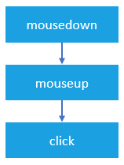
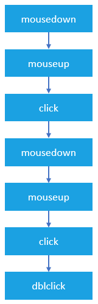
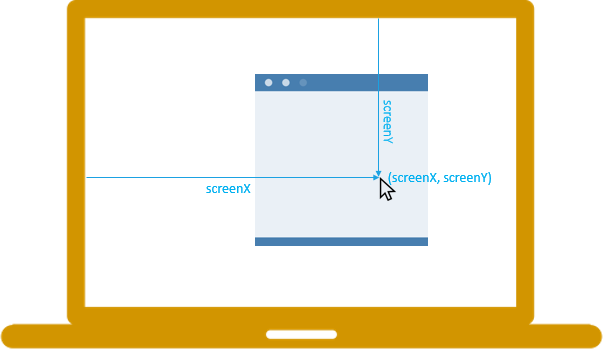
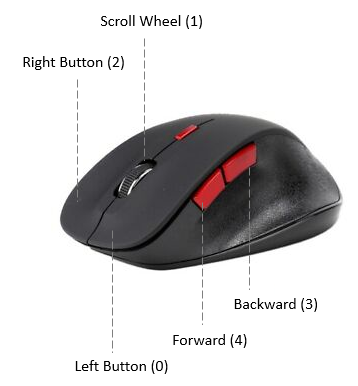
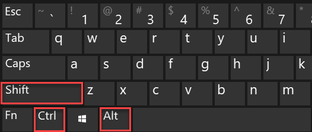

# Mouse Events & Coordinates

## Complete Guide with Full HTML Examples

### Table of Contents

* [Overview of Mouse Events](https://www.google.com/search?q=%231-overview-of-mouse-events)
* [Click and Double-Click Event Sequences](https://www.google.com/search?q=%232-click-and-double-click-event-sequences)
* [Element Boundaries: Hovering vs. Entering](https://www.google.com/search?q=%233-element-boundaries-hovering-vs-entering)
* [Tracking Coordinates: Client vs. Screen](https://www.google.com/search?q=%234-tracking-coordinates-client-vs-screen)
* [Detecting Mouse Buttons & Modifier Keys](https://www.google.com/search?q=%235-detecting-mouse-buttons--modifier-keys)
* [Performance Best Practices for Continuous Events](https://www.google.com/search?q=%236-performance-best-practices-for-continuous-events)
* [Full Integration Sandbox Demo](https://www.google.com/search?q=%237-full-integration-sandbox-demo)
* [Quick Reference Table](https://www.google.com/search?q=%23quick-reference-table)

---

### 1. Overview of Mouse Events

Mouse events allow users to interact with webpage elements using a physical mouse, trackpad, or digital pointer. The W3C DOM Level 3 specification defines 10 fundamental mouse events:

* **`mousedown`**: Fires when a mouse button is pressed down over an element.
* **`mouseup`**: Fires when a pressed mouse button is released over an element.
* **`click`**: Fires when a single left-click sequence completes over an element.
* **`dblclick`**: Fires when a user double-clicks an element.
* **`mousemove`**: Fires repeatedly while the cursor moves within an element's boundaries.
* **`mouseover`**: Fires when the cursor enters an element or any of its children.
* **`mouseout`**: Fires when the cursor leaves an element or any of its children.
* **`mouseenter`**: Fires *only* when the cursor enters the container element itself.
* **`mouseleave`**: Fires *only* when the cursor leaves the container element itself.
* **`wheel`**: Fires when the user rolls a mouse wheel or scrolls a touchpad.

---

### 2. Click and Double-Click Event Sequences

#### The Single Click Sequence



When a user clicks an element, the browser fires at least three events in a strict sequential timeline. If any step is interrupted, the final action is canceled.

1. **`mousedown`** (Button pressed)
2. **`mouseup`** (Button released)
3. **`click`** (A complete press and release sequence on the same element)

**Interruption Scenario:** If a user holds the mouse button down inside a button element, moves the cursor *outside* the button's boundaries, and then releases it, only `mousedown` fires on that element. The `click` event is canceled.

#### The Double-Click Sequence



A double-click event (`dblclick`) requires two complete click sequences within a brief, system-defined time window. It triggers a longer, seven-event lifecycle:

1. `mousedown`
2. `mouseup`
3. `click`
4. `mousedown`
5. `mouseup`
6. `click`
7. **`dblclick`**

*Architectural Warning:* Because single `click` events always execute ahead of a `dblclick` event, you should avoid binding separate `click` and `dblclick` listeners to the exact same HTML element. Doing so makes it difficult to tell whether the user intended a single or double click.

---

### 3. Element Boundaries: Hovering vs. Entering

When tracking when a cursor moves over elements, you can choose between bubbling events (`mouseover`/`mouseout`) and self-contained events (`mouseenter`/`mouseleave`).

[Image comparing mouseover bubbling behavior through nested child elements versus mouseenter restricted outer boundary isolation]

#### Model A: `mouseover` and `mouseout`

These events track cursor movement across both the parent container and any child elements inside it.

* **Bubbling:** Yes.
* **Behavior:** When the cursor moves from a parent container onto a nested child element (like a text span or icon inside a button), a `mouseout` event fires on the parent, followed immediately by a `mouseover` event on the child. This can cause performance bottlenecks if you have complex listener logic.

#### Model B: `mouseenter` and `mouseleave`

These events treat the target container as a single, isolated boundary box.

* **Bubbling:** No.
* **Behavior:** The event fires *only* when the cursor moves from the outside world into the parent container itself. Moving the cursor between child elements inside that container will not trigger additional events. This makes it the preferred choice for complex UI animations and drop-down menus.

---

### 4. Tracking Coordinates: Client vs. Screen

The event object passed to a mouse event listener provides different sets of coordinates to pinpoint the cursor's location. Choosing the right coordinates depends on whether you are tracking the mouse relative to the current webpage viewport or the user's entire display monitor monitor.

#### `clientX` and `clientY`

The `clientX` and `clientY` properties return the horizontal and vertical coordinates of the mouse pointer within the **application’s client area (the browser viewport)**.

* **Origin (0,0):** The top-left corner of the browser's viewable page area.
* **Scroll Impact:** These coordinates do not change based on how far the page has been scrolled horizontally or vertically.
* **Primary Use Case:** Aligning custom floating elements, tooltips, drag-and-drop objects, or custom context menus relative to elements visible inside the browser window.



#### `screenX` and `screenY`

The `screenX` and `screenY` properties return the horizontal and vertical coordinates of the mouse pointer relative to the **user's entire physical monitor screen resolution**.

* **Origin (0,0):** The top-left corner of the primary display monitor screen screen monitor display monitor monitor.
* **Primary Use Case:** Tracking mouse movements for pop-up windows, multi-monitor configuration alignments, or cross-window applications where coordinates outside the browser window boundaries matter.


#### Complete Mouse Location Tracking Example

This standalone HTML example captures live movement inside a bounding element and dynamically updates both coordinate planes simultaneously.

```html
<!DOCTYPE html>
<html lang="en">
<head>
    <meta charset="UTF-8">
    <meta name="viewport" content="width=device-width, initial-scale=1.0">
    <title>JS Mouse Location Demo</title>
    <style>
        body { font-family: Arial, sans-serif; padding: 20px; background-color: #f5f6fa; }
        #track {
            background-color: goldenrod;
            height: 200px;
            width: 400px;
            border-radius: 6px;
            display: flex;
            align-items: center;
            justify-content: center;
            font-weight: bold;
            color: #2f3640;
            cursor: crosshair;
        }
        pre { background: #2f3640; color: #f5f6fa; padding: 15px; border-radius: 6px; width: 370px; font-size: 14px; }
    </style>
</head>
<body>

    <h3>Mouse Coordinate Mapping</h3>
    <p>Move your mouse inside the tracking box below to evaluate screen vs. client vectors:</p>
    
    <div id="track">Tracking Workspace Zone</div>
    <pre id="log">Move mouse over the box to initialize logs...</pre>

    <script>
        const track = document.querySelector('#track');
        const log = document.querySelector('#log');

        track.addEventListener('mousemove', (e) => {
            log.innerText = `Screen X/Y Coordinates: (${e.screenX}, ${e.screenY})\nClient X/Y Coordinates: (${e.clientX}, ${e.clientY})`;
        });
    </script>
</body>
</html>

```

---

### 5. Bubbling Behavior Summary

Different mouse events handle propagation through nested DOM layouts differently. Knowing which events bubble up to parent containers helps you pick the right event model and write efficient event delegation systems.

| Event Type Name | Event Bubbles? | Fires on Direct Child Elements? | Primary Architecture Application |
| --- | --- | --- | --- |
| **`mouseover`** | **Yes** | Yes | Fires when entering either the parent element or any nested child nodes. |
| **`mouseout`** | **Yes** | Yes | Fires when leaving either the parent element or passing into a nested child node. |
| **`mouseenter`** | No | No | Fires *only* when passing through the parent's outer boundary. Safe from child interference. |
| **`mouseleave`** | No | No | Fires *only* when completely leaving the parent's container boundary. Safe from child interference. |
| **`click`** | **Yes** | N/A | Standard interface trigger mechanism for processing layout element selections. |
| **`dblclick`** | **Yes** | N/A | Triggered exclusively when double-clicks complete within a timed window. |
| **`mousedown`** | **Yes** | N/A | Captures the physical click button engagement point before a full release. |
| **`mouseup`** | **Yes** | N/A | Captures the physical click button release execution step. |
| **`mousemove`** | **Yes** | N/A | High-frequency tracking vector that updates continuously with every pixel shift. |
| **`wheel`** | **Yes** | N/A | Measures wheel rotations or trackpad scroll velocity shifts on a targeted container. |

---

### 5. Detecting Mouse Buttons & Modifier Keys



#### The `button` Property

The event object exposes a `.button` integer property that identifies which physical mouse button triggered a `mousedown` or `mouseup` event:

* **`0`**: Primary button (typically the left click).
* **`1`**: Auxiliary button (typically the middle wheel click).
* **`2`**: Secondary button (typically the right click).
* **`3`**: Fourth button (typically the browser "Back" button).
* **`4`**: Fifth button (typically the browser "Forward" button).

#### Modifier Flags



You can also check if any modifier keys were held down during a mouse action using these four built-in boolean properties:

```javascript
element.addEventListener('click', (event) => {
    if (event.ctrlKey)  console.log('Control key active.');
    if (event.shiftKey) console.log('Shift key active.');
    if (event.altKey)   console.log('Alt key active.');
    if (event.metaKey)  console.log('Meta/Command key active.');
});

```

---

### 6. Performance Best Practices for Continuous Events

Events like `mousemove` and `wheel` fire rapidly—often dozens of times per second—for even a single-pixel movement. Running heavy computations inside these listeners can block the main thread and cause visible UI stuttering.

To prevent performance issues, choose one of these optimization strategies:

1. **Dynamic Rebinding:** Attach the `mousemove` handler only when needed (e.g., after a `mousedown` event) and remove it immediately when the interaction ends (e.g., on `mouseup`).
2. **Throttling/Debouncing:** Wrap your callback inside a timing control function to limit how often it executes (e.g., once every 16ms to align with a 60fps refresh rate).

---

### 7. Full Integration Sandbox Demo

This complete HTML file includes a live coordinate logger, modifier key trackers, a mouse-button detection field, and a boundary testing lab to show the difference between event types.

```html
<!DOCTYPE html>
<html lang="en">
<head>
    <meta charset="UTF-8">
    <title>Comprehensive Mouse Events Sandbox</title>
    <style>
        body { font-family: Arial, sans-serif; padding: 25px; background-color: #f5f6fa; color: #2f3640; }
        .grid { display: grid; grid-template-columns: 1fr 1fr; gap: 20px; max-width: 1100px; }
        .card { border: 1px solid #dcdde1; padding: 20px; border-radius: 8px; background: #ffffff; box-shadow: 0 4px 6px rgba(0,0,0,0.05); }
        .track-pad { background-color: #eccc68; height: 180px; border-radius: 6px; display: flex; align-items: center; justify-content: center; font-weight: bold; cursor: crosshair; border: 2px dashed #b53b00; }
        .boundary-zone { background-color: #70a1ff; padding: 30px; border-radius: 6px; text-align: center; color: white; font-weight: bold; }
        .nested-child { background-color: #1e90ff; padding: 20px; margin-top: 15px; border-radius: 4px; border: 2px solid white; }
        pre { background: #2f3640; color: #f5f6fa; padding: 12px; border-radius: 6px; font-size: 13px; font-family: monospace; line-height: 1.4; }
        .interactive-btn { width: 100%; padding: 15px; font-size: 14px; font-weight: bold; border-radius: 6px; border: 2px solid #2f3640; cursor: pointer; }
        .active-key { background-color: #2ed573 !important; color: white; }
        .key-badge { display: inline-block; padding: 5px 10px; background: #dcdde1; margin-right: 5px; border-radius: 4px; font-size: 12px; font-weight: bold; }
    </style>
</head>
<body>

    <h1>JavaScript Mouse Events Lab</h1>
    
    <div class="grid">
        <div class="card">
            <h3>1. Position Vector Monitor (mousemove)</h3>
            <p>Move your cursor inside the box below to track screen vs. client coordinates:</p>
            <div id="move-pad" class="track-pad">Hover & Move Mouse Inside</div>
            <pre id="coordinate-log">Screen Coordinates: (0, 0)&#10;Client Coordinates: (0, 0)</pre>
        </div>

        <div class="card">
            <h3>2. Inputs & Modifiers Monitor</h3>
            <p>Click the button using different mouse buttons (left, middle, right) while holding down modifier keys (Shift, Ctrl, Alt):</p>
            <button id="click-btn" class="interactive-btn">Click Me Every Which Way</button>
            
            <div style="margin: 15px 0;">
                <span id="badge-shift" class="key-badge">SHIFT</span>
                <span id="badge-ctrl" class="key-badge">CTRL</span>
                <span id="badge-alt" class="key-badge">ALT</span>
                <span id="badge-meta" class="key-badge">META</span>
            </div>
            <pre id="input-log">Last Click Action: Waiting for click...</pre>
        </div>

        <div class="card">
            <h3>3. Boundary Crossing Lab (mouseover vs mouseenter)</h3>
            <p>Watch the console log to see how events fire when moving into the parent container versus its nested child:</p>
            <div id="parent-zone" class="boundary-zone">
                PARENT CONTAINER (mouseenter / mouseover)
                <div id="child-zone" class="nested-child">NESTED CHILD ELEMENT</div>
            </div>
        </div>

        <div class="card">
            <h3>4. Scroll Wheel Monitor (wheel)</h3>
            <p>Scroll up or down inside the field below to monitor delta rotation deltas:</p>
            <div id="scroll-pad" class="track-pad" style="background-color: #a4b0be; border-color: #2f3640; color: white;">
                Scroll Wheel / Trackpad Here
            </div>
            <pre id="scroll-log">Scroll DeltaY: 0</pre>
        </div>
    </div>

    <script>
        // --- 1. Coordinate Tracking Logic ---
        const movePad = document.getElementById('move-pad');
        const coordinateLog = document.getElementById('coordinate-log');

        movePad.addEventListener('mousemove', (event) => {
            coordinateLog.textContent = `Screen Coordinates: (X: ${event.screenX}, Y: ${event.screenY})\nClient Coordinates: (X: ${event.clientX}, Y: ${event.clientY})`;
        });

        // --- 2. Button & Modifier Detection Logic ---
        const clickBtn = document.getElementById('click-btn');
        const inputLog = document.getElementById('input-log');
        
        // Prevent right-click context menus from opening on the button
        clickBtn.addEventListener('contextmenu', e => e.preventDefault());

        clickBtn.addEventListener('mouseup', (event) => {
            let buttonName = '';
            switch(event.button) {
                case 0: buttonName = 'Primary/Left Button'; break;
                case 1: buttonName = 'Auxiliary/Middle Wheel Button'; break;
                case 2: buttonName = 'Secondary/Right Button'; break;
                default: buttonName = `Unknown Button ID: ${event.button}`;
            }

            // Update modifier key visual badges
            document.getElementById('badge-shift').className = event.shiftKey ? 'key-badge active-key' : 'key-badge';
            document.getElementById('badge-ctrl').className = event.ctrlKey ? 'key-badge active-key' : 'key-badge';
            document.getElementById('badge-alt').className = event.altKey ? 'key-badge active-key' : 'key-badge';
            document.getElementById('badge-meta').className = event.metaKey ? 'key-badge active-key' : 'key-badge';

            inputLog.textContent = `Event Type Identified: ${event.type}\nButton Used: ${buttonName}\nTimestamp Delta: ${event.timeStamp.toFixed(0)}ms`;
        });

        // --- 3. Boundary Crossing Analysis Logic ---
        const parentZone = document.getElementById('parent-zone');

        // Mouseenter fires only when entering the parent container itself
        parentZone.addEventListener('mouseenter', () => console.log('➡️ [mouseenter]: Entered Parent Container Boundary Box.'));
        parentZone.addEventListener('mouseleave', () => console.log('⬅️ [mouseleave]: Left Parent Container Boundary Box.'));

        // Mouseover fires when entering the parent container OR any of its children
        parentZone.addEventListener('mouseover', (e) => console.log(`  🔹 [mouseover]: Pointer entered target tag: <${e.target.id}>`));
        parentZone.addEventListener('mouseout', (e) => console.log(`  🔸 [mouseout]: Pointer exited target tag: <${e.target.id}>`));

        // --- 4. Scroll Wheel Delta Logic ---
        const scrollPad = document.getElementById('scroll-pad');
        const scrollLog = document.getElementById('scroll-log');

        scrollPad.addEventListener('wheel', (event) => {
            event.preventDefault(); // Prevents normal page scrolling while inside the pad
            scrollLog.textContent = `Scroll DeltaY Movement Magnitude: ${event.deltaY.toFixed(2)}`;
        });
    </script>
</body>
</html>

```

---

### Quick Reference Table

| Event Interface | Bubbling Model | Target Delivery Condition | Primary Intended Functional Use Case |
| --- | --- | --- | --- |
| **`mousedown`** | **Yes** | Fires the instant a mouse button is pressed down. | Best for drag-and-drop actions or custom drawing interfaces. |
| **`mouseup`** | **Yes** | Fires the instant a mouse button is released. | Best for calculating selection ranges or finalizing dragging actions. |
| **`click`** | **Yes** | Fires when a standard press-and-release sequence completes. | The go-to choice for buttons, links, and general UI interactions. |
| **`dblclick`** | **Yes** | Fires after two complete click sequences run back-to-back. | Used for advanced shortcuts, like opening files or magnifying views. |
| **`mousemove`** | **Yes** | Fires repeatedly (many times per second) as the cursor moves. | Used for tracking position paths, custom canvas cursors, or sliders. |
| **`mouseover`** | **Yes** | Fires when entering either the parent element or its children. | Useful for event delegation when tracking large lists of elements. |
| **`mouseenter`** | **No** | Fires only when passing into the parent element's container box. | The cleanest choice for UI hover states, menus, and sidebars. |
| **`wheel`** | **Yes** | Fires when scrolling a physical mouse wheel or a touchpad. | Best for custom image zooming, map panning, or carousel sliders. |

---