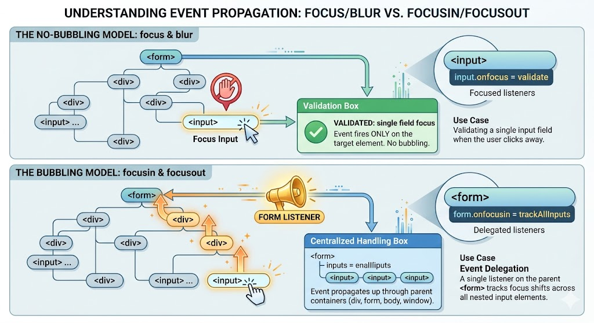

# Focus Events 

## Complete Guide with Full HTML Examples

### Table of Contents

* [Overview of Focus Events](https://www.google.com/search?q=%231-overview-of-focus-events)
* [Bubbling vs. Non-Bubbling Focus Events](https://www.google.com/search?q=%232-bubbling-vs-non-bubbling-focus-events)
* [What Makes an Element Focusable?](https://www.google.com/search?q=%233-what-makes-an-element-focusable)
* [The \`tabindex\` Attribute Interface](https://www.google.com/search?q=%234-the-tabindex-attribute-interface)
* [Full Integration Sandbox Demo](https://www.google.com/search?q=%235-full-integration-sandbox-demo)
* [Quick Reference Table](https://www.google.com/search?q=%23quick-reference-table)

---

### 1. Overview of Focus Events

Focus events fire when a user selects an interactive element on a webpage—such as clicking into a text box or navigating to a link using the `Tab` key—making it the active target for keyboard input. These events also track when a user leaves that element to interact with something else.

The DOM level 3 specification defines four core focus events, grouped into entry and exit pairs:

* **`focus`**: Fires immediately after an element receives focus.
* **`blur`**: Fires immediately after an element loses focus.
* **`focusin`**: Fires when an element is about to receive focus (executes alongside `focus`).
* **`focusout`**: Fires when an element is about to lose focus (executes alongside `blur`).

---

### 2. Bubbling vs. Non-Bubbling Focus Events

The key difference between these four events is their propagation model (whether they bubble up through the DOM tree).

#### The `focus` and `blur` Pair

These events do not bubble up to parent containers. They fire *exclusively* on the specific element receiving or losing focus.

* **Use Case:** Validating a single input field right as a user clicks away from it.

#### The `focusin` and `focusout` Pair

These events follow the standard DOM bubbling model. When an event fires on an input field, it bubbles up through its parent `<form>`, through the structural `<div>` containers, and all the way up to the `window` object.

* **Use Case:** **Event Delegation.** Instead of attaching individual listeners to dozens of separate text fields, you can attach a single `focusin` listener to a parent `<form>` container to track focus shifts across all its nested input elements at once.



---

### 3. What Makes an Element Focusable?

By default, only certain interactive HTML elements can receive focus:

1. **The Global `window` Context:** Receives focus when you click the browser tab or switch to it using `Alt+Tab` / `Cmd+Tab`. It loses focus (`blur`) when you move to a different application or tab.
2. **Navigation Elements:** Anchor links (`<a href="...">`) and area maps when navigated via mouse click or keyboard typing.
3. **Form Controls:** Layout input tags (`<input>`, `<textarea>`, `<select>`, `<button>`).
4. **Explicit Tabindex Elements:** Any standard HTML element (like a `<div>`, `<span>`, or `<li>`) that has a valid `tabindex` attribute.

---

### 4. The `tabindex` Attribute Interface

You can make non-interactive elements focusable by adding the `tabindex` attribute to their HTML markup:

* **`tabindex="0"`**: Adds the element to the natural keyboard tab sequence. The user can navigate to it using the `Tab` key, and it can receive focus just like a native button or link.
* **`tabindex="-1"`**: Makes the element programmatically focusable. A user cannot navigate to it using the `Tab` key, but you can force focus onto it using JavaScript code (e.g., `element.focus()`). This is commonly used for modal windows or error message banners that need to catch screen readers immediately.

---

### 5. Full Integration Sandbox Demo

This complete HTML file includes an interactive form featuring real-time styling updates, a parent-level event delegation pipeline using `focusin`, and custom keyboard-accessible buttons configured with `tabindex`.

```html
<!DOCTYPE html>
<html lang="en">
<head>
    <meta charset="UTF-8">
    <meta name="viewport" content="width=device-width, initial-scale=1.0">
    <title>Comprehensive Focus Events Laboratory</title>
    <style>
        body { font-family: Arial, sans-serif; padding: 25px; background-color: #f5f6fa; color: #2f3640; }
        .grid { display: grid; grid-template-columns: 1fr 1fr; gap: 20px; max-width: 1100px; }
        .card { border: 1px solid #dcdde1; padding: 20px; border-radius: 8px; background: #ffffff; box-shadow: 0 4px 6px rgba(0,0,0,0.05); }
        .form-group { margin-bottom: 15px; }
        label { display: block; margin-bottom: 5px; font-weight: bold; }
        input[type="text"], input[type="password"] { width: 100%; padding: 10px; font-size: 14px; border: 2px solid #cbd5e1; border-radius: 6px; box-sizing: border-box; transition: all 0.3s; }
        
        /* Highlight state triggered via JavaScript event listener */
        .highlighted-focus { background-color: #fff9db; border-color: #fab005 !important; outline: none; }
        
        pre { background: #2f3640; color: #f5f6fa; padding: 12px; border-radius: 6px; font-size: 13px; font-family: monospace; max-height: 180px; overflow-y: auto; }
        
        /* Custom non-native focus components */
        .custom-accessible-pill { inline-size: fit-content; padding: 10px 20px; background-color: #3498db; color: white; font-weight: bold; border-radius: 20px; cursor: pointer; margin-top: 10px; }
        .custom-accessible-pill:focus { outline: 3px solid #2ecc71; background-color: #2980b9; }
    </style>
</head>
<body>

    <h1>JavaScript Focus Events Sandbox</h1>
    
    <div class="grid">
        <div class="card">
            <h3>1. Form Event Delegation Tracker (focusin / focusout)</h3>
            <p>Click through or use the <b>Tab</b> key to navigate the input fields below. Notice the dynamic background color shifts:</p>
            
            <form id="delegated-form">
                <div class="form-group">
                    <label for="txt-username">Account Username:</label>
                    <input type="text" id="txt-username" placeholder="Enter username...">
                </div>
                <div class="form-group">
                    <label for="txt-password">Security Password:</label>
                    <input type="password" id="txt-password" placeholder="Enter password...">
                </div>
            </form>
        </div>

        <div class="card">
            <h3>2. Dynamic Execution Terminal</h3>
            <p>Chronological sequence logs of focus events captured by the browser:</p>
            <pre id="terminal-log">Terminal monitoring initialized. Awaiting user interaction...</pre>
            <button id="btn-clear" style="padding: 5px 10px; cursor: pointer;">Clear Terminal Logs</button>
        </div>

        <div class="card">
            <h3>3. Custom Element Focus via <code>tabindex</code></h3>
            <p>The <code>&lt;div&gt;</code> element below has been assigned a <code>tabindex="0"</code> attribute, making it keyboard-focusable:</p>
            
            <div id="focusable-div" class="custom-accessible-pill" tabindex="0">
                Keyboard Accessible Card Container
            </div>
        </div>
    </div>

    <script>
        const delegatedForm = document.getElementById('delegated-form');
        const terminalLog = document.getElementById('terminal-log');
        const clearBtn = document.getElementById('btn-clear');
        const focusableDiv = document.getElementById('focusable-div');
        
        let eventCounter = 1;

        function printLog(message) {
            if(terminalLog.textContent.includes("Terminal monitoring initialized")) {
                terminalLog.textContent = '';
            }
            terminalLog.textContent += `${eventCounter++}. ${message}\n`;
            terminalLog.scrollTop = terminalLog.scrollHeight; // Auto-scrolls down
        }

        // --- 1. Event Delegation Implementation (focusin / focusout) ---
        // focusin bubbles, allowing us to listen for focus events on the parent form
        delegatedForm.addEventListener('focusin', (event) => {
            if (event.target.tagName === 'INPUT') {
                event.target.classList.add('highlighted-focus');
                printLog(`[focusin] captured on field: "${event.target.id}"`);
            }
        });

        // focusout bubbles, allowing us to listen for blur events on the parent form
        delegatedForm.addEventListener('focusout', (event) => {
            if (event.target.tagName === 'INPUT') {
                event.target.classList.remove('highlighted-focus');
                printLog(`[focusout] captured on field: "${event.target.id}"`);
            }
        });

        // --- 2. Isolated Non-Bubbling Observers (focus / blur) ---
        const passwordField = document.getElementById('txt-password');
        
        passwordField.addEventListener('focus', () => {
            printLog(`⚡ Direct [focus] listener fired on Password Box`);
        });

        passwordField.addEventListener('blur', () => {
            printLog(`💤 Direct [blur] listener fired on Password Box`);
        });

        // --- 3. Tabindex Target Interaction Observers ---
        focusableDiv.addEventListener('focus', (e) => {
            printLog(`🎯 Custom focusable <div> container received active focus.`);
        });

        focusableDiv.addEventListener('blur', (e) => {
            printLog(`🏳️ Custom focusable <div> container lost focus.`);
        });

        // --- Terminal Reset Logic ---
        clearBtn.addEventListener('click', () => {
            terminalLog.textContent = 'Terminal cleared.';
            eventCounter = 1;
        });
    </script>
</body>
</html>

```

---

### Quick Reference Table

| Focus Event | Bubbles Up DOM Tree? | Primary Functional Intended Purpose | Common Architectural Best Practice |
| --- | --- | --- | --- |
| **`focus`** | **No** | Runs logic right when a specific element receives focus. | Great for updating inline form validation state indicators. |
| **`blur`** | **No** | Runs validation checks right when a user leaves a specific input element. | Best for checking inputs (e.g., checking if an email contains `@`) right as the user moves to the next field. |
| **`focusin`** | **Yes** | Tracks when *any* nested element within a parent container receives focus. | **Event Delegation:** Use this on a parent `<form>` to track focus state changes across all its input fields at once. |
| **`focusout`** | **Yes** | Tracks when *any* nested element within a parent container loses focus. | Clear styles or remove custom tooltips globally when a user navigates away from grouped components. |

---