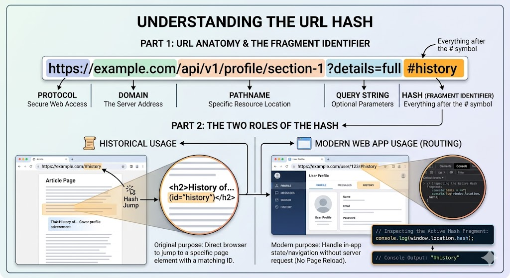

# The `hashchange` Event

## Complete Guide with Full HTML Examples

### Table of Contents

* [Understanding the URL Hash](https://www.google.com/search?q=%231-understanding-the-url-hash)
* [What is the \`hashchange\` Event?](https://www.google.com/search?q=%232-what-is-the-hashchange-event)
* [The \`HashChangeEvent\` Object Properties](https://www.google.com/search?q=%233-the-hashchangeevent-object-properties)
* [Building client-side Routers for Single Page Applications (SPAs)](https://www.google.com/search?q=%234-building-client-side-routers-for-single-page-applications-spas)
* [Full Integration Sandbox Demo](https://www.google.com/search?q=%235-full-integration-sandbox-demo)
* [Quick Reference Table](https://www.google.com/search?q=%23quick-reference-table)

---

### 1. Understanding the URL Hash

The URL hash—also known as the fragment identifier—consists of everything that follows the pound sign (`#`) in a web address.



Historically, browsers used the hash exclusively to jump to a specific element on a page that matched an ID attribute (e.g., `#footer`). Modern web applications repurpose the hash as a simple router tool. It tracks application state and handles navigation without forcing the browser to reload the page or download a new HTML file from the server.

You can inspect the active fragment identifier directly in JavaScript using the global context location utility:

```javascript
// Example URL: https://example.com/#profile
console.log(window.location.hash); // Outputs: "#profile"

```

---

### 2. What is the `hashchange` Event?

The **`hashchange`** event fires on the global `window` object whenever the URL fragment identifier changes. This can happen in several ways:

* A user clicks an anchor link (`<a href="#about">`).
* The browser's back or forward buttons are pressed, navigating through the history log.
* The location hash property is modified programmatically via script code:

```javascript
window.location.hash = 'contact'; // Updates URL to /#contact and triggers hashchange

```

#### Event Registration Syntax Patterns

You can attach listeners to the hash state tracking lifecycle using two distinct approaches. The `addEventListener` approach is the recommended best practice:

```javascript
// Standard Best Practice Pattern
window.addEventListener('hashchange', (event) => {
    console.log('The location fragment path changed.');
});

// Property Assignment Pattern (Overwrites any previous handler assignments)
window.onhashchange = (event) => {
    console.log('The location fragment path changed.');
};

```

---

### 3. The `HashChangeEvent` Object Properties

When the `hashchange` event fires, it passes an event object to your listener. This object includes two valuable read-only string properties that let you track navigation history details:

* **`event.oldURL`**: The complete URL string *before* the hash changed.
* **`event.newURL`**: The updated target URL string *after* the hash changed.

```javascript
window.addEventListener('hashchange', (event) => {
    console.log(`Mapsd away from: ${event.oldURL}`);
    console.log(`Arrived at destination: ${event.newURL}`);
});

```

---

### 4. Building client-side Routers for Single Page Applications (SPAs)

Using `hashchange` is an excellent way to build lightweight client-side routers for Single Page Applications. The router interceptor handles routing by following these execution steps:

[Image flowchart mapping a hashchange event loop capturing a click extracting the hash key updating the DOM body and initializing view states on load]

1. **Interception:** The user clicks a navigation link, changing the hash state without reloading the page.
2. **Parsing:** The router captures the `hashchange` event and slices off the leading `#` character using `.substring(1)` or `.slice(1)`.
3. **Matching:** The router matches the parsed route key against a list of known views using a control switch or configuration dictionary map.
4. **DOM Injection:** The router dynamically updates the container content using `.innerHTML` or text components, instantly updating the user interface.

---

### 5. Full Integration Sandbox Demo

This complete standalone HTML application features a functional client-side router, dynamic view injections, navigation state indicators, and an historical log capturing `oldURL` and `newURL` metrics.

```html
<!DOCTYPE html>
<html lang="en">
<head>
    <meta charset="UTF-8">
    <meta name="viewport" content="width=device-width, initial-scale=1.0">
    <title>Comprehensive HashChange Router Lab</title>
    <style>
        body { font-family: Arial, sans-serif; padding: 25px; background-color: #f5f6fa; color: #2f3640; }
        header { background: #2f3640; padding: 15px 25px; border-radius: 6px; margin-bottom: 25px; }
        nav a { color: #f5f6fa; text-decoration: none; font-weight: bold; margin-right: 20px; padding: 5px 10px; border-radius: 4px; transition: background 0.2s; }
        nav a:hover { background: #444f63; }
        
        /* Highlight state for active route links */
        .active-route { background: #ff7f50 !important; color: white; }
        
        .grid { display: grid; grid-template-columns: 3fr 2fr; gap: 25px; max-width: 1200px; }
        .card { border: 1px solid #dcdde1; padding: 25px; border-radius: 8px; background: #ffffff; box-shadow: 0 4px 6px rgba(0,0,0,0.05); min-height: 200px; }
        pre { background: #1e293b; color: #f1f2f6; padding: 15px; border-radius: 6px; font-size: 13px; font-family: monospace; overflow-x: auto; line-height: 1.5; }
        .route-badge { display: inline-block; padding: 4px 10px; background-color: #718093; color: white; border-radius: 12px; font-size: 12px; font-weight: bold; margin-bottom: 15px; }
    </style>
</head>
<body>

    <header>
        <nav id="app-navigation">
            <a href="#home" id="link-home">Dashboard Home</a>
            <a href="#about" id="link-about">Corporate About</a>
            <a href="#contact" id="link-contact">Contact Channels</a>
        </nav>
    </header>

    <div class="grid">
        <div class="card">
            <div id="current-view-badge" class="route-badge">Active Hash: #home</div>
            <main id="view-viewport">
                <h1>Application Initializing...</h1>
                <p>Awaiting engine component deployment.</p>
            </main>
        </div>

        <div class="card">
            <h3>Router History Monitor</h3>
            <p>Inspect raw <code>HashChangeEvent</code> state histories below:</p>
            <pre id="history-terminal">No hash transitions detected yet. Click links above...</pre>
        </div>
    </div>

    <script>
        const viewViewport = document.getElementById('view-viewport');
        const historyTerminal = document.getElementById('history-terminal');
        const viewBadge = document.getElementById('current-view-badge');
        const navLinks = document.querySelectorAll('#app-navigation a');

        // --- Core Router View Mapping Configuration ---
        const routerMap = {
            'home': {
                title: 'Welcome Home Dashboard',
                body: 'This represents the dynamic view rendered when the route location processes "#home". No server roundtrips were required.'
            },
            'about': {
                title: 'Corporate Profiles & Architecture',
                body: 'Our platform leverages client-side routing routines. The hashchange event listens for updates to the URL context.'
            },
            'contact': {
                title: 'Establish Contact Channels',
                body: 'Have suggestions? Reach out through our mock contact view components at your convenience.'
            }
        };

        // --- Main Route Orchestration Handler Function ---
        function appRouterEngine(event) {
            // Extract the router hash key (default to 'home' if empty)
            let rawHash = window.location.hash;
            let routeKey = rawHash.substring(1) || 'home';

            // Fallback safety if the user types an unrecognized hash route
            if (!routerMap[routeKey]) {
                viewViewport.innerHTML = `<h1>404 — Route Not Found</h1><p>The path segment <b>#${routeKey}</b> is unrecognized.</p>`;
                viewBadge.textContent = `Active Hash: Unknown`;
                return;
            }

            // Update viewport DOM content with the matching route details
            const targetRoute = routerMap[routeKey];
            viewViewport.innerHTML = `<h1>${targetRoute.title}</h1><p>${targetRoute.body}</p>`;
            viewBadge.textContent = `Active Hash: #${routeKey}`;

            // Sync navigation link highlight states
            navLinks.forEach(link => {
                if(link.getAttribute('href') === `#${routeKey}`) {
                    link.className = 'active-route';
                } else {
                    link.className = '';
                }
            });

            // Log event history metrics if triggered by an active change event object
            if (event) {
                historyTerminal.textContent = `Event Captured: ${event.type}\n-----------------------------------\nOld URL: ${event.oldURL}\nNew URL: ${event.newURL}`;
            }
        }

        // --- Lifecycle Subscriptions & Hooks ---
        // Listen for route changes while the user is interacting with the application
        window.addEventListener('hashchange', appRouterEngine);

        // Run the router once when the page first loads to show the correct content based on the initial URL hash
        window.addEventListener('DOMContentLoaded', () => {
            // If the application opens with no trailing hash definition, force-initialize it to #home
            if (!window.location.hash) {
                window.location.hash = 'home';
            } else {
                appRouterEngine(); // Execute immediately using the existing hash route
            }
        });
    </script>
</body>
</html>

```

---

### Quick Reference Table

| Objective Details Feature Matrix | Specification Metric Value / Attribute Rules |
| --- | --- |
| **Target Global Host Object** | `window` |
| **Bubbling Execution Properties** | N/A (Dispatched explicitly to the global `window` instance container context). |
| **Primary State Parameter Property** | `window.location.hash` |
| **Leading Character Syntax** | Returns strings including the pound sign prefix (e.g., `"#dashboard"`). |
| **History Lifecycle Log Vector A** | `event.oldURL` (The full absolute URL text string *before* navigation occurred). |
| **History Lifecycle Log Vector B** | `event.newURL` (The full absolute URL text string *after* navigation occurred). |
| **Core Architecture Purpose** | Managing application routing views and tracking user states within Client-Side Single Page Applications (SPAs). |

---