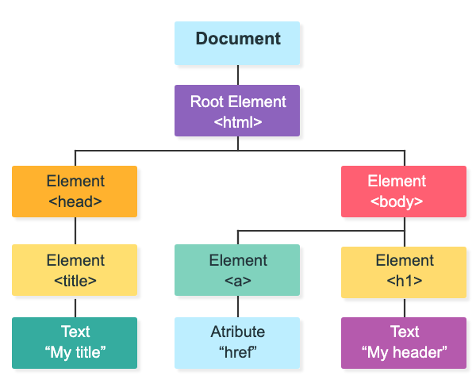

# Introduction to Document Object Model (DOM) in JavaScript

## What is the DOM?

**DOM** (Document Object Model) is an object model for HTML documents. When a web page loads, the browser creates a tree-like representation of the HTML document called the **DOM tree**.

The HTML DOM is a tree of nodes that represents an HTML page. The browser uses DOM to:
- Represent the HTML document internally
- Provide a set of functions and methods to modify the HTML document programmatically

These functions and methods are called **DOM Application Programming Interfaces** or **DOM API**.

## HTML Example

Consider this simple HTML file:

```html
<!DOCTYPE html>
<html lang="en">
  <head>
    <meta charset="UTF-8" />
    <meta name="viewport" content="width=device-width, initial-scale=1.0" />
    <title>JavaScript DOM</title>
  </head>
  <body>
    <h1>Hello DOM!</h1>
  </body>
</html>
```

When opened in a browser, it displays "Hello DOM!" while internally creating a DOM tree representation.



## DOM Node Types

Each part of the HTML document becomes a node in the DOM tree:

| Node | Description |
|------|-------------|
| Document | Owner of all nodes in the document |
| `<html>` | Element Node |
| `<head>` | Element Node |
| `<body>` | Element Node |
| `<a>` | Element Node |
| `href` | Attribute Node |
| `<h1>` | Element Node |
| My Header | Text Node |

## Accessing and Manipulating Elements

### Using querySelector()

You can select elements using CSS selectors with `querySelector()`:

```javascript
const h1 = document.querySelector('h1');
console.log(h1.textContent); // Output: Hello DOM!
h1.textContent = 'Hi JS'; // Change the text
```

### Using getElementById()

The most common way to access an element is by its `id`:

```html
<p id="demo"></p>

<script>
const myPara = document.getElementById("demo");
myPara.innerHTML = "Hello World!";
</script>
```

**Key distinctions:**
- `id="demo"` is an **HTML property**
- `getElementById()` is a **DOM Method**
- `innerHTML` is a **DOM Property**

## Summary

- **DOM** stands for Document Object Model
- **DOM API** provides functions and methods to modify HTML documents dynamically via JavaScript
- Common methods include `querySelector()` and `getElementById()`
- Common properties include `textContent` and `innerHTML`
