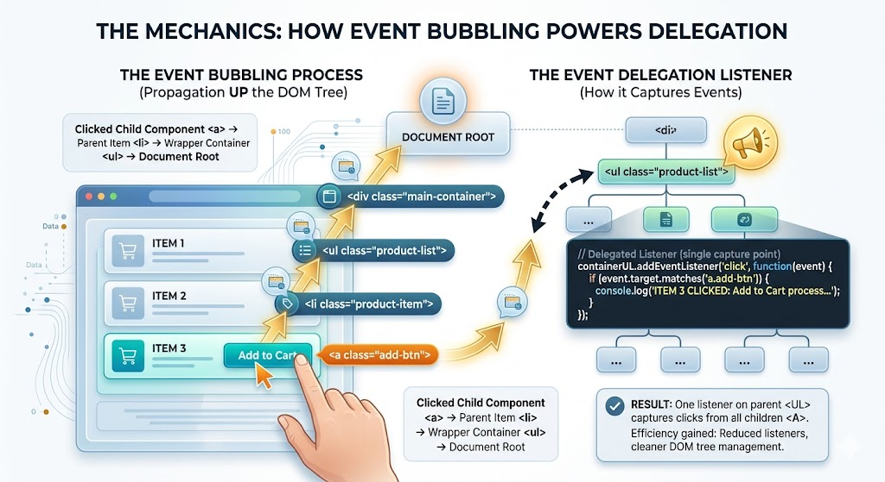

# Event Delegation

## Complete Guide with Full HTML Examples

### Table of Contents

* [Understanding Event Delegation](https://www.google.com/search?q=%231-understanding-event-delegation)
* [The Mechanics: How Event Bubbling Powers Delegation](https://www.google.com/search?q=%232-the-mechanics-how-event-bubbling-powers-delegation)
* [Target Identification (\`event.target\` vs. \`event.currentTarget\`)](https://www.google.com/search?q=%233-target-identification-eventtarget-vs-eventcurrenttarget)
* [The Performance Bottleneck of Too Many Handlers](https://www.google.com/search?q=%234-the-performance-bottleneck-of-too-many-handlers)
* [Key Architectural Benefits](https://www.google.com/search?q=%235-key-architectural-benefits)
* [Full Integration Sandbox Demo](https://www.google.com/search?q=%236-full-integration-sandbox-demo)
* [Quick Reference Table](https://www.google.com/search?q=%23quick-reference-table)

---

### 1. Understanding Event Delegation

**Event delegation** is a highly efficient technique where you attach a **single event handler** to a parent element higher up in the DOM tree instead of registering individual event handlers on multiple child elements.

#### The Problem

Imagine a navigation menu or a massive data list containing dozens of interactive elements. The naive approach is to query all child elements and attach a separate event listener to each one. While this works for small layouts, it becomes unmanageable and unperformant as your application grows.

#### The Solution

By leveraging the native way events travel through the DOM, a single event listener attached to a common wrapper container can catch, inspect, and handle interactions for all current—and future—nested child elements.

---

### 2. The Mechanics: How Event Bubbling Powers Delegation

Event delegation works because of a browser process called **event bubbling**.

When an event (such as a mouse click) fires on a child element, the event does not just stop there. Instead, it travels straight upward through the DOM tree, triggering the same event on its parent elements one after another:



$$\text{Clicked Child Component } \langle a \rangle \longrightarrow \text{ Parent Item } \langle li \rangle \longrightarrow \text{ Wrapper Container } \langle ul \rangle \longrightarrow \text{ Document Root}$$

By placing your event listener on a higher-level parent container (like a `<ul>` or a `<form>`), you can intercept the event as it bubbles up from the specific child element where the interaction originally started.

---

### 3. Target Identification

When an event bubbles up to your parent listener, you need a reliable way to determine exactly which child element triggered it. The browser's `Event` object provides two properties to make this distinction clear:

#### `event.target`

This references the **exact element that triggered the event** (the lowest element in the DOM tree where the click or interaction actually occurred). In an event delegation setup, you use `event.target` to inspect properties like `id`, `className`, or `tagName` to identify which item was clicked.

#### `event.currentTarget`

This references the **element that the event listener is explicitly attached to** (the parent container wrapper).

```javascript
// Example: Capturing an event on a parent container
parentMenu.addEventListener('click', (event) => {
    // event.target is the specific link or button clicked by the user
    console.log(`Original element clicked:`, event.target); 
    
    // event.currentTarget is always parentMenu itself
    console.log(`Element holding the listener:`, event.currentTarget); 
});

```

---

### 4. The Performance Bottleneck of Too Many Handlers

Attaching separate event listeners to a large number of individual elements directly degrades web page responsiveness for two major reasons:

1. **Memory Allocation Overload:** In JavaScript, every event handler you create is a separate function object that takes up memory space. Piling up hundreds of individual objects slows down browser performance and can cause memory leaks.
2. **Setup Delay:** It takes time for the browser to loop through and attach handlers to a large collection of DOM nodes, which can cause noticeable delays before a page becomes fully interactive.

Using event delegation avoids these bottlenecks entirely by replacing scores of individual functions with one lightweight, centralized handler.

---

### 5. Key Architectural Benefits

Implementing event delegation provides several major advantages for your application's architecture:

* **Reduced Memory Footprint:** Minimizing the total number of event listener objects inside system memory ensures smoother rendering performance.
* **Instant Interactivity:** Because you only need to bind a single listener to a top-level parent container, your page becomes interactive much faster.
* **Simplified Life Cycle Management:** The `document` or parent containers are available immediately. As soon as elements are rendered, they function correctly without needing to wait for complex `DOMContentLoaded` or window load setups.
* **Seamless Dynamic Injections:** If your JavaScript code dynamically adds new child elements to the parent container later on, you don't need to manually attach new event listeners to them. The existing parent listener will automatically catch their bubbling events and handle them correctly.

---

### 6. Full Integration Sandbox Demo

This complete HTML file showcases event delegation in action. It includes a single click listener attached to a parent menu container that handles routing actions based on element IDs, along with a system that dynamically adds new items to prove they are automatically supported.

```html
<!DOCTYPE html>
<html lang="en">
<head>
    <meta charset="UTF-8">
    <meta name="viewport" content="width=device-width, initial-scale=1.0">
    <title>Comprehensive Event Delegation Laboratory</title>
    <style>
        body { font-family: Arial, sans-serif; padding: 25px; background-color: #f5f6fa; color: #2f3640; }
        .grid { display: grid; grid-template-columns: 1fr 1fr; gap: 25px; max-width: 1100px; }
        .card { border: 1px solid #dcdde1; padding: 25px; border-radius: 8px; background: #ffffff; box-shadow: 0 4px 6px rgba(0,0,0,0.05); }
        
        /* Interactive Menu Styles */
        ul.menu-container { list-style: none; padding: 0; margin: 0 0 20px 0; border: 1px solid #cbd5e1; border-radius: 6px; overflow: hidden; }
        ul.menu-container li { border-bottom: 1px solid #f1f2f6; }
        ul.menu-container li:last-child { border-bottom: none; }
        ul.menu-container button.menu-item { width: 100%; padding: 12px 20px; background: #ffffff; border: none; text-align: left; font-size: 15px; font-weight: bold; color: #2f3640; cursor: pointer; transition: background 0.2s; }
        ul.menu-container button.menu-item:hover { background-color: #f1f2f6; color: #3b82f6; }
        
        pre { background: #2f3640; color: #f5f6fa; padding: 12px; border-radius: 6px; font-size: 13px; font-family: monospace; min-height: 100px; }
        .control-btn { padding: 8px 16px; background-color: #22c55e; color: white; border: none; border-radius: 4px; font-weight: bold; cursor: pointer; }
        .control-btn:hover { background-color: #16a34a; }
    </style>
</head>
<body>

    <h1>JavaScript Event Delegation Laboratory</h1>
    
    <div class="grid">
        <!-- Panel 1: Interactive Menu Wrapper Target -->
        <div class="card">
            <h3>1. Centralized Parent Menu Wrapper</h3>
            <p>A single click listener is attached to the <code>&lt;ul&gt;</code> element below, handling interactions for all nested buttons automatically:</p>
            
            <ul id="central-menu" class="menu-container">
                <li><button id="home" class="menu-item">Dashboard Home View</button></li>
                <li><button id="dashboard" class="menu-item">Analytics Data Streams</button></li>
                <li><button id="report" class="menu-item">System Operations Report</button></li>
            </ul>

            <button id="btn-add-item" class="control-btn">+ Dynamically Inject New Menu Item</button>
        </div>

        <!-- Panel 2: Live Diagnostic Output Logs -->
        <div class="card">
            <h3>2. Dynamic Execution Log Terminal</h3>
            <p>See how the single parent listener uses <code>event.target.id</code> to dynamically track and handle interactions:</p>
            <pre id="terminal-display">Awaiting interaction logs...</pre>
        </div>
    </div>

    <script>
        const centralMenu = document.getElementById('central-menu');
        const terminalDisplay = document.getElementById('terminal-display');
        const addItemBtn = document.getElementById('btn-add-item');
        let newCustomItemCounter = 1;

        // --- Core Event Delegation Implementation ---
        // Instead of adding separate listeners to each button, we add one listener to the parent <ul> container
        centralMenu.addEventListener('click', (event) => {
            // Find the closest button element in case the user clicked a child element inside the button
            const targetButton = event.target.closest('.menu-item');
            
            // Safety Check: If the click wasn't on or inside a valid menu item button, ignore it
            if (!targetButton) return;

            // Route execution based on the specific element ID
            switch(targetButton.id) {
                case 'home':
                    terminalDisplay.textContent = `Route Triggered: [HOME] View initialized successfully.`;
                    break;
                case 'dashboard':
                    terminalDisplay.textContent = `Route Triggered: [DASHBOARD] pipelines connected.`;
                    break;
                case 'report':
                    terminalDisplay.textContent = `Route Triggered: [REPORT] spreadsheets compiled.`;
                    break;
                default:
                    // This block catches dynamically injected custom items seamlessly, without needing new listeners
                    terminalDisplay.textContent = `Route Triggered: [DYNAMIC PROTOTYPE] ID Name: "${targetButton.id}" executed smoothly.`;
                    break;
            }
        });

        // --- Dynamic Content Injection Logic ---
        addItemBtn.addEventListener('click', () => {
            const newLi = document.createElement('li');
            const newButton = document.createElement('button');
            
            const uniqueId = `custom-node-${newCustomItemCounter}`;
            newButton.id = uniqueId;
            newButton.className = 'menu-item';
            newButton.textContent = `✨ Injected Feature Option ${newCustomItemCounter}`;
            
            newLi.appendChild(newButton);
            centralMenu.appendChild(newLi);
            
            newCustomItemCounter++;
            terminalDisplay.textContent = `System Log: Injected a new DOM element node with ID "${uniqueId}". Try clicking it!`;
        });
    </script>
</body>
</html>

```

---

### Quick Reference Table

| Metric / Feature Details | Standard Multiple Handler Architecture | Modern Optimized Event Delegation Pattern |
| --- | --- | --- |
| **Listener Placement Target** | Registered individually on every single child node. | Attached to a single shared parent container element. |
| **Memory Footprint** | Large (Scales directly with the total number of items). | Minimal (Uses exactly one function object in memory). |
| **Dynamic Elements Support** | Manual (Requires attaching new listeners to new elements). | **Automatic** (Injected elements bubble up to the parent automatically). |
| **Primary Underlying Mechanism** | Isolated direct targeted execution. | **Event Bubbling** (Events travel up through the parent tree). |
| **Element Context Resolution** | Uses `this` or the specific element reference. | Uses **`event.target`** to identify the source element. |
| **Initialization Performance** | Slower (Requires looping through items to bind events). | **Instant** (Only binds once to the wrapper container). |

---