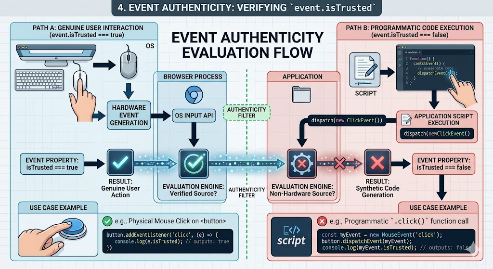

# Creating & Dispatching Custom Events 

## Complete Guide with Full HTML Examples

### Table of Contents

* [Understanding Programmatic Events](https://www.google.com/search?q=%231-understanding-programmatic-events)
* [The \`Event\` Constructor Options](https://www.google.com/search?q=%232-the-event-constructor-options)
* [Firing Events via \`dispatchEvent()\`](https://www.google.com/search?q=%233-firing-events-via-dispatchevent)`
* [Event Authenticity: Verifying \`event.isTrusted\`](https://www.google.com/search?q=%234-event-authenticity-verifying-eventistrusted)`
* [Generic vs. Specialized Event Constructors (\`MouseEvent\`, \`KeyboardEvent\`)](https://www.google.com/search?q=%235-generic-vs-specialized-event-constructors-mouseevent-keyboardevent)
* [Full Integration Sandbox Demo](https://www.google.com/search?q=%236-full-integration-sandbox-demo)
* [Quick Reference Table](https://www.google.com/search?q=%23quick-reference-table)

---

### 1. Understanding Programmatic Events

While events are typically fired by physical user interactions—like clicking a mouse button or typing on a keyboard—JavaScript allows you to generate and dispatch events programmatically via code.

Programmatic events are useful for:

* **Automated Component Testing:** Simulating user journeys (e.g., mock clicking a submission button) to verify application logic.
* **Custom Component Architecture:** Triggering custom notifications across independent modules when an internal state changes (e.g., notifying a checkout sidebar when an item is added to the cart).
* **Simulating Shortcuts:** Hooking keyboard combinations up to simulate clicks on complex UI controls.

Generating an event via code requires two steps:

1. Instantiating an event object using a constructor function.
2. Directing an element node to fire it via the `dispatchEvent()` method.

---

### 2. The `Event` Constructor Options

To create a basic event object, call the global `Event` constructor:

```javascript
let customEvent = new Event(type, [, options]);

```

The constructor accepts two parameters:

1. **`type`** *(String)*: The name of the event type you are mimicking or creating (e.g., `'click'`, `'lookout'`, `'data-sync'`).
2. **`options`** *(Object)*: An optional configuration object defining propagation behaviors.

#### The `options` Configuration Properties

* **`bubbles`** *(Boolean)*: Determines if the event bubbles up through parent DOM elements. Defaults to `false`.
* **`cancelable`** *(Boolean)*: Specifies if the event's default browser behavior can be stopped using `event.preventDefault()`. Defaults to `false`.

```javascript
// A click event that defaults to bubbles: false, cancelable: false
let simpleClick = new Event('click');

// A highly interactive event that bubbles up and can be canceled
let advancedClick = new Event('click', {
    bubbles: true,
    cancelable: true
});

```

---

### 3. Firing Events via `dispatchEvent()`

Once an event object has been instantiated, you fire it on a target DOM node by passing it into the **`element.dispatchEvent(event)`** method.

```javascript
const targetButton = document.querySelector('.my-button');

// 1. Establish a standard listener
targetButton.addEventListener('click', (e) => {
    console.log('Button click detected!');
});

// 2. Synthesize a programmatic event instance
let syntheticClick = new Event('click');

// 3. Force the target node to fire the event
targetButton.dispatchEvent(syntheticClick); // Triggers the listener code immediately

```

When you call `dispatchEvent()`, the browser executes the attached event listeners synchronously, treating the programmatic trigger just like a real user interaction.

---

### 4. Event Authenticity: Verifying `event.isTrusted`

Because scripts can mimic user interactions, browsers provide a security property to check the authenticity of an event: **`event.isTrusted`**.



* **`event.isTrusted === true`**: The event was generated by a genuine user action (e.g., a physical mouse click or key press).
* **`event.isTrusted === false`**: The event was created programmatically by code using `dispatchEvent()`.

This property is read-only and cannot be altered or overwritten by code, making it a reliable way to secure analytics engines or protect forms from script abuse.

```javascript
button.addEventListener('click', (event) => {
    if (event.isTrusted) {
        console.log('Action verified: Initiated by a physical hardware mouse click.');
    } else {
        console.log('Action flag: Triggered synthetically via code manipulation.');
    }
});

```

---

### 5. Generic vs. Specialized Constructors

The base `Event` object is the foundation for all browser UI interactions. However, it lacks the specific context properties needed for detailed event tracking.

[Image showing DOM event constructor class hierarchy branching from Event down to UIEvent and specialized sub types]

Instead of using the generic `new Event('click')` constructor, it is best practice to use specialized constructors like **`MouseEvent`**, **`KeyboardEvent`**, or **`FocusEvent`**. These constructors accept additional domain-specific properties to accurately mimic native inputs.

For instance, a `MouseEvent` lets you pass coordinate positions (`clientX`, `clientY`) directly into its configuration options object:

```javascript
// Creating a detailed MouseEvent simulation
let preciseClick = new MouseEvent('click', {
    bubbles: true,
    cancelable: true,
    clientX: 245, // Simulates clicking at X coordinate 245
    clientY: 410  // Simulates clicking at Y coordinate 410
});

```

---

### 6. Full Integration Sandbox Demo

This complete HTML file includes a primary action button, a toggle switch to toggle security checks via `event.isTrusted`, and simulation triggers that demonstrate how to construct and dispatch both generic and specialized events.

```html
<!DOCTYPE html>
<html lang="en">
<head>
    <meta charset="UTF-8">
    <meta name="viewport" content="width=device-width, initial-scale=1.0">
    <title>Comprehensive dispatchEvent Laboratory</title>
    <style>
        body { font-family: Arial, sans-serif; padding: 25px; background-color: #f5f6fa; color: #2f3640; }
        .grid { display: grid; grid-template-columns: 1fr 1fr; gap: 25px; max-width: 1100px; }
        .card { border: 1px solid #dcdde1; padding: 25px; border-radius: 8px; background: #ffffff; box-shadow: 0 4px 6px rgba(0,0,0,0.05); }
        .main-action-btn { width: 100%; padding: 15px; background-color: #3b82f6; color: white; border: none; border-radius: 6px; font-size: 16px; font-weight: bold; cursor: pointer; transition: background 0.2s; }
        .main-action-btn:hover { background-color: #2563eb; }
        .simulator-btn { display: block; width: 100%; padding: 10px; margin-bottom: 10px; font-weight: bold; cursor: pointer; border-radius: 4px; border: 1px solid #2f3640; background: #f1f2f6; }
        .simulator-btn:hover { background: #2f3640; color: white; }
        pre { background: #2f3640; color: #f5f6fa; padding: 15px; border-radius: 6px; font-size: 13px; font-family: monospace; min-height: 120px; white-space: pre-wrap; }
        .badge { display: inline-block; padding: 4px 8px; border-radius: 4px; font-size: 12px; font-weight: bold; margin-top: 5px; }
        .trusted-true { background-color: #dcfce7; color: #15803d; }
        .trusted-false { background-color: #fee2e2; color: #b91c1c; }
    </style>
</head>
<body>

    <h1>JavaScript dispatchEvent Engine Laboratory</h1>
    
    <div class="grid">
        <div class="card">
            <h3>1. Primary Operational Target Element</h3>
            <p>This button responds to both real physical user interactions and automated programmatic triggers:</p>
            
            <button id="target-action-button" class="main-action-btn">Click / Analyze Interactive Node</button>
            
            <div>
                <strong>Event Integrity Status:</strong>
                <span id="integrity-badge" class="badge">Waiting...</span>
            </div>
            
            <pre id="metrics-terminal">Awaiting event analysis logs...</pre>
        </div>

        <div class="card">
            <h3>2. Scripted Simulation Automation Controllers</h3>
            <p>Click these utility buttons to create and dispatch custom synthetic event objects programmatically using JavaScript:</p>
            
            <button id="trigger-generic" class="simulator-btn">Dispatch Generic Event (new Event)</button>
            <button id="trigger-specialized" class="simulator-btn" style="border-color:#3b82f6; color:#3b82f6;">Dispatch MouseEvent ({ clientX: 500 })</button>
            <button id="btn-clear" style="padding: 5px 10px; cursor: pointer;">Reset Laboratory Terminal</button>
        </div>
    </div>

    <script>
        const actionButton = document.getElementById('target-action-button');
        const integrityBadge = document.getElementById('integrity-badge');
        const metricsTerminal = document.getElementById('metrics-terminal');
        const clearBtn = document.getElementById('btn-clear');

        // --- 1. Core Event Listener Setup ---
        actionButton.addEventListener('click', (event) => {
            // Evaluate authenticity via .isTrusted
            if (event.isTrusted) {
                integrityBadge.textContent = "✓ TRUE USER HARDWARE INTERACTION";
                integrityBadge.className = "badge trusted-true";
            } else {
                integrityBadge.textContent = "⚠ FALSE SYNTHETIC CODE SCRIPT DISPATCH";
                integrityBadge.className = "badge trusted-false";
            }

            // Print available event coordinate metrics
            metricsTerminal.textContent = `Captured Event Details:\n` +
                `• Event Type Name: "${event.type}"\n` +
                `• event.isTrusted: ${event.isTrusted}\n` +
                `• Pointer coordinate context clientX: ${event.clientX || 0}px\n` +
                `• Pointer coordinate context clientY: ${event.clientY || 0}px`;
        });

        // --- 2. Generic Event Dispatch Automation Logic ---
        document.getElementById('trigger-generic').addEventListener('click', () => {
            // Build a generic event object instance
            const syntheticEvent = new Event('click', {
                bubbles: true,
                cancelable: false
            });

            // Dispatch it to the target node element
            actionButton.dispatchEvent(syntheticEvent);
        });

        // --- 3. Specialized MouseEvent Automation Logic ---
        document.getElementById('trigger-specialized').addEventListener('click', () => {
            // Build a specialized MouseEvent object instance with coordinates
            const advancedMouseEvent = new MouseEvent('click', {
                bubbles: true,
                cancelable: true,
                clientX: 575,
                clientY: 210
            });

            // Dispatch it to the target node element
            actionButton.dispatchEvent(advancedMouseEvent);
        });

        // --- Laboratory Clear Function ---
        clearBtn.addEventListener('click', () => {
            metricsTerminal.textContent = "Awaiting event analysis logs...";
            integrityBadge.textContent = "Waiting...";
            integrityBadge.className = "badge";
        });
    </script>
</body>
</html>

```

---

### Quick Reference Table

| Property / Method Component | Structural Value Context Type | Description & Operational Purpose |
| --- | --- | --- |
| **`new Event(type, options)`** | Constructor Method | Instantiates a basic, generic DOM event object. |
| **`new MouseEvent(type, options)`** | Constructor Method | Instantiates a specialized mouse event with pointer metrics like `clientX` and `clientY`. |
| **`element.dispatchEvent(event)`** | Method Execution | Programmatically triggers the specified event on an element, running its listeners synchronously. |
| **`event.isTrusted`** | Read-Only Boolean | Returns `true` if fired by a real user interaction, and `false` if fired programmatically via code. |
| **`options.bubbles`** | Configuration Boolean | Determines if the programmatic event bubbles up through parent DOM containers. Defaults to `false`. |
| **`options.cancelable`** | Configuration Boolean | Determines if the programmatic event can be stopped using `event.preventDefault()`. Defaults to `false`. |

---