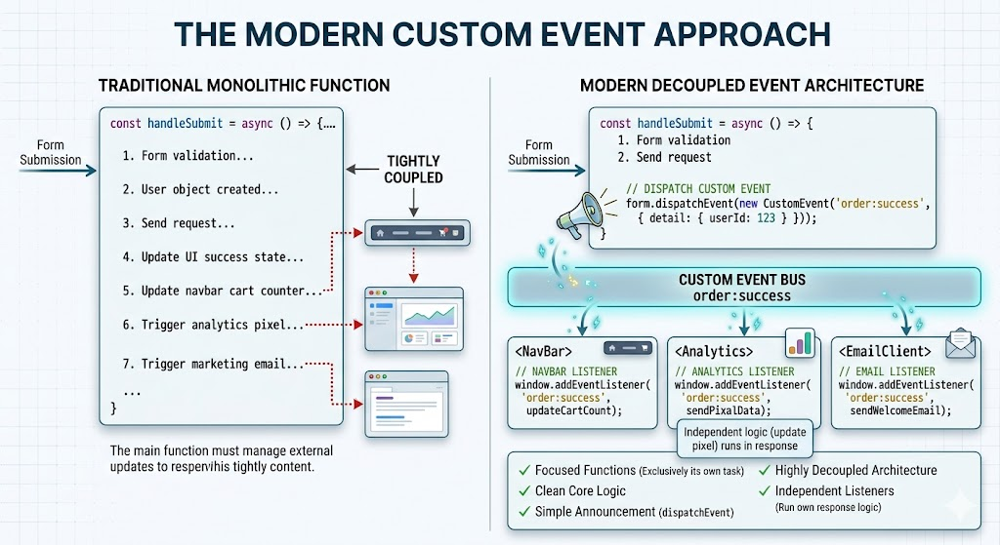

# The \`CustomEvent\` Constructor and Decoupled Architectures

## Complete Guide with Full HTML Examples

### Table of Contents

* [Understanding Custom Events vs. Standard Events](https://www.google.com/search?q=%231-understanding-custom-events-vs-standard-events)
* [The Evolution: Moving from Callbacks to Events](https://www.google.com/search?q=%232-the-evolution-moving-from-callbacks-to-events)
* [The \`CustomEvent\` Constructor & The \`detail\` Property](https://www.google.com/search?q=%233-the-customevent-constructor--the-detail-property)
* [Architectural Benefits: Code Decoupling & Broadcasters](https://www.google.com/search?q=%234-architectural-benefits-code-decoupling--broadcasters)
* [Full Integration Sandbox Demo](https://www.google.com/search?q=%235-full-integration-sandbox-demo)
* [Quick Reference Table](https://www.google.com/search?q=%23quick-reference-table)

---

### 1. Understanding Custom Events vs. Standard Events

Web browsers provide dozens of built-in standard events—such as `click`, `input`, `submit`, and `keydown`. The browser engine monitors hardware inputs or page lifecycle states and automatically fires these events when corresponding actions take place.

**Custom events**, on the other hand, are events that you name, configure, and trigger yourself using JavaScript. Instead of responding to a physical mouse click or a keystroke, custom events let you establish a custom communication layer within your code. Different parts of your application can announce milestones (e.g., `"cart-updated"`, `"theme-swapped"`, or `"video-completed"`) and pass custom payloads back and forth seamlessly.

---

### 2. The Evolution: Moving from Callbacks to Events

When you need to execute a secondary function exactly when a primary task finishes, the most basic solution is to pass a callback function directly into the parent code wrapper.

#### The Legacy Callback Approach

```javascript
function highlightElement(element, callback) {
    element.style.backgroundColor = 'yellow';
    
    // Check if a callback exists and invoke it safely
    if (callback && typeof callback === 'function') {
        callback(element);
    }
}

// Drawback: Hardcoded, tightly bound dependency architecture
highlightElement(myDiv, addRedBorder);

```

While callbacks work well for simple scripts, they quickly create architectural problems as your codebase grows:

* **Tight Coupling:** The `highlightElement` function has to know about, accept, and run the secondary function directly.
* **Rigid Limits:** You can't easily add third or fourth actions later on without modifying the internal logic of the primary function.

#### The Modern Custom Event Approach

By shifting to custom events, the primary function focuses exclusively on its own task. Once finished, it simply announces its completion to the page. Any other independent script can listen for that announcement and run its own logic in response.



---

### 3. The `CustomEvent` Constructor & The `detail` Property

The `CustomEvent` constructor inherits all the core properties of the native `Event` object (such as `bubbles` and `cancelable`) and adds a powerful configuration property called **`detail`**.

```javascript
let myEvent = new CustomEvent(eventType, [, options]);

```

* **`eventType`** *(String)*: A custom name identifying your event (e.g., `'ui:highlight'`, `'order:processed'`).
* **`options`** *(Object)*: An options object that includes a **`detail`** sub-object. This object holds any custom parameters, arrays, state records, or payload data you want to pass to your listeners.

```javascript
// Initializing a custom event with data
let markEvent = new CustomEvent('mark', {
    bubbles: true,
    cancelable: true,
    detail: {
        backgroundColor: 'yellow',
        timestamp: Date.now(),
        userId: 1042
    }
});

```

#### Dispatching the Custom Event

Once created, use the `dispatchEvent()` method on any DOM node to fire the event and send your data through the application:

```javascript
targetElement.dispatchEvent(markEvent);

```

#### Reading the Custom Data Payload

Inside any attached event listener, you can access your passed data directly by reading the **`event.detail`** property object:

```javascript
targetElement.addEventListener('mark', (event) => {
    console.log(`The applied color was: ${event.detail.backgroundColor}`);
    console.log(`The action occurred at: ${event.detail.timestamp}`);
});

```

---

### 4. Architectural Benefits: Code Decoupling

Repurposing your communication layer around custom events provides significant benefits for your application layout:

1. **True Code Decoupling:** The module firing the event does not need to know which elements or scripts are listening to it. It simply broadcasts its state change and leaves, allowing you to write highly independent, modular code.
2. **One-to-Many Broadcasting:** Unlike callbacks (which can only trigger a single function), a custom event can be caught by an infinite number of independent event listeners scattered across completely separate file folders.
3. **Dynamic Script Injections:** You can place event listeners in separate script files or third-party plug-ins. As long as they are listening to the same custom event name, they will execute perfectly without needing modifications to your core codebase.

---

### 5. Full Integration Sandbox Demo

This complete HTML file showcases custom events in action. When the highlight button is clicked, an internal controller updates a workspace box and dispatches a custom event named `ui:highlight`. Multiple independent event listeners catch this event to add a border, update a performance metric log, and output data payload metrics to a terminal window.

```html
<!DOCTYPE html>
<html lang="en">
<head>
    <meta charset="UTF-8">
    <meta name="viewport" content="width=device-width, initial-scale=1.0">
    <title>Comprehensive Custom Events Laboratory</title>
    <style>
        body { font-family: Arial, sans-serif; padding: 25px; background-color: #f5f6fa; color: #2f3640; }
        .grid { display: grid; grid-template-columns: 1fr 1fr; gap: 25px; max-width: 1100px; }
        .card { border: 1px solid #dcdde1; padding: 25px; border-radius: 8px; background: #ffffff; box-shadow: 0 4px 6px rgba(0,0,0,0.05); }
        
        /* Interactive Box Target Frame */
        #workspace-note { padding: 30px; font-size: 18px; font-weight: bold; border-radius: 6px; background-color: #f1f2f6; text-align: center; border: 2px solid transparent; transition: all 0.3s; margin-bottom: 15px; }
        
        .action-btn { width: 100%; padding: 12px; background-color: #3b82f6; color: white; border: none; border-radius: 6px; font-size: 15px; font-weight: bold; cursor: pointer; }
        .action-btn:hover { background-color: #2563eb; }
        pre { background: #2f3640; color: #f5f6fa; padding: 15px; border-radius: 6px; font-size: 13px; font-family: monospace; min-height: 120px; white-space: pre-wrap; }
        .counter-badge { float: right; padding: 2px 8px; background: #718093; color: white; border-radius: 10px; font-size: 12px; }
    </style>
</head>
<body>

    <h1>JavaScript Custom Events Laboratory</h1>
    <p>Demonstrating one-to-many code broadcasting with complete decoupling architecture tools:</p>
    
    <div class="grid">
        <div class="card">
            <h3>1. Interactive Target Container</h3>
            <div id="workspace-note">Interactive Target Content Layer</div>
            <button id="btn-trigger" class="action-btn">Run Highlight & Dispatch Custom Event</button>
        </div>

        <div class="card">
            <h3>2. Dynamic Multicast Observers</h3>
            <p>Three independent listeners are catching the <code>"ui:highlight"</code> event at the exact same time:</p>
            
            <div style="margin-bottom: 10px;">
                <b>Listener A (Border Injector Status):</b> <span id="status-border" style="color:#718093; font-weight:bold;">Inactive</span>
            </div>
            <div style="margin-bottom: 15px;">
                <b>Listener B (Execution Counter):</b> <span id="status-counter" class="counter-badge">0</span> Active Dispatches
            </div>
            
            <b>Listener C (Payload Data Terminal Inspector):</b>
            <pre id="payload-terminal">Awaiting custom event detail payload data dictionary...</pre>
        </div>
    </div>

    <script>
        const targetNote = document.getElementById('workspace-note');
        const triggerBtn = document.getElementById('btn-trigger');
        
        // --- Core Engine Broadcasting Logic ---
        function runHighlightEngine(element) {
            const selectedColor = '#fff9db'; // Warm Amber Yellow tint
            
            // 1. Perform primary action task
            element.style.backgroundColor = selectedColor;

            // 2. Build the CustomEvent container alongside a data payload object
            const highlightEvent = new CustomEvent('ui:highlight', {
                bubbles: true,
                cancelable: true,
                detail: {
                    hexColor: selectedColor,
                    timestamp: new Date().toLocaleTimeString(),
                    executionId: Math.floor(Math.random() * 9000) + 1000
                }
            });

            // 3. Dispatch the event outward into the system DOM layout
            element.dispatchEvent(highlightEvent);
        }

        // Connect the button to run our core engine function
        triggerBtn.addEventListener('click', () => {
            runHighlightEngine(targetNote);
        });

        // =========================================================================
        // DECOUPLED MULTICAST LISTENERS (Could reside in completely separate files)
        // =========================================================================

        // --- Listener A: Modifies the element border style ---
        targetNote.addEventListener('ui:highlight', function(event) {
            this.style.borderColor = '#fab005'; // Amber border accent line
            document.getElementById('status-border').textContent = "✓ Success Border Added";
            document.getElementById('status-border').style.color = "#22c55e";
        });

        // --- Listener B: Increments an independent metrics counter ---
        let globalClickCount = 0;
        targetNote.addEventListener('ui:highlight', () => {
            globalClickCount++;
            document.getElementById('status-counter').textContent = globalClickCount;
        });

        // --- Listener C: Reads and prints the event.detail custom payload data ---
        const payloadTerminal = document.getElementById('payload-terminal');
        targetNote.addEventListener('ui:highlight', (event) => {
            payloadTerminal.textContent = `[Listener C intercepted Event Payload!]\n` +
                `-----------------------------------------\n` +
                `• Captured Event Name : "${event.type}"\n` +
                `• event.detail.hexColor:  "${event.detail.hexColor}"\n` +
                `• event.detail.timestamp: "${event.detail.timestamp}"\n` +
                `• event.detail.executionId: ${event.detail.executionId}`;
        });
    </script>
</body>
</html>

```

---

### Quick Reference Table

| API Specification Element | Variable Payload / Configuration Rules | Operational Objective Description |
| --- | --- | --- |
| **`new CustomEvent()`** | Constructor Method | Instantiates a brand new custom event object using a unique system name identifier. |
| **`type`** *(Parameter 1)* | String format notation (e.g., `'cart:updated'`) | Defines the descriptive name used by listeners to watch for your custom event. |
| **`options.detail`** *(Parameter 2)* | Structured Object Map (`{ data: value }`) | **The custom data payload.** Stores arrays, strings, strings, or numbers passed directly to your listeners. |
| **`element.dispatchEvent()`** | Method Execution Interface | Fires your custom event on a target element, sending it up the DOM tree for listeners to catch. |
| **`event.detail`** | Read-Only Property Accessor | Used inside event listeners to read the custom data payload passed by the event. |
| **Architectural Purpose** | **Code Decoupling & Multicasting** | Allows completely separate parts of your application to communicate asynchronously without hardcoded dependencies. |

---