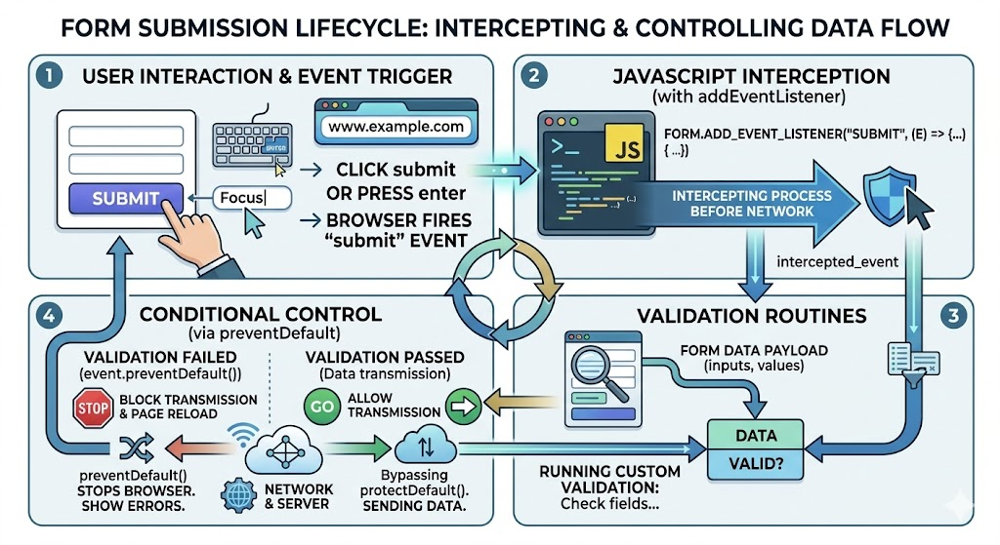
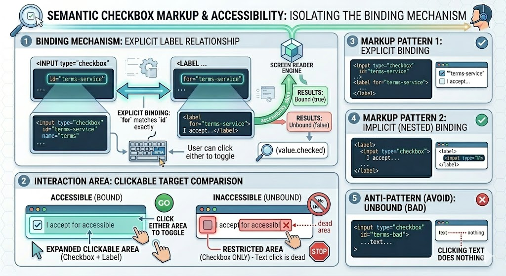

# Form Handling & Validation

## Complete Guide with Full HTML Examples

### Table of Contents

* [Form Element Basics](https://www.google.com/search?q=%231-form-element-basics)
* [Referencing Forms and Fields](https://www.google.com/search?q=%232-referencing-forms-and-fields)
* [Intercepting and Controlling Form Submission](https://www.google.com/search?q=%233-intercepting-and-controlling-form-submission)
* [Client-Side Validation Architecture](https://www.google.com/search?q=%234-client-side-validation-architecture)
* [Full Integration Sandbox Demo](https://www.google.com/search?q=%235-full-integration-sandbox-demo)
* [Quick Reference Table](https://www.google.com/search?q=%23quick-reference-table)

---

### 1. Form Element Basics

HTML forms use the `<form>` wrapper tag to bundle interactive fields and send collected input values to a web server.

The structure is defined by two primary attributes:

* **`action`**: The URL endpoint destination where the browser transmits the packaged input payload data.
* **`method`**: The HTTP method used for transmission (typically `GET` or `POST`).
* **`GET`**: Appends your field inputs directly to the URL string (e.g., `/search?query=javascript`). This is ideal for safe, idempotent interactions like search bars or filters.
* **`POST`**: Encapsulates data safely inside the HTTP request body. Use this whenever you create or update database records, handle sensitive user details, or process file uploads.


In the DOM, the browser maps this element to the **`HTMLFormElement`** object interface, providing direct properties like `form.action` and `form.method` along with built-in runtime methods like `form.reset()` and `form.submit()`.

---

### 2. Referencing Forms and Fields

JavaScript provides multiple structural APIs to query form elements and their child inputs.

#### Accessing Form Objects

You can fetch form elements using standard DOM query hooks, or by accessing the global window forms collection array index:

```javascript
// Method A: Standard selector query hook
const loginForm = document.getElementById('login-form');

// Method B: Using the global document.forms collection
const firstForm = document.forms[0]; // Returns the first form element rendered in the layout

```

#### Accessing Child Input Fields

While methods like `document.getElementById` work perfectly fine for single targets, the cleanest approach is to use the **`form.elements`** property. This returns an `HTMLFormControlsCollection` allowing you to look up elements by their numerical layout index, their unique `id`, or their `name` attribute:

```javascript
const userForm = document.getElementById('signup-form');

// Accessing an input via three alternative lookups:
const fieldByIndex = userForm.elements[0];        // 1. Array-style structural index
const fieldByName  = userForm.elements['username']; // 2. HTML 'name' attribute key
const fieldById    = userForm.elements['user-id'];  // 3. HTML 'id' attribute key

// Extracting active text inputs
let currentInputValue = fieldByName.value;

```

---

### 3. Intercepting and Controlling Form Submission

When a user clicks a button with the attribute `type="submit"`, or presses the `Enter` key inside a focused input field, the browser automatically fires a **`submit`** event before sending the payload out over the network.



#### Intercepting Submission with `event.preventDefault()`

By listening for the `submit` event, you can intercept the submission process and run validation routines. If any field inputs fail your validation rules, calling **`event.preventDefault()`** stops the browser from reloading the page or sending data to the server.

```javascript
const checkoutForm = document.getElementById('checkout');

checkoutForm.addEventListener('submit', (event) => {
    // Stop the default browser submission loop
    event.preventDefault();
    
    // Custom evaluation rules run here...
});

```

#### Programmatic Submission via `form.submit()`

You can also force a form to submit programmatically by calling the built-in **`form.submit()`** method.

*CRITICAL ARCHITECTURAL NOTE:* Calling `form.submit()` directly via script code **does not** trigger your form's `submit` event listener. Because of this, you must always run and pass all validation checks *before* calling `form.submit()`.

---

### 4. Client-Side Validation Architecture



A clean validation pattern relies on helper utilities to isolate your business rules from your DOM manipulation logic:

1. **State Evaluation:** Extract field values and remove leading or trailing whitespaces using `.trim()`. Check values against validation rules or regular expressions (`RegExp`).
2. **UI Feedback Routing:** Traverse the DOM upward to find parent container wrappers (like a `.field-group` container) using `input.parentNode`. Locate placeholder tags (like `<small>`) to inject user-friendly error text.
3. **Class Style Injections:** Dynamically swap class names like `.success` or `.error` on input fields to give immediate, accessible visual feedback.

---

### 5. Full Integration Sandbox Demo

This complete, production-ready HTML template features a full signup form layout. It includes validation rules for empty fields, a robust email address regex parser, dynamic UI styling updates, and a structured submission loop:

```html
<!DOCTYPE html>
<html lang="en">
<head>
    <meta charset="UTF-8">
    <meta name="viewport" content="width=device-width, initial-scale=1.0">
    <title>Comprehensive Form Validation Engine</title>
    <style>
        body { font-family: Arial, sans-serif; padding: 30px; background-color: #f1f5f9; color: #1e293b; }
        .form-card { background: #ffffff; max-width: 450px; margin: 0 auto; padding: 30px; border-radius: 8px; box-shadow: 0 4px 10px rgba(0, 0, 0, 0.08); }
        h1 { margin-top: 0; font-size: 24px; color: #0f172a; text-align: center; }
        
        .field-group { margin-bottom: 20px; position: relative; }
        label { display: block; margin-bottom: 6px; font-weight: bold; font-size: 14px; }
        
        input[type="text"] { width: 100%; padding: 10px 12px; font-size: 15px; border: 2px solid #cbd5e1; border-radius: 6px; box-sizing: border-box; transition: all 0.2s ease-in-out; }
        input[type="text"]:focus { outline: none; border-color: #3b82f6; }
        
        /* Validation State Styling Rules */
        input.error { border-color: #ef4444 !important; background-color: #fef2f2; }
        input.success { border-color: #22c55e !important; background-color: #f0fdf4; }
        
        small { display: block; color: #ef4444; font-size: 12px; font-weight: bold; margin-top: 5px; min-height: 18px; }
        
        .submit-btn { width: 100%; padding: 12px; background-color: #2563eb; color: white; border: none; border-radius: 6px; font-size: 16px; font-weight: bold; cursor: pointer; transition: background 0.2s; }
        .submit-btn:hover { background-color: #1d4ed8; }
    </style>
</head>
<body>

    <div class="form-card">
        <h1>Create Account</h1>
        
        <form action="/register-endpoint" method="POST" id="signup-form">
            
            <div class="field-group">
                <label for="name-field">Full Name</label>
                <input type="text" id="name-field" name="username" placeholder="John Doe">
                <small id="error-username"></small>
            </div>
            
            <div class="field-group">
                <label for="email-field">Email Address</label>
                <input type="text" id="email-field" name="email" placeholder="john@example.com">
                <small id="error-email"></small>
            </div>
            
            <button type="submit" class="submit-btn">Register Account</button>
        </form>
    </div>

    <script>
        const signupForm = document.getElementById('signup-form');
        
        // Validation Messaging Dictionary Constants
        const MSG_NAME_REQ = "Please enter your name.";
        const MSG_EMAIL_REQ = "Please enter your email address.";
        const MSG_EMAIL_INV = "Please enter a valid email address format.";

        // --- 1. UI Rendering Utility ---
        function setFieldState(inputElement, errorMessage, isSuccess) {
            // Traverse up to find the parent container, then locate its error placeholder
            const errorPlaceholder = inputElement.parentNode.querySelector('small');
            errorPlaceholder.innerText = errorMessage;
            
            // Toggle corresponding success/error CSS helper classes
            inputElement.className = isSuccess ? "success" : "error";
            return isSuccess;
        }

        // --- 2. Presence/Value Check Rule ---
        function checkRequired(inputElement, requiredMessage) {
            if (inputElement.value.trim() === "") {
                return setFieldState(inputElement, requiredMessage, false);
            }
            return setFieldState(inputElement, "", true);
        }

        // --- 3. Format/Pattern Check Rule ---
        function checkEmailFormat(inputElement, requiredMessage, invalidMessage) {
            // First check if the field is empty using our existing utility
            if (!checkRequired(inputElement, requiredMessage)) {
                return false; 
            }
            
            // Standard email evaluation regular expression pattern
            const emailRegex = /^[^\s@]+@[^\s@]+\.[^\s@]+$/;
            const currentEmailValue = inputElement.value.trim();
            
            if (!emailRegex.test(currentEmailValue)) {
                return setFieldState(inputElement, invalidMessage, false);
            }
            return setFieldState(inputElement, "", true);
        }

        // --- 4. Main Event Listener Loop ---
        signupForm.addEventListener('submit', (event) => {
            // Step A: Stop automatic browser submission
            event.preventDefault();

            // Step B: Run validation checks across form elements
            const nameTargetField = signupForm.elements['username'];
            const emailTargetField = signupForm.elements['email'];

            let isNameValid = checkRequired(nameTargetField, MSG_NAME_REQ);
            let isEmailValid = checkEmailFormat(emailTargetField, MSG_EMAIL_REQ, MSG_EMAIL_INV);

            // Step C: Conditionally submit data if all checks pass
            if (isNameValid && isEmailValid) {
                alert("Validation Passed! Submitting form data to server endpoint...");
                
                // Programmatically fire the native transmission process
                signupForm.submit(); 
            }
        });
    </script>
</body>
</html>

```

---

### Quick Reference Table

| Target API Method / Property | Expected Evaluation Data Type | Primary Practical Purpose | Notable Behavioral Exceptions |
| --- | --- | --- | --- |
| **`document.forms`** | `HTMLFormControlsCollection` | Returns an array-like list of every `<form>` element rendered on the current webpage. | Read-only structural breakdown list. |
| **`form.elements`** | `HTMLFormControlsCollection` | Gives direct access to a form's input fields via their array index, `id`, or `name` attribute. | Includes only form controls (excludes structural formatting elements like `div`). |
| **`event.preventDefault()`** | Method Execution | Stops the browser's default submit behavior, preventing page reloads or data transmission. | Must be called inside an active event listener function wrapper block. |
| **`form.submit()`** | Method Execution | Programmatically commands the browser to submit the form data to its defined action URL. | **Does not** fire your form's `submit` event listener. Run validation routines manually *before* execution. |
| **`form.reset()`** | Method Execution | Clears all input fields within the targeted form, restoring their default initial markup values. | Instantly clears values; cannot be reversed unless values are cached. |

---