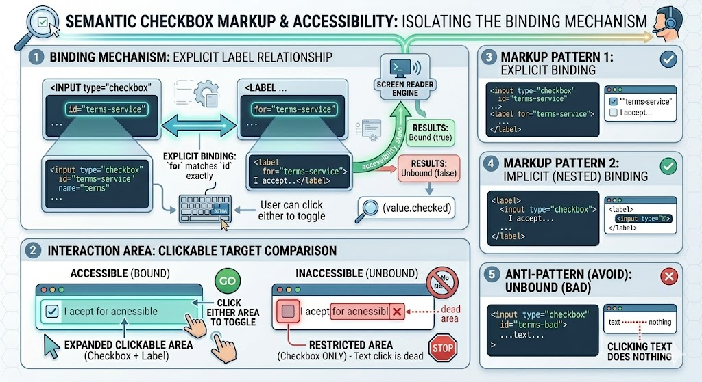

# Checkboxes 

## Complete Guide with Full HTML Examples

### Table of Contents

* [Semantic Checkbox Markup and Accessibility](https://www.google.com/search?q=%231-semantic-checkbox-markup-and-accessibility)
* [Evaluating Checkbox States (\`.checked\` vs. \`:checked\`)](https://www.google.com/search?q=%232-evaluating-checkbox-states-checked-vs-checked)
* [Extracting Checkbox Values (Single vs. Multi-Select Groups)](https://www.google.com/search?q=%233-extracting-checkbox-values-single-vs-multi-select-groups)
* [Implementing a "Select All / Unselect All" Master Control Toggle](https://www.google.com/search?q=%234-implementing-a-select-all--unselect-all-master-control-toggle)
* [Dynamically Generating Checkboxes from Data Collections](https://www.google.com/search?q=%235-dynamically-generating-checkboxes-from-data-collections)
* [Full Integration Sandbox Demo](https://www.google.com/search?q=%236-full-integration-sandbox-demo)
* [Quick Reference Table](https://www.google.com/search?q=%23quick-reference-table)

---

### 1. Semantic Checkbox Markup and Accessibility

An HTML checkbox is created using the `<input>` tag with `type="checkbox"`. To ensure clean accessibility (aiding screen readers and creating a better user experience), a checkbox should always be structurally bound to a `<label>` element.

Binding a label to an input gives users a much larger clickable area, letting them click either the checkbox box itself or its descriptive text label to toggle its state.



#### Patterns for Structuring Checkboxes

```html
<input type="checkbox" id="terms-service" name="terms" value="agree">
<label for="terms-service">I accept the terms and conditions</label>

<label>
    <input type="checkbox" name="terms" value="agree">
    I accept the terms and conditions
</label>

<input type="checkbox" id="terms-bad"> I accept the terms and conditions (Clicking this text does nothing)

```

*Architectural Note:* When using explicit binding (**Pattern A**), the value of the label's `for` attribute must match the `id` string of the `<input>` element exactly.

---

### 2. Evaluating Checkbox States (`.checked` vs. `:checked`)

A checkbox element handles its state using boolean parameters rather than text strings. You can check if a checkbox is selected or unselected in JavaScript using two distinct evaluation approaches:

#### Approach A: Reading the `.checked` Element Property

The most direct way to check a checkbox's state is to query the element node and inspect its read-only boolean **`checked`** property:

```javascript
const termsCheckbox = document.querySelector('#terms-service');

if (termsCheckbox.checked) {
    console.log("The box is checked (true)");
} else {
    console.log("The box is unchecked (false)");
}

```

#### Approach B: Querying with the `:checked` CSS Pseudo-Class Selector

Alternatively, you can look for checkboxes that are actively selected directly within your query selector using the CSS `:checked` pseudo-class:

```javascript
// Attempt to find an active element matching the selector criteria
const activeCheckbox = document.querySelector('#terms-service:checked');

// If no matching element is currently checked, querySelector returns null
const isBoxSelected = (activeCheckbox !== null);

```

---

### 3. Extracting Checkbox Values

Understanding how a checkbox manages its `value` attribute is essential for gathering and processing form data correctly:

#### The Default Single Checkbox Trapping Loop

If you read the `.value` property of a basic checkbox element that does not have an explicitly defined `value=""` attribute in its HTML markup, it will **always return the string value `"on"**`—regardless of whether the box is checked or unchecked. Because of this, you should look at the `.checked` property (true/false) to determine whether a single checkbox is selected, rather than checking its value.

#### Collecting Multi-Select Checkbox Groups

When building a questionnaire or filter panel with a group of related options, you give multiple checkboxes the exact same `name` attribute, but assign a unique `value` string to each individual item:

```javascript
// Select all elements matching the group name that are actively checked
let selectedBoxes = document.querySelectorAll('input[name="marketing-channels"]:checked');
let chosenValues = [];

// Loop through the filtered collection and extract their values
selectedBoxes.forEach((box) => {
    chosenValues.push(box.value);
});

console.log('User selections:', chosenValues); // Outputs selected values, e.g., ["email", "sms"]

```

---

### 4. Implementing a "Select All / Unselect All" Master Control Toggle

Managing multiple checkboxes simultaneously is a common pattern in web applications (e.g., selecting all emails in an inbox to batch delete them).

To build a master control toggle, create an event listener that catches changes on a main "Select All" checkbox. When triggered, loop through the collection of child checkboxes and update their `.checked` properties to match the master toggle's active state:

[Image flowchart showing a master checkbox control toggling true or false and updating a loop of sub-checkbox input elements to match its state]

```javascript
const masterToggle = document.getElementById('select-all-master');
const structuralCheckboxes = document.querySelectorAll('input[name="item-row"]');

masterToggle.addEventListener('change', (event) => {
    // Loop through each sub-checkbox and apply the master checkbox's state
    structuralCheckboxes.forEach((checkbox) => {
        checkbox.checked = event.target.checked;
    });
});

```

---

### 5. Dynamically Generating Checkboxes from Data Collections

When working with data from external APIs or databases, you will often need to generate your checkbox interfaces dynamically at runtime. You can accomplish this cleanly using either programmatic DOM creation methods or string interpolation templates:

#### Method A: Programmatic Generation via `document.createElement`

This structured approach uses standard DOM methods to instantiate nodes individually, making it highly secure against cross-site scripting (XSS) issues:

```javascript
const categories = ['Tech', 'Health', 'Finance'];
const targetContainer = document.getElementById('checkbox-container');

categories.forEach((category) => {
    const wrapperLabel = document.createElement('label');
    const uniqueId = `cat-${category.toLowerCase()}`;
    
    wrapperLabel.setAttribute('for', uniqueId);
    
    const inputNode = document.createElement('input');
    inputNode.type = 'checkbox';
    inputNode.id = uniqueId;
    inputNode.name = 'category-group';
    inputNode.value = category.toLowerCase();
    
    // Assemble the elements structurally
    wrapperLabel.appendChild(inputNode);
    wrapperLabel.appendChild(document.createTextNode(` ${category}`));
    targetContainer.appendChild(wrapperLabel);
});

```

#### Method B: Generation via Template Literals and `.innerHTML`

This alternative approach uses JavaScript array transformations (`.map()`) and string interpolation to quickly generate the clean HTML markup strings before injecting them into the DOM:

```javascript
const options = ['Red', 'Green', 'Blue'];

const dynamicMarkup = options.map(color => `
    <label for="color-${color.toLowerCase()}">
        <input type="checkbox" name="color-group" id="color-${color.toLowerCase()}" value="${color.toLowerCase()}"> ${color}
    </label>
`).join(' ');

document.getElementById('checkbox-container').innerHTML = dynamicMarkup;

```

---

### 6. Full Integration Sandbox Demo

This standalone HTML file combines all of these concepts into a functional interface. It features a master selection framework, dynamic dataset rendering, state verification tools, and an interactive log terminal.

```html
<!DOCTYPE html>
<html lang="en">
<head>
    <meta charset="UTF-8">
    <meta name="viewport" content="width=device-width, initial-scale=1.0">
    <title>Comprehensive Checkbox Engine Laboratory</title>
    <style>
        body { font-family: Arial, sans-serif; padding: 25px; background-color: #f8fafc; color: #1e293b; }
        .grid { display: grid; grid-template-columns: 1fr 1fr; gap: 25px; max-width: 1150px; }
        .card { border: 1px solid #e2e8f0; padding: 25px; border-radius: 8px; background: #ffffff; box-shadow: 0 4px 6px rgba(0,0,0,0.02); }
        
        .control-group { margin-bottom: 15px; padding-bottom: 15px; border-bottom: 2px dashed #e2e8f0; }
        
        /* Checkbox list layout design wrapper options */
        .checkbox-stack { display: flex; flex-direction: column; gap: 10px; margin-bottom: 20px; }
        label { display: flex; align-items: center; gap: 10px; padding: 8px 12px; background: #f1f5f9; border-radius: 6px; cursor: pointer; user-select: none; transition: background 0.2s; }
        label:hover { background-color: #e2e8f0; }
        
        input[type="checkbox"] { width: 18px; height: 18px; cursor: pointer; }
        
        .action-btn { padding: 10px 16px; background-color: #3b82f6; color: white; border: none; border-radius: 6px; font-weight: bold; cursor: pointer; }
        .action-btn:hover { background-color: #2563eb; }
        pre { background: #0f172a; color: #f8fafc; padding: 15px; border-radius: 6px; font-size: 13px; font-family: monospace; min-height: 120px; white-space: pre-wrap; }
    </style>
</head>
<body>

    <h1>JavaScript Checkbox Engine Laboratory</h1>
    
    <div class="grid">
        <div class="card">
            <h3>1. Interactive Subscription Form</h3>
            
            <div class="control-group">
                <label style="background: #e0f2fe;">
                    <input type="checkbox" id="master-select-all">
                    <strong>Toggle All Topic Selections</strong>
                </label>
            </div>

            <div id="dynamic-checkbox-container" class="checkbox-stack">
                </div>

            <button id="btn-process" class="action-btn">Compile Checked Values</button>
        </div>

        <div class="card">
            <h3>2. Dynamic Execution Log Terminal</h3>
            <p>Real-time telemetry reports capturing checking parameters within the browser layout:</p>
            <pre id="diagnostic-terminal">Awaiting calculation analysis parameters...</pre>
        </div>
    </div>

    <script>
        const checkboxContainer = document.getElementById('dynamic-checkbox-container');
        const masterSelect = document.getElementById('master-select-all');
        const processBtn = document.getElementById('btn-process');
        const diagnosticTerminal = document.getElementById('diagnostic-terminal');

        // Sample data model array representing database options
        const topicsDataset = ["Frontend", "Backend", "Database", "Security", "DevOps"];

        // --- 1. Programmatic Initialization Routine ---
        function initializeComponent() {
            // Build collection string using array mapping utilities
            const renderedHtml = topicsDataset.map(topic => {
                const standardizedId = `topic-${topic.toLowerCase()}`;
                return `
                    <label for="${standardizedId}">
                        <input type="checkbox" name="topic-selection" id="${standardizedId}" value="${topic.toLowerCase()}">
                        <span>Development Topic: <b>${topic}</b></span>
                    </label>
                `;
            }).join('');
            
            checkboxContainer.innerHTML = renderedHtml;
        }

        // --- 2. Master Checkbox Toggle Processing Logic ---
        masterSelect.addEventListener('change', (event) => {
            const childCheckboxes = checkboxContainer.querySelectorAll('input[name="topic-selection"]');
            const targetState = event.target.checked;
            
            childCheckboxes.forEach((checkbox) => {
                checkbox.checked = targetState;
            });
            
            diagnosticTerminal.textContent = `Master Control Alert: Synchronized all child checkbox states to: "${targetState}"`;
        });

        // --- 3. Gather Checked Items and Process Selection Value Payloads ---
        processBtn.addEventListener('click', () => {
            // Filter down exclusively to checkbox nodes that are actively checked
            const checkedItems = checkboxContainer.querySelectorAll('input[name="topic-selection"]:checked');
            
            let accumulatedValues = [];
            checkedItems.forEach((checkbox) => {
                accumulatedValues.push(checkbox.value);
            });

            // Update diagnostic terminal output display
            if (accumulatedValues.length === 0) {
                diagnosticTerminal.textContent = `Processing Pipeline Results:\n-----------------------------\n⚠ No selection components are checked right now.`;
            } else {
                diagnosticTerminal.textContent = `Processing Pipeline Results:\n-----------------------------\n` +
                    `• Total Checked Counter: ${accumulatedValues.length}\n` +
                    `• Compiled Array Values : ${JSON.stringify(accumulatedValues)}`;
            }
        });

        // Initialize component generation on page load
        initializeComponent();
    </script>
</body>
</html>

```

---

### Quick Reference Table

| Target API Property / Selector | Expected Structural Data Type | Core Functional Operational Purpose | Critical Behavioral Exception Caveats |
| --- | --- | --- | --- |
| **`checkbox.checked`** | Read/Write Boolean | Checks or sets whether a checkbox is checked (`true`) or unchecked (`false`). | The standard, recommended property to track checkbox toggle states. |
| **`checkbox.value`** | String Parameter | Returns the assigned text string token value of the checkbox node. | Defaults to **`"on"`** if you don't explicitly define a `value=""` attribute in the HTML markup. |
| **`input[name="x"]:checked`** | CSS Query Filter Selection | Instantly queries only the checkboxes inside group name "x" that are actively checked. | Returns `null` (with `querySelector`) or an empty list (with `querySelectorAll`) if no elements are checked. |
| **`checkbox.type = "checkbox"`** | Configuration String | Programmatically configures a native `<input>` element to act as a checkbox component. | Must be set before appending your dynamic element nodes to the DOM tree layout. |
| **`label.setAttribute('for', id)`** | Method Execution Interface | Links a descriptive text label element to an explicit checkbox ID for accessibility. | The value string must match your target input's structural `id` parameter exactly. |

---