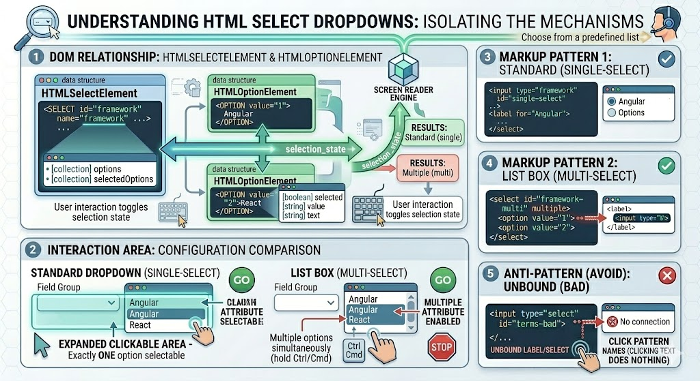

# The Select Element 

## Complete Guide with Full HTML Examples

### Table of Contents

* [Understanding HTML Select Dropdowns](https://www.google.com/search?q=%231-understanding-html-select-dropdowns)
* [The \`HTMLSelectElement\` Type & Key Properties](https://www.google.com/search?q=%232-the-htmlselectelement-type--key-properties)
* [Evaluating Single-Select Values & Indexes](https://www.google.com/search?q=%233-evaluating-single-select-values--indexes)
* [The \`HTMLOptionElement\` Type & Options Collection](https://www.google.com/search?q=%234-the-htmloptionelement-type--options-collection)
* [Handling Multiple Selection Lists](https://www.google.com/search?q=%235-handling-multiple-selection-lists)
* [Full Integration Sandbox Demo](https://www.google.com/search?q=%236-full-integration-sandbox-demo)
* [Quick Reference Table](https://www.google.com/search?q=%23quick-reference-table)

---

### 1. Understanding HTML Select Dropdowns

The HTML `<select>` element creates an interactive control that lets users choose from a list of predefined options. Depending on its markup attributes, it operates in one of two configurations:

* **Standard Dropdown (Single-Select):** Displays a collapsed item list, allowing exactly one selection.
* **List Box (Multi-Select):** Enabled by adding the **`multiple`** attribute. This renders an expanded box interface that allows users to select multiple options simultaneously (by holding down `Ctrl` or `Cmd`).



```html
<select id="framework">
    <option value="1">Angular</option>
    <option value="2">React</option>
</select>

<select id="framework-multi" multiple>
    <option value="1">Angular</option>
    <option value="2">React</option>
</select>

```

---

### 2. The `HTMLSelectElement` Type & Key Properties

In the Document Object Model, the `<select>` element is represented by the `HTMLSelectElement` object interface. This type provides several specialized properties for inspecting and managing drop-down states:

* **`selectedIndex`**: A zero-based index value representing the currently selected item. If no item is selected, it returns `-1`. In multi-select modes, it returns the index of the *first* selected option.
* **`value`**: Returns the `value` string of the first selected option. If the list is empty or unselected, it returns an empty string (`""`).
* **`multiple`**: A boolean value that returns `true` if the `<select>` element allows multiple selections, corresponding to the HTML attribute.

---

### 3. Evaluating Single-Select Values & Indexes

The `select.value` property automatically evaluates its data token based on how your child `<option>` tags are declared in the HTML markup:

1. **Option with a defined value:** `select.value` returns that explicit string value attribute.
2. **Option with an empty value tag (`value=""`):** `select.value` returns an empty string (`""`).
3. **Option without a value attribute:** `select.value` falls back and returns the literal **visible text content** found inside the option tag.

[Image flow chart illustrating how select.value resolves its value property by checking for a value attribute, an empty string, or falling back to the inner text content]

```javascript
const selectBox = document.querySelector('#framework');

// Retrieve the active choice's index positions
console.log(selectBox.selectedIndex); // e.g., Returns 1 for the second option

// Retrieve the active choice's computed token
console.log(selectBox.value); // e.g., Returns "react"

```

---

### 4. The `HTMLOptionElement` Type & Options Collection

Every individual `<option>` element inside a dropdown is represented by an **`HTMLOptionElement`** node. This sub-interface provides four key properties:

* **`index`**: The zero-based numerical layout order of the option within the parent dropdown.
* **`selected`**: A boolean property indicating if the option is currently highlighted. You can programmatically set this to `true` to select an option via code.
* **`text`**: Gets or sets the visible label text displayed to the user.
* **`value`**: Gets or sets the underlying data string attribute.

The parent `<select>` element exposes an **`options`** property, which returns an `HTMLOptionsCollection` containing all child options. You can use this collection alongside `selectedIndex` to precisely isolate the selected option node:

```javascript
const dropdown = document.querySelector('#framework');

// Access the second option in the list
const secondOption = dropdown.options[1];
console.log(secondOption.text, secondOption.value);

// Isolate the selected option node directly
const activeOption = dropdown.options[dropdown.selectedIndex];
console.log(`User selected: ${activeOption.text} (Value: ${activeOption.value})`);

```

---

### 5. Handling Multiple Selection Lists

Because the `select.options` collection returns an array-like object rather than a true JavaScript Array, it lacks modern array methods like `.filter()` or `.map()`.

To gather selected values from a multi-select list (`multiple`), you can use **`Array.from()`** to convert the options collection into a proper array, or iterate through them using a standard `for...of` loop:

#### Modern Compilation Loop via `Array.from()`

```javascript
const multiSelect = document.querySelector('#framework-multi');

// Convert the collection to a true array, filter for selected options, and map their text values
const selectedTextLabels = Array.from(multiSelect.options)
    .filter(option => option.selected)
    .map(option => option.text);

console.log(selectedTextLabels); // e.g., ["React", "Vue.js"]

```

#### Traditional Loop Approach

```javascript
const multiSelect = document.querySelector('#framework-multi');
const selectedValues = [];

for (const option of multiSelect.options) {
    if (option.selected) {
        selectedValues.push(option.value);
    }
}

```

---

### 6. Full Integration Sandbox Demo

This standalone HTML file demonstrates how to manage both single and multi-select components. It features runtime value evaluation, text label extraction, and a real-time diagnostic logging terminal.

```html
<!DOCTYPE html>
<html lang="en">
<head>
    <meta charset="UTF-8">
    <meta name="viewport" content="width=device-width, initial-scale=1.0">
    <title>Comprehensive Select Box Laboratory</title>
    <style>
        body { font-family: Arial, sans-serif; padding: 25px; background-color: #f8fafc; color: #0f172a; }
        .grid { display: grid; grid-template-columns: 1fr 1fr; gap: 25px; max-width: 1100px; }
        .card { border: 1px solid #e2e8f0; padding: 25px; border-radius: 8px; background: #ffffff; box-shadow: 0 4px 6px rgba(0,0,0,0.02); }
        
        .field-group { margin-bottom: 20px; }
        label { display: block; margin-bottom: 8px; font-weight: bold; font-size: 14px; }
        
        select { width: 100%; padding: 10px; font-size: 15px; border: 2px solid #cbd5e1; border-radius: 6px; background-color: #fff; outline: none; }
        select:focus { border-color: #3b82f6; }
        select[multiple] { height: 110px; }
        
        .action-btn { width: 100%; padding: 10px; background-color: #3b82f6; color: white; border: none; border-radius: 6px; font-weight: bold; cursor: pointer; margin-top: 5px; margin-bottom: 15px; }
        .action-btn:hover { background-color: #2563eb; }
        pre { background: #0f172a; color: #f8fafc; padding: 15px; border-radius: 6px; font-size: 13px; font-family: monospace; min-height: 150px; white-space: pre-wrap; }
    </style>
</head>
<body>

    <h1>JavaScript Select Element Interface Laboratory</h1>
    
    <div class="grid">
        <div class="card">
            <form id="dropdown-form">
                
                <div class="field-group">
                    <label for="single-framework">1. Preferred Framework (Single-Select)</label>
                    <select id="single-framework">
                        <option value="">-- Choose Option --</option>
                        <option value="ang">Angular</option>
                        <option value="rct">React</option>
                        <option>Ember.js</option> </select>
                </div>
                <button type="button" id="btn-analyze-single" class="action-btn">Compile Single Selection</button>

                <div class="field-group">
                    <label for="multi-framework">2. Additional Tooling (Multi-Select - Hold Ctrl/Cmd)</label>
                    <select id="multi-framework" multiple>
                        <option value="v">Vue.js</option>
                        <option value="s">Svelte</option>
                        <option value="n">Next.js</option>
                        <option value="nux">Nuxt.js</option>
                    </select>
                </div>
                <button type="button" id="btn-analyze-multi" class="action-btn" style="background-color: #10b981;">Compile Multiple Selections</button>
                
            </form>
        </div>

        <div class="card">
            <h3>Runtime Diagnostic Output Terminal</h3>
            <pre id="diagnostic-terminal">Awaiting option interactions or evaluation requests...</pre>
        </div>
    </div>

    <script>
        const singleSelect = document.getElementById('single-framework');
        const multiSelect = document.getElementById('multi-framework');
        const terminal = document.getElementById('diagnostic-terminal');

        // --- 1. Single Selection Processing Logic ---
        document.getElementById('btn-analyze-single').addEventListener('click', () => {
            const index = singleSelect.selectedIndex;
            const value = singleSelect.value;
            
            if (index === -1 || value === "") {
                terminal.textContent = `[Single-Select Query Results]:\n---------------------------------\n⚠ No selection made or empty value wrapper active.`;
                return;
            }

            // Extract the chosen option node using the index pointer
            const selectedOptionNode = singleSelect.options[index];

            terminal.textContent = `[Single-Select Query Results]:\n` +
                `---------------------------------\n` +
                `• selectedIndex           : ${index}\n` +
                `• selectElement.value     : "${value}"\n` +
                `• optionNode.text (Label) : "${selectedOptionNode.text}"\n` +
                `• optionNode.value (Data) : "${selectedOptionNode.value}"`;
        });

        // --- 2. Multiple Selection Processing Logic ---
        document.getElementById('btn-analyze-multi').addEventListener('click', () => {
            // Convert options collection into a true array using Array.from()
            const allOptionNodes = Array.from(multiSelect.options);
            
            // Filter down to highlighted options
            const chosenOptions = allOptionNodes.filter(opt => opt.selected);

            if (chosenOptions.length === 0) {
                terminal.textContent = `[Multi-Select Query Results]:\n---------------------------------\n⚠ No list items are selected. Hold Ctrl or Cmd to select multiple options.`;
                return;
            }

            // Map values and text properties into distinct data arrays
            const compiledValues = chosenOptions.map(opt => opt.value);
            const compiledLabels = chosenOptions.map(opt => opt.text);

            terminal.textContent = `[Multi-Select Query Results]:\n` +
                `---------------------------------\n` +
                `• First selectedIndex     : ${multiSelect.selectedIndex}\n` +
                `• Total Count Selected    : ${chosenOptions.length}\n` +
                `• Compiled Value Array    : ${JSON.stringify(compiledValues)}\n` +
                `• Compiled Text Labels    : ${JSON.stringify(compiledLabels)}`;
        });
        
        // --- 3. Live Change Listener Feedback ---
        singleSelect.addEventListener('change', function() {
            terminal.textContent = `[Live Event Notification]: Dropdown "change" event detected!\n` +
                `• Active baseline value token is now: "${this.value}"`;
        });
    </script>
</body>
</html>

```

---

### Quick Reference Table

| Target Property / API Hook | Expected Structural Evaluation Data Type | Primary Practical Purpose | Notable Behavioral Exceptions |
| --- | --- | --- | --- |
| **`select.value`** | String | Returns the value attribute of the selected item. | Returns the option's text content if no value attribute is present. |
| **`select.selectedIndex`** | Number (Integer) | Returns the zero-based index position of the selected item. | Returns `-1` if no item is selected. |
| **`select.options`** | `HTMLOptionsCollection` | Returns an array-like list of all `<option>` elements inside the dropdown. | Does not inherit native array utility methods like `.map()` or `.filter()`. |
| **`option.selected`** | Boolean | Checks or sets whether an individual option is selected (`true`/`false`). | Ideal for verifying selections in multi-select dropdowns. |
| **`option.text`** | String | Returns the visible label text of an option element. | Read and write accessible; updating it dynamically changes the text shown to the user. |
| **`'change'`** | Event Listener Target | Fires immediately when a user confirms a new selection from the list. | Does not fire when options are modified programmatically via script logic. |

---