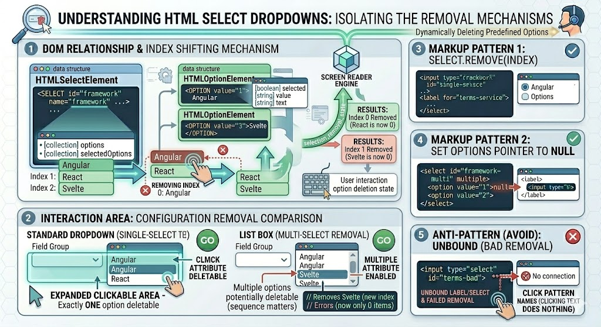

# Dynamically Adding & Removing Options

## Complete Guide with Full HTML Examples

### Table of Contents

* [Introduction to Dynamic Option Manipulation](#1-introduction-to-dynamic-option-manipulation)
* [Strategies for Dynamically Adding Options](#2-strategies-for-dynamically-adding-options)
* [Strategies for Dynamically Removing Options](#3-strategies-for-dynamically-removing-options)
* [Clearing a Dropdown List Efficiently](#4-clearing-a-dropdown-list-efficiently)
* [Full Integration Sandbox Demo](#5-full-integration-sandbox-demo)
* [Quick Reference Table](#quick-reference-table)

---

### 1. Introduction to Dynamic Option Manipulation

Web applications frequently require dropdown menus (`<select>`) to change their content dynamically at runtime. For example, selecting a country in one dropdown might update a second dropdown to display only the relevant regions or cities.

JavaScript represents the `<select>` element using the **`HTMLSelectElement`** object interface. This interface provides dedicated methods—specifically **`add()`** and **`remove()`**—designed for managing option nodes efficiently without manually parsing raw HTML strings.

---

### 2. Strategies for Dynamically Adding Options

You can add an `<option>` element to a list dynamically using two main patterns:

#### Method A: Using the `Option` Constructor and `add()`

This is the cleanest and most efficient approach. The global **`Option` constructor** builds a complete choice node in a single line, accepting the visible label text as the first argument and the data value string as the second:

```javascript
// Syntax: new Option(text, value);
let newOption = new Option('React', 'rct');

```

Once instantiated, pass the new node to the select box's native **`add(option, existingOption)`** method:

* **`option`**: The newly instantiated `HTMLOptionElement` to inject.
* **`existingOption`**: An optional reference to an existing option node currently in the list. The new item will be inserted immediately *before* this option. Passing **`undefined`** instructs the browser to append the new item to the very end of the list.

```javascript
const frameworkSelect = document.querySelector('#framework-list');

// Append the newly created choice cleanly to the end of the list
frameworkSelect.add(newOption, undefined);

```

#### Method B: Using Standard DOM Creation Methods

Alternatively, you can build options using standard, foundational DOM manipulation functions. While functional, this method requires more boilerplate code:

```javascript
const frameworkSelect = document.querySelector('#framework-list');

// 1. Create the base option tag node
const newOption = document.createElement('option');

// 2. Attach the underlying data value attribute
newOption.setAttribute('value', 'rct');

// 3. Create and append the visible label text node
const labelText = document.createTextNode('React');
newOption.appendChild(labelText);

// 4. Inject the final structured element node into the select list
frameworkSelect.appendChild(newOption);

```

---

### 3. Strategies for Dynamically Removing Options

Just like adding items, JavaScript offers multiple approaches for deleting options from a list box by target index reference:



#### Method A: Using the Native `select.remove(index)` Method

The most reliable approach is to call the built-in **`remove()`** method on the parent `<select>` element, passing the numerical layout index of the item you want to delete:

```javascript
// Remove the first item rendered inside the dropdown list
frameworkSelect.remove(0);

```

#### Method B: Setting the Options Collection Pointer to `null`

You can also remove an option by targeting it directly within the zero-based `select.options` collection array and assigning its value pointer to **`null`**:

```javascript
// Instantly deletes the option element at index 0 from the DOM
frameworkSelect.options[0] = null;

```

#### Method C: Using `removeChild()`

You can use the standard DOM parent-child removal method. This approach requires traversing through the `options` collection to pass the literal element node wrapper:

```javascript
// Locate and pluck out the first option node wrapper element explicitly
frameworkSelect.removeChild(frameworkSelect.options[0]);

```

---

### 4. Clearing a Dropdown List Efficiently

When resetting a form or shifting application states, you may need to clear out every option inside a `<select>` list.

#### The Pitfall of Forward-Looping

A common mistake is attempting to clear the list using a standard forward-loop (`for (let i = 0; i < select.options.length; i++)`). Because the `options` collection is **live**, removing the item at index `0` causes all remaining items to immediately shift downward. The item previously at index `1` now becomes index `0`. As a result, a forward-loop will skip every other element.

#### Solution A: The Reverse While Loop (Recommended)

By evaluating the length of the list and looping backwards using a `while` block, you can safely remove elements without index-shifting issues affecting the upcoming iterations:

```javascript
function clearDropdown(selectElement) {
    let index = selectElement.options.length;
    while (index--) {
        selectElement.remove(index);
    }
}

```

#### Solution B: Targeted Deletion of Index Zero

Alternatively, you can continually delete index `0` until the live length counter drops to zero:

```javascript
function clearDropdown(selectElement) {
    while (selectElement.options.length > 0) {
        selectElement.remove(0);
    }
}

```

---

### 5. Full Integration Sandbox Demo

This complete, production-ready HTML file combines these concepts into a dynamic management component. Users can type new framework names into an input field to add them, and select one or more options within a multi-select list box to delete them simultaneously.

```html
<!DOCTYPE html>
<html lang="en">
<head>
    <meta charset="UTF-8">
    <meta name="viewport" content="width=device-width, initial-scale=1.0">
    <title>Dynamic Option Management Laboratory</title>
    <style>
        body { font-family: Arial, sans-serif; padding: 25px; background-color: #f1f5f9; color: #1e293b; }
        .grid { display: grid; grid-template-columns: 1fr 1fr; gap: 25px; max-width: 1050px; margin: 0 auto; }
        .card { border: 1px solid #e2e8f0; padding: 25px; border-radius: 8px; background: #ffffff; box-shadow: 0 4px 6px rgba(0,0,0,0.02); }
        
        .field-group { margin-bottom: 15px; }
        label { display: block; margin-bottom: 6px; font-weight: bold; font-size: 14px; }
        
        input[type="text"], select { width: 100%; padding: 10px; font-size: 15px; border: 2px solid #cbd5e1; border-radius: 6px; box-sizing: border-box; outline: none; background: #fff; }
        input[type="text"]:focus, select:focus { border-color: #3b82f6; }
        select[multiple] { height: 140px; }
        
        .btn-row { display: flex; gap: 10px; margin-top: 10px; margin-bottom: 20px; }
        .action-btn { flex: 1; padding: 11px; font-weight: bold; border-radius: 6px; border: none; cursor: pointer; font-size: 14px; color: white; transition: background 0.2s; }
        
        .btn-add { background-color: #2563eb; }
        .btn-add:hover { background-color: #1d4ed8; }
        .btn-remove { background-color: #ef4444; }
        .btn-remove:hover { background-color: #dc2626; }
        .btn-clear { background-color: #475569; }
        .btn-clear:hover { background-color: #334155; }
        
        pre { background: #0f172a; color: #f8fafc; padding: 15px; border-radius: 6px; font-size: 13px; font-family: monospace; min-height: 150px; white-space: pre-wrap; margin: 0; }
    </style>
</head>
<body>

    <h1 style="text-align: center; margin-bottom: 30px;">Dynamic Option Management Laboratory</h1>
    
    <div class="grid">
        <div class="card">
            <form id="management-form">
                <div class="field-group">
                    <label for="input-framework">1. Add New Entry</label>
                    <input type="text" id="input-framework" placeholder="Enter framework name (e.g. Svelte)" autocomplete="off">
                </div>
                <div class="btn-row">
                    <button type="button" id="btn-add-option" class="action-btn btn-add">Add to Dropdown</button>
                </div>

                <div class="field-group">
                    <label for="framework-listbox">2. Active Framework List (Hold Ctrl/Cmd to multi-select)</label>
                    <select id="framework-listbox" multiple>
                        <option value="angular">Angular</option>
                        <option value="react">React</option>
                        <option value="vue">Vue.js</option>
                    </select>
                </div>
                
                <div class="btn-row">
                    <button type="button" id="btn-remove-selected" class="action-btn btn-remove">Remove Selected</button>
                    <button type="button" id="btn-clear-all" class="action-btn btn-clear">Clear Entire List</button>
                </div>
            </form>
        </div>

        <div class="card">
            <h3>Live Diagnostic Output Terminal</h3>
            <p>Real-time list telemetry showing length metrics and inner value tracking parameters:</p>
            <pre id="diagnostic-terminal">Awaiting actions...</pre>
        </div>
    </div>

    <script>
        const inputFramework = document.getElementById('input-framework');
        const listbox = document.getElementById('framework-listbox');
        const terminal = document.getElementById('diagnostic-terminal');

        // --- Utility function to update telemetry report text ---
        function updateTelemetryLog(actionPerformed) {
            const currentOptions = Array.from(listbox.options);
            const valuesArray = currentOptions.map(opt => opt.value);
            
            terminal.textContent = `[Action Log]: ${actionPerformed}\n` +
                `--------------------------------------------------\n` +
                `• Total List Length     : ${listbox.options.length}\n` +
                `• Compiled Value Array  : ${JSON.stringify(valuesArray)}`;
        }

        // --- 1. Processing Logic: Adding items ---
        document.getElementById('btn-add-option').addEventListener('click', () => {
            const cleanText = inputFramework.value.trim();

            // Guard clause to prevent empty additions
            if (cleanText === "") {
                alert("Validation Error: Please enter a valid name string.");
                inputFramework.focus();
                return;
            }

            // Normalize the text into a clean token string for the value key
            const standardizedValue = cleanText.toLowerCase().replace(/\s+/g, '-');

            // Initialize option element node via clean constructor mapping wrapper
            const freshOptionNode = new Option(cleanText, standardizedValue);

            // Append item cleanly to the tail end of the list
            listbox.add(freshOptionNode, undefined);

            // Clean up and reset input interface
            inputFramework.value = "";
            inputFramework.focus();

            updateTelemetryLog(`Successfully added item node ("${cleanText}")`);
        });

        // --- 2. Processing Logic: Removing selected items ---
        document.getElementById('btn-remove-selected').addEventListener('click', () => {
            let totalOptionsLength = listbox.options.length;
            let targetSelectionStateMap = [];

            // Step A: Map out which indexes are currently selected
            for (let i = 0; i < totalOptionsLength; i++) {
                targetSelectionStateMap[i] = listbox.options[i].selected;
            }

            // Step B: Loop backwards to safely remove selected items
            let itemsRemovedCounter = 0;
            let indexPointer = totalOptionsLength;
            
            while (indexPointer--) {
                if (targetSelectionStateMap[indexPointer]) {
                    listbox.remove(indexPointer);
                    itemsRemovedCounter++;
                }
            }

            // Update user feedback
            if (itemsRemovedCounter === 0) {
                updateTelemetryLog("⚠ Removal aborted: No option components were highlighted.");
            } else {
                updateTelemetryLog(`Successfully purged ${itemsRemovedCounter} selected item node(s).`);
            }
        });

        // --- 3. Processing Logic: Clearing the entire list ---
        document.getElementById('btn-clear-all').addEventListener('click', () => {
            let loopIndex = listbox.options.length;
            
            while (loopIndex--) {
                listbox.remove(loopIndex);
            }
            
            updateTelemetryLog("Successfully cleared all items from list collection.");
        });

        // Run baseline telemetry report on page initialization
        updateTelemetryLog("Component initialized.");
    </script>
</body>
</html>

```

---

### Quick Reference Table

| Target Operational Interface Hook | Parameter Data Type | Primary Practical Purpose | Notable Architectural Exceptions |
| --- | --- | --- | --- |
| **`new Option(text, value)`** | String, String | Instantiates a brand new, fully configured `HTMLOptionElement` node. | Built natively by the browser engine; can be immediately passed to list manipulation handlers. |
| **`select.add(node, ref)`** | Object, Node Reference | Injects a newly created option node element into a target dropdown list configuration framework. | If the reference parameter is passed as **`undefined`**, the item automatically appends to the end of the list. |
| **`select.remove(index)`** | Number (Integer) | Deletes the specific option element sitting at that exact index location from the DOM layer tree. | Live index reposition shifts occur instantly; use a **reverse loop** structure when batching removals. |
| **`select.options[i] = null`** | Primitive Assignment | Alternative syntax pattern to cleanly destroy an option by index reference. | Behaves identically to `select.remove(i)`. |
| **`select.options.length`** | Number (Integer) | Read/Write property indicating the total number of options inside the element. | Setting `select.options.length = 0` instantly clears all choices from the list. |

---